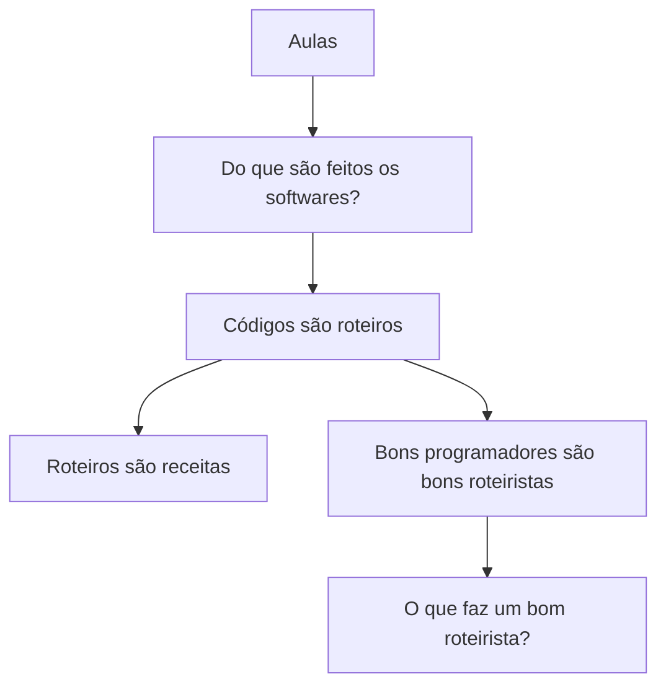

# Aulas

## Do que são feitos os softwares?

Softwares não nascem prontos na tela. Por trás de cada app, site ou sistema há um material básico: **instruções escritas** que alguém (ou alguma máquina) consegue seguir.

Essas instruções dizem o que fazer, em que ordem, e com o quê. O computador não “entende” o mundo como nós — ele executa o que foi descrito com precisão.

Na próxima seção, essa ideia ganha um nome útil: o código como **roteiro**.

## Códigos são roteiros

Se um software é feito de instruções, o **código** é o texto dessas instruções — um **roteiro** do que deve acontecer.

Um roteiro de teatro lista falas e cenas. Um roteiro de software lista **passos**: ler um dado, calcular, mostrar na tela, guardar no disco. A linguagem muda (JavaScript, Python, etc.), mas o papel é o mesmo: descrever a ação com clareza para quem vai executar.

Roteiros são receitas que precisam de ingredientes, um roteiro conjunto de passos e uma pessoa ou máquinas (agentes).

### Roteiros são receitas

Roteiros são receitas que precisam de ingredientes, um roteiro conjunto de passos e uma pessoa ou máquinas (agentes).

Pense numa receita de bolo:

| Na cozinha | No software |
|---|---|
| Ingredientes | Dados, arquivos, APIs, configs |
| Passos | Instruções do código |
| Cozinheiro ou máquina | Pessoa ou agentes (máquinas) |

Sem ingredientes, a receita não produz nada. Sem passos, ninguém sabe o que fazer. Sem quem execute — humano ou agente automatizado — o roteiro fica só no papel.

Por isso um software completo junta as três peças: **o quê** entra, **como** se transforma, e **quem** (pessoa ou máquina) leva o roteiro até o fim.

### Bons programadores são bons roteiristas

Se código é roteiro, programar bem é **escrever bem o roteiro**: claro, na ordem certa, sem cenas redundantes e com papéis bem definidos.

Um bom roteirista antecipa o público e as falhas da cena. Um bom programador antecipa quem lê o código (pessoa ou agente), os caminhos felizes e os erros — e deixa o texto fácil de seguir e de mudar.

#### O que faz um bom roteirista?

Um bom roteirista:

- deixa a história **clara** — quem lê entende o que acontece e por quê
- ordena as cenas — cada passo no momento certo
- corta o que não serve — sem falas ou atos sobrando
- define papéis — cada personagem (ou módulo) sabe o que faz
- prevê o público e os imprevistos — caminhos felizes e erros

No código, isso vira: nomes honestos, fluxo legível, responsabilidades pequenas e tratamento explícito do que pode falhar.
