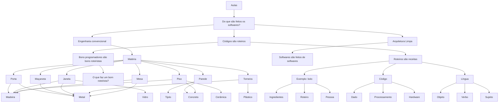

# Aulas

## Do que são feitos os softwares?

Softwares não nascem prontos na tela. Por trás de cada app, site ou sistema há um material básico: **instruções escritas** que alguém (ou alguma máquina) consegue seguir.

Antes, um contraste: a engenharia convencional é constituída de **matéria**. Uncle Bob, em Arquitetura Limpa, diz que **softwares são feitos de softwares**. E o código, em si, é **roteiro**.

## Engenharia convencional

A **engenharia convencional** é constituída de **matéria**: coisas físicas que ocupam espaço, têm peso e se transformam com ferramentas e energia.

### Matéria

A matéria é o material de construção do mundo físico. Em casa, ela aparece primeiro em **componentes maiores** — peças que usamos no dia a dia — e cada um é feito de matérias-primas (as folhas da árvore).

#### Porta

- Madeira — folha, batente
- Metal — dobradiças, fechaduras

#### Maçaneta

- Metal — corpo, trinco, parafusos

#### Janela

- Vidro — o painel transparente
- Madeira — caixilho
- Metal — perfil, fechos

#### Parede

- Tijolo — alvenaria
- Concreto — estrutura, reboco

#### Piso

- Madeira — tábua, laminado
- Concreto — contrapiso
- Cerâmica — revestimento

#### Torneira

- Metal — corpo, registro
- Plástico — vedações, mangueiras

#### Mesa

- Madeira — tampo, pés
- Metal — estrutura, parafusos

## Arquitetura Limpa

No livro **Arquitetura Limpa**, Robert C. Martin (Uncle Bob) desloca a pergunta “do que são feitos os softwares?” para longe da matéria física: o material do software não é madeira nem metal.

### Softwares são feitos de softwares

Softwares são feitos de softwares. Um sistema maior é composto de módulos, bibliotecas, serviços e camadas menores — cada um também software. A engenharia aqui monta peças de software umas sobre as outras, não tijolos sobre concreto.

## Códigos são roteiros

Se um software é feito de instruções, o **código** é o texto dessas instruções — um **roteiro** do que deve acontecer.

Um roteiro de teatro lista falas e cenas. Um roteiro de software lista **passos**: ler um dado, calcular, mostrar na tela, guardar no disco. A linguagem muda (JavaScript, Python, etc.), mas o papel é o mesmo: descrever a ação com clareza para quem vai executar.

Roteiros são receitas que precisam de ingredientes, um roteiro conjunto de passos e uma pessoa ou máquinas (agentes).

### Roteiros são receitas

Roteiros são receitas que precisam de ingredientes, um roteiro conjunto de passos e uma pessoa ou máquinas (agentes).

Por isso um software completo junta as três peças: **o quê** entra, **como** se transforma, e **quem** (pessoa ou máquina) leva o roteiro até o fim.

#### Exemplo: bolo

Pense numa receita de bolo:

| Exemplo: bolo | Código | Língua |
|---|---|---|
| Ingredientes | Dado | Objeto |
| Roteiro | Processamento | Verbo |
| Pessoa | Hardware | Sujeito |

Sem ingredientes, a receita não produz nada. Sem passos, ninguém sabe o que fazer. Sem quem execute — humano ou agente automatizado — o roteiro fica só no papel.

##### Ingredientes

Farinha, ovos, açúcar, fermento — o material sem o qual o bolo não sai. No software: dados, arquivos, APIs, configs.

##### Roteiro

Misturar, assar, esperar — a sequência de passos. No software: as instruções do código.

##### Pessoa

Quem executa a receita: o cozinheiro, ou uma máquina. No software: uma pessoa ou agentes (máquinas). Sem executor, o roteiro fica só no papel.

### Código

O **código** é o texto do roteiro: as instruções escritas numa linguagem que a máquina (ou um intérprete) consegue executar. É a forma concreta do roteiro de software — o mesmo papel da receita escrita na cozinha.

#### Dado

O que o código lê e transforma: números, textos, arquivos, respostas de APIs — a matéria-prima da execução. Corresponde aos **ingredientes**.

#### Processamento

As operações que o código aplica aos dados: calcular, filtrar, decidir, combinar — os passos do roteiro em ação. Corresponde ao **roteiro**.

#### Hardware

Onde o código e o processamento acontecem de fato: processador, memória, disco, rede — a máquina que executa o roteiro. Corresponde à **pessoa** (ou agente).

### Língua

A **língua** falada — português, inglês, etc. — é o roteiro humano: combinamos peças para dizer o que fazer, o que é, o que queremos. O código imita essa lógica num outro meio.

#### Objeto

Sobre o quê se fala — a coisa afetada ou referida. Corresponde aos **ingredientes** / **dado**.

#### Verbo

A ação ou estado — o que acontece. Corresponde ao **roteiro** / **processamento**.

#### Sujeito

Quem age ou de quem se fala — quem põe a frase em movimento. Corresponde à **pessoa** / **hardware**.

### Bons programadores são bons roteiristas

Se código é roteiro, programar bem é **escrever bem o roteiro**: claro, na ordem certa, sem cenas redundantes e com papéis bem definidos.

Um bom roteirista antecipa o público e as falhas da cena. Um bom programador antecipa quem lê o código (pessoa ou agente), os caminhos felizes e os erros — e deixa o texto fácil de seguir e de mudar.

#### O que faz um bom roteirista?

Um bom roteirista:

- deixa a história **clara** — quem lê entende o que acontece e por quê
- ordena as cenas — cada passo no momento certo
- corta o que não serve — sem falas ou atos sobrando
- define papéis — cada personagem (ou módulo) sabe o que faz
- prevê o público e os imprevistos — caminhos felizes e erros

No código, isso vira: nomes honestos, fluxo legível, responsabilidades pequenas e tratamento explícito do que pode falhar.
