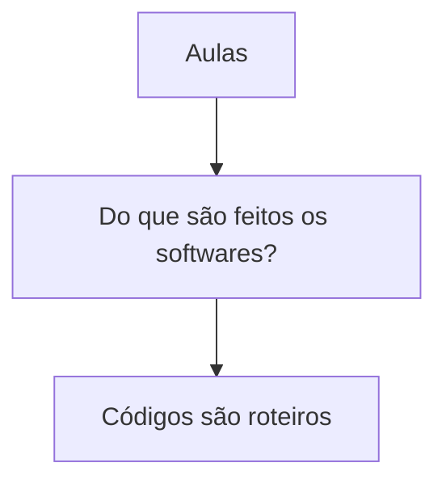

# Aulas

Árvore de seções.

## Seções

- [Do que são feitos os softwares?](do-que-sao-feitos-os-softwares/README.md)
  - [Códigos são roteiros](do-que-sao-feitos-os-softwares/codigos-sao-roteiros/README.md)
