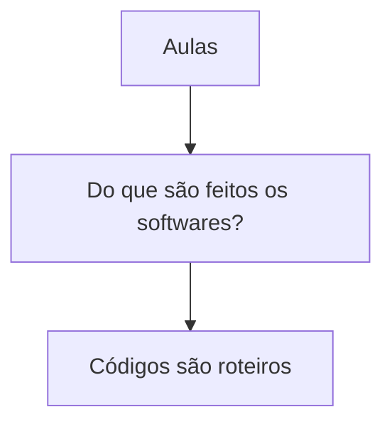

# Do que são feitos os softwares?

```mermaid
flowchart TD
  A[Aulas]
  B[Do que são feitos os softwares?]
  C[Códigos são roteiros]
  A --> B
  B --> C
```

## Filhas

- [Códigos são roteiros](codigos-sao-roteiros/README.md)
