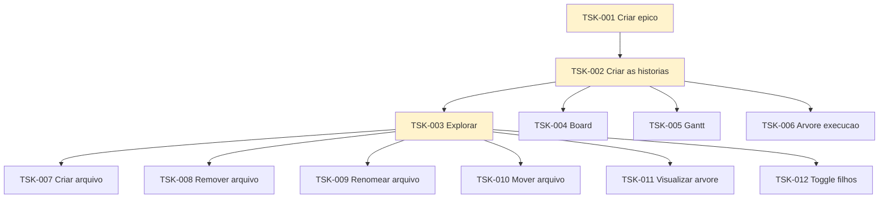

# Board

Kanban da workstation: **uma raia por projeto**, colunas **Todo**, **Doing** e **Done**.

Raias ordenadas por **prioridade** (maior → menor).  
Quando houver hierarquia de tasks, a raia usa **Mermaid** (árvore + cor de status) em vez de forçar árvore dentro da tabela kanban.

---

## P1 — ConnectMax

| Todo | Doing | Done |
|------|-------|------|
| Criar épico | | |

→ [`connectmax/`](connectmax/)

---

## P2 — Flow

Pré-requisito do Plans.  
Legenda: verde = Done · amarelo = Doing · cinza = Todo

| Todo | Doing | Done |
|------|-------|------|
| [TSK-007](flow/tasks/TSK-001-criar-epico/TSK-002-criar-as-historias/TSK-003-explorar/TSK-007-criar-arquivo/) Criar arquivo | [TSK-001](flow/tasks/TSK-001-criar-epico/) Criar épico | — |
| [TSK-008](flow/tasks/TSK-001-criar-epico/TSK-002-criar-as-historias/TSK-003-explorar/TSK-008-remover-arquivo/) Remover arquivo | [TSK-002](flow/tasks/TSK-001-criar-epico/TSK-002-criar-as-historias/) Criar as histórias | |
| [TSK-009](flow/tasks/TSK-001-criar-epico/TSK-002-criar-as-historias/TSK-003-explorar/TSK-009-renomear-arquivo/) Renomear arquivo | [TSK-003](flow/tasks/TSK-001-criar-epico/TSK-002-criar-as-historias/TSK-003-explorar/) Explorar | |
| [TSK-010](flow/tasks/TSK-001-criar-epico/TSK-002-criar-as-historias/TSK-003-explorar/TSK-010-mover-arquivo-dragdrop/) Mover arquivo | | |
| [TSK-011](flow/tasks/TSK-001-criar-epico/TSK-002-criar-as-historias/TSK-003-explorar/TSK-011-visualizar-arvore-de-arquivos/) Visualizar árvore | | |
| [TSK-012](flow/tasks/TSK-001-criar-epico/TSK-002-criar-as-historias/TSK-003-explorar/TSK-012-toggle-visualizar-filhos/) Toggle visualizar filhos | | |
| [TSK-004](flow/tasks/TSK-001-criar-epico/TSK-002-criar-as-historias/TSK-004-board/) Board | | |
| [TSK-005](flow/tasks/TSK-001-criar-epico/TSK-002-criar-as-historias/TSK-005-gantt/) Gantt | | |
| [TSK-006](flow/tasks/TSK-001-criar-epico/TSK-002-criar-as-historias/TSK-006-arvore-de-execucao/) Árvore de execução | | |

→ [`flow/`](flow/) · [`flow/tasks/`](flow/tasks/) · [`flow/epics/`](flow/epics/) · [`flow/gantt.md`](flow/gantt.md)

---

## P3 — Plans

| Todo | Doing | Done |
|------|-------|------|
| | | Criar épico |

→ [`plans/`](plans/) · [`plans/epics/`](plans/epics/)

---

## P4 — RoleGo

| Todo | Doing | Done |
|------|-------|------|
| | | |

→ [`role-go/`](role-go/)

---

## P5 — Chines

| Todo | Doing | Done |
|------|-------|------|
| | | |

→ [`chines/`](chines/)

---

## P6 — Caronas

| Todo | Doing | Done |
|------|-------|------|
| | | |

→ [`caronas/`](caronas/)

---

## P7 — Fitness

| Todo | Doing | Done |
|------|-------|------|
| | | |

→ [`fitness/`](fitness/)

---

## P8 — Eternos Mutáveis

| Todo | Doing | Done |
|------|-------|------|
| | | |

→ [`eternos-mutaveis/`](eternos-mutaveis/)

---

## P9 — Jiu-jitsu

| Todo | Doing | Done |
|------|-------|------|
| | | |

→ [`jiu-jitsu/`](jiu-jitsu/)
