# Board

Kanban da workstation: **uma raia por projeto**, colunas **Todo**, **Doing** e **Done**.

Raias ordenadas por **prioridade** (maior → menor).  
Quando houver hierarquia de tasks, a raia usa **Mermaid** (árvore + cor de status) em vez de forçar árvore dentro da tabela kanban.

---

## P1 — ConnectMax

| Todo | Doing | Done |
|------|-------|------|
| Criar épico | | |

→ [`connectmax/`](connectmax/README.md)

---

## P2 — Flow

Pré-requisito do Plans.  
Legenda: verde = Done · amarelo = Doing · cinza = Todo

```mermaid
flowchart TD
  T001[TSK-001 Criar epico]
  T002[TSK-002 Criar as historias]
  T003[TSK-003 Explorar]
  T007[TSK-007 Criar arquivo]
  T008[TSK-008 Remover arquivo]
  T009[TSK-009 Renomear arquivo]
  T010[TSK-010 Mover arquivo]
  T011[TSK-011 Visualizar arvore]
  T012[TSK-012 Expandir e recolher]
  T004[TSK-004 Board]
  T013[TSK-013 Criar card]
  T014[TSK-014 Remover card]
  T015[TSK-015 Mover card]
  T016[TSK-016 Renomear card]
  T017[TSK-017 Abrir card]
  T018[TSK-018 Editar card]
  T019[TSK-019 Criar coluna]
  T020[TSK-020 Criar raia]
  T005[TSK-005 Gantt]
  T006[TSK-006 Arvore execucao]
  T001 --> T002
  T002 --> T003
  T003 --> T007
  T003 --> T008
  T003 --> T009
  T003 --> T010
  T003 --> T011
  T003 --> T012
  T002 --> T004
  T004 --> T013
  T004 --> T014
  T004 --> T015
  T004 --> T016
  T004 --> T017
  T004 --> T018
  T004 --> T019
  T004 --> T020
  T002 --> T005
  T002 --> T006
  style T001 fill:#fff3cd
  style T002 fill:#fff3cd
  style T003 fill:#d4edda
  style T007 fill:#d4edda
  style T008 fill:#d4edda
  style T009 fill:#d4edda
  style T010 fill:#d4edda
  style T011 fill:#d4edda
  style T012 fill:#d4edda
  style T004 fill:#d4edda
  style T013 fill:#d4edda
  style T014 fill:#d4edda
  style T015 fill:#d4edda
  style T016 fill:#d4edda
  style T017 fill:#d4edda
  style T018 fill:#d4edda
  style T019 fill:#d4edda
  style T020 fill:#d4edda
```

| Todo | Doing | Done |
|------|-------|------|
| [TSK-005](flow/epics/EP-03-gantt/README.md) Gantt | [TSK-001](flow/tasks/TSK-001-criar-epico/README.md) Criar épico | [TSK-007](flow/epics/EP-01-explorar/US-01-criar-arquivo/README.md) Criar arquivo |
| [TSK-006](flow/epics/EP-04-arvore-de-execucao/README.md) Árvore de execução | [TSK-002](flow/tasks/TSK-001-criar-epico/TSK-002-criar-as-historias/README.md) Criar as histórias | [TSK-008](flow/epics/EP-01-explorar/US-02-remover-arquivo/README.md) Remover arquivo |
| | | [TSK-009](flow/epics/EP-01-explorar/US-03-renomear-arquivo/README.md) Renomear arquivo |
| | | [TSK-010](flow/epics/EP-01-explorar/US-04-mover-arquivo-dragdrop/README.md) Mover arquivo |
| | | [TSK-011](flow/epics/EP-01-explorar/US-05-visualizar-arvore-de-arquivos/README.md) Visualizar árvore |
| | | [TSK-012](flow/epics/EP-01-explorar/US-06-toggle-visualizar-filhos/README.md) Expandir e recolher |
| | | [TSK-003](flow/epics/EP-01-explorar/README.md) Explorar |
| | | [TSK-004](flow/epics/EP-02-board/README.md) Board |
| | | [TSK-013](flow/epics/EP-02-board/US-01-criar-card/README.md) Criar card |
| | | [TSK-014](flow/epics/EP-02-board/US-02-remover-card/README.md) Remover card |
| | | [TSK-015](flow/epics/EP-02-board/US-03-mover-card/README.md) Mover card |
| | | [TSK-016](flow/epics/EP-02-board/US-04-renomear-card/README.md) Renomear card |
| | | [TSK-017](flow/epics/EP-02-board/US-05-abrir-card/README.md) Abrir card |
| | | [TSK-018](flow/epics/EP-02-board/US-06-editar-card/README.md) Editar card |
| | | [TSK-019](flow/epics/EP-02-board/US-07-criar-coluna/README.md) Criar coluna |
| | | [TSK-020](flow/epics/EP-02-board/US-08-criar-raia/README.md) Criar raia |

→ [`flow/`](flow/README.md) · [`flow/tasks/`](flow/tasks/README.md) · [`flow/epics/`](flow/epics/README.md) · [`flow/gantt.md`](flow/gantt.md)

---

## P3 — Plans

| Todo | Doing | Done |
|------|-------|------|
| | | Criar épico |

→ [`plans/`](plans/README.md) · [`plans/epics/`](plans/epics/README.md)

---

## P4 — RoleGo

| Todo | Doing | Done |
|------|-------|------|
| | | |

→ [`role-go/`](role-go/README.md)

---

## P5 — Chines

| Todo | Doing | Done |
|------|-------|------|
| | | |

→ [`chines/`](chines/docs/README.md)

---

## P6 — Caronas

| Todo | Doing | Done |
|------|-------|------|
| | | |

→ [`caronas/`](caronas/README.md)

---

## P7 — Fitness

| Todo | Doing | Done |
|------|-------|------|
| | | |

→ [`fitness/`](fitness/README.md)

---

## P8 — Eternos Mutáveis

| Todo | Doing | Done |
|------|-------|------|
| | | |

→ [`eternos-mutaveis/`](eternos-mutaveis/README.md)

---

## P9 — Jiu-jitsu

| Todo | Doing | Done |
|------|-------|------|
| | | |

→ [`jiu-jitsu/`](jiu-jitsu/README.md)
