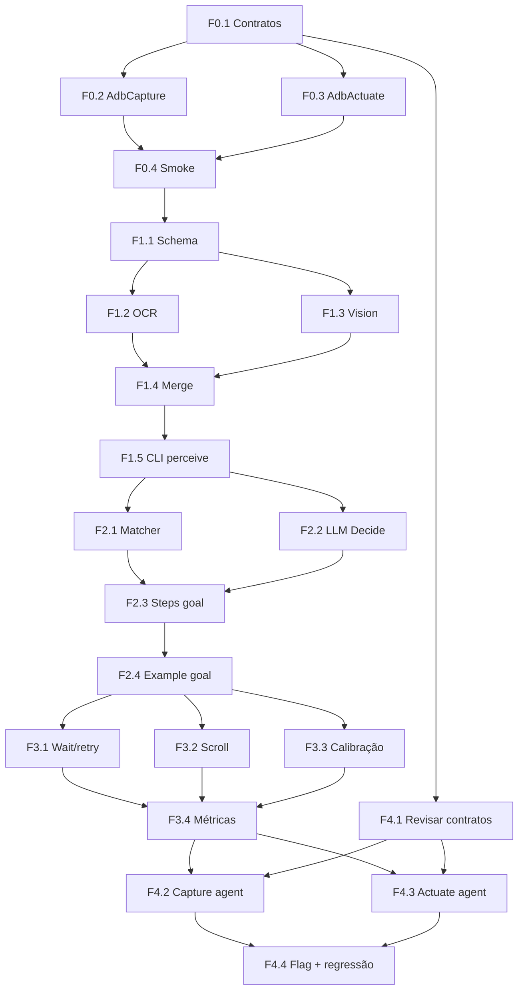

# Plano — Percepção por imagem → ação (redroid → hardware)

**Por quê:** automatizar “ver a tela → extrair elementos → decidir → clicar/copiar” com **imagem como contrato único**, reutilizável no redroid e depois em dispositivo físico.  
**Base:** `sources/android-control` (tap / type / shot / ADBKeyBoard).  
**Estimativas:** horas de **esforço de IA** (agente implementando), não de humano. 1 h IA ≈ uma sessão contínua de implementação/teste no repo.

---

## Princípios

1. **Frame in, action out** — entrada = PNG + `width/height`; saída = gesto ou dado extraído.
2. **Sem uiautomator em produção** — dump só opcional para debug/treino.
3. **Actuator plugável** — ADB hoje; agent/HID depois, mesma API.
4. **Coordenadas no espaço da imagem** — recalibrar se a captura mudar de resolução.

---

## Árvore do produto (WBS)

```text
Percepção por imagem → ação
├── F0  Fundamentos (interfaces + ADB)
│   ├── F0.1  Contratos Capture / Perceive / Decide / Actuate
│   ├── F0.2  AdbCapture (screencap → frame)
│   ├── F0.3  AdbActuate (wrap cli.js: tap/swipe/type)
│   └── F0.4  Loop smoke: frame → tap(cx,cy)
├── F1  Perceive (frame → Element[])
│   ├── F1.1  Schema Element + validação JSON
│   ├── F1.2  OCR local/API → textos + bboxes          ⎱ paralelizáveis
│   ├── F1.3  Vision (LLM/detector) → botões/fotos/cards ⎰ após F1.1
│   ├── F1.4  Merge OCR + vision → Element[] estável
│   └── F1.5  CLI perceive + overlay debug
├── F2  Decide + goals
│   ├── F2.1  Matcher por label / kind / índice
│   ├── F2.2  Decide via LLM (opcional, goal em linguagem)
│   ├── F2.3  Steps: perceive → choose → tap|copy|crop
│   └── F2.4  goals/example.json end-to-end
├── F3  Robustez
│   ├── F3.1  Wait/retry até elemento aparecer
│   ├── F3.2  Scroll + re-perceive (listas)
│   ├── F3.3  Calibração resolução frame ↔ actuator
│   └── F3.4  Métricas (acerto, latency, custo)
└── F4  Hardware-ready
    ├── F4.1  Interface estável (já em F0; revisar)
    ├── F4.2  Backend Capture agent (APK ou scrcpy USB)
    ├── F4.3  Backend Actuate agent
    └── F4.4  Flag backend=adb|agent + regressão 1 device
```

### Dependências (resumo)



---

## Estimativas de esforço (IA)

| ID | Atividade | Esforço IA (h) | Depende de | Paraleliza com |
|----|-----------|----------------|------------|----------------|
| F0.1 | Contratos Capture/Perceive/Decide/Actuate | 0,4 | — | — |
| F0.2 | AdbCapture | 0,5 | F0.1 | F0.3 |
| F0.3 | AdbActuate (wrap cli) | 0,4 | F0.1 | F0.2 |
| F0.4 | Smoke frame → tap | 0,3 | F0.2, F0.3 | — |
| F1.1 | Schema Element + validação | 0,4 | F0.4 | — |
| F1.2 | OCR → textos + bboxes | 1,0 | F1.1 | F1.3 |
| F1.3 | Vision → botões/fotos/cards | 1,5 | F1.1 | F1.2 |
| F1.4 | Merge OCR + vision | 0,6 | F1.2, F1.3 | — |
| F1.5 | CLI perceive + overlay | 0,5 | F1.4 | — |
| F2.1 | Matcher label/kind/índice | 0,6 | F1.5 | F2.2 |
| F2.2 | Decide via LLM | 0,8 | F1.5 | F2.1 |
| F2.3 | Steps perceive→choose→act | 0,8 | F2.1, F2.2 | — |
| F2.4 | Goal example E2E | 0,4 | F2.3 | — |
| F3.1 | Wait/retry | 0,5 | F2.4 | F3.2, F3.3 |
| F3.2 | Scroll + re-perceive | 0,6 | F2.4 | F3.1, F3.3 |
| F3.3 | Calibração resolução | 0,5 | F2.4 | F3.1, F3.2 |
| F3.4 | Métricas | 0,4 | F3.1–F3.3 | — |
| F4.1 | Revisar contratos p/ agent | 0,3 | F0.1, F3.4* | — |
| F4.2 | Capture agent / scrcpy USB | 1,5 | F4.1 | F4.3 |
| F4.3 | Actuate agent | 1,5 | F4.1 | F4.2 |
| F4.4 | Flag backend + regressão | 0,8 | F4.2, F4.3 | — |

\* F4.1 pode começar em paralelo após F0.1; integração completa após F3.4.

| Fase | Soma (h IA) | Com paralelismo (caminho crítico ≈) |
|------|-------------|--------------------------------------|
| F0 | 1,6 | ~1,2 |
| F1 | 4,0 | ~3,0 |
| F2 | 2,6 | ~2,0 |
| F3 | 2,0 | ~1,1 |
| F4 | 4,1 | ~2,6 |
| **Total** | **~14,3** | **~10 h** (1 agente, trilhas paralelas no Gantt) |

> Com **2 agentes em paralelo** nas trilhas OCR∥Vision e Capture∥Actuate agent, o calendário de parede cai para ~**7–8 h** de sessão agregada.

---

## Gantt (esforço IA, horas acumuladas)

Eixo = horas de trabalho de IA (não dias humanos). Barras na mesma faixa de tempo = **paralelizáveis**.

```mermaid
gantt
  title Percepção por imagem → ação (horas de esforço IA)
  dateFormat X
  axisFormat %s h
  tickInterval 1hour

  section F0 Fundamentos
  F0.1 Contratos           :a01, 0, 0.4h
  F0.2 AdbCapture          :a02, after a01, 0.5h
  F0.3 AdbActuate          :a03, after a01, 0.4h
  F0.4 Smoke               :a04, after a02 a03, 0.3h

  section F1 Perceive
  F1.1 Schema              :b01, after a04, 0.4h
  F1.2 OCR                 :b02, after b01, 1h
  F1.3 Vision              :b03, after b01, 1.5h
  F1.4 Merge               :b04, after b02 b03, 0.6h
  F1.5 CLI + overlay       :b05, after b04, 0.5h

  section F2 Decide
  F2.1 Matcher             :c01, after b05, 0.6h
  F2.2 LLM Decide          :c02, after b05, 0.8h
  F2.3 Steps goal          :c03, after c01 c02, 0.8h
  F2.4 Example E2E         :c04, after c03, 0.4h

  section F3 Robustez
  F3.1 Wait/retry          :d01, after c04, 0.5h
  F3.2 Scroll              :d02, after c04, 0.6h
  F3.3 Calibração          :d03, after c04, 0.5h
  F3.4 Métricas            :d04, after d01 d02 d03, 0.4h

  section F4 Hardware
  F4.1 Revisar contratos   :e01, after d04, 0.3h
  F4.2 Capture agent       :e02, after e01, 1.5h
  F4.3 Actuate agent       :e03, after e01, 1.5h
  F4.4 Flag + regressão    :e04, after e02 e03, 0.8h
```



### Trilhas paralelas (visão rápida)

| Janela (h IA no caminho) | Trilha A | Trilha B |
|--------------------------|----------|----------|
| Após F0.1 | AdbCapture | AdbActuate |
| Após F1.1 | OCR | Vision |
| Após F1.5 | Matcher | LLM Decide |
| Após F2.4 | Wait/retry ∥ Scroll ∥ Calibração | — |
| Após F4.1 | Capture agent | Actuate agent |

---

## Contratos (referência)

```text
Capture.getFrame() → { png: Buffer|path, width, height, ts }
Perceive.run(frame) → Element[]
Decide.run(elements, goal) → Action
Actuate.run(action) → void

Element = { id, kind, label?, bbox[4], center[2], score, text? }
kind    = button | text | image | list_item | icon | unknown
Action  = { type: tap|swipe|type|copy_text|shot_region, ... }
```

Layout sugerido:

```text
sources/android-control/
  lib/capture.js
  lib/perceive.js
  lib/decide.js
  lib/actuate.js
  perceive-cli.js
  run-goal.js
  goals/example.json
```

---

## Marcos de aceite

| Marco | Critério | Após |
|-------|----------|------|
| M1 | Capture + Actuate ADB: frame → tap estável | F0 |
| M2 | Perceive gera `Element[]` útil só do PNG | F1 |
| M3 | Goal sem coordenadas hardcoded | F2 |
| M4 | Wait/scroll/calibração + métricas | F3 |
| M5 | Segundo backend (caminho hardware) sem reescrever Perceive/Decide | F4 |

---

## Riscos

| Risco | Mitigação |
|-------|-----------|
| UI Instagram/LinkedIn muda | Perceive por visão; goals por intenção |
| Custo/latência vision | OCR primeiro; vision sob demanda |
| Hardware sem ADB | Agent no desenho desde F0 (interfaces) |
| Estimativa IA otimista | Buffer ~20% (~+3 h) se APIs/vision falharem no redroid |

---

## Próximos passos

1. Implementar **F0** em `sources/android-control`.  
2. Em seguida **F1.1 + F1.2** (OCR) para já clicar por texto.  
3. Só então **F1.3** vision para botões/fotos sem label.
