# Roadmap — screen-robot

**Por quê:** Gantt EP → US (folhas com o mesmo tamanho visual).  
**Gantt com SC e minutos:** [`tasks.md`](tasks.md).  
**Fonte:** [`3.scenarios.md`](3.scenarios.md).  
**Funcionalidades:** [`2.functionalities.md`](2.functionalities.md).  
**Visão:** [`README.md`](README.md).

```mermaid
---
config:
  theme: base
  themeVariables:
    darkMode: true
    background: '#000000'
    primaryTextColor: '#ffffff'
    secondaryTextColor: '#ffffff'
    tertiaryTextColor: '#ffffff'
    textColor: '#ffffff'
    lineColor: '#333333'
    mainBkg: '#000000'
    secondaryColor: '#000000'
    tertiaryColor: '#000000'
    sectionBkgColor: '#000000'
    sectionBkgColor2: '#000000'
    altSectionBkgColor: '#000000'
    gridColor: '#222222'
    excludeBkgColor: '#000000'
    todayLineColor: '#444444'
    doneTaskBkgColor: '#2563eb'
    doneTaskBorderColor: '#1d4ed8'
    taskBkgColor: '#94a3b8'
    taskBorderColor: '#64748b'
    taskTextColor: '#ffffff'
    taskTextDarkColor: '#ffffff'
    taskTextLightColor: '#ffffff'
    taskTextOutsideColor: '#ffffff'
    critBkgColor: '#2563eb'
    critBorderColor: '#1d4ed8'
    activeTaskBkgColor: '#94a3b8'
    activeTaskBorderColor: '#64748b'
---
gantt
  title screen-robot EP / US
  dateFormat X
  axisFormat %s

  section EP-01 Provisionar
  EP-01 Provisionar agente              :done, ep01, 0, 1

  section EP-02 Eventos de UI
  EP-02 Eventos de UI                   :done, ep02, after ep01, 2
  US-02 Evento de boot                  :us02, after ep01, 1
  US-03 Evento de app aberta            :us03, after us02, 1
  US-04 Evento de tela estavel          :us04, after us02, 1
  US-05 Evento de mudanca de dump       :us05, after us02, 1

  section EP-03 Instalar APKs
  EP-03 Instalar APKs                   :done, ep03, after us05, 1

  section EP-04 Operar tela
  EP-04 Operar tela                     :done, ep04, after us05, 1
  US-07 Abrir aplicativo                :us07, after us05, 1
  US-08 tap                             :us08, after us05, 1
  US-09 type                            :us09, after us05, 1
  US-10 scroll                          :us10, after us05, 1
  US-11 screenshot                      :us11, after us05, 1
  US-12 Resgatar coordenadas x,y        :us12, after us05, 1

  section EP-05 Extrair elementos
  EP-05 Extrair elementos               :done, ep05, after us05, 1

  section EP-06 Sessao
  EP-06 Sessao                          :done, ep06, after ep05, 3
  US-14 Salvar sessao                   :us14, after ep05, 1
  US-15 Remover sessao                  :us15, after us14, 1
  US-16 Recuperar sessao                :us16, after us15, 1
```

## Próximos passos

→ [`tasks.md`](tasks.md) · [`4.bdds.md`](4.bdds.md)  
→ Implementação em [`sources/android-control`](sources/android-control/README.md)
