# Tasks — screen-robot

**Por quê:** Gantt das tasks (minutos IA).  
**IDs:** **TSK-** + origem **EP-** / **US-** / **SC-** em cada barra.  
**Roadmap:** [`6.roadmap.md`](6.roadmap.md).  
**Fonte:** [`1.stories.md`](1.stories.md) · [`3.scenarios.md`](3.scenarios.md) · [`4.bdds.md`](4.bdds.md).  
**Épicos:** [`2.epics.md`](2.epics.md).  
**Visão:** [`README.md`](README.md).  
**Kanban / inventário (umbrella):** [`core/tasks`](../../core/tasks/README.md#p1--connectmax--screen-robot).

Estimativas: minutos IA · **1 dia = 8h = 480 min**.

```mermaid
---
config:
  theme: base
  themeVariables:
    darkMode: true
    background: '#000000'
    primaryTextColor: '#ffffff'
    secondaryTextColor: '#ffffff'
    tertiaryTextColor: '#ffffff'
    textColor: '#ffffff'
    lineColor: '#333333'
    mainBkg: '#000000'
    secondaryColor: '#000000'
    tertiaryColor: '#000000'
    sectionBkgColor: '#000000'
    sectionBkgColor2: '#000000'
    altSectionBkgColor: '#000000'
    gridColor: '#222222'
    excludeBkgColor: '#000000'
    todayLineColor: '#444444'
    doneTaskBkgColor: '#2563eb'
    doneTaskBorderColor: '#1d4ed8'
    taskBkgColor: '#94a3b8'
    taskBorderColor: '#64748b'
    taskTextColor: '#ffffff'
    taskTextDarkColor: '#ffffff'
    taskTextLightColor: '#ffffff'
    taskTextOutsideColor: '#ffffff'
    critBkgColor: '#2563eb'
    critBorderColor: '#1d4ed8'
    activeTaskBkgColor: '#2dd4bf'
    activeTaskBorderColor: '#14b8a6'
---
gantt
  title screen-robot TSK
  dateFormat X
  axisFormat %s

  section TSK-001 EP-01 Provisionar
  TSK-001 EP-01 Provisionar agente      :done, tsk01, 0, 60m
  TSK-002 SC-01 Subir e conectar        :active, tsk02, 0, 20m
  TSK-003 SC-02 Serial ADB online       :active, tsk03, after tsk02, 20m
  TSK-004 SC-03 Boot completo           :active, tsk04, after tsk03, 20m

  section TSK-005 EP-02 Eventos de UI
  TSK-005 EP-02 Eventos de UI           :done, tsk05, after tsk01, 24m
  TSK-006 US-02 Evento de boot          :tsk06, after tsk01, 12m
  TSK-007 SC-04 Sinal de boot           :active, tsk07, after tsk01, 12m
  TSK-008 US-03 Evento de app aberta    :tsk08, after tsk06, 12m
  TSK-009 SC-05 App em foreground       :active, tsk09, after tsk06, 12m
  TSK-010 US-04 Evento de tela estavel  :tsk10, after tsk06, 12m
  TSK-011 SC-06 Tela fica estavel       :active, tsk11, after tsk06, 12m
  TSK-012 US-05 Evento de mudanca dump  :tsk12, after tsk06, 12m
  TSK-013 SC-07 Dump de UI muda         :active, tsk13, after tsk06, 12m

  section TSK-014 EP-03 Instalar APKs
  TSK-014 EP-03 Instalar APKs           :done, tsk14, after tsk12, 45m
  TSK-015 SC-08 Ler versao              :active, tsk15, after tsk12, 5m
  TSK-016 SC-09 Baixar APK              :active, tsk16, after tsk15, 25m
  TSK-017 SC-10 Instalar pacote         :active, tsk17, after tsk16, 15m

  section TSK-018 EP-04 Operar tela
  TSK-018 EP-04 Operar tela             :done, tsk18, after tsk12, 15m
  TSK-019 US-07 Abrir aplicativo        :tsk19, after tsk12, 15m
  TSK-020 SC-11 App e aberta            :active, tsk20, after tsk12, 15m
  TSK-021 US-08 tap                     :tsk21, after tsk12, 15m
  TSK-022 SC-12 Toque na tela           :active, tsk22, after tsk12, 15m
  TSK-023 US-09 type                    :tsk23, after tsk12, 15m
  TSK-024 SC-13 Texto e digitado        :active, tsk24, after tsk12, 15m
  TSK-025 US-10 scroll                  :tsk25, after tsk12, 15m
  TSK-026 SC-14 Conteudo e rolado       :active, tsk26, after tsk12, 15m
  TSK-027 US-11 screenshot              :tsk27, after tsk12, 15m
  TSK-028 SC-15 Print da tela           :active, tsk28, after tsk12, 15m
  TSK-029 US-12 Resgatar coordenadas    :tsk29, after tsk12, 15m
  TSK-030 SC-16 Coordenadas template    :active, tsk30, after tsk12, 15m

  section TSK-031 EP-05 Extrair elementos
  TSK-031 EP-05 Extrair elementos       :done, tsk31, after tsk12, 100m
  TSK-032 US-13 Extrair arvore DOM      :tsk32, after tsk12, 40m
  TSK-033 SC-17 Extrair textos fase 1   :active, tsk33, after tsk12, 20m
  TSK-034 SC-18 Extrair restante DOM    :active, tsk34, after tsk33, 20m
  TSK-035 US-14 Extrair icones          :tsk35, after tsk12, 20m
  TSK-036 SC-19 Extrair icones          :active, tsk36, after tsk12, 20m
  TSK-037 US-15 Extrair listas          :tsk37, after tsk12, 20m
  TSK-038 SC-20 Extrair listas          :active, tsk38, after tsk12, 20m
  TSK-039 US-16 Extrair imagens         :tsk39, after tsk12, 20m
  TSK-040 SC-21 Extrair imagens         :active, tsk40, after tsk12, 20m

  section TSK-041 EP-06 Sessao
  TSK-041 EP-06 Sessao                  :done, tsk41, after tsk31, 45m
  TSK-042 US-17 Salvar sessao           :tsk42, after tsk31, 15m
  TSK-043 SC-22 Salvar sessao           :active, tsk43, after tsk31, 15m
  TSK-044 US-18 Remover sessao          :tsk44, after tsk42, 15m
  TSK-045 SC-23 Remover sessao          :active, tsk45, after tsk42, 15m
  TSK-046 US-19 Recuperar sessao        :tsk46, after tsk44, 15m
  TSK-047 SC-24 Recuperar sessao        :active, tsk47, after tsk44, 15m
```

| ID | Atividade | Descrição | Output | Status | Início | Fim | Estimativa |
|----|-----------|-----------|--------|--------|--------|-----|------------|
| TSK-001 | Provisionar agente | Orquestra subir/conectar o Android até o device estar pronto para ADB | Agent pronto para ADB (serial online, boot ok) | Todo | | | 60 min |
| TSK-002 | Subir e conectar | Inicia o runtime/agent e estabelece a conexão com o host | Processo do agent em execução e alcançável | Todo | | | 20 min |
| TSK-003 | Serial ADB online | Garante o serial esperado online via `adb connect` / listagem | Serial ADB online | Todo | | | 20 min |
| TSK-004 | Boot completo | Aguarda `sys.boot_completed` (ou equivalente) no device | Device com boot completo | Todo | | | 20 min |
| TSK-005 | Eventos de UI | Agrupa os sinais de UI que o código espera antes de operar/extrair | Sinais de boot, app aberta, tela estável e mudança de dump | Todo | | | 24 min |
| TSK-006 | Evento de boot | Emite/confirma o sinal de boot do device | Boot sinalizado | Todo | | | 12 min |
| TSK-007 | Sinal de boot | Listener aguarda o evento de boot | Boot sinalizado | Todo | | | 12 min |
| TSK-008 | Evento de app aberta | Confirma que o package alvo está em foreground | App em foreground | Todo | | | 12 min |
| TSK-009 | App em foreground | Aguarda app aberta / package em foreground | App em foreground | Todo | | | 12 min |
| TSK-010 | Evento de tela estável | Confirma UI estável (sem transição) | Tela estável | Todo | | | 12 min |
| TSK-011 | Tela fica estável | Aguarda ausência de transição de UI | Tela estável | Todo | | | 12 min |
| TSK-012 | Evento de mudança de dump | Detecta mudança no dump de UI (uiautomator) | Dump atualizado disponível | Todo | | | 12 min |
| TSK-013 | Dump de UI muda | Detecta mudança no dump (uiautomator) | Dump atualizado disponível | Todo | | | 12 min |
| TSK-014 | Instalar APKs | Lê versão, baixa e instala pacotes definidos na config | Apps instalados nas versões definidas | Todo | | | 45 min |
| TSK-015 | Ler versão | Parseia package/versão em `device.config.json` | Versão e package alvo | Todo | | | 5 min |
| TSK-016 | Baixar APK | Baixa o artefato APK/XAPK da versão pedida | Artefato APK no disco | Todo | | | 25 min |
| TSK-017 | Instalar pacote | Instala o APK no agent via `adb install` (ou equivalente) | Pacote instalado no agent | Todo | | | 15 min |
| TSK-018 | Operar tela | Agrupa gestos, captura e localização visual | Capacidade de operar e inspecionar a tela | Todo | | | 15 min |
| TSK-019 | Abrir aplicativo | Faz launch de package/activity no agent | App em foreground | Todo | | | 15 min |
| TSK-020 | App é aberta | Launch do app no agent | App em foreground | Todo | | | 15 min |
| TSK-021 | tap | Executa toque em coordenadas ou bounds | UI refletindo o toque | Todo | | | 15 min |
| TSK-022 | Toque na tela | Tap no alvo (coords ou bounds) | UI refletindo o toque | Todo | | | 15 min |
| TSK-023 | type | Digita / injeta texto no campo ou coords | Texto na UI | Todo | | | 15 min |
| TSK-024 | Texto é digitado | Type injeta o texto | Texto na UI | Todo | | | 15 min |
| TSK-025 | scroll | Executa swipe/scroll na tela ou lista | Conteúdo rolado; novos itens visíveis | Todo | | | 15 min |
| TSK-026 | Conteúdo é rolado | Scroll/swipe na área | Conteúdo rolado; novos itens visíveis | Todo | | | 15 min |
| TSK-027 | screenshot | Captura o frame da tela e grava o arquivo | Arquivo de imagem | Todo | | | 15 min |
| TSK-028 | Print da tela | Captura screenshot no path | Arquivo de imagem | Todo | | | 15 min |
| TSK-029 | Resgatar coordenadas x,y | Localiza alvo por template/visão e devolve x,y + confiança | Coordenadas x,y (e confiança) | Todo | | | 15 min |
| TSK-030 | Coordenadas template | Match por visão/template na tela | Coordenadas x,y (e confiança) | Todo | | | 15 min |
| TSK-031 | Extrair elementos | Agrupa árvore DOM com textos → restante e extrações tipadas | Árvore de componentes por tipo / completa | Todo | | | 100 min |
| TSK-032 | Extrair árvore DOM com textos | Fase textos + restante até árvore completa | Árvore de componentes completa | Todo | | | 40 min |
| TSK-033 | Extrair textos (fase 1) | Fase 1: extrai textos e monta árvore | Árvore de componentes contendo os textos | Todo | | | 20 min |
| TSK-034 | Extrair restante e compor árvore DOM | Extrai ícones/listas/imagens e completa a hierarquia | Árvore de componentes completa | Todo | | | 20 min |
| TSK-035 | Extrair ícones | Reconhece ícones e monta árvore | Árvore de componentes contendo os ícones | Todo | | | 20 min |
| TSK-036 | Extrair ícones | Reconhece ícones; monta árvore | Árvore de componentes contendo os ícones | Todo | | | 20 min |
| TSK-037 | Extrair listas | Extrai listas/itens e monta árvore | Árvore de componentes contendo as listas | Todo | | | 20 min |
| TSK-038 | Extrair listas | Reconhece listas e itens; monta árvore | Árvore de componentes contendo as listas | Todo | | | 20 min |
| TSK-039 | Extrair imagens | Extrai imagens/fotos e monta árvore | Árvore de componentes contendo as imagens | Todo | | | 20 min |
| TSK-040 | Extrair imagens | Reconhece imagens/fotos; monta árvore | Árvore de componentes contendo as imagens | Todo | | | 20 min |
| TSK-041 | Sessão | Agrupa persistir, remover e recuperar estado do robô | Sessão gerenciável em disco/runtime | Todo | | | 45 min |
| TSK-042 | Salvar sessão | Serializa o estado em memória e grava no path da sessão | Arquivo de sessão | Todo | | | 15 min |
| TSK-043 | Salvar sessão | Serializar e gravar arquivo de sessão | Arquivo de sessão | Todo | | | 15 min |
| TSK-044 | Remover sessão | Apaga o arquivo de sessão e limpa o contexto | Arquivo inexistente; contexto limpo | Todo | | | 15 min |
| TSK-045 | Remover sessão | Apagar arquivo de sessão | Arquivo inexistente; contexto limpo | Todo | | | 15 min |
| TSK-046 | Recuperar sessão | Lê o arquivo e reaplica o estado no runtime | Estado restaurado no runtime | Todo | | | 15 min |
| TSK-047 | Recuperar sessão | Ler e reaplicar contexto | Estado restaurado no runtime | Todo | | | 15 min |

## Próximos passos

→ Roadmap: [`6.roadmap.md`](6.roadmap.md)  
→ Implementação em [`sources/android-control`](sources/android-control/README.md)  
→ Aceite: [`4.bdds.md`](4.bdds.md)
