# Tasks — screen-robot

**Por quê:** Gantt das tasks (minutos IA).  
**IDs:** **TSK-** para todos os nós.  
**Roadmap:** [`6.roadmap.md`](6.roadmap.md).  
**Fonte:** [`2.scenarios.md`](2.scenarios.md).  
**Épicos:** [`4.epics.md`](4.epics.md).  
**Visão:** [`README.md`](README.md).  
**Kanban / inventário (umbrella):** [`core/tasks`](../../core/tasks/README.md#p1--connectmax--screen-robot).

Estimativas: minutos IA · **1 dia = 8h = 480 min**.

```mermaid
---
config:
  theme: base
  themeVariables:
    darkMode: true
    background: '#000000'
    primaryTextColor: '#ffffff'
    secondaryTextColor: '#ffffff'
    tertiaryTextColor: '#ffffff'
    textColor: '#ffffff'
    lineColor: '#333333'
    mainBkg: '#000000'
    secondaryColor: '#000000'
    tertiaryColor: '#000000'
    sectionBkgColor: '#000000'
    sectionBkgColor2: '#000000'
    altSectionBkgColor: '#000000'
    gridColor: '#222222'
    excludeBkgColor: '#000000'
    todayLineColor: '#444444'
    doneTaskBkgColor: '#2563eb'
    doneTaskBorderColor: '#1d4ed8'
    taskBkgColor: '#94a3b8'
    taskBorderColor: '#64748b'
    taskTextColor: '#ffffff'
    taskTextDarkColor: '#ffffff'
    taskTextLightColor: '#ffffff'
    taskTextOutsideColor: '#ffffff'
    critBkgColor: '#2563eb'
    critBorderColor: '#1d4ed8'
    activeTaskBkgColor: '#94a3b8'
    activeTaskBorderColor: '#64748b'
---
gantt
  title screen-robot TSK
  dateFormat X
  axisFormat %s

  section TSK-001 Provisionar
  TSK-001 Provisionar agente            :done, tsk01, 0, 60m
  TSK-002 Subir e conectar              :tsk02, 0, 20m
  TSK-003 Serial ADB online             :tsk03, after tsk02, 20m
  TSK-004 Boot completo                 :tsk04, after tsk03, 20m

  section TSK-005 Eventos de UI
  TSK-005 Eventos de UI                 :done, tsk05, after tsk01, 24m
  TSK-006 Evento de boot                :tsk06, after tsk01, 12m
  TSK-007 Evento de app aberta          :tsk07, after tsk06, 12m
  TSK-008 Evento de tela estavel        :tsk08, after tsk06, 12m
  TSK-009 Evento de mudanca de dump     :tsk09, after tsk06, 12m

  section TSK-010 Instalar APKs
  TSK-010 Instalar APKs                 :done, tsk10, after tsk09, 45m
  TSK-011 Ler versao                    :tsk11, after tsk09, 5m
  TSK-012 Baixar APK                    :tsk12, after tsk11, 25m
  TSK-013 Instalar pacote               :tsk13, after tsk12, 15m

  section TSK-014 Operar tela
  TSK-014 Operar tela                   :done, tsk14, after tsk09, 15m
  TSK-015 Abrir aplicativo              :tsk15, after tsk09, 15m
  TSK-016 tap                           :tsk16, after tsk09, 15m
  TSK-017 type                          :tsk17, after tsk09, 15m
  TSK-018 scroll                        :tsk18, after tsk09, 15m
  TSK-019 screenshot                    :tsk19, after tsk09, 15m
  TSK-020 Resgatar coordenadas x,y      :tsk20, after tsk09, 15m

  section TSK-021 Extrair elementos
  TSK-021 Extrair elementos             :done, tsk21, after tsk09, 120m

  section TSK-022 Sessao
  TSK-022 Sessao                        :done, tsk22, after tsk21, 45m
  TSK-023 Salvar sessao                 :tsk23, after tsk21, 15m
  TSK-024 Remover sessao                :tsk24, after tsk23, 15m
  TSK-025 Recuperar sessao              :tsk25, after tsk24, 15m
```

| ID | Atividade | Descrição | Output | Status | Início | Fim | Estimativa |
|----|-----------|-----------|--------|--------|--------|-----|------------|
| TSK-001 | Provisionar agente | Orquestra subir/conectar o Android até o device estar pronto para ADB | Agent pronto para ADB (serial online, boot ok) | Todo | | | 60 min |
| TSK-002 | Subir e conectar | Inicia o runtime/agent e estabelece a conexão com o host | Processo do agent em execução e alcançável | Todo | | | 20 min |
| TSK-003 | Serial ADB online | Garante o serial esperado online via `adb connect` / listagem | Serial ADB online | Todo | | | 20 min |
| TSK-004 | Boot completo | Aguarda `sys.boot_completed` (ou equivalente) no device | Device com boot completo | Todo | | | 20 min |
| TSK-005 | Eventos de UI | Agrupa os sinais de UI que o código espera antes de operar/extrair | Sinais de boot, app aberta, tela estável e mudança de dump | Todo | | | 24 min |
| TSK-006 | Evento de boot | Emite/confirma o sinal de boot do device | Boot sinalizado | Todo | | | 12 min |
| TSK-007 | Evento de app aberta | Confirma que o package alvo está em foreground | App em foreground | Todo | | | 12 min |
| TSK-008 | Evento de tela estável | Confirma UI estável (sem transição) | Tela estável | Todo | | | 12 min |
| TSK-009 | Evento de mudança de dump | Detecta mudança no dump de UI (uiautomator) | Dump atualizado disponível | Todo | | | 12 min |
| TSK-010 | Instalar APKs | Lê versão, baixa e instala pacotes definidos na config | Apps instalados nas versões definidas | Todo | | | 45 min |
| TSK-011 | Ler versão | Parseia package/versão em `device.config.json` | Versão e package alvo | Todo | | | 5 min |
| TSK-012 | Baixar APK | Baixa o artefato APK/XAPK da versão pedida | Artefato APK no disco | Todo | | | 25 min |
| TSK-013 | Instalar pacote | Instala o APK no agent via `adb install` (ou equivalente) | Pacote instalado no agent | Todo | | | 15 min |
| TSK-014 | Operar tela | Agrupa gestos, captura e localização visual | Capacidade de operar e inspecionar a tela | Todo | | | 15 min |
| TSK-015 | Abrir aplicativo | Faz launch de package/activity no agent | App em foreground | Todo | | | 15 min |
| TSK-016 | tap | Executa toque em coordenadas ou bounds | UI refletindo o toque | Todo | | | 15 min |
| TSK-017 | type | Digita / injeta texto no campo ou coords | Texto na UI | Todo | | | 15 min |
| TSK-018 | scroll | Executa swipe/scroll na tela ou lista | Conteúdo rolado; novos itens visíveis | Todo | | | 15 min |
| TSK-019 | screenshot | Captura o frame da tela e grava o arquivo | Arquivo de imagem | Todo | | | 15 min |
| TSK-020 | Resgatar coordenadas x,y | Localiza alvo por template/visão e devolve x,y + confiança | Coordenadas x,y (e confiança) | Todo | | | 15 min |
| TSK-021 | Extrair elementos | Extrai elementos tipados (OCR etc.) e monta a árvore DOM | Elementos tipados + árvore DOM | Todo | | | 120 min |
| TSK-022 | Sessão | Agrupa persistir, remover e recuperar estado do robô | Sessão gerenciável em disco/runtime | Todo | | | 45 min |
| TSK-023 | Salvar sessão | Serializa o estado em memória e grava no path da sessão | Arquivo de sessão | Todo | | | 15 min |
| TSK-024 | Remover sessão | Apaga o arquivo de sessão e limpa o contexto | Arquivo inexistente; contexto limpo | Todo | | | 15 min |
| TSK-025 | Recuperar sessão | Lê o arquivo e reaplica o estado no runtime | Estado restaurado no runtime | Todo | | | 15 min |

## Próximos passos

→ Roadmap: [`6.roadmap.md`](6.roadmap.md)  
→ Implementação em [`sources/android-control`](sources/android-control/README.md)  
→ Aceite: [`3.bdds.md`](3.bdds.md)
