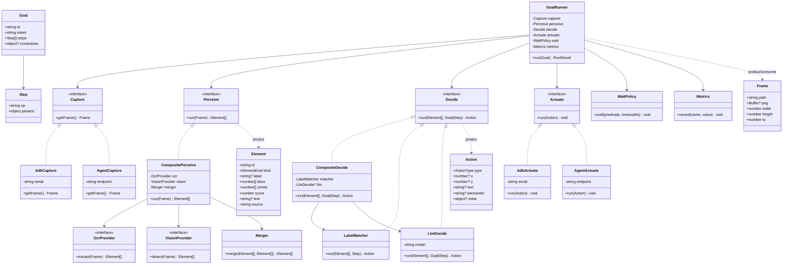
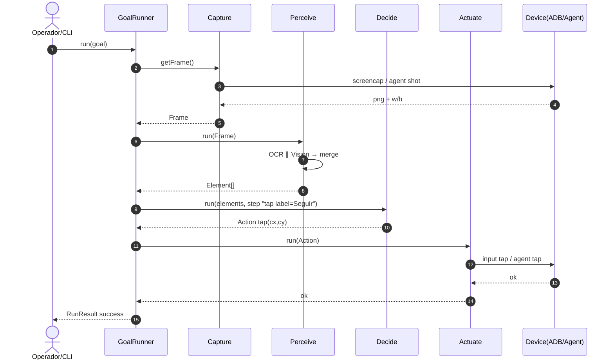
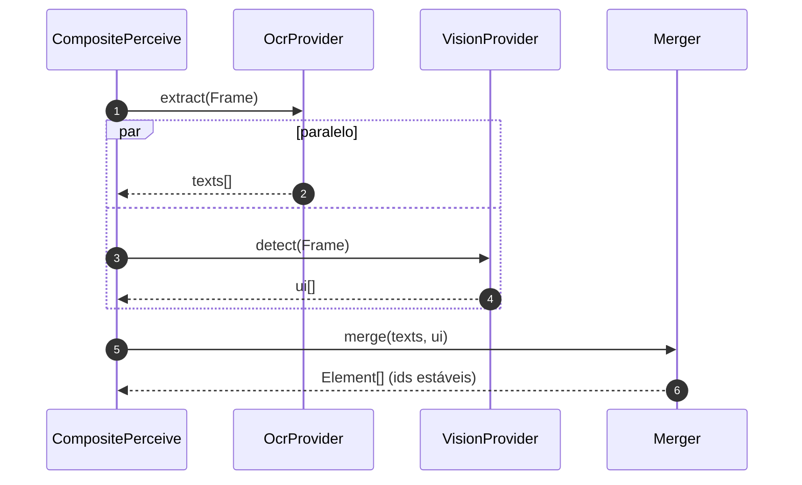
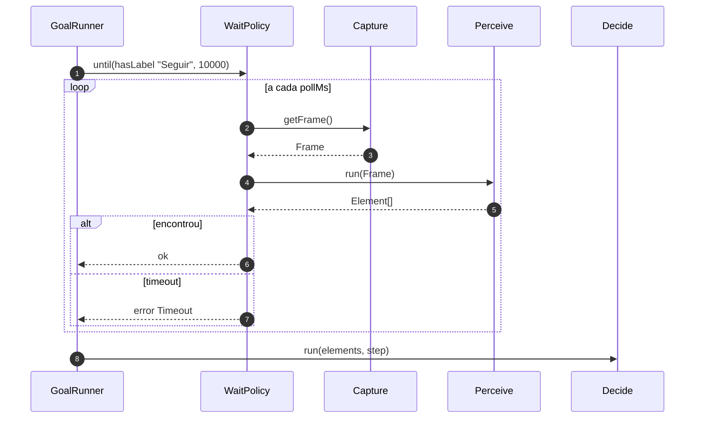
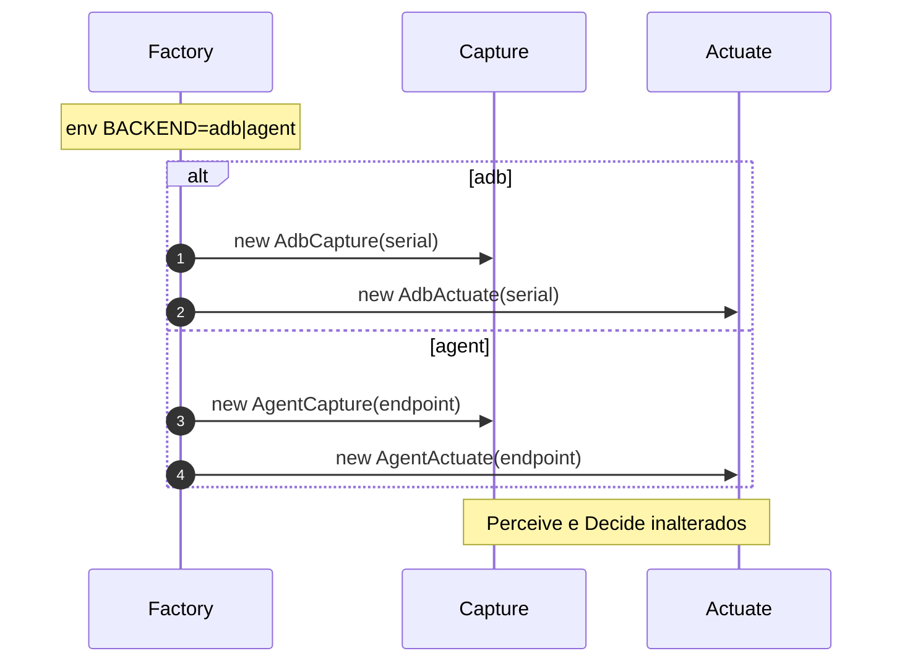

# Plano de implementação — Capture → Perceive → Decide → Actuate

**Por quê:** especificar *como* implementar o motor de percepção por imagem no **screen-robot**, com diagramas, BDD, árvore de execução e Gantt paralelizado.  
**Produto / WBS:** [`plano-percepcao-imagem-hardware.md`](plano-percepcao-imagem-hardware.md).  
**Código-base:** `sources/android-control`.  
**Estimativas:** horas de **esforço de IA** (agente), não humanas.  
**Premissa atual:** Capture e Actuate são **somente agent** (sem factory ADB|agent neste momento). Ver [`../epics/README.md`](../epics/README.md).
**Negócio vendas:** fora de escopo — ver [`../../vendas/`](../../vendas/README.md).

---

## 1. Escopo da implementação

| Em escopo | Fora de escopo (neste plano) |
|-----------|------------------------------|
| Libs + CLIs em `android-control` | App LinkedIn/Instagram completo de negócio |
| Backends ADB e contrato p/ agent | Robô/câmera externa |
| Goals JSON + BDD técnicos | UI web do ConnectMax |

---

## 2. Árvore de execução (implementação)

Ordem em que a IA deve executar e validar. Cada folha = entregável testável.

```text
plano-implementacao (este doc)
└── sources/android-control/
    ├── F0 Fundamentos
    │   ├── [ ] lib/types.js          # Frame, Element, Action, Goal
    │   ├── [ ] lib/capture.js        # interface + AdbCapture
    │   ├── [ ] lib/actuate.js        # interface + AdbActuate
    │   └── [ ] scripts/smoke-tap.js  # getFrame → tap
    ├── F1 Perceive
    │   ├── [ ] lib/schema.js         # validação Element[]
    │   ├── [ ] lib/ocr.js            # ∥ vision
    │   ├── [ ] lib/vision.js         # ∥ ocr
    │   ├── [ ] lib/perceive.js       # merge
    │   └── [ ] perceive-cli.js
    ├── F2 Decide + run
    │   ├── [ ] lib/matcher.js        # ∥ llm-decide
    │   ├── [ ] lib/llm-decide.js
    │   ├── [ ] lib/decide.js
    │   ├── [ ] lib/runner.js         # goal loop
    │   ├── [ ] run-goal.js
    │   └── [ ] goals/example.json
    ├── F3 Robustez
    │   ├── [ ] lib/wait.js           # ∥ scroll ∥ calibrate
    │   ├── [ ] lib/scroll.js
    │   ├── [ ] lib/calibrate.js
    │   └── [ ] lib/metrics.js
    └── F4 Hardware-ready
        ├── [ ] lib/agent-capture.js  # ∥ agent-actuate
        ├── [ ] lib/agent-actuate.js
        └── [ ] factory backend=adb|agent
```

### O que será feito em cada atividade

#### F0 — Fundamentos

| ID | Entregável | O que será feito |
|----|------------|------------------|
| I0.1 | `lib/types.js` | Definir os tipos/contratos JSDoc (ou shapes) de `Frame`, `Element`, `Action`, `Goal` e `Step`; enums `ElementKind` e `ActionType`; documentar o contrato Capture/Perceive/Decide/Actuate para o resto do código tipar contra isso. |
| I0.2 | `lib/capture.js` | Expor interface `Capture.getFrame()` e implementar `AdbCapture`: screencap via ADB no serial configurado, salvar/devolver PNG + `width`/`height`/`ts`. Reutilizar o que já existe em `android-control` (shot). |
| I0.3 | `lib/actuate.js` | Expor interface `Actuate.run(Action)` e implementar `AdbActuate`: wrap de `cli.js` / shell ADB para `tap`, `swipe` e `type` a partir de `Action`. Paralelo a I0.2. |
| I0.4 | `scripts/smoke-tap.js` + BDD `@f0` | Script que faz `getFrame` → `tap` no centro do frame no redroid; validar que o PNG tem dimensões > 0 e que o tap fica dentro dos limites. Cobrir o cenário BDD `@f0`. |

#### F1 — Perceive

| ID | Entregável | O que será feito |
|----|------------|------------------|
| I1.1 | `lib/schema.js` | Validar JSON de `Element[]` (campos obrigatórios, `bbox` 4 números, `center` 2 números, `kind` conhecido). Rejeitar payloads inválidos com erro claro. |
| I1.2 | `lib/ocr.js` | Provider OCR (local ou API): dado um `Frame`, extrair textos com bboxes e montar `Element[]` (`kind` text/button quando possível, `source: "ocr"`). Paralelo a I1.3. |
| I1.3 | `lib/vision.js` | Provider vision (LLM/detector): detectar botões, fotos, cards e regiões UI sem depender só de texto; emitir `Element[]` com `source: "vision"`. Paralelo a I1.2. |
| I1.4 | `lib/perceive.js` | `CompositePerceive`: chamar OCR ∥ vision, mergear listas (ids estáveis, sem conflito em sobreposição), marcar `source` ocr/vision/merged. |
| I1.5 | `perceive-cli.js` + BDD `@f1` | CLI `perceive <frame.png>` → JSON; overlay debug opcional; fixtures com texto “Seguir”; passar BDD `@f1` (OCR + merge). |

#### F2 — Decide + run

| ID | Entregável | O que será feito |
|----|------------|------------------|
| I2.1 | `lib/matcher.js` | Decisão determinística: escolher elemento por `label` / `kind` / índice e devolver `Action` (`tap` no `center`, `copy_text`, etc.). Sem LLM. Paralelo a I2.2. |
| I2.2 | `lib/llm-decide.js` | Decisão opcional via LLM: goal/step em linguagem natural + `Element[]` → `Action` estruturada. Fallback/uso só quando o matcher não basta. Paralelo a I2.1. |
| I2.3 | `lib/decide.js` + `lib/runner.js` | `CompositeDecide` (matcher + llm); `GoalRunner` orquestra Capture → Perceive → Decide → Actuate por step do goal; resultado `RunResult` (success/fail + dados extraídos). |
| I2.4 | `run-goal.js` + `goals/example.json` + BDD `@f2` | CLI para rodar um goal JSON; exemplo E2E “clicar em Seguir” **sem coordenadas hardcoded**; cobrir BDD `@f2` (tap por label + copy_text). |

#### F3 — Robustez

| ID | Entregável | O que será feito |
|----|------------|------------------|
| I3.1 | `lib/wait.js` | `WaitPolicy`: poll de capture+perceive até predicado (ex.: label aparece) ou timeout; usado em steps `wait_until`. Paralelo a I3.2 e I3.3. |
| I3.2 | `lib/scroll.js` | Steps `scroll_until`: swipe + re-perceive em loop até achar o alvo ou esgotar `max_swipes` (listas fora da viewport). Paralelo a I3.1 e I3.3. |
| I3.3 | `lib/calibrate.js` | Mapear coordenadas do espaço do frame para o espaço do actuator quando as resoluções diferem (ex.: 1080×1920 → 720×1280). Paralelo a I3.1 e I3.2. |
| I3.4 | `lib/metrics.js` + BDD `@f3` | Registrar acerto, latência e custo por etapa; integrar no runner; passar BDD `@f3` (wait, scroll, calibrate). |

#### F4 — Hardware-ready

| ID | Entregável | O que será feito |
|----|------------|------------------|
| I4.1 | factory + env | Factory que lê `BACKEND=adb\|agent` (e serial/endpoint) e instancia Capture/Actuate corretos **sem** mudar Perceive/Decide. Revisar contratos de F0 se necessário. |
| I4.2 | `lib/agent-capture.js` | Segundo backend de captura (APK agent ou scrcpy USB): mesma interface `getFrame()` → `Frame`. Paralelo a I4.3. |
| I4.3 | `lib/agent-actuate.js` | Segundo backend de atuação via agent: mesma interface `run(Action)`. Paralelo a I4.2. |
| I4.4 | BDD `@f4` + regressão | Validar factory + smoke do mesmo `goal.json` com `BACKEND=agent`; regressão mínima em 1 device (ou mock) sem reescrever goals. |

### Critérios de avanço

| De | Para | Só avança se |
|----|------|----------------|
| F0 | F1 | Smoke: frame + tap no redroid OK |
| F1 | F2 | `perceive frame.png` → JSON com ≥1 elemento útil |
| F2 | F3 | `run-goal.js goals/example.json` clica sem coords fixas |
| F3 | F4 | Wait/scroll cobertos por BDD abaixo |
| F4 | fim | Flag `backend=agent` compila + smoke em 1 device (quando houver) |

---

## 3. Diagrama de classes



### Pacotes / arquivos

| Classe / módulo | Arquivo sugerido |
|-----------------|------------------|
| tipos Frame/Element/Action/Goal | `lib/types.js` |
| AdbCapture | `lib/capture.js` |
| AgentCapture | `lib/agent-capture.js` |
| Ocr + Vision + CompositePerceive | `lib/ocr.js`, `lib/vision.js`, `lib/perceive.js` |
| Matcher + LlmDecide + CompositeDecide | `lib/matcher.js`, `lib/llm-decide.js`, `lib/decide.js` |
| AdbActuate / AgentActuate | `lib/actuate.js`, `lib/agent-actuate.js` |
| GoalRunner | `lib/runner.js` |

---

## 4. Diagramas de sequência

### 4.1 Fluxo feliz — goal “clicar em Seguir”



### 4.2 Perceive interno (OCR ∥ Vision)



### 4.3 Wait até elemento + retry



### 4.4 Troca de backend (ADB → Agent)



---

## 5. Cenários BDD

Formato: **Dado / Quando / Então**. Tags: `@f0`…`@f4`. Device padrão: redroid `127.0.0.1:5555`.

### História A — Capturar e atuar (F0)

```gherkin
@f0 @smoke
Cenário: Smoke captura frame e toca no centro da tela
  Dado que o device ADB "127.0.0.1:5555" está online
  E que o backend de captura/atuação é "adb"
  Quando o smoke executa getFrame e em seguida tap no centro do frame
  Então um arquivo PNG de frame é gerado com width e height > 0
  E o adb shell input tap é invocado com coordenadas dentro dos limites do frame
```

### História B — Perceber elementos só pela imagem (F1)

```gherkin
@f1 @perceive
Cenário: Perceive extrai textos via OCR a partir de um PNG
  Dado um frame PNG de fixture com o texto visível "Seguir"
  Quando executo perceive-cli sobre esse frame
  Então a saída JSON contém ao menos um Element com kind "text" ou "button"
  E o Element possui bbox de 4 números e center de 2 números
  E o label ou text contém "Seguir" (case-insensitive)

@f1 @perceive
Cenário: Perceive mescla OCR e vision sem ids duplicados conflitantes
  Dado um frame PNG de fixture com botão e foto
  Quando OCR e Vision retornam regiões sobrepostas
  Então o merge produz Element[] com ids únicos
  E cada Element declara source "ocr", "vision" ou "merged"
```

### História C — Decidir e executar goal (F2)

```gherkin
@f2 @goal
Cenário: Goal clica em elemento pelo label sem coordenada fixa no JSON
  Dado que o device está na tela de fixture onde existe o botão "Seguir"
  E um goal.json com step choose label="Seguir" e action tap
  Quando executo run-goal.js com esse goal
  Então o Decide seleciona um Element cujo label casa com "Seguir"
  E o Actuate recebe Action type="tap" com x,y iguais ao center do Element
  E o goal termina com status success

@f2 @goal
Cenário: Goal copia texto de um Element
  Dado elementos percebidos com text "Maria Silva"
  E um step copy_text matching kind="text" index=0
  Quando o runner executa o step
  Então o RunResult.extracted contém "Maria Silva"
```

### História D — Robustez (F3)

```gherkin
@f3 @wait
Cenário: Wait faz poll até o label aparecer
  Dado que o label "Seguir" ainda não está no primeiro frame
  E que aparecerá em até 3 segundos nos frames seguintes
  Quando o step wait_until label="Seguir" timeout=10000 roda
  Então o runner não falha por timeout
  E o perceive é chamado mais de uma vez

@f3 @scroll
Cenário: Scroll e re-perceive encontra item fora da viewport inicial
  Dado que o alvo "Lead X" não está no primeiro perceive
  Quando o step scroll_until label="Lead X" max_swipes=5 roda
  Então ao menos um swipe é executado
  E ao final existe Element com label contendo "Lead X"

@f3 @calibrate
Cenário: Calibração mapeia center do frame para coordenadas do actuator
  Dado um frame 1080x1920 e actuator lógico 720x1280
  Quando calibro o Action tap do center [540,960]
  Então as coordenadas enviadas ao actuator são [360,640] (±1px)
```

### História E — Backend agent (F4)

```gherkin
@f4 @hardware
Cenário: Factory seleciona AgentCapture e AgentActuate
  Dado BACKEND=agent e endpoint configurado
  Quando o GoalRunner é construído pela factory
  Então Capture é instância de AgentCapture
  E Actuate é instância de AgentActuate
  E Perceive e Decide são as mesmas classes do backend adb

@f4 @hardware
Cenário: Mesmo goal.json roda com backend agent (smoke)
  Dado um device físico ou mock do agent respondendo frame fixo
  E BACKEND=agent
  Quando executo o goal de smoke tap-center
  Então o resultado é success sem alterar o arquivo do goal
```

---

## 6. Gantt paralelizado (esforço IA)

Mesmas estimativas do [plano de produto](plano-percepcao-imagem-hardware.md); foco em **ordem de implementação**.

| ID | Entregável | h IA | Paralelo com |
|----|------------|------|--------------|
| I0.1 | `lib/types.js` | 0,4 | — |
| I0.2 | `AdbCapture` | 0,5 | I0.3 |
| I0.3 | `AdbActuate` | 0,4 | I0.2 |
| I0.4 | `smoke-tap.js` + BDD @f0 | 0,4 | — |
| I1.1 | `schema.js` | 0,4 | — |
| I1.2 | `ocr.js` | 1,0 | I1.3 |
| I1.3 | `vision.js` | 1,5 | I1.2 |
| I1.4 | `perceive.js` merge | 0,6 | — |
| I1.5 | `perceive-cli.js` + BDD @f1 | 0,5 | — |
| I2.1 | `matcher.js` | 0,6 | I2.2 |
| I2.2 | `llm-decide.js` | 0,8 | I2.1 |
| I2.3 | `decide.js` + `runner.js` | 0,9 | — |
| I2.4 | `run-goal.js` + example + BDD @f2 | 0,5 | — |
| I3.1 | `wait.js` | 0,5 | I3.2, I3.3 |
| I3.2 | `scroll.js` | 0,6 | I3.1, I3.3 |
| I3.3 | `calibrate.js` | 0,5 | I3.1, I3.2 |
| I3.4 | `metrics.js` + BDD @f3 | 0,5 | — |
| I4.1 | factory + env | 0,3 | — |
| I4.2 | `agent-capture.js` | 1,5 | I4.3 |
| I4.3 | `agent-actuate.js` | 1,5 | I4.2 |
| I4.4 | BDD @f4 + regressão | 0,8 | — |

**Total:** ~14,7 h IA · **caminho crítico c/ paralelismo:** ~10,5 h · **2 agentes:** ~8 h

```mermaid
gantt
  title Implementação android-control (minutos esforço IA)
  dateFormat X
  axisFormat %s

  section F0
  I0.1 types              :i01, 0, 24m
  I0.2 AdbCapture         :i02, after i01, 30m
  I0.3 AdbActuate         :i03, after i01, 24m
  I0.4 smoke+BDD          :i04, after i02, 24m

  section F1
  I1.1 schema             :i11, after i04, 24m
  I1.2 ocr                :i12, after i11, 60m
  I1.3 vision             :i13, after i11, 90m
  I1.4 merge              :i14, after i12, 36m
  I1.5 cli+BDD            :i15, after i14, 30m

  section F2
  I2.1 matcher            :i21, after i15, 36m
  I2.2 llm-decide         :i22, after i15, 48m
  I2.3 decide+runner      :i23, after i21, 54m
  I2.4 run-goal+BDD       :i24, after i23, 30m

  section F3
  I3.1 wait               :i31, after i24, 30m
  I3.2 scroll             :i32, after i24, 36m
  I3.3 calibrate          :i33, after i24, 30m
  I3.4 metrics+BDD        :i34, after i31, 30m

  section F4
  I4.1 factory            :i41, after i34, 18m
  I4.2 agent-capture      :i42, after i41, 90m
  I4.3 agent-actuate      :i43, after i41, 90m
  I4.4 BDD+regressão      :i44, after i42, 48m
```



> Paralelos reais (tabela): I0.2∥I0.3, I1.2∥I1.3, I2.1∥I2.2, I3.1∥I3.2∥I3.3, I4.2∥I4.3. O Gantt Mermaid simplifica `after` único; use a tabela como fonte de verdade.

---

## 7. Ordem de commits sugerida (IA)

1. `types` + `capture` + `actuate` + smoke  
2. `schema` + `ocr` (+ fixtures)  
3. `vision` + `perceive` merge + CLI  
4. `matcher` / `llm-decide` + `runner` + example goal  
5. `wait` / `scroll` / `calibrate` / `metrics`  
6. `agent-*` + factory + flag  

Cada commit deve deixar os BDD da fase correspondente passando (ou skip explícito se device offline).

---

## 8. Próximos passos

1. Implementar **I0.1–I0.4** (F0) em `sources/android-control`.  
2. Validar BDD `@f0` no redroid.  
3. Seguir árvore de execução até F4 conforme device disponível.
