# Tasks — screen-robot

**Por quê:** árvore de desenvolvimento das features e Gantt (minutos IA).  
**Fonte:** [`functionalities.md`](functionalities.md).  
**Visão:** [`../README.md`](../README.md).  
**Kanban / inventário (umbrella):** [`core/tasks`](../../../core/tasks/README.md#p1--connectmax--screen-robot).

Estimativas: minutos IA · **1 dia = 8h = 480 min**.  
IDs: **US-** história · **SC-** cenário (só sob US-01, US-02, US-13).

## Árvore de desenvolvimento

```text
screen-robot (393 min)
├── US-01 Provisionar um agente (60 min)
│   ├── SC-01.1 Subir / conectar o Android (agent) (20 min)
│   ├── SC-01.2 Garantir serial ADB online (20 min)
│   └── SC-01.3 Aguardar boot completo (20 min)
├── US-02 Instalar APKs (45 min)
│   ├── SC-02.1 Ler versão na config do dispositivo (5 min)
│   ├── SC-02.2 Baixar APK na versão definida (25 min)
│   └── SC-02.3 Instalar pacote no agent (15 min)
├── Eventos
│   ├── US-03 Evento de boot (12 min)
│   ├── US-04 Evento de app aberta (12 min)
│   ├── US-05 Evento de tela estável (12 min)
│   └── US-06 Evento de mudança de dump (12 min)
├── Operações
│   ├── US-07 Abrir aplicativo (15 min)
│   ├── US-08 tap (15 min)
│   ├── US-09 type (15 min)
│   ├── US-10 scroll (15 min)
│   ├── US-11 screenshot (15 min)
│   └── US-12 Resgatar coordenadas x,y (imagem de entrada) (15 min)
└── US-13 Extrair elementos e guardar sessão (150 min)
    ├── SC-13.1 Persistir sessão em arquivo (15 min)
    └── SC-13.2 Restaurar sessão do arquivo (15 min)
```

## Gantt — atividades da árvore (paralelizáveis por IA)

Mesmas atividades da árvore (nomes e minutos).  
Barras `crit` = funcionalidade; filhas em paralelo entre si (entrega IA).  
Esforço total (soma): **393 min**. Caminho crítico ≈ **60 min** (Provisionar) — US-13 = **150 min**.

```mermaid
gantt
  title screen-robot US minutos IA
  dateFormat X
  axisFormat %s

  section Provisionar
  US-01 Provisionar agente         :crit, p0, 0, 60m
  SC-01.1 Subir e conectar         :p1, 0, 20m
  SC-01.2 Serial ADB online        :p2, 0, 20m
  SC-01.3 Boot completo            :p3, 0, 20m

  section Instalar APKs
  US-02 Instalar APKs              :crit, i0, 0, 45m
  SC-02.1 Ler versao               :i1, 0, 5m
  SC-02.2 Baixar APK               :i2, 0, 25m
  SC-02.3 Instalar pacote          :i3, 0, 15m

  section Eventos
  US-03 Evento boot                :e1, 0, 12m
  US-04 Evento app aberta          :e2, 0, 12m
  US-05 Evento tela estavel        :e3, 0, 12m
  US-06 Evento mudanca dump        :e4, 0, 12m

  section Operacoes
  US-07 Abrir aplicativo           :o1, 0, 15m
  US-08 tap                        :o2, 0, 15m
  US-09 type                       :o3, 0, 15m
  US-10 scroll                     :o4, 0, 15m
  US-11 screenshot                 :o5, 0, 15m
  US-12 Resgatar xy por imagem     :o6, 0, 15m

  section Extrair e sessao
  US-13 Extrair e guardar sessao   :crit, x1, 0, 150m
  SC-13.1 Persistir sessao         :s1, 0, 15m
  SC-13.2 Restaurar sessao         :s2, 0, 15m
```



## Próximos passos

→ Implementação em [`../sources/android-control`](../sources/android-control/README.md)  
→ Aceite: [`bdd-linkedin-login.md`](bdd-linkedin-login.md) · BDD nós: [`bdd-nos.md`](bdd-nos.md)
