# Tasks — screen-robot

**Por quê:** árvore de execução das features e Gantt (minutos IA).  
**Fonte:** [`scenarios.md`](scenarios.md).  
**Épicos / fases:** [`epics.md`](epics.md).  
**Visão:** [`../README.md`](../README.md).  
**Kanban / inventário (umbrella):** [`core/tasks`](../../../core/tasks/README.md#p1--connectmax--screen-robot).

Histórias US (cada US com ≥1 SC; extrair = US-13; sessão = US-14..16).  
Estimativas: minutos IA · **1 dia = 8h = 480 min**.

### Árvore de execução

```text
screen-robot (273 min caminho · 408 min soma)
├── US-01 Provisionar um agente (60 min)
│   ├── SC-01 Subir / conectar o Android (agent) (20 min)
│   ├── SC-02 Garantir serial ADB online (20 min)
│   └── SC-03 Aguardar boot completo (20 min)
├── US-02 Evento de boot (12 min)
│   └── SC-04 Sinal de boot é recebido (12 min)
├── US-03 Evento de app aberta (12 min)
│   └── SC-05 App em foreground é confirmada (12 min)
├── US-04 Evento de tela estável (12 min)
│   └── SC-06 Tela fica estável (12 min)
├── US-05 Evento de mudança de dump (12 min)
│   └── SC-07 Dump de UI muda (12 min)
├── ∥ US-06 Instalar APKs (45 min)
│   ├── SC-08 Ler versão na config do dispositivo (5 min)
│   ├── SC-09 Baixar APK na versão definida (25 min)
│   └── SC-10 Instalar pacote no agent (15 min)
├── ∥ US-07 Abrir aplicativo (15 min)
│   └── SC-11 App é aberta no agent (15 min)
├── ∥ US-08 tap (15 min)
│   └── SC-12 Toque na tela (15 min)
├── ∥ US-09 type (15 min)
│   └── SC-13 Texto é digitado (15 min)
├── ∥ US-10 scroll (15 min)
│   └── SC-14 Conteúdo é rolado (15 min)
├── ∥ US-11 screenshot (15 min)
│   └── SC-15 Print da tela é salvo (15 min)
├── ∥ US-12 Resgatar coordenadas x,y a partir de uma imagem (15 min)
│   └── SC-16 Coordenadas a partir de imagem template (15 min)
├── ∥ US-13 Extrair elementos (120 min)
│   └── SC-17 Extrair elementos tipados e árvore DOM (120 min)
├── US-14 Salvar sessão (15 min)
│   └── SC-18 Salvar sessão em arquivo (15 min)
├── US-15 Remover sessão (15 min)
│   └── SC-19 Remover sessão do disco (15 min)
└── US-16 Recuperar sessão (15 min)
    └── SC-20 Recuperar sessão do arquivo (15 min)
```

`∥` = paralelizáveis (US-06..13; caminho do grupo = 120 min).

### Gantt — histórias (US-06..13 paralelas)

Barras = US apenas (SC ficam na árvore acima).  
US-01..05 e US-14..16 sequenciais; **US-06..13** partem juntas após US-05.  
Soma esforço: **408 min** · caminho crítico: **273 min**.

```mermaid
gantt
  title screen-robot US minutos IA (paralelo 06-13)
  dateFormat X
  axisFormat %s

  section Sequencial
  US-01 Provisionar um agente           :us01, 0, 60m
  US-02 Evento de boot                  :us02, after us01, 12m
  US-03 Evento de app aberta            :us03, after us02, 12m
  US-04 Evento de tela estavel          :us04, after us03, 12m
  US-05 Evento de mudanca de dump       :us05, after us04, 12m

  section Paralelo
  US-06 Instalar APKs                   :us06, after us05, 45m
  US-07 Abrir aplicativo                :us07, after us05, 15m
  US-08 tap                             :us08, after us05, 15m
  US-09 type                            :us09, after us05, 15m
  US-10 scroll                          :us10, after us05, 15m
  US-11 screenshot                      :us11, after us05, 15m
  US-12 Resgatar coordenadas x,y        :us12, after us05, 15m
  US-13 Extrair elementos               :crit, us13, after us05, 120m

  section Apos paralelo
  US-14 Salvar sessao                   :us14, after us13, 15m
  US-15 Remover sessao                  :us15, after us14, 15m
  US-16 Recuperar sessao                :us16, after us15, 15m
```



## Próximos passos

→ Implementação em [`../sources/android-control`](../sources/android-control/README.md)  
→ Aceite: [`bdds.md`](bdds.md)
