# Tasks — screen-robot

**Por quê:** árvore de execução das features e Gantt (minutos IA).  
**Fonte:** [`functionalities/`](functionalities/README.md).  
**Visão:** [`../README.md`](../README.md).  
**Kanban / inventário (umbrella):** [`core/tasks`](../../../core/tasks/README.md#p1--connectmax--screen-robot).

Histórias US (cada US com ≥1 SC; Extrair+sessão = US-13).  
Estimativas: minutos IA · **1 dia = 8h = 480 min**.

### Árvore de execução

```text
screen-robot (393 min)
├── US-01 Provisionar um agente (60 min)
│   ├── SC-01 Subir / conectar o Android (agent) (20 min)
│   ├── SC-02 Garantir serial ADB online (20 min)
│   └── SC-03 Aguardar boot completo (20 min)
├── US-02 Evento de boot (12 min)
│   └── SC-04 Sinal de boot é recebido (12 min)
├── US-03 Evento de app aberta (12 min)
│   └── SC-05 App em foreground é confirmada (12 min)
├── US-04 Evento de tela estável (12 min)
│   └── SC-06 Tela fica estável (12 min)
├── US-05 Evento de mudança de dump (12 min)
│   └── SC-07 Dump de UI muda (12 min)
├── US-06 Instalar APKs (45 min)
│   ├── SC-08 Ler versão na config do dispositivo (5 min)
│   ├── SC-09 Baixar APK na versão definida (25 min)
│   └── SC-10 Instalar pacote no agent (15 min)
├── US-07 Abrir aplicativo (15 min)
│   └── SC-11 App é aberta no agent (15 min)
├── US-08 tap (15 min)
│   └── SC-12 Toque na tela (15 min)
├── US-09 type (15 min)
│   └── SC-13 Texto é digitado (15 min)
├── US-10 scroll (15 min)
│   └── SC-14 Conteúdo é rolado (15 min)
├── US-11 screenshot (15 min)
│   └── SC-15 Print da tela é salvo (15 min)
├── US-12 Resgatar coordenadas x,y (imagem de entrada) (15 min)
│   └── SC-16 Coordenadas a partir de imagem template (15 min)
└── US-13 Extrair elementos e guardar sessão (150 min)
    ├── SC-17 Persistir sessão em arquivo (15 min)
    └── SC-18 Restaurar sessão do arquivo (15 min)
```

### Gantt — atividades da árvore (sequenciais)

Mesmas atividades da árvore acima (nomes e minutos), em sequência.  
Barras na ordem da árvore (folhas SC).  
Esforço total (soma / caminho crítico): **393 min**.

```mermaid
gantt
  title screen-robot US minutos IA sequencial
  dateFormat X
  axisFormat %s

  section Provisionar
  SC-01 Subir e conectar         :p1, 0, 20m
  SC-02 Serial ADB online        :p2, after p1, 20m
  SC-03 Boot completo            :p3, after p2, 20m

  section Eventos
  SC-04 Evento boot              :e1, after p3, 12m
  SC-05 Evento app aberta        :e2, after e1, 12m
  SC-06 Evento tela estavel      :e3, after e2, 12m
  SC-07 Evento mudanca dump      :e4, after e3, 12m

  section Instalar APKs
  SC-08 Ler versao               :i1, after e4, 5m
  SC-09 Baixar APK               :i2, after i1, 25m
  SC-10 Instalar pacote          :i3, after i2, 15m

  section Operacoes
  SC-11 Abrir aplicativo         :o1, after i3, 15m
  SC-12 tap                      :o2, after o1, 15m
  SC-13 type                     :o3, after o2, 15m
  SC-14 scroll                   :o4, after o3, 15m
  SC-15 screenshot               :o5, after o4, 15m
  SC-16 Resgatar xy por imagem   :o6, after o5, 15m

  section Extrair e sessao
  US-13 Extrair elementos          :crit, x1, after o6, 120m
  SC-17 Persistir sessao         :s1, after x1, 15m
  SC-18 Restaurar sessao         :s2, after s1, 15m
```



## Próximos passos

→ Implementação em [`../sources/android-control`](../sources/android-control/README.md)  
→ Aceite: [`bdd-linkedin-login.md`](bdd-linkedin-login.md) · BDD nós: [`bdd-nos.md`](bdd-nos.md)
