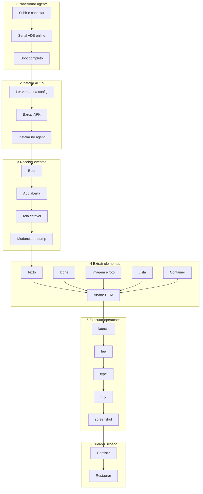

# Tasks — screen-robot

**Por quê:** árvore de execução e Gantt das funcionalidades maiores (sequenciais) e filhas.  
**Fonte:** [`functionalities.md`](functionalities.md).  
**Visão:** [`../README.md`](../README.md).  
**Estimativas:** minutos de esforço IA.

## Árvore de execução

```text
screen-robot
├── 1. Provisionar um agente
│   ├── Subir / conectar o Android (agent)
│   ├── Garantir serial ADB online
│   └── Aguardar boot completo
├── 2. Instalar APKs
│   ├── Ler versão na config do dispositivo
│   ├── Baixar APK na versão definida
│   └── Instalar pacote no agent
├── 3. Receber eventos
│   ├── Evento de boot
│   ├── Evento de app aberta
│   ├── Evento de tela estável
│   └── Evento de mudança de dump
├── 4. Extrair elementos e informações
│   ├── Nó Texto
│   ├── Nó Ícone
│   ├── Nó Imagem / foto
│   ├── Nó Lista (itens filhos + scroll)
│   ├── Nó Container
│   └── Montar árvore DOM (raiz → filhos)
├── 5. Executar operações
│   ├── launch
│   ├── tap
│   ├── type
│   ├── key
│   └── screenshot
└── 6. Guardar estado de sessão
    ├── Persistir sessão em arquivo
    └── Restaurar sessão do arquivo
```



## Gantt

Funcionalidades **maiores** em sequência; dentro de cada seção, as **filhas** preenchem a barra da maior.

```mermaid
gantt
  title screen-robot funcionalidades minutos IA
  dateFormat X
  axisFormat %s

  section 1 Provisionar
  Provisionar um agente     :crit, p0, 0, 60
  Subir e conectar agent    :p1, 0, 20
  Serial ADB online         :p2, after p1, 20
  Boot completo             :p3, after p2, 20

  section 2 Instalar APKs
  Instalar APKs             :crit, i0, after p0, 45
  Ler versao na config      :i1, after p0, 5
  Baixar APK                :i2, after i1, 25
  Instalar no agent         :i3, after i2, 15

  section 3 Receber eventos
  Receber eventos           :crit, e0, after i0, 48
  Evento boot               :e1, after i0, 12
  Evento app aberta         :e2, after e1, 12
  Evento tela estavel       :e3, after e2, 12
  Evento mudanca de dump    :e4, after e3, 12

  section 4 Extrair
  Extrair elementos         :crit, x0, after e0, 120
  No Texto                  :x1, after e0, 20
  No Icone                  :x2, after x1, 20
  No Imagem e foto          :x3, after x2, 24
  No Lista                  :x4, after x3, 24
  No Container              :x5, after x4, 12
  Montar arvore DOM         :x6, after x5, 20

  section 5 Operacoes
  Executar operacoes        :crit, o0, after x0, 75
  launch                    :o1, after x0, 15
  tap                       :o2, after o1, 15
  type                      :o3, after o2, 15
  key                       :o4, after o3, 15
  screenshot                :o5, after o4, 15

  section 6 Sessao
  Guardar estado de sessao  :crit, s0, after o0, 30
  Persistir sessao          :s1, after o0, 15
  Restaurar sessao          :s2, after s1, 15
```



| # | Maior | Filhas | Min IA |
|---|-------|--------|--------|
| 1 | Provisionar um agente | subir/conectar · serial online · boot | 60 |
| 2 | Instalar APKs | ler versão · baixar · instalar | 45 |
| 3 | Receber eventos | boot · app aberta · tela estável · dump | 48 |
| 4 | Extrair elementos | texto · ícone · imagem/foto · lista · container · árvore DOM | 120 |
| 5 | Executar operações | launch · tap · type · key · screenshot | 75 |
| 6 | Guardar sessão | persistir · restaurar | 30 |
| | **Total** | | **378** |

## Próximos passos

→ Implementação em [`../sources/android-control`](../sources/android-control/README.md)  
→ Aceite: [`bdd-linkedin-login.md`](bdd-linkedin-login.md)
