# screen-robot — Vision (EN)

**What:** Node-exposed capabilities of the Android screen robot.  
**Source (PT):** [`functionalities/`](functionalities/README.md) · **Product vision (PT):** [`../README.md`](../README.md).

## Pipeline (visual)

```mermaid
flowchart LR
  subgraph Provision
    US01[US-01 Provision agent]
  end
  subgraph Events
    US02[US-02 Boot event]
    US03[US-03 App open event]
    US04[US-04 Stable screen event]
    US05[US-05 Dump change event]
  end
  subgraph Install
    US06[US-06 Install APKs]
  end
  subgraph Operate
    US07[US-07 Open app]
    US08[US-08 tap]
    US09[US-09 type]
    US10[US-10 scroll]
    US11[US-11 screenshot]
    US12[US-12 x,y from image]
  end
  subgraph Extract
    US13[US-13 Extract + session]
  end

  US01 --> US02 --> US03 --> US04 --> US05 --> US06
  US06 --> US07 --> US08 --> US09 --> US10 --> US11 --> US12 --> US13
```

## User stories

| ID | Title | Description |
|----|-------|-------------|
| US-01 | Provision an agent | Start/connect Android and leave the device ready for ADB |
| US-02 | Boot event | Wait for and confirm the device boot signal |
| US-03 | App open event | Wait for and confirm the app is in foreground |
| US-04 | Stable screen event | Wait until the UI is stable (no transition) |
| US-05 | Dump change event | Detect a change in the UI dump (uiautomator) |
| US-06 | Install APKs | Download (version from config) and install packages on the agent |
| US-07 | Open application | Launch a package/activity on the agent |
| US-08 | tap | Touch at coordinates or element bounds |
| US-09 | type | Type / inject text |
| US-10 | scroll | Swipe / scroll on the screen or list |
| US-11 | screenshot | Capture a screen frame |
| US-12 | Get x,y coordinates from an image | Resolve on-screen x,y coordinates from an input image (template) |
| US-13 | Extract elements and save session | Typed elements + DOM-like tree from the screen; persist/restore session |

## Out of scope

- LinkedIn business cadence, lead queue, billing, sales roles  
- Auth bypass / illegitimate scraping  

## Next

→ Portuguese stories: [`functionalities/`](functionalities/README.md)  
→ Tasks: [`tasks.md`](tasks.md)  
→ Integration BDD: [`bdd-linkedin-login.md`](bdd-linkedin-login.md)
