# Vision — screen-robot

**Por quê:** lista visual das histórias (US) e como cada uma funciona.  
**Detalhe:** [`functionalities/`](functionalities/README.md) · **Visão do produto:** [`../README.md`](../README.md).

## Pipeline

```mermaid
flowchart LR
  subgraph Provisionar
    US01[US-01 Provisionar agente]
  end
  subgraph Eventos
    US02[US-02 Evento de boot]
    US03[US-03 Evento de app aberta]
    US04[US-04 Evento de tela estável]
    US05[US-05 Evento de mudança de dump]
  end
  subgraph Instalar
    US06[US-06 Instalar APKs]
  end
  subgraph Operar
    US07[US-07 Abrir aplicativo]
    US08[US-08 tap]
    US09[US-09 type]
    US10[US-10 scroll]
    US11[US-11 screenshot]
    US12[US-12 x,y a partir de imagem]
  end
  subgraph Extrair
    US13[US-13 Extrair e sessão]
  end

  US01 --> US02 --> US03 --> US04 --> US05 --> US06
  US06 --> US07 --> US08 --> US09 --> US10 --> US11 --> US12 --> US13
```

## Histórias

### US-01 — Provisionar um agente

Sobe/conecta o Android e deixa o device pronto para ADB.

Na prática, o código Node lê `device.config.json`, sobe o runtime/agent no host, estabelece a conexão e só considera o provisionamento concluído quando o serial ADB aparece como `device` e o boot do sistema está completo (`sys.boot_completed` ou equivalente). Sem esse estado, nenhuma operação seguinte deve rodar.

### US-02 — Evento de boot

Espera e confirma o sinal de boot do device.

Depois do serial online, o listener fica bloqueado (com timeout) até o device emitir o evento de boot. O retorno é um sinal explícito de “boot ok”, usado como pré-condição para instalar apps e abrir telas.

### US-03 — Evento de app aberta

Espera e confirma a app em foreground.

Recebe o package (e activity opcional) esperado e consulta o estado do agent até a app alvo estar em foreground. Só então o fluxo segue para estabilidade de UI ou gestos — evita tocar/digitar em tela errada.

### US-04 — Evento de tela estável

Espera UI estável (sem transição).

Com a app em foreground, observa a hierarquia/frame até não haver mais transição relevante (animações, loading, troca de tela). O evento “tela estável” libera screenshot, extração e operações confiáveis.

### US-05 — Evento de mudança de dump

Detecta mudança no dump de UI (uiautomator).

Compara o dump atual com o anterior (ou com ausência de dump). Quando a árvore UI muda, devolve o dump atualizado. Serve para reagir a mudanças de tela sem polling cego de screenshot o tempo todo.

### US-06 — Instalar APKs

Baixa (versão na config) e instala pacotes no agent.

Para cada app em `device.config.json`, lê package + versão, baixa o APK/XAPK com a ferramenta configurada (ex. apkeep) e instala via `adb install` (ou equivalente). Resultado: apps na versão pedida no agent, prontos para abrir.

### US-07 — Abrir aplicativo

Launch de package/activity no agent.

Dispara o launch do package (e activity se informada) no device e espera a app entrar em foreground. É o ponto de entrada das operações de UI (tap, type, scroll, print).

### US-08 — tap

Toque em coordenadas ou bounds do elemento.

Recebe x,y ou um retângulo (bounds), envia o toque no agent e espera a UI refletir a ação. Usado após localizar o alvo (por dump, visão ou coordenadas já conhecidas).

### US-09 — type

Digitar / injetar texto.

Com campo focado ou coords do alvo, injeta o texto no agent. O estado esperado é o texto visível na UI (ou aceito pelo campo), para formulários e login.

### US-10 — scroll

Swipe / scroll na tela ou lista.

Recebe direção (up/down/left/right), distância ou área (bounds) e executa swipe/scroll. Objetivo: revelar conteúdo fora da viewport (listas, feeds) antes de novo tap/extração.

### US-11 — screenshot

Capturar frame da tela.

Com serial online e path de saída, captura o frame atual e grava o arquivo de imagem. O print alimenta visão (US-12), OCR/extração (US-13) e evidência de aceite.

### US-12 — Resgatar coordenadas x,y a partir de uma imagem

Resgata as coordenadas x,y na tela a partir de uma imagem de entrada (template).

Recebe uma imagem template e o frame/tela atual, faz match por visão/template e devolve x,y (e confiança). Assim o robô toca em alvos reconhecidos visualmente quando não há id estável no dump.

### US-13 — Extrair elementos e guardar sessão

Elementos tipados + árvore DOM a partir da tela; persistir/restaurar sessão.

A partir de imagem/frame ou dump, reconhece textos (OCR), ícones, imagens/fotos, listas e containers, monta uma árvore de componentes (estilo DOM) e permite gravar/restaurar o contexto da sessão em arquivo (device, apps, etapa, paths). É a ponte entre “o que está na tela” e o estado do fluxo automatizado.

## Fora de escopo

- Cadência LinkedIn, fila de leads, faturamento, papéis de venda
- Bypass de autenticação / scraping ilegítimo

## Próximos passos

→ [`functionalities/`](functionalities/README.md)  
→ [`tasks.md`](tasks.md)  
→ [`bdd-linkedin-login.md`](bdd-linkedin-login.md)
