# Vision — screen-robot

**Por quê:** lista visual das histórias (US) do robô de tela.  
**Detalhe:** [`functionalities/`](functionalities/README.md) · **Visão do produto:** [`../README.md`](../README.md).

## Pipeline

```mermaid
flowchart LR
  subgraph Provisionar
    US01[US-01 Provisionar agente]
  end
  subgraph Eventos
    US02[US-02 Evento de boot]
    US03[US-03 Evento de app aberta]
    US04[US-04 Evento de tela estável]
    US05[US-05 Evento de mudança de dump]
  end
  subgraph Instalar
    US06[US-06 Instalar APKs]
  end
  subgraph Operar
    US07[US-07 Abrir aplicativo]
    US08[US-08 tap]
    US09[US-09 type]
    US10[US-10 scroll]
    US11[US-11 screenshot]
    US12[US-12 x,y a partir de imagem]
  end
  subgraph Extrair
    US13[US-13 Extrair e sessão]
  end

  US01 --> US02 --> US03 --> US04 --> US05 --> US06
  US06 --> US07 --> US08 --> US09 --> US10 --> US11 --> US12 --> US13
```

## Histórias

### US-01 — Provisionar um agente

Sobe/conecta o Android e deixa o device pronto para ADB.

### US-02 — Evento de boot

Espera e confirma o sinal de boot do device.

### US-03 — Evento de app aberta

Espera e confirma a app em foreground.

### US-04 — Evento de tela estável

Espera UI estável (sem transição).

### US-05 — Evento de mudança de dump

Detecta mudança no dump de UI (uiautomator).

### US-06 — Instalar APKs

Baixa (versão na config) e instala pacotes no agent.

### US-07 — Abrir aplicativo

Launch de package/activity no agent.

### US-08 — tap

Toque em coordenadas ou bounds do elemento.

### US-09 — type

Digitar / injetar texto.

### US-10 — scroll

Swipe / scroll na tela ou lista.

### US-11 — screenshot

Capturar frame da tela.

### US-12 — Resgatar coordenadas x,y a partir de uma imagem

Resgata as coordenadas x,y na tela a partir de uma imagem de entrada (template).

### US-13 — Extrair elementos e guardar sessão

Elementos tipados + árvore DOM a partir da tela; persistir/restaurar sessão.

## Fora de escopo

- Cadência LinkedIn, fila de leads, faturamento, papéis de venda
- Bypass de autenticação / scraping ilegítimo

## Próximos passos

→ [`functionalities/`](functionalities/README.md)  
→ [`tasks.md`](tasks.md)  
→ [`bdd-linkedin-login.md`](bdd-linkedin-login.md)
