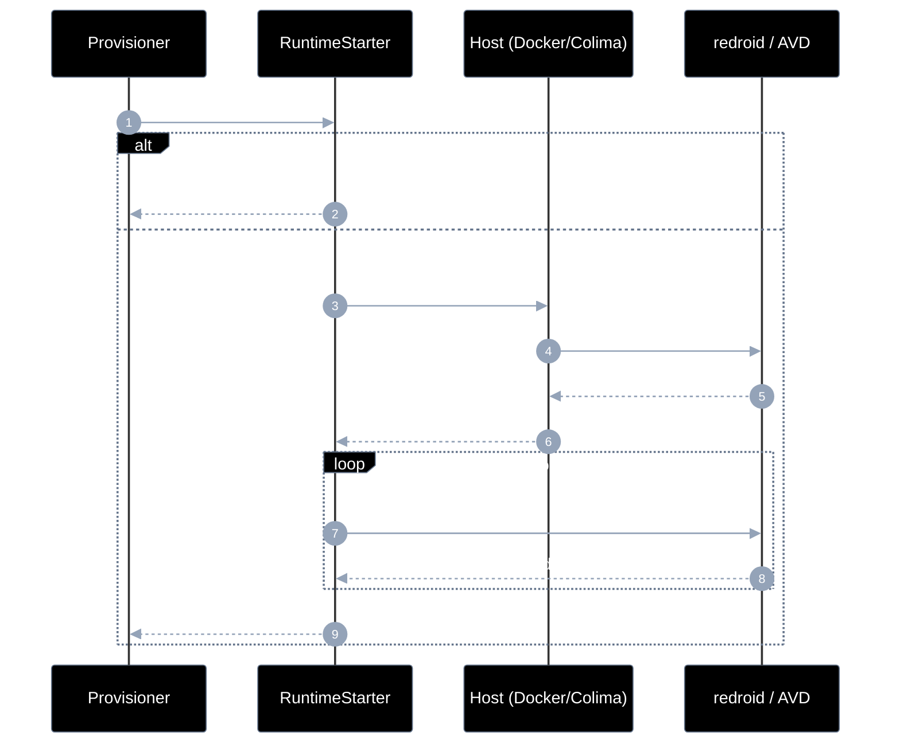
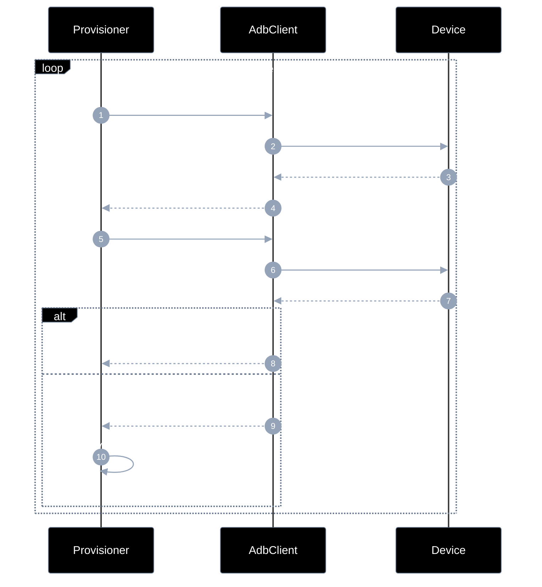
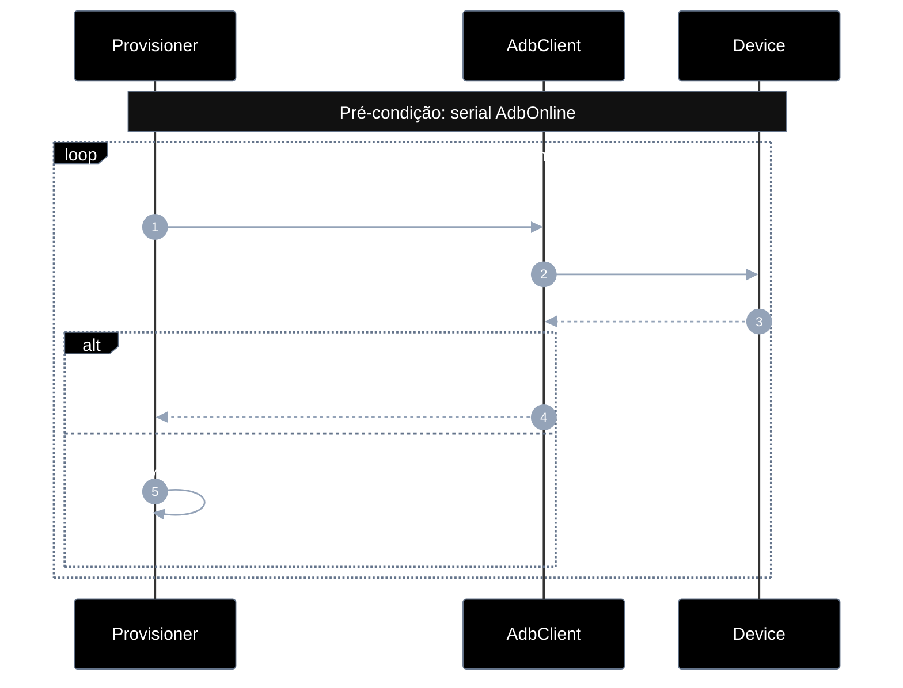
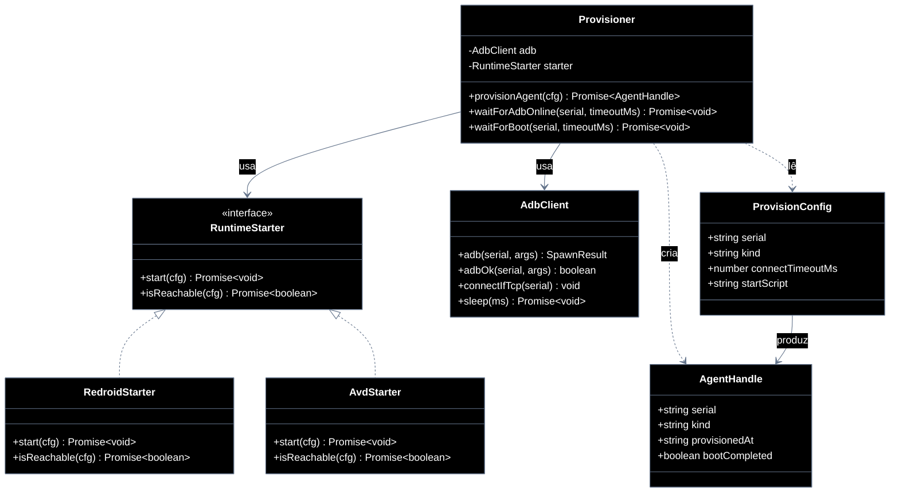

# Implementation plan — EP-01 Provisionar agente

**Por quê:** plano técnico do épico (sequências · agentes · passo a passo · contratos · classes · modelos · BDDs).  
**Épico:** [`2.epics.md`](2.epics.md) · [`README.md`](README.md).  
**US:** [`US-01-provisionar-um-agente/`](US-01-provisionar-um-agente/README.md).  
**Código:** [`../../sources/android-control/lib/provision.js`](../../sources/android-control/lib/provision.js) · [`adb.js`](../../sources/android-control/lib/adb.js).  
**Runtime:** [`../../sources/redroid/`](../../sources/redroid/README.md) · [`../../sources/android-studio/`](../../sources/android-studio/README.md).

**Stack:** Node ≥ 18 · `adb` · Docker/Colima (redroid) ou AVD.

---

## Escopo

| ID | Item |
|----|------|
| US-01 | Provisionar um agente |
| SC-01 | Subir / conectar o Android (agent) |
| SC-02 | Garantir serial ADB online |
| SC-03 | Aguardar boot completo |

**Resultado:** serial ADB `device` + `sys.boot_completed=1` → runtime pronto para EP-02..06.

---

## Diagramas de sequência

### US-01 — Fluxo completo

#### Agentes

| Agente | Responsabilidade |
|--------|------------------|
| Caller / CLI | Inicia o provisionamento e consome o `AgentHandle` pronto |
| Provisioner | Orquestra SC-01→SC-03: resolve config, sobe runtime, espera ADB e boot |
| RuntimeStarter | Sobe ou detecta o runtime Android (redroid/AVD) até ficar alcançável |
| AdbClient | Encapsula comandos `adb` (connect, wait-for-device, getprop) |
| Device / redroid | Android alvo onde o agent roda e responde aos comandos ADB |

```mermaid
---
config:
  theme: base
  themeVariables:
    darkMode: true
    background: '#000000'
    primaryColor: '#000000'
    primaryTextColor: '#ffffff'
    primaryBorderColor: '#64748b'
    secondaryColor: '#000000'
    secondaryTextColor: '#ffffff'
    secondaryBorderColor: '#64748b'
    tertiaryColor: '#000000'
    tertiaryTextColor: '#ffffff'
    tertiaryBorderColor: '#64748b'
    lineColor: '#64748b'
    textColor: '#ffffff'
    mainBkg: '#000000'
    nodeBorder: '#64748b'
    clusterBkg: '#000000'
    clusterBorder: '#333333'
    titleColor: '#ffffff'
    edgeLabelBackground: '#000000'
    actorBkg: '#000000'
    actorBorder: '#64748b'
    actorTextColor: '#ffffff'
    actorLineColor: '#333333'
    signalColor: '#94a3b8'
    signalTextColor: '#ffffff'
    labelBoxBkgColor: '#000000'
    labelBoxBorderColor: '#64748b'
    labelTextColor: '#ffffff'
    loopTextColor: '#ffffff'
    noteBorderColor: '#64748b'
    noteBkgColor: '#111111'
    noteTextColor: '#ffffff'
    activationBorderColor: '#64748b'
    activationBkgColor: '#1a1a1a'
    sequenceNumberColor: '#ffffff'
    classText: '#ffffff'
---
sequenceDiagram
  autonumber
  actor Dev as Caller / CLI
  participant P as Provisioner
  participant R as RuntimeStarter
  participant A as AdbClient
  participant D as Device / redroid

  Dev->>P: provisionAgent(cfg)
  P->>P: resolve serial, timeout, kind

  rect rgb(17,17,17)
    note over P,D: SC-01 Subir / conectar
    P->>R: start(cfg) se ainda não reachable
    R->>D: scripts/start.sh (docker/AVD)
    D-->>R: up (porta/processo)
    R-->>P: reachable
  end

  rect rgb(26,26,26)
    note over P,D: SC-02 Serial ADB online
    loop até device ou timeout
      P->>A: connectIfTcp(serial)
      A->>D: adb connect
      D-->>A: connected
      A-->>P: ok
      P->>A: wait-for-device
      A->>D: adb -s serial wait-for-device
      D-->>A: device
      A-->>P: online
    end
  end

  rect rgb(34,34,34)
    note over P,D: SC-03 Boot completo
    loop até boot=1 ou timeout
      P->>A: getprop sys.boot_completed
      A->>D: adb shell getprop
      D-->>A: "1"
      A-->>P: boot=1
    end
  end

  P-->>Dev: AgentHandle { serial, kind, provisionedAt }
```



#### Passo a passo

| # | Chamada | Por quê | Entradas | Execução | Saídas |
|---|---------|---------|----------|----------|--------|
| 1 | Dev → Provisioner: `provisionAgent(cfg)` | Entrada do épico | `cfg` | Valida cfg e orquestra SC-01→SC-03 | Promise `AgentHandle` |
| 2 | Provisioner → Provisioner: resolve serial/timeout/kind | Normalizar config | `cfg` + env | Aplica defaults e precedência | `ProvisionConfig` |
| 3 | Provisioner → RuntimeStarter: `start(cfg)` | Garantir runtime up (SC-01) | `kind`, `startScript?` | Chama start se não reachable | pedido de start |
| 4 | RuntimeStarter → Device: `scripts/start.sh` | Materializar Android | script + args | Spawn docker/AVD | pedido de up |
| 5 | Device → RuntimeStarter: `up` | Confirmar runtime no ar | porta/processo | Sinaliza up | `up` |
| 6 | RuntimeStarter → Provisioner: `reachable` | Fechar SC-01 | `up` | Retorna reachable | `true` |
| 7 | Provisioner → AdbClient: `connectIfTcp(serial)` | TCP precisa connect (SC-02) | `serial` | Detecta TCP e pede connect | pedido |
| 8 | AdbClient → Device: `adb connect` | Abrir canal ADB | `host:port` | Roda adb connect | pedido |
| 9 | Device → AdbClient: `connected` | Sessão TCP | — | Aceita/recusa connect | `connected` |
| 10 | AdbClient → Provisioner: `ok` | Connect concluído | — | Propaga resultado | `ok` |
| 11 | Provisioner → AdbClient: `wait-for-device` | Esperar estado device | `serial` | Chama wait-for-device | pedido |
| 12 | AdbClient → Device: `adb wait-for-device` | Bloquear até online | `serial` | Comando adb | pedido |
| 13 | Device → AdbClient: `device` | Serial online | — | Estado device | `device` |
| 14 | AdbClient → Provisioner: `online` | SC-02 ok | — | Propaga online | `online` |
| 15 | Provisioner → AdbClient: `getprop sys.boot_completed` | Checar boot (SC-03) | `serial` | Pede getprop | pedido |
| 16 | AdbClient → Device: `adb shell getprop` | Ler prop | `sys.boot_completed` | Shell remoto | pedido |
| 17 | Device → AdbClient: `"1"` | Boot completo | — | Retorna prop | `1` |
| 18 | AdbClient → Provisioner: `boot=1` | SC-03 ok | — | Propaga Booted | `boot=1` |
| 19 | Provisioner → Dev: `AgentHandle` | Entregar handle | estado interno | Monta saída | `{ serial, kind, provisionedAt }` |

#### Contratos

| | Contrato |
|--|----------|
| **API** | `provisionAgent(cfg: ProvisionConfig) → Promise<AgentHandle>` |
| **Entrada** | `cfg` com `serial` (ou `device` / `ANDROID_SERIAL`), `kind?`, `connectTimeoutMs?`, `startScript?` |
| **Pré** | Host com `adb`; runtime redroid/AVD disponível ou startável |
| **Saída** | `{ serial, kind, provisionedAt, bootCompleted: true }` |
| **Erro** | `PROVISION_NO_SERIAL` · `PROVISION_START_FAILED` · `PROVISION_ADB_TIMEOUT` · `PROVISION_BOOT_TIMEOUT` |
| **Pós** | Device em estado `Booted`; pronto para EP-02..06 |

### SC-01 — Subir / conectar o Android

#### Agentes

| Agente | Responsabilidade |
|--------|------------------|
| Provisioner | Pede ao RuntimeStarter que o Android esteja reachable antes do ADB |
| RuntimeStarter | Decide se já há runtime up; senão, dispara o start e faz poll de alcance |
| Host (Docker/Colima) | Executa o script/processo que materializa container ou AVD |
| redroid / AVD | Instância Android que sobe e passa a responder na porta/status |



#### Passo a passo

| # | Chamada | Por quê | Entradas | Execução | Saídas |
|---|---------|---------|----------|----------|--------|
| 1 | Provisioner → RuntimeStarter: `isReachable(cfg)?` | Evitar subir de novo | `kind`, `serial` | Probe porta/processo | pedido |
| 2 | RuntimeStarter → Provisioner: `true` | Já up | — | alt alcançável | `true` |
| 3 | RuntimeStarter → Host: `spawn startScript` | Subir runtime | `startScript` | Spawn no host | pedido |
| 4 | Host → Device: `container/AVD up` | Materializar Android | imagem/AVD | docker run / emulator | pedido |
| 5 | Device → Host: `running` | Processo no ar | — | Sinaliza running | `running` |
| 6 | Host → RuntimeStarter: `started` | Spawn ok | — | Confirma started | `started` |
| 7 | RuntimeStarter → Device: `porta / status` | Poll de alcance | porta | Lê health | pedido |
| 8 | Device → RuntimeStarter: `up\|down` | Status atual | — | Responde probe | `up`\\|`down` |
| 9 | RuntimeStarter → Provisioner: `reachable` | Fechar SC-01 | — | Retorna reachable | `reachable` |

#### Contratos

| | Contrato |
|--|----------|
| **API** | `RuntimeStarter.start(cfg)` · `isReachable(cfg) → boolean` |
| **Entrada** | `kind`, `startScript?`, `host?`, `serial` |
| **Pré** | Docker/Colima ou AVD no PATH; script de start existente |
| **Saída** | Runtime alcançável (porta/processo up) |
| **Erro** | `PROVISION_START_FAILED` |

### SC-02 — Serial ADB online

#### Agentes

| Agente | Responsabilidade |
|--------|------------------|
| Provisioner | Repete connect/wait até o serial ficar `device` dentro do timeout |
| AdbClient | Executa `adb connect` (TCP) e `wait-for-device` no serial |
| Device | Aparece no adb server como estado `device` quando online |



#### Passo a passo

| # | Chamada | Por quê | Entradas | Execução | Saídas |
|---|---------|---------|----------|----------|--------|
| 1 | Provisioner → AdbClient: `connectIfTcp(serial)` | Connect se TCP | `serial` | Detecta e conecta | pedido |
| 2 | AdbClient → Device: `adb connect` | Abrir sessão | `host:port` | Comando adb | pedido |
| 3 | Device → AdbClient: `connected\|failed` | Resultado connect | — | Resposta adb | status |
| 4 | AdbClient → Provisioner: `connect result` | Reportar connect | — | Propaga | resultado |
| 5 | Provisioner → AdbClient: `wait-for-device` | Esperar device | `serial` | Chama wait | pedido |
| 6 | AdbClient → Device: `adb wait-for-device` | Bloquear até online | `serial` | Comando adb | pedido |
| 7 | Device → AdbClient: `device\|timeout` | Estado | — | Resposta | status |
| 8 | AdbClient → Provisioner: `ok` | Online | — | alt device | `ok` |
| 9 | AdbClient → Provisioner: `erro / retry` | Ainda offline | — | alt falha | erro |
| 10 | Provisioner → Provisioner: `sleep(2000)` | Backoff | `2000ms` | Espera e reentra no loop | — |

#### Contratos

| | Contrato |
|--|----------|
| **API** | `waitForAdbOnline(serial, { timeoutMs }) → Promise<void>` |
| **Entrada** | `serial` TCP ou USB; `timeoutMs` |
| **Pré** | Runtime reachable (SC-01) |
| **Saída** | Serial listado como `device` no `adb` |
| **Erro** | `PROVISION_ADB_TIMEOUT` |

### SC-03 — Boot completo

#### Agentes

| Agente | Responsabilidade |
|--------|------------------|
| Provisioner | Polla `sys.boot_completed` até `1` ou timeout |
| AdbClient | Roda `adb shell getprop` e devolve o valor da prop |
| Device | Expõe o estado de boot via propriedade do sistema |



#### Passo a passo

| # | Chamada | Por quê | Entradas | Execução | Saídas |
|---|---------|---------|----------|----------|--------|
| 1 | Provisioner → AdbClient: `getprop sys.boot_completed` | Ler boot | `serial` | Pede getprop | pedido |
| 2 | AdbClient → Device: `getprop` | Shell | `sys.boot_completed` | adb shell getprop | pedido |
| 3 | Device → AdbClient: `"0"\|"1"\|vazio` | Valor da prop | — | Resposta | prop |
| 4 | AdbClient → Provisioner: `Booted` | Boot ok | `1` | alt boot==1 | `Booted` |
| 5 | Provisioner → Provisioner: `sleep(2000)` | Backoff enquanto não boot | `2000ms` | Espera e reentra no loop | — |

#### Contratos

| | Contrato |
|--|----------|
| **API** | `waitForBoot(serial, { timeoutMs, onEvent? }) → Promise<{ boot: true }>` |
| **Entrada** | `serial` online; `timeoutMs`; `onEvent?` |
| **Pré** | Serial `AdbOnline` (SC-02) |
| **Saída** | `sys.boot_completed === "1"` |
| **Erro** | `PROVISION_BOOT_TIMEOUT` |
---

## Modelos

### ProvisionConfig

| Campo | Tipo | Origem | Descrição |
|-------|------|--------|-----------|
| `serial` | `string` | `cfg.provision.serial` \| `cfg.device` \| `ANDROID_SERIAL` | Ex.: `127.0.0.1:5555` |
| `kind` | `"adb" \| "redroid" \| "avd"` | `cfg.provision.kind` | Runtime alvo |
| `connectTimeoutMs` | `number` | `cfg.provision.connectTimeoutMs` | Default `120000` |
| `startScript` | `string?` | futuro | Path do script de start (SC-01) |
| `host` | `string?` | futuro | Host Docker/Colima |

### AgentHandle (saída)

| Campo | Tipo | Descrição |
|-------|------|-----------|
| `serial` | `string` | Serial ADB online |
| `kind` | `string` | Kind efetivo |
| `provisionedAt` | `ISO-8601` | Momento do aceite |
| `bootCompleted` | `boolean` | Sempre `true` no sucesso |

### DeviceState (máquina de estados)

```text
Absent → Starting → Reachable → AdbOnline → Booted
                ↘──────── timeout / error ────────↗
```

| Estado | Significado | SC |
|--------|-------------|-----|
| `Absent` | Sem processo/container | — |
| `Starting` | Script de start em curso | SC-01 |
| `Reachable` | Runtime alcançável (porta/processo) | SC-01 |
| `AdbOnline` | `adb` lista serial como `device` | SC-02 |
| `Booted` | `sys.boot_completed=1` | SC-03 |

### Erros

| Código | Quando |
|--------|--------|
| `PROVISION_NO_SERIAL` | Config sem serial |
| `PROVISION_START_FAILED` | Script/runtime não sobe (SC-01) |
| `PROVISION_ADB_TIMEOUT` | Serial não fica `device` (SC-02) |
| `PROVISION_BOOT_TIMEOUT` | Boot não completa (SC-03) |

---

## Diagrama de classes



**Hoje:** `provisionAgent` + `AdbClient` (`adb.js`) cobrem SC-02+SC-03; SC-01 é manual via scripts redroid/studio.  
**Gap:** extrair `RuntimeStarter` e APIs `waitForAdbOnline` / `waitForBoot`.

---

## Cenários BDD

Fonte canônica: [`US-01-provisionar-um-agente/4.bdds.md`](US-01-provisionar-um-agente/4.bdds.md).

### US-01 — Agent fica pronto para ADB

```gherkin
Cenário: US-01 Agent fica pronto para ADB
  Dado o config e o runtime Android disponíveis
  Quando o provisionamento sobe/conecta o agent, garante serial online e aguarda boot completo
  Então o agent está pronto para ADB (serial online e boot ok)
```

### SC-01 — Subir / conectar o Android (agent)

```gherkin
Cenário: SC-01 Agent sobe e fica alcançável
  Dado host, imagem/runtime e script de start
  Quando o agent é iniciado e a conexão é estabelecida
  Então o processo do agent está em execução e alcançável
```

### SC-02 — Garantir serial ADB online

```gherkin
Cenário: SC-02 Serial ADB fica online
  Dado o agent alcançável e o serial esperado na config
  Quando adb connect / listagem de devices é repetida até o serial aparecer como device
  Então o serial ADB está online
```

### SC-03 — Aguardar boot completo

```gherkin
Cenário: SC-03 Boot completo no device
  Dado o serial ADB online
  Quando o sistema faz poll de boot (ex. sys.boot_completed)
  Então o device reporta boot completo
```

---

## Plano de implementação (gaps → entregas)

| # | Entrega | SC | Arquivos | Critério |
|---|---------|-----|----------|----------|
| I1 | Tipar `ProvisionConfig` / `AgentHandle` (JSDoc ou `.d.ts`) | — | `lib/provision.js` | Tipos documentados |
| I2 | Extrair `waitForAdbOnline(serial, opts)` | SC-02 | `provision.js` + `adb.js` | API isolada + timeout |
| I3 | Extrair `waitForBoot(serial, opts)` | SC-03 | `provision.js` | API isolada + `onEvent` |
| I4 | `RuntimeStarter` + `RedroidStarter` (chama `sources/redroid/scripts/start.sh`) | SC-01 | `lib/runtime/` | Start opcional se não reachable |
| I5 | `AvdStarter` (android-studio scripts) | SC-01 | `lib/runtime/` | kind=`avd` |
| I6 | `provisionAgent` orquestra I2–I5 | US-01 | `provision.js` | BDDs US-01 + SC passam |
| I7 | CLI `node cli.js provision --config …` | US-01 | `cli.js` | Exit 0 só com Booted |

### Ordem

```text
I1 → I2 → I3 → I4 → I5 → I6 → I7
         ↘ paraleliza I4/I5 após I1
```

---

## Mapeamento código atual

| Peça | Status |
|------|--------|
| `provisionAgent` (connect + boot loop) | Existe — mistura SC-02+SC-03 |
| `connectIfTcp` / `adb` / `wait-for-device` | Existe |
| Start redroid/AVD via Node | **Gap** (só scripts shell) |
| `waitForBoot` / `waitForAdbOnline` dedicados | **Gap** |
| Eventos `onEvent` no provision | **Gap** (EP-02 US-02 reutiliza) |

---

## Critério de pronto (épico)

1. Modelos `ProvisionConfig` / `AgentHandle` / estados documentados  
2. Classes/APIs alinhadas ao diagrama  
3. Sequências SC-01..03 implementáveis e cobertas por BDD  
4. `provisionAgent` devolve handle só em estado `Booted`  
5. Piloto LinkedIn continua funcionando com o mesmo config  

## Próximos passos

→ Implementar I1–I7 em [`sources/android-control`](../../sources/android-control/README.md)  
→ Aceite: [`US-01-provisionar-um-agente/4.bdds.md`](US-01-provisionar-um-agente/4.bdds.md)
