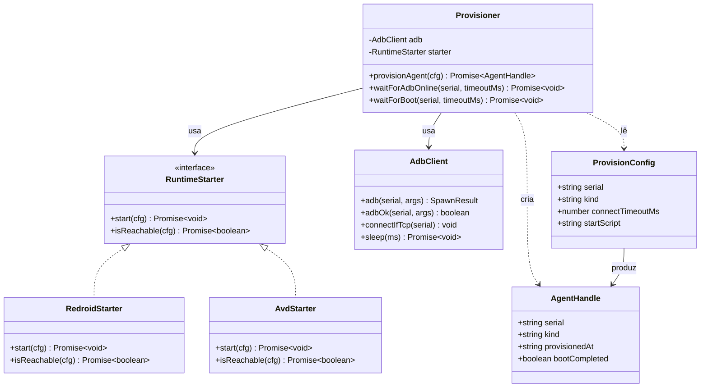
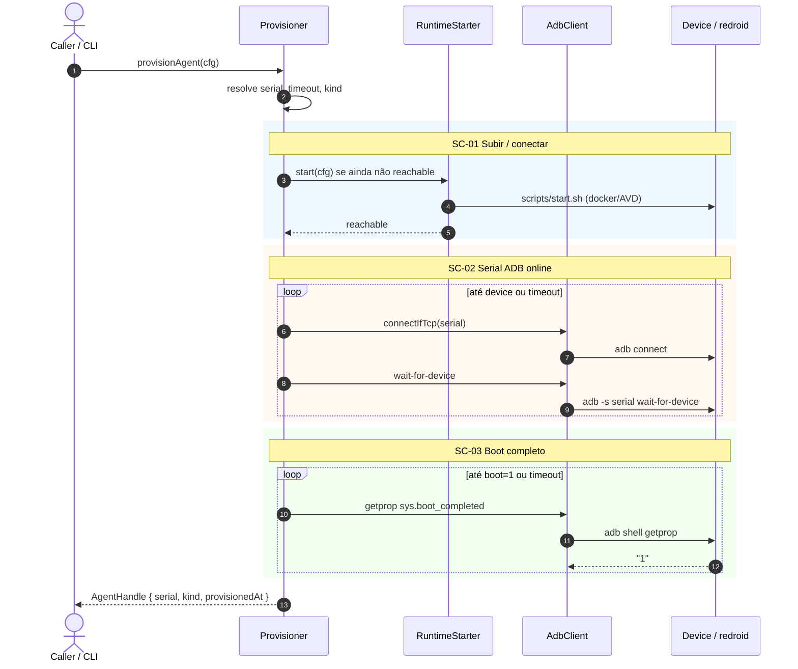
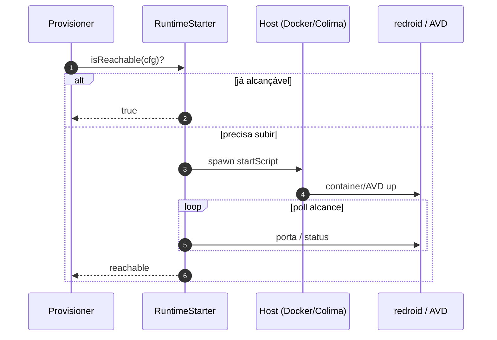
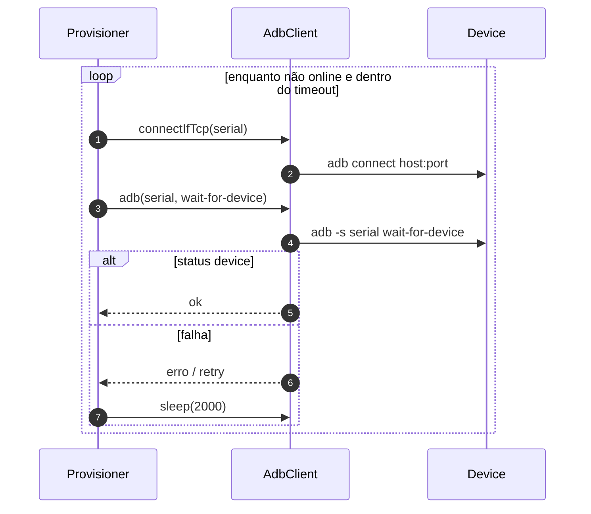
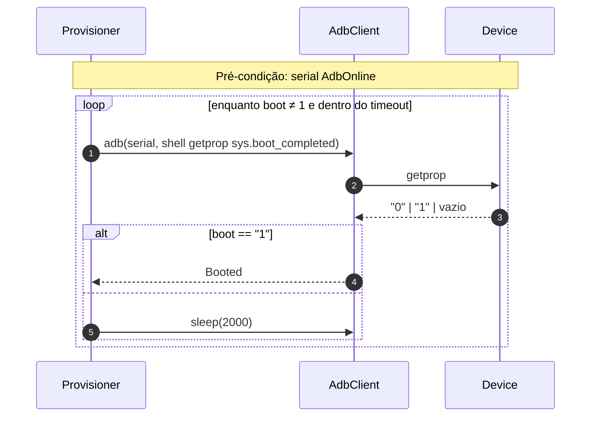

# Implementation plan — EP-01 Provisionar agente

**Por quê:** plano técnico do épico (modelos · classes · sequências · BDDs).  
**Épico:** [`2.epics.md`](2.epics.md) · [`README.md`](README.md).  
**US:** [`US-01-provisionar-um-agente/`](US-01-provisionar-um-agente/README.md).  
**Código:** [`../../sources/android-control/lib/provision.js`](../../sources/android-control/lib/provision.js) · [`adb.js`](../../sources/android-control/lib/adb.js).  
**Runtime:** [`../../sources/redroid/`](../../sources/redroid/README.md) · [`../../sources/android-studio/`](../../sources/android-studio/README.md).

**Stack:** Node ≥ 18 · `adb` · Docker/Colima (redroid) ou AVD.

---

## Escopo

| ID | Item |
|----|------|
| US-01 | Provisionar um agente |
| SC-01 | Subir / conectar o Android (agent) |
| SC-02 | Garantir serial ADB online |
| SC-03 | Aguardar boot completo |

**Resultado:** serial ADB `device` + `sys.boot_completed=1` → runtime pronto para EP-02..06.

---

## Modelos

### ProvisionConfig

| Campo | Tipo | Origem | Descrição |
|-------|------|--------|-----------|
| `serial` | `string` | `cfg.provision.serial` \| `cfg.device` \| `ANDROID_SERIAL` | Ex.: `127.0.0.1:5555` |
| `kind` | `"adb" \| "redroid" \| "avd"` | `cfg.provision.kind` | Runtime alvo |
| `connectTimeoutMs` | `number` | `cfg.provision.connectTimeoutMs` | Default `120000` |
| `startScript` | `string?` | futuro | Path do script de start (SC-01) |
| `host` | `string?` | futuro | Host Docker/Colima |

### AgentHandle (saída)

| Campo | Tipo | Descrição |
|-------|------|-----------|
| `serial` | `string` | Serial ADB online |
| `kind` | `string` | Kind efetivo |
| `provisionedAt` | `ISO-8601` | Momento do aceite |
| `bootCompleted` | `boolean` | Sempre `true` no sucesso |

### DeviceState (máquina de estados)

```text
Absent → Starting → Reachable → AdbOnline → Booted
                ↘──────── timeout / error ────────↗
```

| Estado | Significado | SC |
|--------|-------------|-----|
| `Absent` | Sem processo/container | — |
| `Starting` | Script de start em curso | SC-01 |
| `Reachable` | Runtime alcançável (porta/processo) | SC-01 |
| `AdbOnline` | `adb` lista serial como `device` | SC-02 |
| `Booted` | `sys.boot_completed=1` | SC-03 |

### Erros

| Código | Quando |
|--------|--------|
| `PROVISION_NO_SERIAL` | Config sem serial |
| `PROVISION_START_FAILED` | Script/runtime não sobe (SC-01) |
| `PROVISION_ADB_TIMEOUT` | Serial não fica `device` (SC-02) |
| `PROVISION_BOOT_TIMEOUT` | Boot não completa (SC-03) |

---

## Diagrama de classes



**Hoje:** `provisionAgent` + `AdbClient` (`adb.js`) cobrem SC-02+SC-03; SC-01 é manual via scripts redroid/studio.  
**Gap:** extrair `RuntimeStarter` e APIs `waitForAdbOnline` / `waitForBoot`.

---

## Diagramas de sequência

### US-01 — Fluxo completo



### SC-01 — Subir / conectar o Android



### SC-02 — Serial ADB online



### SC-03 — Boot completo



---

## Cenários BDD

Fonte canônica: [`US-01-provisionar-um-agente/4.bdds.md`](US-01-provisionar-um-agente/4.bdds.md).

### US-01 — Agent fica pronto para ADB

```gherkin
Cenário: US-01 Agent fica pronto para ADB
  Dado o config e o runtime Android disponíveis
  Quando o provisionamento sobe/conecta o agent, garante serial online e aguarda boot completo
  Então o agent está pronto para ADB (serial online e boot ok)
```

### SC-01 — Subir / conectar o Android (agent)

```gherkin
Cenário: SC-01 Agent sobe e fica alcançável
  Dado host, imagem/runtime e script de start
  Quando o agent é iniciado e a conexão é estabelecida
  Então o processo do agent está em execução e alcançável
```

### SC-02 — Garantir serial ADB online

```gherkin
Cenário: SC-02 Serial ADB fica online
  Dado o agent alcançável e o serial esperado na config
  Quando adb connect / listagem de devices é repetida até o serial aparecer como device
  Então o serial ADB está online
```

### SC-03 — Aguardar boot completo

```gherkin
Cenário: SC-03 Boot completo no device
  Dado o serial ADB online
  Quando o sistema faz poll de boot (ex. sys.boot_completed)
  Então o device reporta boot completo
```

---

## Plano de implementação (gaps → entregas)

| # | Entrega | SC | Arquivos | Critério |
|---|---------|-----|----------|----------|
| I1 | Tipar `ProvisionConfig` / `AgentHandle` (JSDoc ou `.d.ts`) | — | `lib/provision.js` | Tipos documentados |
| I2 | Extrair `waitForAdbOnline(serial, opts)` | SC-02 | `provision.js` + `adb.js` | API isolada + timeout |
| I3 | Extrair `waitForBoot(serial, opts)` | SC-03 | `provision.js` | API isolada + `onEvent` |
| I4 | `RuntimeStarter` + `RedroidStarter` (chama `sources/redroid/scripts/start.sh`) | SC-01 | `lib/runtime/` | Start opcional se não reachable |
| I5 | `AvdStarter` (android-studio scripts) | SC-01 | `lib/runtime/` | kind=`avd` |
| I6 | `provisionAgent` orquestra I2–I5 | US-01 | `provision.js` | BDDs US-01 + SC passam |
| I7 | CLI `node cli.js provision --config …` | US-01 | `cli.js` | Exit 0 só com Booted |

### Ordem

```text
I1 → I2 → I3 → I4 → I5 → I6 → I7
         ↘ paraleliza I4/I5 após I1
```

---

## Mapeamento código atual

| Peça | Status |
|------|--------|
| `provisionAgent` (connect + boot loop) | Existe — mistura SC-02+SC-03 |
| `connectIfTcp` / `adb` / `wait-for-device` | Existe |
| Start redroid/AVD via Node | **Gap** (só scripts shell) |
| `waitForBoot` / `waitForAdbOnline` dedicados | **Gap** |
| Eventos `onEvent` no provision | **Gap** (EP-02 US-02 reutiliza) |

---

## Critério de pronto (épico)

1. Modelos `ProvisionConfig` / `AgentHandle` / estados documentados  
2. Classes/APIs alinhadas ao diagrama  
3. Sequências SC-01..03 implementáveis e cobertas por BDD  
4. `provisionAgent` devolve handle só em estado `Booted`  
5. Piloto LinkedIn continua funcionando com o mesmo config  

## Próximos passos

→ Implementar I1–I7 em [`sources/android-control`](../../sources/android-control/README.md)  
→ Aceite: [`US-01-provisionar-um-agente/4.bdds.md`](US-01-provisionar-um-agente/4.bdds.md) · plano US: [`US-01-provisionar-um-agente/5.implementation-plan.md`](US-01-provisionar-um-agente/5.implementation-plan.md)
