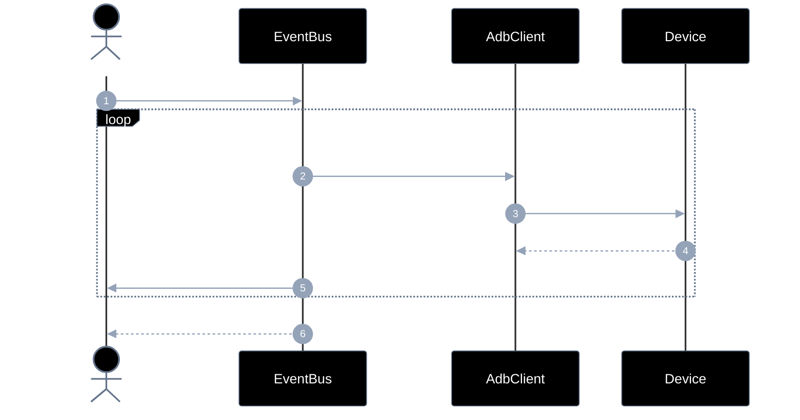
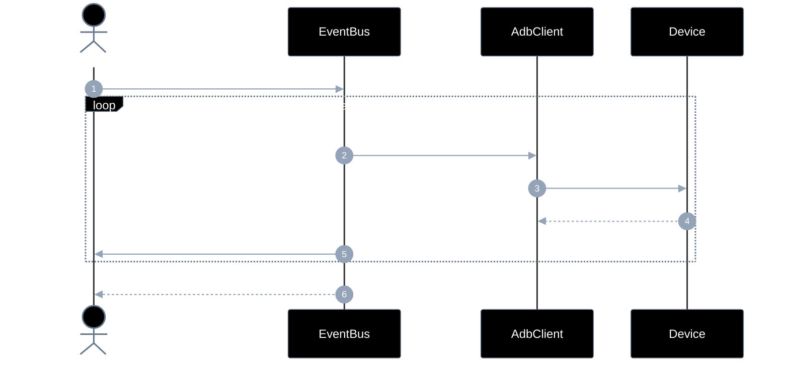
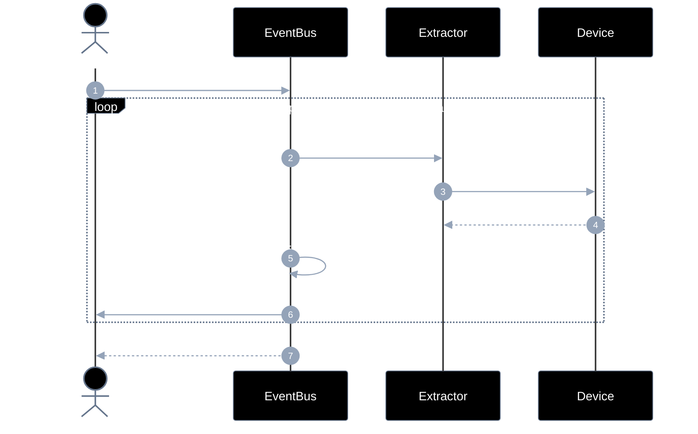
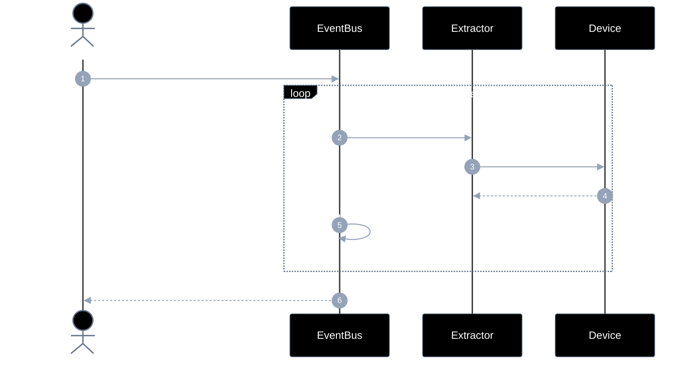
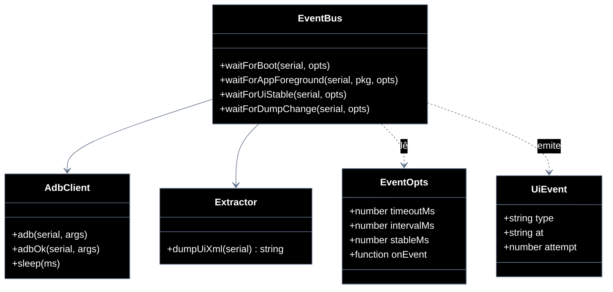

# Implementation plan — EP-02 Eventos de UI

**Por quê:** plano técnico do épico (sequências · contratos · classes · modelos · BDDs).  
**Épico:** [`2.epics.md`](2.epics.md) · [`README.md`](README.md).  
**US:** US-02..05 em [`US-02-evento-de-boot/`](US-02-evento-de-boot/README.md) · [`US-03`](US-03-evento-de-app-aberta/README.md) · [`US-04`](US-04-evento-de-tela-estavel/README.md) · [`US-05`](US-05-evento-de-mudanca-de-dump/README.md).  
**Código:** [`../../sources/android-control/lib/events.js`](../../sources/android-control/lib/events.js) · [`extract.js`](../../sources/android-control/lib/extract.js) · [`adb.js`](../../sources/android-control/lib/adb.js).

**Stack:** Node ≥ 18 · `adb` · runtime provisionado (EP-01).

---

## Escopo

| ID | Item |
|----|------|
| US-02 | Evento de boot |
| US-03 | Evento de app aberta |
| US-04 | Evento de tela estável |
| US-05 | Evento de mudança de dump |
| SC-04 | Sinal de boot é recebido |
| SC-05 | App em foreground é confirmada |
| SC-06 | Tela fica estável |
| SC-07 | Dump de UI muda |

**Resultado:** sinais de UI confiáveis antes de instalar/operar/extrair.

---

## Diagramas de sequência

### US-02 — Evento de boot



#### Contratos

| | Contrato |
|--|----------|
| **API** | `waitForBoot(serial, opts?: EventOpts) → Promise<{ boot: true }>` |
| **Entrada** | `serial`; `timeoutMs?`; `intervalMs?`; `onEvent?` |
| **Pré** | Serial ADB online (EP-01) |
| **Saída** | `{ boot: true }` + eventos `boot_poll` / `boot` |
| **Erro** | `EVENT_BOOT_TIMEOUT` |

### US-03 — Evento de app aberta



#### Contratos

| | Contrato |
|--|----------|
| **API** | `waitForAppForeground(serial, pkg, opts?) → Promise<{ foreground: true, package }>` |
| **Entrada** | `serial`; `pkg`; `activity?`; `timeoutMs?`; `onEvent?` |
| **Pré** | Device Booted; package instalado (ou a instalar) |
| **Saída** | Package (e activity opcional) em foreground |
| **Erro** | `EVENT_APP_TIMEOUT` |

### US-04 — Evento de tela estável



#### Contratos

| | Contrato |
|--|----------|
| **API** | `waitForUiStable(serial, opts?) → Promise<{ stable: true }>` |
| **Entrada** | `serial`; `timeoutMs?`; `stableMs?`; `intervalMs?`; `onEvent?` |
| **Pré** | App em foreground (US-03) recomendado |
| **Saída** | Dump/hash sem mudança por `stableMs` |
| **Erro** | `EVENT_STABLE_TIMEOUT` |

### US-05 — Evento de mudança de dump



#### Contratos

| | Contrato |
|--|----------|
| **API** | `waitForDumpChange(serial, opts?) → Promise<{ xml, changed: true }>` |
| **Entrada** | `serial`; `previousXml?`; `timeoutMs?`; `onEvent?` |
| **Pré** | Serial online; dump uiautomator disponível |
| **Saída** | `{ xml, changed: true }` com hash ≠ base |
| **Erro** | `EVENT_DUMP_TIMEOUT` |
---

## Modelos

### EventOpts

| Campo | Tipo | Descrição |
|-------|------|-----------|
| `timeoutMs` | `number` | Default por API |
| `intervalMs` | `number` | Poll interval |
| `stableMs` | `number` | US-04: janela sem mudança |
| `onEvent` | `(e) => void` | Callback de progresso |
| `activity` | `string?` | US-03 opcional |

### UiEvent

| Campo | Tipo | Exemplos `type` |
|-------|------|-----------------|
| `type` | `string` | `boot`, `app_foreground`, `ui_stable`, `dump_changed`, `*_poll` |
| `at` | `ISO-8601` | Timestamp |
| `attempt` | `number` | Tentativa atual |

### Erros

| Código | US |
|--------|-----|
| `EVENT_BOOT_TIMEOUT` | US-02 |
| `EVENT_APP_TIMEOUT` | US-03 |
| `EVENT_STABLE_TIMEOUT` | US-04 |
| `EVENT_DUMP_TIMEOUT` | US-05 |


---

## Diagrama de classes



**Hoje / gap:** ver mapeamento abaixo.

---

## Cenários BDD

Fonte: pastas `US-02`..`US-05` / `4.bdds.md`.

### US-02

```gherkin
Cenário: US-02 Boot do device é sinalizado
  Dado o serial online
  Quando o sistema espera o sinal de boot
  Então o boot é sinalizado
```

### US-03

```gherkin
Cenário: US-03 App aberta é confirmada
  Dado o package em foreground esperado
  Quando o sistema espera a app em foreground
  Então a app aberta está confirmada
```

### US-04

```gherkin
Cenário: US-04 Tela estável é confirmada
  Dado a app em foreground
  Quando o sistema espera UI estável (sem transição)
  Então a tela está estável
```

### US-05

```gherkin
Cenário: US-05 Dump atualizado fica disponível
  Dado um dump anterior (opcional) e serial online
  Quando o sistema detecta mudança no dump de UI
  Então um dump atualizado está disponível
```


---

## Plano de implementação (gaps → entregas)

| # | Entrega | US | Arquivos | Critério |
|---|---------|-----|----------|----------|
| I1 | `waitForBoot` dedicado + `onEvent` | US-02 | `events.js` | SC-04 |
| I2 | `waitForAppForeground` (dumpsys, não só pidof) | US-03 | `events.js` | SC-05 |
| I3 | `waitForUiStable` por hash de dump | US-04 | `events.js` | SC-06 |
| I4 | `waitForDumpChange` | US-05 | `events.js` | SC-07 |
| I5 | Deprecar/agrupar `waitForUiReady` genérico | — | `events.js` | API clara |

### Ordem

```text
I1 → I2 → I3 → I4 → I5
```


---

## Mapeamento código atual

| Peça | Status |
|------|--------|
| `waitForUiReady` / `isPackageForeground` | Parcial |
| `waitForBoot` / `waitForUiStable` / `waitForDumpChange` | **Gap** |
| Foreground real (dumpsys) | **Gap** |


---

## Critério de pronto (épico)

1. Quatro APIs de evento exportadas  
2. Sequências US-02..05 cobertas por BDD  
3. `onEvent` disponível em todas  
4. Consumíveis por EP-03..05  


## Próximos passos

→ Implementar gaps em [`sources/android-control`](../../sources/android-control/README.md)  
→ Aceite: BDDs em cada pasta `US-*/4.bdds.md`
