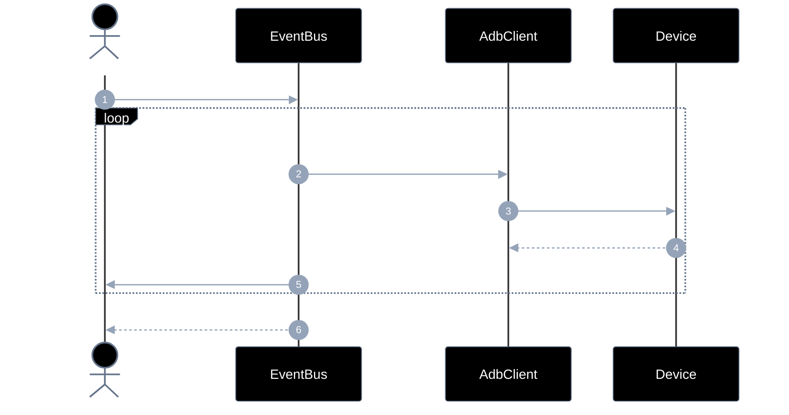
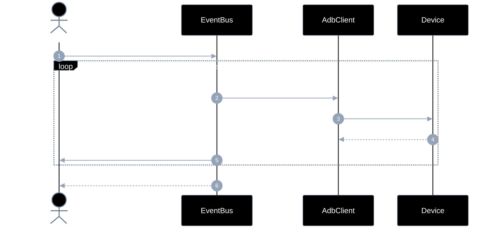
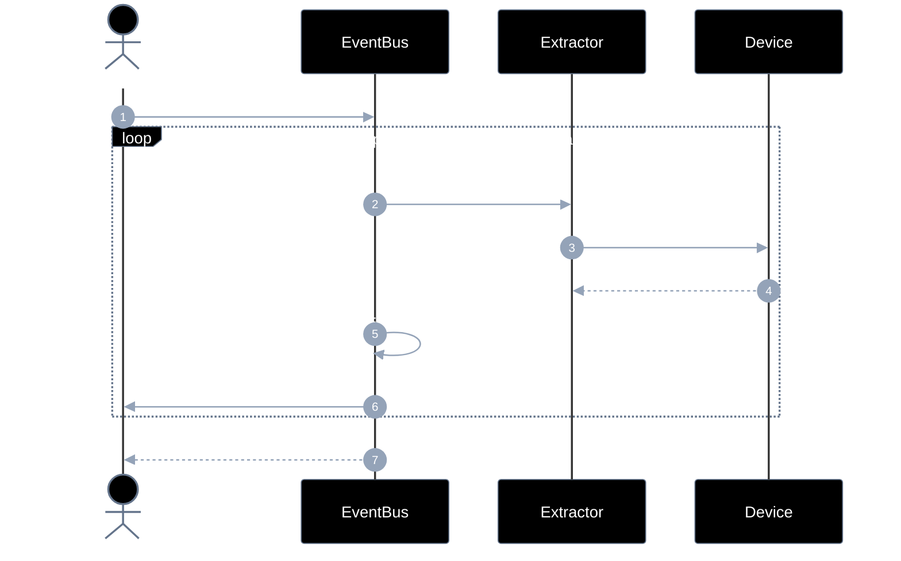
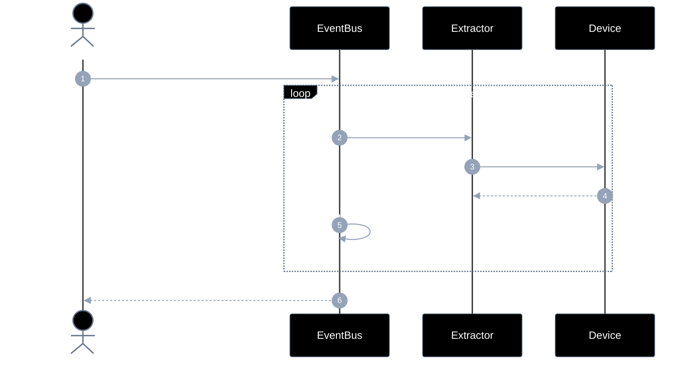
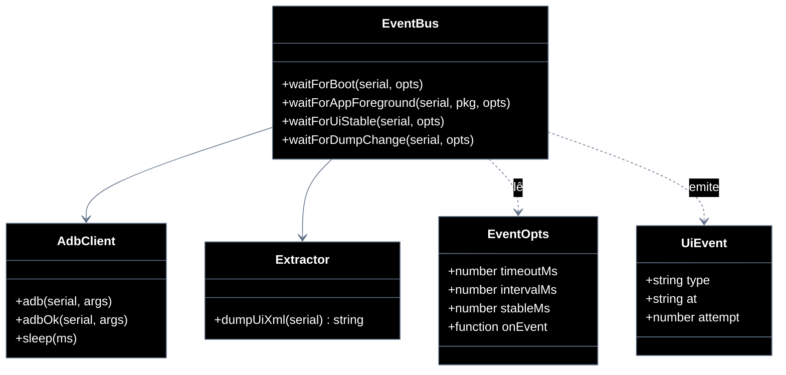

# Implementation plan — EP-02 Eventos de UI

**Por quê:** plano técnico do épico (sequências · agentes · passo a passo · contratos · classes · modelos · BDDs).  
**Épico:** [`2.epics.md`](2.epics.md) · [`README.md`](README.md).  
**US:** US-02..05 em [`US-02-evento-de-boot/`](US-02-evento-de-boot/README.md) · [`US-03`](US-03-evento-de-app-aberta/README.md) · [`US-04`](US-04-evento-de-tela-estavel/README.md) · [`US-05`](US-05-evento-de-mudanca-de-dump/README.md).  
**Código:** [`../../sources/android-control/lib/events.js`](../../sources/android-control/lib/events.js) · [`extract.js`](../../sources/android-control/lib/extract.js) · [`adb.js`](../../sources/android-control/lib/adb.js).

**Stack:** Node ≥ 18 · `adb` · runtime provisionado (EP-01).

---

## Escopo

| ID | Item |
|----|------|
| US-02 | Evento de boot |
| US-03 | Evento de app aberta |
| US-04 | Evento de tela estável |
| US-05 | Evento de mudança de dump |
| SC-04 | Sinal de boot é recebido |
| SC-05 | App em foreground é confirmada |
| SC-06 | Tela fica estável |
| SC-07 | Dump de UI muda |

**Resultado:** sinais de UI confiáveis antes de instalar/operar/extrair.

---

## Diagramas de sequência

### US-02 — Evento de boot



#### Agentes

| Agente | Responsabilidade |
|--------|------------------|
| Caller | Solicita o wait de boot e opcionalmente recebe `onEvent` de progresso |
| EventBus | Polla a condição de boot e resolve quando `sys.boot_completed=1` |
| AdbClient | Lê propriedades do device via `adb shell getprop` |
| Device | Fonte da prop `sys.boot_completed` |

#### Passo a passo

| # | Chamada | Por quê | Entradas | Execução | Saídas |
|---|---------|---------|----------|----------|--------|
| 1 | Dev → Events: `waitForBoot(serial, opts)` | Bloquear até o Android bootar | `serial`, `timeoutMs?`, `onEvent?` | Inicia o wait: configura timeout/interval e entra no loop de poll do boot | Promise `{ boot: true }` |
| 2 | Events → AdbClient: `getprop sys.boot_completed` | Checar progresso do boot | `serial` | A cada intervalo solicita a leitura de sys.boot_completed via AdbClient | pedido de prop |
| 3 | AdbClient → Device: `adb shell getprop` | Ler prop no device | `sys.boot_completed` | Roda `adb shell getprop sys.boot_completed` no device e devolve o valor | `"0"`\\|`"1"` |
| 4 | Device → AdbClient: valor | Feedback do sistema | — | Retorna a string da prop para o Events avaliar | prop |
| 5 | Events → Dev: `onEvent(boot_poll)` | Observabilidade do progresso | `type`, serial, valor | Dispara callback onEvent com type boot_poll e o valor lido (se informado) | UI/log atualizado |
| 6 | Events → Dev: `{ boot: true }` | Condição satisfeita | prop == `1` | Quando a prop for `1`, resolve a Promise com `{ boot: true }` | evento `boot` concluído |

#### Contratos

| | Contrato |
|--|----------|
| **API** | `waitForBoot(serial, opts?: EventOpts) → Promise<{ boot: true }>` |
| **Entrada** | `serial`; `timeoutMs?`; `intervalMs?`; `onEvent?` |
| **Pré** | Serial ADB online (EP-01) |
| **Saída** | `{ boot: true }` + eventos `boot_poll` / `boot` |
| **Erro** | `EVENT_BOOT_TIMEOUT` |

### US-03 — Evento de app aberta



#### Agentes

| Agente | Responsabilidade |
|--------|------------------|
| Caller | Pede wait até o package (e activity opcional) estar em foreground |
| EventBus | Polla evidência de app ativa e emite `app_poll` até confirmar foreground |
| AdbClient | Executa `dumpsys window` / `pidof` (ou equivalentes) no device |
| Device | Reporta janela/processo ativos que indicam o package em foreground |

#### Passo a passo

| # | Chamada | Por quê | Entradas | Execução | Saídas |
|---|---------|---------|----------|----------|--------|
| 1 | Dev → Events: `waitForAppForeground(serial, pkg, opts)` | Esperar app alvo em foreground | `serial`, `pkg`, `activity?`, timeout | Inicia o wait pelo package/activity em foreground com timeout e onEvent | Promise foreground |
| 2 | Events → AdbClient: `dumpsys window` / `pidof` | Detectar package ativo | `pkg` | Pede dumpsys window e/ou pidof do package para saber se está ativo | pedido de estado |
| 3 | AdbClient → Device: `adb shell` | Consultar window/processo | comando | Executa os comandos shell no device e devolve o stdout | stdout |
| 4 | Device → AdbClient: package ativo? | Evidência de foreground | — | Entrega evidência de foreground (sim/não) para o Events comparar com o alvo | sim/não |
| 5 | Events → Dev: `onEvent(app_poll)` | Progresso do wait | pkg + evidência | Emite onEvent(app_poll) com package e evidência a cada tentativa | log/UI |
| 6 | Events → Dev: `{ foreground: true, package }` | App aberta | match pkg/activity | Resolve com `{ foreground: true, package }` quando o app alvo estiver na frente | estado usável por operate |

#### Contratos

| | Contrato |
|--|----------|
| **API** | `waitForAppForeground(serial, pkg, opts?) → Promise<{ foreground: true, package }>` |
| **Entrada** | `serial`; `pkg`; `activity?`; `timeoutMs?`; `onEvent?` |
| **Pré** | Device Booted; package instalado (ou a instalar) |
| **Saída** | Package (e activity opcional) em foreground |
| **Erro** | `EVENT_APP_TIMEOUT` |

### US-04 — Evento de tela estável



#### Agentes

| Agente | Responsabilidade |
|--------|------------------|
| Caller | Pede wait até a UI parar de mudar por `stableMs` |
| EventBus | Amostra dumps, compara hashes e resolve quando estável |
| Extractor | Obtém o XML da UI (`uiautomator dump`) para cada amostra |
| Device | Fornece o dump da hierarquia de views |

#### Passo a passo

| # | Chamada | Por quê | Entradas | Execução | Saídas |
|---|---------|---------|----------|----------|--------|
| 1 | Dev → Events: `waitForUiStable(serial, opts)` | Esperar UI sem mudanças | `serial`, `stableMs?`, timeout | Inicia amostragem de dumps até o hash permanecer igual por stableMs ou timeout | Promise `{ stable: true }` |
| 2 | Events → Extract: `dumpUiXml(serial)` | Obter snapshot da UI | `serial` | Solicita dump da UI atual ao módulo de extract | xml |
| 3 | Extract → Device: `uiautomator dump` | Capturar hierarquia | — | Roda uiautomator dump no device, faz pull do XML e devolve a string | arquivo/xml |
| 4 | Device → Extract: `xml` | Snapshot bruto | — | Entrega o XML bruto para hash/comparação | string XML |
| 5 | Events → Events: `hash(xml) == previous?` | Detectar estabilidade temporal | xml atual + anterior | Calcula hash do XML, compara com o anterior e acumula tempo estável | stable\\|ainda mudando |
| 6 | Events → Dev: `onEvent(ui_stable_poll)` | Progresso | hash/delta | Emite onEvent(ui_stable_poll) com hash/delta a cada amostra | observabilidade |
| 7 | Events → Dev: `{ stable: true }` | UI quieta o suficiente | hash estável por `stableMs` | Resolve `{ stable: true }` quando o hash não muda por stableMs contínuos | pronto para extract/operate |

#### Contratos

| | Contrato |
|--|----------|
| **API** | `waitForUiStable(serial, opts?) → Promise<{ stable: true }>` |
| **Entrada** | `serial`; `timeoutMs?`; `stableMs?`; `intervalMs?`; `onEvent?` |
| **Pré** | App em foreground (US-03) recomendado |
| **Saída** | Dump/hash sem mudança por `stableMs` |
| **Erro** | `EVENT_STABLE_TIMEOUT` |

### US-05 — Evento de mudança de dump



#### Agentes

| Agente | Responsabilidade |
|--------|------------------|
| Caller | Pede wait até o dump divergir do baseline |
| EventBus | Compara hash atual com o anterior e resolve na primeira mudança |
| Extractor | Captura novos dumps XML sob demanda |
| Device | Fonte do dump uiautomator a cada poll |

#### Passo a passo

| # | Chamada | Por quê | Entradas | Execução | Saídas |
|---|---------|---------|----------|----------|--------|
| 1 | Dev → Events: `waitForDumpChange(serial, previousXml?, opts)` | Esperar mudança na UI | `serial`, baseline xml/hash, timeout | Guarda o baseline (previousXml/hash) e polla dumps até o hash mudar ou timeout | Promise `{ xml, changed }` |
| 2 | Events → Extract: `dumpUiXml(serial)` | Novo snapshot | `serial` | Pede um novo dump da UI ao extract | xml |
| 3 | Extract → Device: `uiautomator dump` | Capturar hierarquia | — | Roda uiautomator dump + pull e devolve o XML | xml |
| 4 | Device → Extract: `xml` | Snapshot | — | Entrega o XML atual para comparação | xml |
| 5 | Events → Events: `hash ≠ previous?` | Detectar mudança | xml vs baseline | Compara hash atual com o baseline e decide se houve mudança | changed\\|igual |
| 6 | Events → Dev: `{ xml, changed: true }` | Mudança confirmada | novo xml | Resolve `{ xml, changed: true }` com o XML novo quando o hash diverge | xml atualizado para o caller |

#### Contratos

| | Contrato |
|--|----------|
| **API** | `waitForDumpChange(serial, opts?) → Promise<{ xml, changed: true }>` |
| **Entrada** | `serial`; `previousXml?`; `timeoutMs?`; `onEvent?` |
| **Pré** | Serial online; dump uiautomator disponível |
| **Saída** | `{ xml, changed: true }` com hash ≠ base |
| **Erro** | `EVENT_DUMP_TIMEOUT` |
---

## Modelos

### EventOpts

| Campo | Tipo | Descrição |
|-------|------|-----------|
| `timeoutMs` | `number` | Default por API |
| `intervalMs` | `number` | Poll interval |
| `stableMs` | `number` | US-04: janela sem mudança |
| `onEvent` | `(e) => void` | Callback de progresso |
| `activity` | `string?` | US-03 opcional |

### UiEvent

| Campo | Tipo | Exemplos `type` |
|-------|------|-----------------|
| `type` | `string` | `boot`, `app_foreground`, `ui_stable`, `dump_changed`, `*_poll` |
| `at` | `ISO-8601` | Timestamp |
| `attempt` | `number` | Tentativa atual |

### Erros

| Código | US |
|--------|-----|
| `EVENT_BOOT_TIMEOUT` | US-02 |
| `EVENT_APP_TIMEOUT` | US-03 |
| `EVENT_STABLE_TIMEOUT` | US-04 |
| `EVENT_DUMP_TIMEOUT` | US-05 |


---

## Diagrama de classes



**Hoje / gap:** ver mapeamento abaixo.

---

## Cenários BDD

Fonte: pastas `US-02`..`US-05` / `4.bdds.md`.

### US-02

```gherkin
Cenário: US-02 Boot do device é sinalizado
  Dado o serial online
  Quando o sistema espera o sinal de boot
  Então o boot é sinalizado
```

### US-03

```gherkin
Cenário: US-03 App aberta é confirmada
  Dado o package em foreground esperado
  Quando o sistema espera a app em foreground
  Então a app aberta está confirmada
```

### US-04

```gherkin
Cenário: US-04 Tela estável é confirmada
  Dado a app em foreground
  Quando o sistema espera UI estável (sem transição)
  Então a tela está estável
```

### US-05

```gherkin
Cenário: US-05 Dump atualizado fica disponível
  Dado um dump anterior (opcional) e serial online
  Quando o sistema detecta mudança no dump de UI
  Então um dump atualizado está disponível
```


---

## Plano de implementação (gaps → entregas)

| # | Entrega | US | Arquivos | Critério |
|---|---------|-----|----------|----------|
| I1 | `waitForBoot` dedicado + `onEvent` | US-02 | `events.js` | SC-04 |
| I2 | `waitForAppForeground` (dumpsys, não só pidof) | US-03 | `events.js` | SC-05 |
| I3 | `waitForUiStable` por hash de dump | US-04 | `events.js` | SC-06 |
| I4 | `waitForDumpChange` | US-05 | `events.js` | SC-07 |
| I5 | Deprecar/agrupar `waitForUiReady` genérico | — | `events.js` | API clara |

### Ordem

```text
I1 → I2 → I3 → I4 → I5
```


---

## Mapeamento código atual

| Peça | Status |
|------|--------|
| `waitForUiReady` / `isPackageForeground` | Parcial |
| `waitForBoot` / `waitForUiStable` / `waitForDumpChange` | **Gap** |
| Foreground real (dumpsys) | **Gap** |


---

## Critério de pronto (épico)

1. Quatro APIs de evento exportadas  
2. Sequências US-02..05 cobertas por BDD  
3. `onEvent` disponível em todas  
4. Consumíveis por EP-03..05  


## Próximos passos

→ Implementar gaps em [`sources/android-control`](../../sources/android-control/README.md)  
→ Aceite: BDDs em cada pasta `US-*/4.bdds.md`
