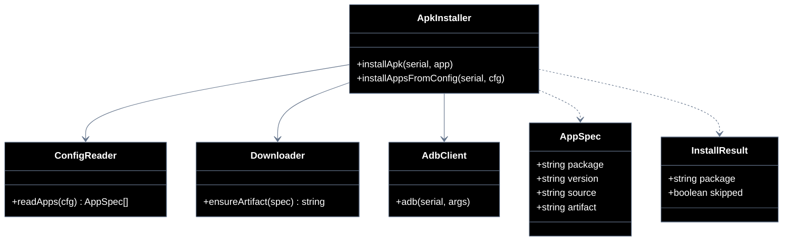

# Implementation plan — EP-03 Instalar APKs

**Por quê:** plano técnico do épico (sequências · agentes · passo a passo · contratos · classes · modelos · BDDs).  
**Épico:** [`2.epics.md`](2.epics.md) · [`README.md`](README.md).  
**US:** [`US-06-instalar-apks/`](US-06-instalar-apks/README.md).  
**Código:** [`../../sources/android-control/lib/apks.js`](../../sources/android-control/lib/apks.js) · [`adb.js`](../../sources/android-control/lib/adb.js).

**Stack:** Node ≥ 18 · `adb` · runtime provisionado (EP-01).

---

## Escopo

| ID | Item |
|----|------|
| US-06 | Instalar APKs |
| SC-08 | Ler versão na config |
| SC-09 | Baixar APK na versão definida |
| SC-10 | Instalar pacote no agent |

**Resultado:** apps da `device.config.json` instalados na versão pedida.

---

## Diagramas de sequência

### US-06 — Instalar APKs (fluxo completo)

```mermaid
---
config:
  theme: base
  themeVariables:
    darkMode: true
    background: '#000000'
    primaryColor: '#000000'
    primaryTextColor: '#ffffff'
    primaryBorderColor: '#64748b'
    secondaryColor: '#000000'
    secondaryTextColor: '#ffffff'
    secondaryBorderColor: '#64748b'
    tertiaryColor: '#000000'
    tertiaryTextColor: '#ffffff'
    tertiaryBorderColor: '#64748b'
    lineColor: '#64748b'
    textColor: '#ffffff'
    mainBkg: '#000000'
    nodeBorder: '#64748b'
    clusterBkg: '#000000'
    clusterBorder: '#333333'
    titleColor: '#ffffff'
    edgeLabelBackground: '#000000'
    actorBkg: '#000000'
    actorBorder: '#64748b'
    actorTextColor: '#ffffff'
    actorLineColor: '#333333'
    signalColor: '#94a3b8'
    signalTextColor: '#ffffff'
    labelBoxBkgColor: '#000000'
    labelBoxBorderColor: '#64748b'
    labelTextColor: '#ffffff'
    loopTextColor: '#ffffff'
    noteBorderColor: '#64748b'
    noteBkgColor: '#111111'
    noteTextColor: '#ffffff'
    activationBorderColor: '#64748b'
    activationBkgColor: '#1a1a1a'
    sequenceNumberColor: '#ffffff'
    classText: '#ffffff'
---
sequenceDiagram
  autonumber
  actor Dev as Caller
  participant K as ApkInstaller
  participant C as Config
  participant DL as Downloader
  participant A as AdbClient
  participant D as Device

  Dev->>K: installAppsFromConfig(serial, cfg)

  rect rgb(17,17,17)
    note over K,C: SC-08 Ler versão
    K->>C: apps.*.package / version
    C-->>K: alvo
  end

  rect rgb(26,26,26)
    note over K,DL: SC-09 Baixar APK
    K->>A: versionName instalada?
    alt já na versão
      K-->>Dev: skip
    else falta artefato
      K->>DL: apkeep / artifact local
      DL-->>K: path APK/XAPK
    end
  end

  rect rgb(34,34,34)
    note over K,D: SC-10 Instalar
    K->>A: adb install / install-multiple
    A->>D: instalar
    D-->>A: ok
  end

  K-->>Dev: { installed: true, package, version }
```



#### Agentes

| Agente | Responsabilidade |
|--------|------------------|
| Caller | Dispara instalação das apps do cfg e recebe o resultado por package |
| ApkInstaller | Para cada app: decide skip, baixa artefato e instala via ADB |
| Config | Fornece `package` / `version` / source por entrada em `cfg.apps` |
| Downloader | Obtém APK/XAPK (apkeep ou path local) e devolve o artefato |
| AdbClient | Consulta versão instalada e executa `adb install` / `install-multiple` |
| Device | Recebe o package e reporta sucesso/falha da instalação |

#### Passo a passo

| # | Chamada | Por quê | Entradas | Execução | Saídas |
|---|---------|---------|----------|----------|--------|
| 1 | Dev → Apks: `installAppsFromConfig(serial, cfg)` | Instalar todas as apps do cfg | `serial`, `cfg.apps.*` | Itera cada app em cfg.apps e orquestra skip/download/install por package | lista de resultados |
| 2 | Apks → Config: lê `package` / `version` | Saber o alvo por app | chave em `cfg.apps` | Lê package, version e source/artifact da entrada de config da app | `{ package, version?, source? }` |
| 3 | Config → Apks: alvo | Contrato de instalação | — | Devolve o alvo normalizado (package + versão desejada) ao instalador | alvo normalizado |
| 4 | Apks → AdbClient: `versionName` instalada? | Skip se já na versão | `package` | Consulta versionName instalada via dumpsys package no device | versão atual ou ausente |
| 5 | Apks → Dev: `skip` | Evitar reinstall desnecessário | versão == alvo | Se a versão já bate com o alvo, marca skipped e passa para a próxima app | `{ skipped: true }` |
| 6 | Apks → Download: `apkeep` / artifact local | Obter binário se falta | `package`, `version`, `source?` | Baixa com apkeep ou resolve path local do APK/XAPK para a versão alvo | path APK/XAPK |
| 7 | Download → Apks: path | Artefato pronto | — | Devolve o caminho do artefato pronto para install | `artifactPath` |
| 8 | Apks → AdbClient: `adb install` / `install-multiple` | Instalar no device | path(s) | Dispara `adb install` (ou install-multiple para XAPK) com o(s) path(s) | pedido de install |
| 9 | AdbClient → Device: instalar | Aplicar package | APK/XAPK | Aplica o package no device via pm install e captura Success/Failure | Success/Failure |
| 10 | Device → AdbClient: `ok` | Install concluído | — | Confirma sucesso do install ao módulo Apks | sucesso |
| 11 | Apks → Dev: `{ installed, package, version }` | Resultado por app | estado pós-install | Agrega e retorna InstallResult com package, version e installed=true | InstallResult |

#### Contratos

| | Contrato |
|--|----------|
| **API** | `installAppsFromConfig(serial, cfg) → Promise<InstallResult[]>` · `installApk(serial, app)` |
| **Entrada** | `serial` Booted; `cfg.apps.*` (`package`, `version?`, `source?`, `artifact?`) |
| **Pré** | EP-01 ok; `apkeep` ou artefato local para download |
| **Saída** | Lista `{ package, version, skipped, artifactPath? }` |
| **Erro** | `APK_CONFIG_INVALID` · `APK_DOWNLOAD_FAILED` · `APK_INSTALL_FAILED` |
| **Pós** | `versionName` no device == alvo (se informado) |
---

## Modelos

### AppSpec

| Campo | Tipo | Descrição |
|-------|------|-----------|
| `package` | `string` | Package Android |
| `version` | `string?` | versionName alvo |
| `source` | `string?` | ex. `apk-pure` |
| `artifact` | `string?` | Path local APK/XAPK |

### InstallResult

| Campo | Tipo |
|-------|------|
| `package` | `string` |
| `version` | `string` |
| `skipped` | `boolean` |
| `artifactPath` | `string?` |

### Erros

| Código | Quando |
|--------|--------|
| `APK_CONFIG_INVALID` | SC-08 |
| `APK_DOWNLOAD_FAILED` | SC-09 |
| `APK_INSTALL_FAILED` | SC-10 |


---

## Diagrama de classes



**Hoje / gap:** ver mapeamento abaixo.

---

## Cenários BDD

Fonte: [`US-06-instalar-apks/4.bdds.md`](US-06-instalar-apks/4.bdds.md).

```gherkin
Cenário: US-06 Apps da config ficam instalados na versão definida
  Dado o agent provisionado e a lista de apps/versões na config
  Quando cada pacote é lido, baixado e instalado
  Então os apps estão instalados nas versões definidas
```

```gherkin
Cenário: SC-08 Versão e package são lidos da config
  Dado o arquivo device.config.json
  Quando apps.*.version e package são parseados
  Então a versão e o package alvo estão disponíveis para download
```

```gherkin
Cenário: SC-09 APK da versão pedida é baixado
  Dado package, versão e ferramenta de download
  Quando o download da versão definida é executado
  Então o artefato APK/XAPK existe no disco
```

```gherkin
Cenário: SC-10 Pacote é instalado no agent
  Dado serial online e caminho do APK
  Quando adb install é executado
  Então o pacote está instalado no agent
```


---

## Plano de implementação (gaps → entregas)

| # | Entrega | SC | Critério |
|---|---------|-----|----------|
| I1 | `installAppsFromConfig` multi-app | US-06 | Loop config |
| I2 | Skip se `versionName` == alvo | SC-08/10 | Idempotente |
| I3 | Validar versão pós-install | SC-10 | Assert versionName |
| I4 | Erros tipados download/install | SC-09/10 | Códigos estáveis |

### Ordem

```text
I1 → I2 → I3 → I4
```


---

## Mapeamento código atual

| Peça | Status |
|------|--------|
| `installApk` + apkeep + XAPK | Existe |
| Loop multi-app + skip por versão estrita | **Parcial / gap** |


---

## Critério de pronto (épico)

1. Config → download → install cobertos  
2. BDDs US-06 + SC-08..10  
3. Idempotente na versão alvo  


## Próximos passos

→ Implementar gaps em [`sources/android-control`](../../sources/android-control/README.md)  
→ Aceite: BDDs em cada pasta `US-*/4.bdds.md`
