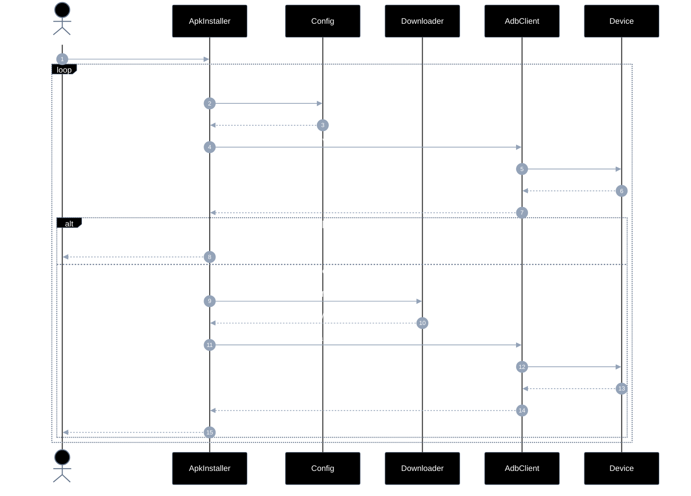
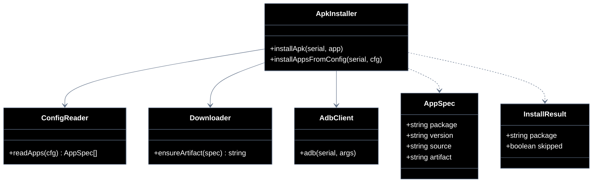

# Implementation plan — EP-03 Instalar APKs

**Por quê:** plano técnico do épico (sequências · agentes · passo a passo · contratos · classes · modelos · BDDs).  
**Épico:** [`2.epics.md`](../../2.epics.md) · [`README.md`](README.md).  
**US:** [`US-06-instalar-apks/`](US-06-instalar-apks/README.md).  
**Código:** [`../../sources/android-control/lib/apks.js`](../../sources/android-control/lib/apks.js) · [`adb.js`](../../sources/android-control/lib/adb.js).

**Stack:** Node ≥ 18 · `adb` · runtime provisionado (EP-01).

---

## Escopo

| ID | Item |
|----|------|
| US-06 | Instalar APKs |
| SC-08 | Ler versão na config |
| SC-09 | Baixar APK na versão definida |
| SC-10 | Instalar pacote no agent |

**Resultado:** apps da `device.config.json` instalados na versão pedida.

---

## Diagramas de sequência

### US-06 — Instalar APKs (fluxo completo)

#### Agentes

| Agente | Responsabilidade |
|--------|------------------|
| Caller | Dispara instalação das apps do cfg e recebe o resultado por package |
| ApkInstaller | Para cada app: decide skip, baixa artefato e instala via ADB |
| Config | Fornece `package` / `version` / source por entrada em `cfg.apps` |
| Downloader | Obtém APK/XAPK (apkeep ou path local) e devolve o artefato |
| AdbClient | Consulta versão instalada e executa `adb install` / `install-multiple` |
| Device | Recebe o package e reporta sucesso/falha da instalação |



#### Passo a passo

| # | Chamada | Por quê | Entradas | Execução | Saídas |
|---|---------|---------|----------|----------|--------|
| 1 | Dev → ApkInstaller: `installAppsFromConfig(...)` | Instalar apps do cfg | `serial`, `cfg` | Itera apps | lista resultados |
| 2 | ApkInstaller → Config: `package/version` | Ler alvo | chave app | Parse | pedido |
| 3 | Config → ApkInstaller: `alvo` | Contrato da app | — | Retorna | alvo |
| 4 | ApkInstaller → AdbClient: `versionName?` | Ver se já instalado | `package` | Pede dumpsys | pedido |
| 5 | AdbClient → Device: `dumpsys package` | Ler versão | `pkg` | Shell | pedido |
| 6 | Device → AdbClient: `versionName\|null` | Versão atual | — | Resposta | versão |
| 7 | AdbClient → ApkInstaller: `versão atual` | Reportar | — | Propaga | versão |
| 8 | ApkInstaller → Dev: `skip` | Já na versão | match | Atalho | `skipped` |
| 9 | ApkInstaller → Downloader: `apkeep/artifact` | Obter binário | pkg/version | Download ou path | pedido |
| 10 | Downloader → ApkInstaller: `path` | Artefato | — | Retorna path | path |
| 11 | ApkInstaller → AdbClient: `adb install` | Instalar | path(s) | install/-multiple | pedido |
| 12 | AdbClient → Device: `instalar` | pm install | APK/XAPK | Aplica package | pedido |
| 13 | Device → AdbClient: `ok` | Install ok | — | Success | `ok` |
| 14 | AdbClient → ApkInstaller: `Success` | Confirmar | — | Propaga | `Success` |
| 15 | ApkInstaller → Dev: `{ installed, package, version }` | Resultado | — | Agrega | InstallResult |

#### Contratos

| | Contrato |
|--|----------|
| **API** | `installAppsFromConfig(serial, cfg) → Promise<InstallResult[]>` · `installApk(serial, app)` |
| **Entrada** | `serial` Booted; `cfg.apps.*` (`package`, `version?`, `source?`, `artifact?`) |
| **Pré** | EP-01 ok; `apkeep` ou artefato local para download |
| **Saída** | Lista `{ package, version, skipped, artifactPath? }` |
| **Erro** | `APK_CONFIG_INVALID` · `APK_DOWNLOAD_FAILED` · `APK_INSTALL_FAILED` |
| **Pós** | `versionName` no device == alvo (se informado) |
---

## Modelos

### AppSpec

| Campo | Tipo | Descrição |
|-------|------|-----------|
| `package` | `string` | Package Android |
| `version` | `string?` | versionName alvo |
| `source` | `string?` | ex. `apk-pure` |
| `artifact` | `string?` | Path local APK/XAPK |

### InstallResult

| Campo | Tipo |
|-------|------|
| `package` | `string` |
| `version` | `string` |
| `skipped` | `boolean` |
| `artifactPath` | `string?` |

### Erros

| Código | Quando |
|--------|--------|
| `APK_CONFIG_INVALID` | SC-08 |
| `APK_DOWNLOAD_FAILED` | SC-09 |
| `APK_INSTALL_FAILED` | SC-10 |

---

## Diagrama de classes



**Hoje / gap:** ver mapeamento abaixo.

---

## Cenários BDD

Fonte: [`US-06-instalar-apks/4.bdds.md`](US-06-instalar-apks/4.bdds.md).

```gherkin
Cenário: US-06 Apps da config ficam instalados na versão definida
  Dado o agent provisionado e a lista de apps/versões na config
  Quando cada pacote é lido, baixado e instalado
  Então os apps estão instalados nas versões definidas
```

```gherkin
Cenário: SC-08 Versão e package são lidos da config
  Dado o arquivo device.config.json
  Quando apps.*.version e package são parseados
  Então a versão e o package alvo estão disponíveis para download
```

```gherkin
Cenário: SC-09 APK da versão pedida é baixado
  Dado package, versão e ferramenta de download
  Quando o download da versão definida é executado
  Então o artefato APK/XAPK existe no disco
```

```gherkin
Cenário: SC-10 Pacote é instalado no agent
  Dado serial online e caminho do APK
  Quando adb install é executado
  Então o pacote está instalado no agent
```

---

## Plano de implementação (gaps → entregas)

| # | Entrega | SC | Critério |
|---|---------|-----|----------|
| I1 | `installAppsFromConfig` multi-app | US-06 | Loop config |
| I2 | Skip se `versionName` == alvo | SC-08/10 | Idempotente |
| I3 | Validar versão pós-install | SC-10 | Assert versionName |
| I4 | Erros tipados download/install | SC-09/10 | Códigos estáveis |

### Ordem

```text
I1 → I2 → I3 → I4
```

---

## Mapeamento código atual

| Peça | Status |
|------|--------|
| `installApk` + apkeep + XAPK | Existe |
| Loop multi-app + skip por versão estrita | **Parcial / gap** |

---

## Critério de pronto (épico)

1. Config → download → install cobertos  
2. BDDs US-06 + SC-08..10  
3. Idempotente na versão alvo  

## Próximos passos

→ Implementar gaps em [`sources/android-control`](../../sources/android-control/README.md)  
→ Aceite: BDDs em cada pasta `US-*/4.bdds.md`
