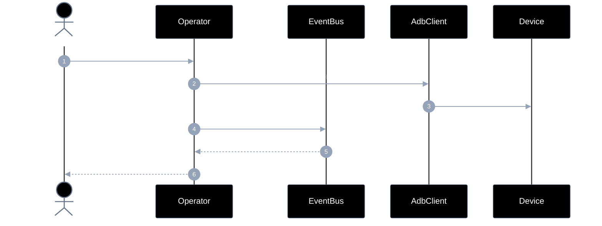
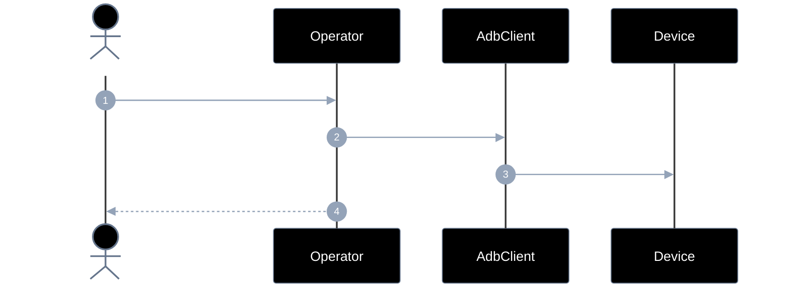
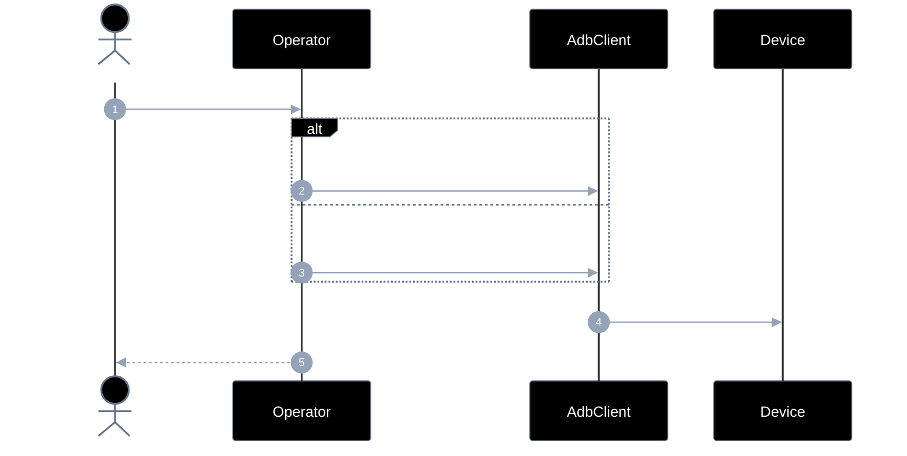
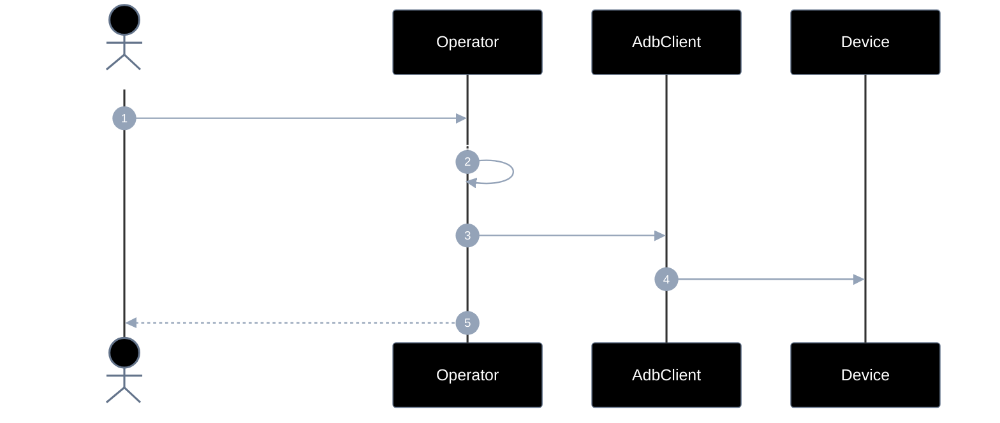
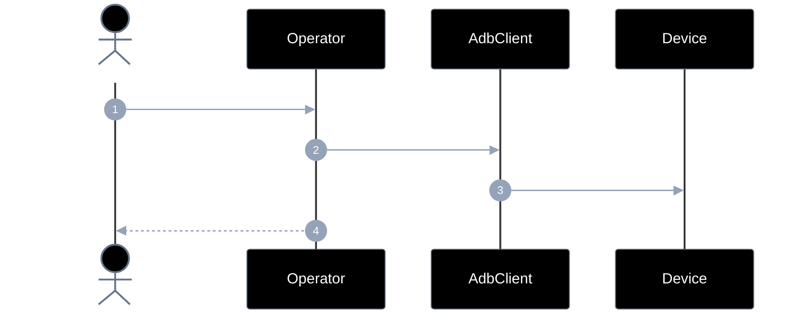
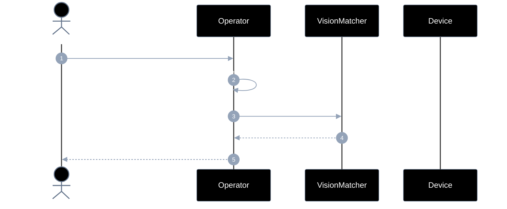
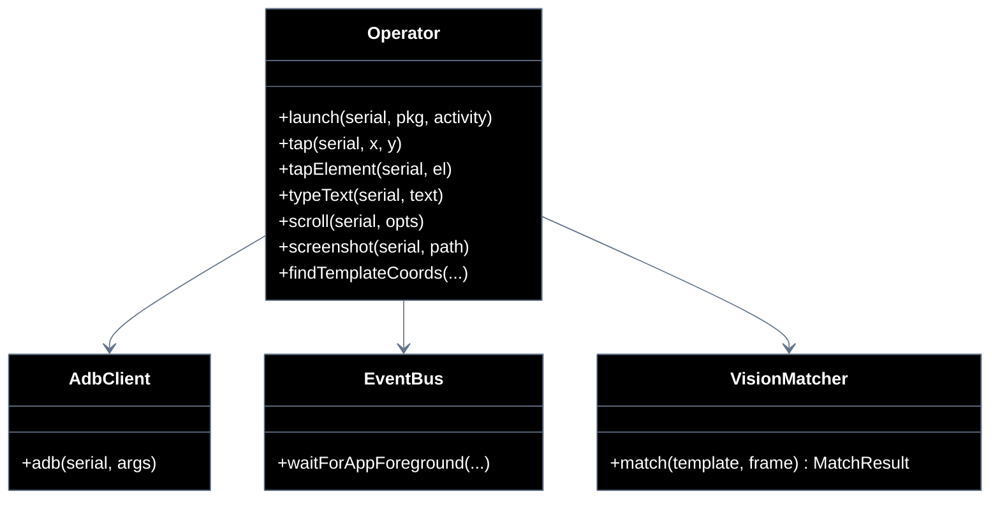

# Implementation plan — EP-04 Operar tela

**Por quê:** plano técnico do épico (sequências · contratos · classes · modelos · BDDs).  
**Épico:** [`2.epics.md`](2.epics.md) · [`README.md`](README.md).  
**US:** US-07..12 em pastas `US-07`..`US-12`.  
**Código:** [`../../sources/android-control/lib/operate.js`](../../sources/android-control/lib/operate.js) · [`events.js`](../../sources/android-control/lib/events.js).

**Stack:** Node ≥ 18 · `adb` · runtime provisionado (EP-01).

---

## Escopo

| ID | Item |
|----|------|
| US-07 | Abrir aplicativo |
| US-08 | tap |
| US-09 | type |
| US-10 | scroll |
| US-11 | screenshot |
| US-12 | Resgatar coordenadas x,y a partir de uma imagem |
| SC-11..16 | Cenários correspondentes |

**Resultado:** gestos, captura e match visual sobre o device.

---

## Diagramas de sequência

### US-07 — Abrir aplicativo



#### Contratos

| | Contrato |
|--|----------|
| **API** | `launch(serial, pkg, activity?) → Promise<void>` |
| **Entrada** | `serial`; `pkg`; `activity?` |
| **Pré** | Device Booted; package instalado |
| **Saída** | App em foreground (via `waitForAppForeground`) |
| **Erro** | `OP_LAUNCH_FAILED` · `EVENT_APP_TIMEOUT` |

### US-08 — tap



#### Contratos

| | Contrato |
|--|----------|
| **API** | `tap(serial, x, y) → void` · `tapElement(serial, el) → void` |
| **Entrada** | `serial`; coords `x,y` **ou** elemento com `center`/`bounds` |
| **Pré** | Device Booted; UI alvo visível |
| **Saída** | Toque enviado; UI pode refletir a ação |
| **Erro** | `OP_TAP_INVALID_TARGET` (sem center) |

### US-09 — type



#### Contratos

| | Contrato |
|--|----------|
| **API** | `typeText(serial, text) → void` |
| **Entrada** | `serial`; `text` (ASCII ou unicode) |
| **Pré** | Campo focado ou IME pronto; ADBKeyBoard para unicode |
| **Saída** | Texto injetado no campo/UI |
| **Erro** | Falha `input text` / IME ausente |

### US-10 — scroll



#### Contratos

| | Contrato |
|--|----------|
| **API** | `scroll(serial, opts: ScrollOpts) → void` |
| **Entrada** | `direction`; `distance?`; `bounds?` |
| **Pré** | Device Booted; área scrollável |
| **Saída** | Swipe executado; conteúdo pode revelar novos itens |
| **Erro** | `OP_SCROLL_UNSUPPORTED` (até API existir) |

### US-11 — screenshot



#### Contratos

| | Contrato |
|--|----------|
| **API** | `screenshot(serial, path) → string` (absPath) |
| **Entrada** | `serial`; `path` de saída |
| **Pré** | Device Booted |
| **Saída** | Arquivo de imagem no path absoluto |
| **Erro** | Falha `screencap` / `pull` |

### US-12 — Coordenadas por template



#### Contratos

| | Contrato |
|--|----------|
| **API** | `findTemplateCoords(serial\|framePath, templatePath) → MatchResult` |
| **Entrada** | Frame/tela + imagem template; limiar de confiança |
| **Pré** | Screenshot disponível ou capturável |
| **Saída** | `{ x, y, confidence }` |
| **Erro** | `OP_MATCH_LOW_CONFIDENCE` · template não encontrado |
---

## Modelos

### TapTarget / ScrollOpts / MatchResult

| Modelo | Campos |
|--------|--------|
| `TapTarget` | `x,y` ou `bounds` / `center` |
| `ScrollOpts` | `direction`, `distance?`, `bounds?` |
| `MatchResult` | `x`, `y`, `confidence` |

### Erros

| Código | US |
|--------|-----|
| `OP_LAUNCH_FAILED` | US-07 |
| `OP_SCROLL_UNSUPPORTED` | US-10 (hoje) |
| `OP_MATCH_LOW_CONFIDENCE` | US-12 |


---

## Diagrama de classes



**Hoje / gap:** ver mapeamento abaixo.

---

## Cenários BDD

Fonte: `US-07`..`US-12` / `4.bdds.md`.

```gherkin
Cenário: US-07 App fica em foreground no agent
  Dado package (e activity opcional)
  Quando o launch do app é executado no agent
  Então a app está em foreground
```

```gherkin
Cenário: US-08 UI reflete o toque
  Dado coordenadas x,y ou bounds
  Quando o toque na tela é executado
  Então a UI reflete o tap
```

```gherkin
Cenário: US-09 Texto aparece na UI
  Dado um texto e campo focado ou coords
  Quando digitar / injetar texto é executado
  Então o texto aparece na UI
```

```gherkin
Cenário: US-10 Conteúdo da tela ou lista é rolado
  Dado direção, distância ou bounds
  Quando swipe / scroll é executado
  Então o conteúdo rolou
```

```gherkin
Cenário: US-11 Frame da tela é capturado
  Dado serial e path de saída
  Quando o frame da tela é capturado
  Então o arquivo de imagem existe
```

```gherkin
Cenário: US-12 Coordenadas do alvo são devolvidas
  Dado template e frame/tela atual
  Quando o match por visão/template é executado
  Então coordenadas x,y e confiança são devolvidas
```


---

## Plano de implementação (gaps → entregas)

| # | Entrega | US | Critério |
|---|---------|-----|----------|
| I1 | `launch` + `waitForAppForeground` | US-07 | SC-11 |
| I2 | `scroll` / swipe API + CLI | US-10 | SC-14 |
| I3 | `VisionMatcher` + `findTemplateCoords` | US-12 | SC-16 |
| I4 | Pós-condição opcional (dump change) em tap/type | US-08/09 | Aceite UI |

### Ordem

```text
I1 → I2 → I3 → I4
```


---

## Mapeamento código atual

| Peça | Status |
|------|--------|
| launch, tap, type, screenshot | Existe |
| scroll | **Gap** |
| template match | **Gap** |


---

## Critério de pronto (épico)

1. Seis APIs US-07..12  
2. BDDs SC-11..16  
3. CLI cobre gestos principais  


## Próximos passos

→ Implementar gaps em [`sources/android-control`](../../sources/android-control/README.md)  
→ Aceite: BDDs em cada pasta `US-*/4.bdds.md`
