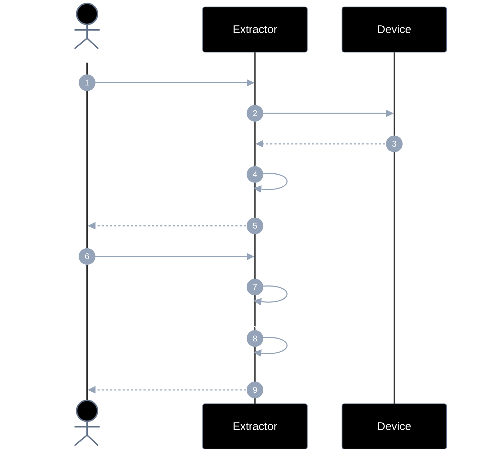
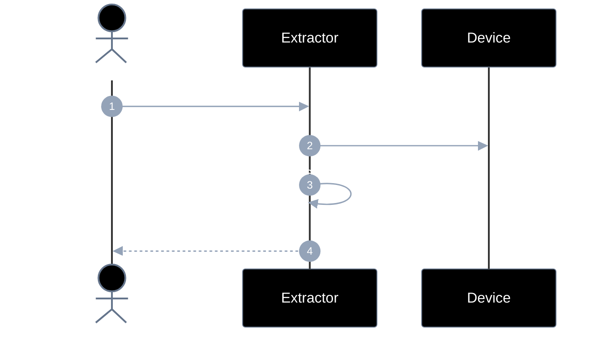
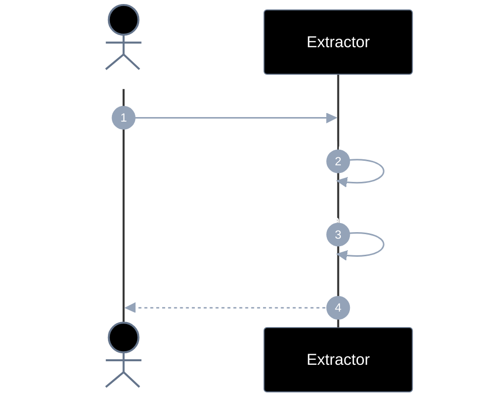
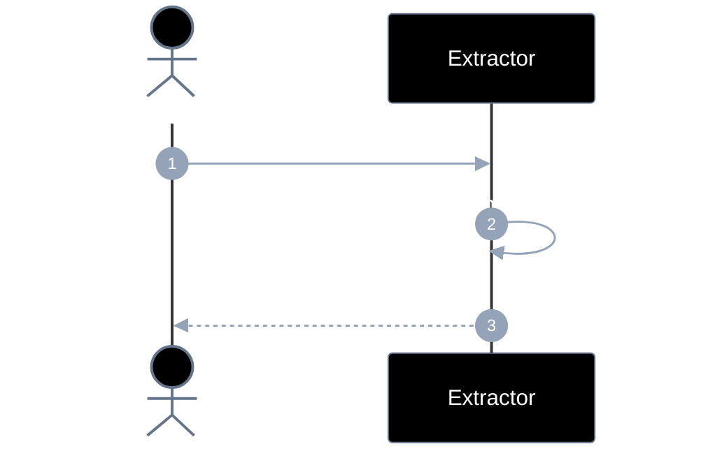
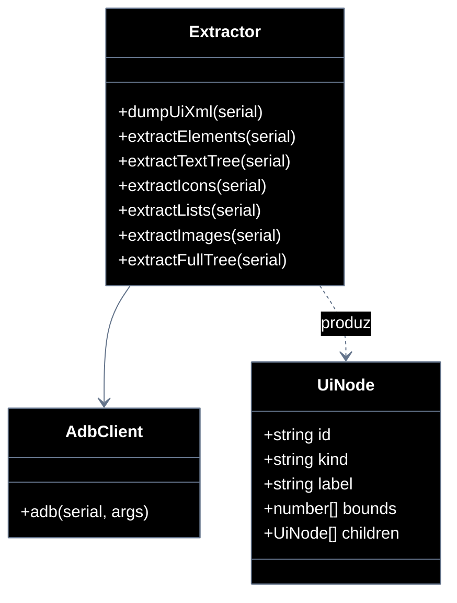

# Implementation plan — EP-05 Extrair elementos

**Por quê:** plano técnico do épico (sequências · passo a passo · contratos · classes · modelos · BDDs).  
**Épico:** [`2.epics.md`](2.epics.md) · [`README.md`](README.md).  
**US:** US-13..16 em pastas `US-13`..`US-16`.  
**Código:** [`../../sources/android-control/lib/extract.js`](../../sources/android-control/lib/extract.js).

**Stack:** Node ≥ 18 · `adb` · runtime provisionado (EP-01).

---

## Escopo

| ID | Item |
|----|------|
| US-13 | Extrair árvore DOM com textos |
| US-14 | Extrair ícones |
| US-15 | Extrair listas |
| US-16 | Extrair imagens |
| SC-17..21 | Cenários correspondentes |

**Resultado:** árvore de componentes tipada (textos → completa).

---

## Diagramas de sequência

### US-13 — Árvore DOM (duas fases)



#### Passo a passo

| # | Chamada | Por quê | Entradas | Execução | Saídas |
|---|---------|---------|----------|----------|--------|
| 1 | Dev → Extract: `extractTextTree(serial)` | Fase 1: textos rápidos | `serial` | Dump + parse text nodes | Promise tree fase 1 |
| 2 | Extract → Device: `uiautomator dump` | Obter XML da UI | — | Dump + pull | xml |
| 3 | Device → Extract: `xml` | Hierarquia bruta | — | Retorno | string XML |
| 4 | Extract → Extract: parse → árvore textos | Normalizar nodes `kind=text` | xml | Parser + filtros | tree parcial |
| 5 | Extract → Dev: tree fase 1 | Entrega rápida | — | Resolve | `{ tree, xml }` |
| 6 | Dev → Extract: `extractFullTree(serial\|tree)` | Fase 2: árvore tipada completa | serial ou tree+xml | Orquestra extractors | Promise tree full |
| 7 | Extract → Extract: icons + lists + images | Preencher kinds não-texto | tree/xml/frame | Chama US-14..16 | subárvores |
| 8 | Extract → Extract: compor hierarquia | Árvore única coerente | subárvores | Merge/compose | tree completa |
| 9 | Extract → Dev: tree completa | DOM usável pelo robot | — | Resolve | `{ tree }` |

#### Contratos

| | Contrato |
|--|----------|
| **API** | `extractTextTree(serial) → { tree, xml }` · `extractFullTree(serial\|tree) → { tree }` |
| **Entrada** | `serial` **ou** árvore fase 1 + dump/frame |
| **Pré** | Device Booted; UI dumpável |
| **Saída** | Fase 1: árvore `kind=text`; Fase 2: árvore completa tipada |
| **Erro** | `EXTRACT_DUMP_FAILED` · `EXTRACT_EMPTY_TREE` |

### US-14 — Extrair ícones



#### Passo a passo

| # | Chamada | Por quê | Entradas | Execução | Saídas |
|---|---------|---------|----------|----------|--------|
| 1 | Dev → Extract: `extractIcons(serial\|tree)` | Identificar ícones na UI | `serial` ou tree + dump | Filtra nodes de ícone | Promise tree icons |
| 2 | Extract → Device: dump / frame | Fonte de evidência | `serial` | Dump (e frame se preciso) | xml/frame |
| 3 | Extract → Extract: filtrar ImageView/icon | Marcar `kind=icon` | xml/tree | Heurísticas de classe/bounds | nodes icon |
| 4 | Extract → Dev: tree `kind=icon` | Ícones tipados | — | Resolve | `{ tree }` |

#### Contratos

| | Contrato |
|--|----------|
| **API** | `extractIcons(serial\|tree) → { tree }` |
| **Entrada** | `serial` ou tree parcial; dump/frame |
| **Pré** | Dump disponível |
| **Saída** | Árvore com nodes `kind=icon` (bounds/metadados) |
| **Erro** | `EXTRACT_DUMP_FAILED` |

### US-15 — Extrair listas



#### Passo a passo

| # | Chamada | Por quê | Entradas | Execução | Saídas |
|---|---------|---------|----------|----------|--------|
| 1 | Dev → Extract: `extractLists(serial\|tree)` | Agrupar listas/itens | `serial` ou tree | Detecta containers de lista | Promise tree lists |
| 2 | Extract → Extract: detectar RecyclerView/ListView | Achar containers | xml/tree | Heurísticas de classe | candidatos |
| 3 | Extract → Extract: agrupar items | Filhos como items da lista | container nodes | Agrupamento | list + items |
| 4 | Extract → Dev: tree `kind=list` | Listas tipadas | — | Resolve | `{ tree }` |

#### Contratos

| | Contrato |
|--|----------|
| **API** | `extractLists(serial\|tree) → { tree }` |
| **Entrada** | `serial` ou tree; dump |
| **Pré** | Dump disponível |
| **Saída** | Árvore com `kind=list` + items filhos |
| **Erro** | `EXTRACT_DUMP_FAILED` |

### US-16 — Extrair imagens



#### Passo a passo

| # | Chamada | Por quê | Entradas | Execução | Saídas |
|---|---------|---------|----------|----------|--------|
| 1 | Dev → Extract: `extractImages(serial\|tree)` | Marcar imagens/fotos | `serial` ou tree | Filtra nodes de imagem | Promise tree images |
| 2 | Extract → Extract: nodes imagem + bounds | Tipar `kind=image` | xml/tree/frame | Heurísticas + bounds | nodes image |
| 3 | Extract → Dev: tree `kind=image` | Imagens tipadas | — | Resolve | `{ tree }` |

#### Contratos

| | Contrato |
|--|----------|
| **API** | `extractImages(serial\|tree) → { tree }` |
| **Entrada** | `serial` ou tree; dump/frame |
| **Pré** | Dump disponível |
| **Saída** | Árvore com `kind=image` + bounds |
| **Erro** | `EXTRACT_DUMP_FAILED` |
---

## Modelos

### UiNode / ComponentTree

| Campo | Tipo | Descrição |
|-------|------|-----------|
| `id` | `string` | id estável na árvore |
| `kind` | `text\|icon\|list\|image\|node\|…` | Tipo |
| `label` / `text` | `string` | Conteúdo |
| `bounds` / `center` | `number[]` | Geometria |
| `children` | `UiNode[]` | Hierarquia |

### Erros

| Código | Quando |
|--------|--------|
| `EXTRACT_DUMP_FAILED` | Dump indisponível |
| `EXTRACT_EMPTY_TREE` | Sem nodes úteis |


---

## Diagrama de classes



**Hoje / gap:** ver mapeamento abaixo.

---

## Cenários BDD

Fonte: `US-13`..`US-16` / `4.bdds.md`.

```gherkin
Cenário: US-13 Árvore de componentes é composta em duas fases
  Dado uma imagem da tela ou dump
  Quando primeiro os textos são extraídos e montados na árvore
  E em seguida o restante é extraído e a hierarquia é completa
  Então a árvore de componentes completa é devolvida
```

```gherkin
Cenário: US-14 Árvore de componentes com ícones
  Dado uma imagem da tela ou dump
  Quando o reconhecimento de ícones monta a árvore
  Então a árvore de componentes contendo os ícones é devolvida
```

```gherkin
Cenário: US-15 Árvore de componentes com listas
  Dado uma imagem da tela ou dump
  Quando o reconhecimento de listas monta a árvore
  Então a árvore de componentes contendo as listas é devolvida
```

```gherkin
Cenário: US-16 Árvore de componentes com imagens
  Dado uma imagem da tela ou dump
  Quando o reconhecimento de imagens/fotos monta a árvore
  Então a árvore de componentes contendo as imagens é devolvida
```


---

## Plano de implementação (gaps → entregas)

| # | Entrega | US | Critério |
|---|---------|-----|----------|
| I1 | `extractTextTree` hierárquico | US-13 / SC-17 | Árvore textos |
| I2 | `extractFullTree` composição | US-13 / SC-18 | Árvore completa |
| I3 | `extractIcons` tipado | US-14 | kind=icon |
| I4 | `extractLists` tipado | US-15 | kind=list |
| I5 | `extractImages` tipado | US-16 | kind=image |

### Ordem

```text
I1 → I3/I4/I5 → I2
```


---

## Mapeamento código atual

| Peça | Status |
|------|--------|
| `dumpUiXml` / `extractElements` flat | Existe |
| Árvore hierárquica + kinds tipados | **Gap** |


---

## Critério de pronto (épico)

1. APIs US-13..16  
2. BDDs SC-17..21  
3. Tree consumível por operate/tapElement  


## Próximos passos

→ Implementar gaps em [`sources/android-control`](../../sources/android-control/README.md)  
→ Aceite: BDDs em cada pasta `US-*/4.bdds.md`
