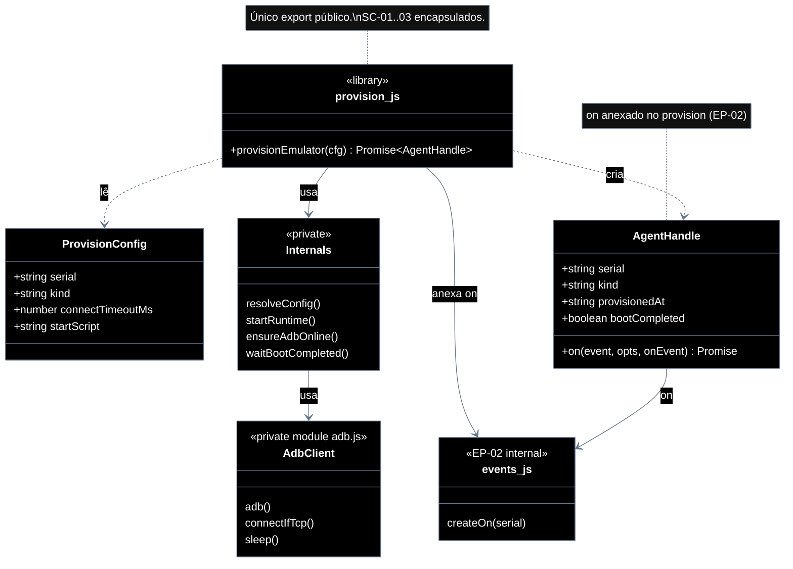

# Implementation plan — EP-01 Provisionar agente

**Por quê:** plano técnico do épico (sequências · agentes · passo a passo · contratos · classes · modelos · BDDs).  
**Épico:** [`2.epics.md`](../2.epics.md).  
**US:** [`1.stories.md`](../1.stories.md) · [`4.scenarios.md#ep-01--provisionar-agente`](../4.scenarios.md#ep-01--provisionar-agente) · [`5.bdds.md#ep-01--provisionar-agente`](../5.bdds.md#ep-01--provisionar-agente).  
**Biblioteca:** [`../sources/android-control/lib/provision.js`](../sources/android-control/lib/provision.js) — **único método público:** `provisionEmulator`.  
**Runtime:** [`../sources/redroid/`](../sources/redroid/README.md) · [`../sources/android-studio/`](../sources/android-studio/README.md).

**Stack:** Node ≥ 18 · JavaScript · `adb` · Docker/Colima (redroid) ou AVD.

---

## Escopo

| ID | Item |
|----|------|
| US-01 | Provisionar um agente |
| SC-01 | Subir / conectar o Android (agent) |
| SC-02 | Garantir serial ADB online |
| SC-03 | Aguardar boot completo |

**Resultado:** serial ADB `device` + `sys.boot_completed=1` → runtime pronto para EP-02..06.

---

## Biblioteca JavaScript

Arquivo: `sources/android-control/lib/provision.js`.

**Regra:** a lib **encapsula** todas as chamadas dos diagramas de sequência (SC-01→SC-03). Para o caller existe **apenas um método**:

```js
import { provisionEmulator } from "./lib/provision.js";

const handle = await provisionEmulator(cfg);
// → { serial, kind, provisionedAt, bootCompleted: true, on }
// EP-02: await handle.on("ui_stable", …)
```

Helpers internos (`resolveConfig`, `startRuntime`, `ensureAdbOnline`, `waitBootCompleted`, uso de `adb.js`) **não** são exportados — ficam privados ao módulo. `on` no handle vem de EP-02.

| Superfície | O quê |
|------------|--------|
| **Público** | `provisionEmulator(cfg) → Promise<AgentHandle>` |
| **Privado** | resolve config · start runtime · connect/wait ADB · poll boot |

---

## Diagramas de sequência

### US-01 — Provisionar um agente

#### Agentes

| Agente | Responsabilidade |
|--------|------------------|
| Caller / CLI | Chama **só** `provisionEmulator(cfg)` e consome o `AgentHandle` |
| provision.js | Biblioteca: encapsula SC-01→SC-03 (start, ADB, boot) |
| Runtime (interno) | Sobe ou detecta redroid/AVD até ficar alcançável |
| AdbClient (interno) | `adb` connect, wait-for-device, getprop — **não** exportado |
| Device / emulador | Android alvo |

```mermaid
---
config:
  theme: base
  themeVariables:
    darkMode: true
    background: '#000000'
    primaryColor: '#000000'
    primaryTextColor: '#ffffff'
    primaryBorderColor: '#64748b'
    secondaryColor: '#000000'
    secondaryTextColor: '#ffffff'
    secondaryBorderColor: '#64748b'
    tertiaryColor: '#000000'
    tertiaryTextColor: '#ffffff'
    tertiaryBorderColor: '#64748b'
    lineColor: '#64748b'
    textColor: '#ffffff'
    mainBkg: '#000000'
    nodeBorder: '#64748b'
    clusterBkg: '#000000'
    clusterBorder: '#333333'
    titleColor: '#ffffff'
    edgeLabelBackground: '#000000'
    actorBkg: '#000000'
    actorBorder: '#64748b'
    actorTextColor: '#ffffff'
    actorLineColor: '#333333'
    signalColor: '#94a3b8'
    signalTextColor: '#ffffff'
    labelBoxBkgColor: '#000000'
    labelBoxBorderColor: '#64748b'
    labelTextColor: '#ffffff'
    loopTextColor: '#ffffff'
    noteBorderColor: '#64748b'
    noteBkgColor: '#111111'
    noteTextColor: '#ffffff'
    activationBorderColor: '#64748b'
    activationBkgColor: '#1a1a1a'
    sequenceNumberColor: '#ffffff'
    classText: '#ffffff'
---
sequenceDiagram
  autonumber
  actor Dev as Caller / CLI
  participant Lib as provision.js
  participant R as Runtime (interno)
  participant A as AdbClient (interno)
  participant D as Emulador / Device

  Dev->>Lib: provisionEmulator(cfg)
  note over Lib: único método público
  Lib->>Lib: resolveConfig(cfg)

  rect rgb(17,17,17)
    note over Lib,D: SC-01 Subir / conectar
    Lib->>R: startRuntime(cfg) se ainda não reachable
    R->>D: scripts/start.sh (docker/AVD)
    D-->>R: up
    R-->>Lib: reachable
  end

  rect rgb(26,26,26)
    note over Lib,D: SC-02 Serial ADB online
    loop até device ou timeout
      Lib->>A: connectIfTcp(serial)
      A->>D: adb connect
      D-->>A: connected
      Lib->>A: wait-for-device
      A->>D: adb -s serial wait-for-device
      D-->>A: device
      A-->>Lib: online
    end
  end

  rect rgb(34,34,34)
    note over Lib,D: SC-03 Boot completo
    loop até boot=1 ou timeout
      Lib->>A: getprop sys.boot_completed
      A->>D: adb shell getprop
      D-->>A: "1"
      A-->>Lib: boot=1
    end
  end

  Lib-->>Dev: AgentHandle { serial, kind, provisionedAt, bootCompleted }
```



#### Passo a passo

| # | De | Para | Chamada | Descrição | Entradas | Execução | Saídas |
|---|----|------|---------|-----------|----------|----------|--------|
| 1 | Dev | provision.js | `provisionEmulator(cfg)` | **Única** chamada pública | `cfg` | Orquestra SC-01→SC-03 por dentro | Promise `AgentHandle` |
| 2 | Lib | Lib | `resolveConfig` *(privado)* | Normalizar config | `cfg` + env | Defaults e precedência | config resolvida |
| 3 | Lib | Runtime | `startRuntime` *(privado)* | Garantir emulador up (SC-01) | `kind`, `startScript?` | Start se não reachable | `reachable` |
| 4 | Runtime | Device | `scripts/start.sh` | Materializar Android | script | Spawn docker/AVD | `up` |
| 5–6 | Device → Lib | — | reachable | Fechar SC-01 | `up` | Confirma | `true` |
| 7–14 | Lib ↔ Adb | *(privado)* | connect + wait-for-device | SC-02 | `serial` | Loop até `device` | `online` |
| 15–18 | Lib ↔ Adb | *(privado)* | getprop boot | SC-03 | `serial` | Poll até `1` | `boot=1` |
| 19 | Lib | Dev | `AgentHandle` | Entregar handle | estado interno | Monta saída + anexa `on` | `{ serial, kind, provisionedAt, bootCompleted, on }` |

#### Contratos

**API pública** (só isto é importável pelo caller):

```ts
// Pré: host com adb; runtime redroid/AVD disponível ou startável
// Erros: PROVISION_NO_SERIAL | PROVISION_START_FAILED | PROVISION_ADB_TIMEOUT | PROVISION_BOOT_TIMEOUT

type ProvisionConfig = {
  device?: string;
  provision?: {
    serial?: string;
    kind?: "adb" | "redroid" | "avd";
    connectTimeoutMs?: number;
    startScript?: string;
  };
};

type AgentHandle = {
  serial: string;
  kind: string;
  provisionedAt: string; // ISO-8601
  bootCompleted: true;
  /** EP-02: eventos de UI (serial já no handle). */
  on(
    event: "boot" | "app_open" | "ui_stable" | "dump_change",
    opts?: Record<string, unknown>,
    onEvent?: (payload: { type: string; [k: string]: unknown }) => void,
  ): Promise<unknown>;
};

/** Único método exportado pela biblioteca. */
declare function provisionEmulator(cfg: ProvisionConfig): Promise<AgentHandle>;

const handle = await provisionEmulator({
  provision: {
    serial: "127.0.0.1:5555",
    kind: "redroid",
    connectTimeoutMs: 120_000,
  },
});
// → { serial, kind, provisionedAt, bootCompleted: true, on }
// EP-02: await handle.on("ui_stable", { stableMs: 1_200 });
```

**Interno (não exportar):** `resolveConfig`, `startRuntime`, `ensureAdbOnline`, `waitBootCompleted` — encapsulam as linhas #2–#18 do passo a passo. `on` é anexado ao handle via `events.createOn(serial)` (EP-02).

---

## Modelos

### ProvisionConfig

| Campo | Tipo | Origem | Descrição |
|-------|------|--------|-----------|
| `serial` | `string` | `cfg.provision.serial` \| `cfg.device` \| `ANDROID_SERIAL` | Ex.: `127.0.0.1:5555` |
| `kind` | `"adb" \| "redroid" \| "avd"` | `cfg.provision.kind` | Runtime alvo |
| `connectTimeoutMs` | `number` | `cfg.provision.connectTimeoutMs` | Default `120000` |
| `startScript` | `string?` | futuro | Path do script de start (SC-01) |
| `host` | `string?` | futuro | Host Docker/Colima |

### AgentHandle (saída)

| Campo | Tipo | Descrição |
|-------|------|-----------|
| `serial` | `string` | Serial ADB online |
| `kind` | `string` | Kind efetivo |
| `provisionedAt` | `ISO-8601` | Momento do aceite |
| `bootCompleted` | `boolean` | Sempre `true` no sucesso |
| `on` | `(event, opts?, onEvent?) => Promise` | EP-02: eventos de UI |
| `installApk` | `(app) => Promise` | EP-03 |
| `launch` / `tap` / `type` / `scroll` / `screenshot` / `matchImage` | métodos | EP-04 |
| `extract` | `(kind, opts?) => Promise` | EP-05 |
| `saveSession` / `removeSession` / `restoreSession` | métodos | EP-06 |

Métodos EP-02..06 são anexados ao handle em `provisionEmulator` (libs internas).

### DeviceState (máquina de estados)

```text
Absent → Starting → Reachable → AdbOnline → Booted
                ↘──────── timeout / error ────────↗
```

| Estado | Significado | SC |
|--------|-------------|-----|
| `Absent` | Sem processo/container | — |
| `Starting` | Script de start em curso | SC-01 |
| `Reachable` | Runtime alcançável (porta/processo) | SC-01 |
| `AdbOnline` | `adb` lista serial como `device` | SC-02 |
| `Booted` | `sys.boot_completed=1` | SC-03 |

### Erros

| Código | Quando |
|--------|--------|
| `PROVISION_NO_SERIAL` | Config sem serial |
| `PROVISION_START_FAILED` | Script/runtime não sobe (SC-01) |
| `PROVISION_ADB_TIMEOUT` | Serial não fica `device` (SC-02) |
| `PROVISION_BOOT_TIMEOUT` | Boot não completa (SC-03) |

---

## Diagrama de classes



**Hoje:** `provisionEmulator` exportado; ADB + boot encapsulados; `on` no handle (EP-02).  
**Gap:** completar `startRuntime` (redroid/AVD) **dentro** da lib, sem expandir a API pública além do handle.

---

## Cenários BDD

Fonte canônica: [`5.bdds.md#ep-01--provisionar-agente`](../5.bdds.md#ep-01--provisionar-agente).

### US-01 — Agent fica pronto para ADB

```gherkin
Cenário: US-01 Agent fica pronto para ADB
  Dado o config e o runtime Android disponíveis
  Quando o provisionamento sobe/conecta o agent, garante serial online e aguarda boot completo
  Então o agent está pronto para ADB (serial online e boot ok)
```

### SC-01 — Subir / conectar o Android (agent)

```gherkin
Cenário: SC-01 Agent sobe e fica alcançável
  Dado host, imagem/runtime e script de start
  Quando o agent é iniciado e a conexão é estabelecida
  Então o processo do agent está em execução e alcançável
```

### SC-02 — Garantir serial ADB online

```gherkin
Cenário: SC-02 Serial ADB fica online
  Dado o agent alcançável e o serial esperado na config
  Quando adb connect / listagem de devices é repetida até o serial aparecer como device
  Então o serial ADB está online
```

### SC-03 — Aguardar boot completo

```gherkin
Cenário: SC-03 Boot completo no device
  Dado o serial ADB online
  Quando o sistema faz poll de boot (ex. sys.boot_completed)
  Então o device reporta boot completo
```

---

## Plano de implementação (gaps → entregas)

| # | Entrega | SC | Arquivos | Critério |
|---|---------|-----|----------|----------|
| I1 | Lib `provision.js` com **só** `provisionEmulator` exportado | US-01 | `lib/provision.js` | API pública = 1 método |
| I2 | Internos: `resolveConfig` + `ensureAdbOnline` + `waitBootCompleted` | SC-02/03 | `provision.js` | Encapsulam o diagrama; não exportados |
| I3 | Interno: `startRuntime` (redroid `start.sh`) | SC-01 | `provision.js` | Start se não reachable |
| I4 | Interno: start AVD (`kind=avd`) | SC-01 | `provision.js` | Sem novo export |
| I5 | CLI chama `provisionEmulator` | US-01 | `cli.js` | Exit 0 só com Booted |
| I6 | Piloto LinkedIn usa `provisionEmulator` | US-01 | `scripts/linkedin-login.js` | Mesmo config |

### Ordem

```text
I1 → I2 → I3 → I4 → I5 → I6
         ↘ I3/I4 após I2 (ainda internos)
```

---

## Mapeamento código atual

| Peça | Status |
|------|--------|
| `provisionEmulator` (único export) | Existe — encapsula SC-02+SC-03 |
| Internos ADB / boot | Encapsulados em `provision.js` + `adb.js` |
| `startRuntime` (SC-01) | **Gap** interno (scripts shell manuais) |
| Exports extras além de `provisionEmulator` | **Proibido** nesta lib |

---

## Critério de pronto (épico)

1. Biblioteca JS com **apenas** `provisionEmulator` na superfície pública  
2. Sequências SC-01..03 encapsuladas dentro da lib  
3. Modelos `ProvisionConfig` / `AgentHandle` / estados documentados  
4. `provisionEmulator` devolve handle só em estado `Booted`  
5. Piloto LinkedIn usa o mesmo método  

## Próximos passos

→ Completar gaps I3–I4 em [`sources/android-control`](../sources/android-control/README.md)  
→ Aceite: [`5.bdds.md#ep-01--provisionar-agente`](../5.bdds.md#ep-01--provisionar-agente)
