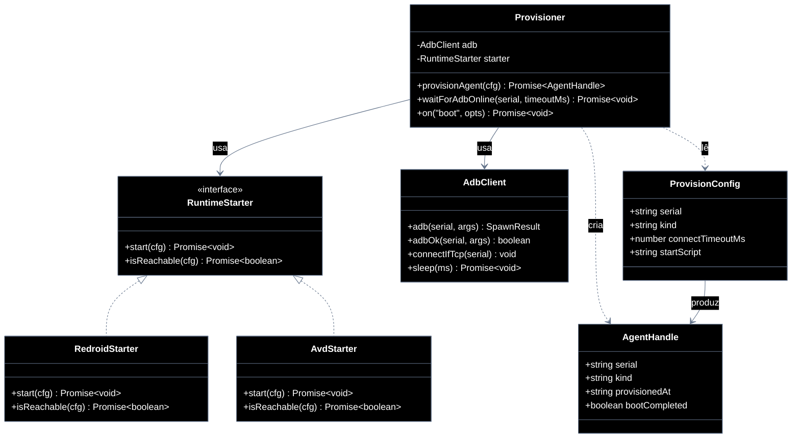

# Implementation plan — EP-01 Provisionar agente

**Por quê:** plano técnico do épico (sequências · agentes · passo a passo · contratos · classes · modelos · BDDs).  
**Épico:** [`2.epics.md`](../2.epics.md).  
**US:** [`1.stories.md`](../1.stories.md) · [`4.scenarios.md#ep-01--provisionar-agente`](../4.scenarios.md#ep-01--provisionar-agente) · [`5.bdds/EP-01-provisionar-agente.md`](../5.bdds/EP-01-provisionar-agente.md).
**Código:** [`../sources/android-control/lib/provision.js`](../sources/android-control/lib/provision.js) · [`adb.js`](../sources/android-control/lib/adb.js).  
**Runtime:** [`../sources/redroid/`](../sources/redroid/README.md) · [`../sources/android-studio/`](../sources/android-studio/README.md).

**Stack:** Node ≥ 18 · `adb` · Docker/Colima (redroid) ou AVD.

---

## Escopo

| ID | Item |
|----|------|
| US-01 | Provisionar um agente |
| SC-01 | Subir / conectar o Android (agent) |
| SC-02 | Garantir serial ADB online |
| SC-03 | Aguardar boot completo |

**Resultado:** serial ADB `device` + `sys.boot_completed=1` → runtime pronto para EP-02..06.

---

## Diagramas de sequência

### US-01 — Provisionar um agente

#### Agentes

| Agente | Responsabilidade |
|--------|------------------|
| Caller / CLI | Inicia o provisionamento e consome o `AgentHandle` pronto |
| Provisioner | Orquestra SC-01→SC-03: resolve config, sobe runtime, espera ADB e boot |
| RuntimeStarter | Sobe ou detecta o runtime Android (redroid/AVD) até ficar alcançável |
| AdbClient | Encapsula comandos `adb` (connect, wait-for-device, getprop) |
| Device / redroid | Android alvo onde o agent roda e responde aos comandos ADB |

```mermaid
---
config:
  theme: base
  themeVariables:
    darkMode: true
    background: '#000000'
    primaryColor: '#000000'
    primaryTextColor: '#ffffff'
    primaryBorderColor: '#64748b'
    secondaryColor: '#000000'
    secondaryTextColor: '#ffffff'
    secondaryBorderColor: '#64748b'
    tertiaryColor: '#000000'
    tertiaryTextColor: '#ffffff'
    tertiaryBorderColor: '#64748b'
    lineColor: '#64748b'
    textColor: '#ffffff'
    mainBkg: '#000000'
    nodeBorder: '#64748b'
    clusterBkg: '#000000'
    clusterBorder: '#333333'
    titleColor: '#ffffff'
    edgeLabelBackground: '#000000'
    actorBkg: '#000000'
    actorBorder: '#64748b'
    actorTextColor: '#ffffff'
    actorLineColor: '#333333'
    signalColor: '#94a3b8'
    signalTextColor: '#ffffff'
    labelBoxBkgColor: '#000000'
    labelBoxBorderColor: '#64748b'
    labelTextColor: '#ffffff'
    loopTextColor: '#ffffff'
    noteBorderColor: '#64748b'
    noteBkgColor: '#111111'
    noteTextColor: '#ffffff'
    activationBorderColor: '#64748b'
    activationBkgColor: '#1a1a1a'
    sequenceNumberColor: '#ffffff'
    classText: '#ffffff'
---
sequenceDiagram
  autonumber
  actor Dev as Caller / CLI
  participant P as Provisioner
  participant R as RuntimeStarter
  participant A as AdbClient
  participant D as Device / redroid

  Dev->>P: provisionAgent(cfg)
  P->>P: resolve serial, timeout, kind

  rect rgb(17,17,17)
    note over P,D: SC-01 Subir / conectar
    P->>R: start(cfg) se ainda não reachable
    R->>D: scripts/start.sh (docker/AVD)
    D-->>R: up (porta/processo)
    R-->>P: reachable
  end

  rect rgb(26,26,26)
    note over P,D: SC-02 Serial ADB online
    loop até device ou timeout
      P->>A: connectIfTcp(serial)
      A->>D: adb connect
      D-->>A: connected
      A-->>P: ok
      P->>A: wait-for-device
      A->>D: adb -s serial wait-for-device
      D-->>A: device
      A-->>P: online
    end
  end

  rect rgb(34,34,34)
    note over P,D: SC-03 Boot completo
    loop até boot=1 ou timeout
      P->>A: getprop sys.boot_completed
      A->>D: adb shell getprop
      D-->>A: "1"
      A-->>P: boot=1
    end
  end

  P-->>Dev: AgentHandle { serial, kind, provisionedAt }
```



#### Passo a passo

| # | De | Para | Chamada | Descrição | Entradas | Execução | Saídas |
|---|----|------|---------|---------|----------|----------|--------|
| 1 | Dev | Provisioner | `provisionAgent(cfg)` | Entrada do épico | `cfg` | Valida cfg e orquestra SC-01→SC-03 | Promise `AgentHandle` |
| 2 | Provisioner | Provisioner | resolve serial/timeout/kind | Normalizar config | `cfg` + env | Aplica defaults e precedência | `ProvisionConfig` |
| 3 | Provisioner | RuntimeStarter | `start(cfg)` | Garantir runtime up (SC-01) | `kind`, `startScript?` | Chama start se não reachable | pedido de start |
| 4 | RuntimeStarter | Device | `scripts/start.sh` | Materializar Android | script + args | Spawn docker/AVD | pedido de up |
| 5 | Device | RuntimeStarter | `up` | Confirmar runtime no ar | porta/processo | Sinaliza up | `up` |
| 6 | RuntimeStarter | Provisioner | `reachable` | Fechar SC-01 | `up` | Retorna reachable | `true` |
| 7 | Provisioner | AdbClient | `connectIfTcp(serial)` | TCP precisa connect (SC-02) | `serial` | Detecta TCP e pede connect | pedido |
| 8 | AdbClient | Device | `adb connect` | Abrir canal ADB | `host:port` | Roda adb connect | pedido |
| 9 | Device | AdbClient | `connected` | Sessão TCP | — | Aceita/recusa connect | `connected` |
| 10 | AdbClient | Provisioner | `ok` | Connect concluído | — | Propaga resultado | `ok` |
| 11 | Provisioner | AdbClient | `wait-for-device` | Esperar estado device | `serial` | Chama wait-for-device | pedido |
| 12 | AdbClient | Device | `adb wait-for-device` | Bloquear até online | `serial` | Comando adb | pedido |
| 13 | Device | AdbClient | `device` | Serial online | — | Estado device | `device` |
| 14 | AdbClient | Provisioner | `online` | SC-02 ok | — | Propaga online | `online` |
| 15 | Provisioner | AdbClient | `getprop sys.boot_completed` | Checar boot (SC-03) | `serial` | Pede getprop | pedido |
| 16 | AdbClient | Device | `adb shell getprop` | Ler prop | `sys.boot_completed` | Shell remoto | pedido |
| 17 | Device | AdbClient | `"1"` | Boot completo | — | Retorna prop | `1` |
| 18 | AdbClient | Provisioner | `boot=1` | SC-03 ok | — | Propaga Booted | `boot=1` |
| 19 | Provisioner | Dev | `AgentHandle` | Entregar handle | estado interno | Monta saída | `{ serial, kind, provisionedAt }` |

#### Contratos

Exemplos TypeScript das chamadas (# do passo a passo).

```ts
// Pré: host com adb; runtime redroid/AVD disponível ou startável
// Erros: PROVISION_NO_SERIAL | PROVISION_START_FAILED | PROVISION_ADB_TIMEOUT | PROVISION_BOOT_TIMEOUT

type ProvisionConfig = {
  device?: string;
  provision?: {
    serial?: string;
    kind?: "adb" | "redroid" | "avd";
    connectTimeoutMs?: number;
    startScript?: string;
  };
};

type AgentHandle = {
  serial: string;
  kind: string;
  provisionedAt: string; // ISO-8601
  bootCompleted: true;
};

// #1 Dev → Provisioner
declare function provisionAgent(cfg: ProvisionConfig): Promise<AgentHandle>;

const handle = await provisionAgent({
  provision: {
    serial: "127.0.0.1:5555",
    kind: "redroid",
    connectTimeoutMs: 120_000,
  },
});

// #2 Provisioner → Provisioner
declare function resolveProvisionConfig(cfg: ProvisionConfig): {
  serial: string;
  kind: "adb" | "redroid" | "avd";
  connectTimeoutMs: number;
  startScript?: string;
};

const resolved = resolveProvisionConfig({
  provision: { serial: "127.0.0.1:5555" },
});
// → { serial: "127.0.0.1:5555", kind: "adb", connectTimeoutMs: 120_000 }

// #3 Provisioner → RuntimeStarter
declare function start(cfg: ProvisionConfig): Promise<{ reachable: true }>;

await start(resolved);

// #4 RuntimeStarter → Device
declare function spawnStartScript(
  script: string,
  args?: string[],
): Promise<{ up: true }>;

await spawnStartScript("sources/redroid/scripts/start.sh");

// #5–6 Device → RuntimeStarter → Provisioner
const up: { up: true } = { up: true };
const reachable: true = true;

// #7 Provisioner → AdbClient
declare function connectIfTcp(serial: string): void;
connectIfTcp("127.0.0.1:5555");

// #8–10 AdbClient ↔ Device
declare function adbConnect(hostPort: string): Promise<"connected">;
await adbConnect("127.0.0.1:5555");

// #11–14 AdbClient ↔ Device → Provisioner
declare function waitForDevice(serial: string): Promise<"device">;
const online = await waitForDevice("127.0.0.1:5555");
// → "device"

// #15–18 AdbClient ↔ Device → Provisioner
declare function getprop(
  serial: string,
  key: "sys.boot_completed",
): Promise<"0" | "1">;

const boot = await getprop("127.0.0.1:5555", "sys.boot_completed");
// → "1"

// #19 Provisioner → Dev
const out: AgentHandle = {
  serial: "127.0.0.1:5555",
  kind: "redroid",
  provisionedAt: "2026-09-19T21:00:00.000Z",
  bootCompleted: true,
};
```

## Modelos

### ProvisionConfig

| Campo | Tipo | Origem | Descrição |
|-------|------|--------|-----------|
| `serial` | `string` | `cfg.provision.serial` \| `cfg.device` \| `ANDROID_SERIAL` | Ex.: `127.0.0.1:5555` |
| `kind` | `"adb" \| "redroid" \| "avd"` | `cfg.provision.kind` | Runtime alvo |
| `connectTimeoutMs` | `number` | `cfg.provision.connectTimeoutMs` | Default `120000` |
| `startScript` | `string?` | futuro | Path do script de start (SC-01) |
| `host` | `string?` | futuro | Host Docker/Colima |

### AgentHandle (saída)

| Campo | Tipo | Descrição |
|-------|------|-----------|
| `serial` | `string` | Serial ADB online |
| `kind` | `string` | Kind efetivo |
| `provisionedAt` | `ISO-8601` | Momento do aceite |
| `bootCompleted` | `boolean` | Sempre `true` no sucesso |

### DeviceState (máquina de estados)

```text
Absent → Starting → Reachable → AdbOnline → Booted
                ↘──────── timeout / error ────────↗
```

| Estado | Significado | SC |
|--------|-------------|-----|
| `Absent` | Sem processo/container | — |
| `Starting` | Script de start em curso | SC-01 |
| `Reachable` | Runtime alcançável (porta/processo) | SC-01 |
| `AdbOnline` | `adb` lista serial como `device` | SC-02 |
| `Booted` | `sys.boot_completed=1` | SC-03 |

### Erros

| Código | Quando |
|--------|--------|
| `PROVISION_NO_SERIAL` | Config sem serial |
| `PROVISION_START_FAILED` | Script/runtime não sobe (SC-01) |
| `PROVISION_ADB_TIMEOUT` | Serial não fica `device` (SC-02) |
| `PROVISION_BOOT_TIMEOUT` | Boot não completa (SC-03) |

---

## Diagrama de classes



**Hoje:** `provisionAgent` + `AdbClient` (`adb.js`) cobrem SC-02+SC-03; SC-01 é manual via scripts redroid/studio.  
**Gap:** extrair `RuntimeStarter`, `waitForAdbOnline` e reusar `on("boot")` (EP-02).

---

## Cenários BDD

Fonte canônica: [`5.bdds/EP-01-provisionar-agente.md`](../5.bdds/EP-01-provisionar-agente.md).

### US-01 — Agent fica pronto para ADB

```gherkin
Cenário: US-01 Agent fica pronto para ADB
  Dado o config e o runtime Android disponíveis
  Quando o provisionamento sobe/conecta o agent, garante serial online e aguarda boot completo
  Então o agent está pronto para ADB (serial online e boot ok)
```

### SC-01 — Subir / conectar o Android (agent)

```gherkin
Cenário: SC-01 Agent sobe e fica alcançável
  Dado host, imagem/runtime e script de start
  Quando o agent é iniciado e a conexão é estabelecida
  Então o processo do agent está em execução e alcançável
```

### SC-02 — Garantir serial ADB online

```gherkin
Cenário: SC-02 Serial ADB fica online
  Dado o agent alcançável e o serial esperado na config
  Quando adb connect / listagem de devices é repetida até o serial aparecer como device
  Então o serial ADB está online
```

### SC-03 — Aguardar boot completo

```gherkin
Cenário: SC-03 Boot completo no device
  Dado o serial ADB online
  Quando o sistema faz poll de boot (ex. sys.boot_completed)
  Então o device reporta boot completo
```

---

## Plano de implementação (gaps → entregas)

| # | Entrega | SC | Arquivos | Critério |
|---|---------|-----|----------|----------|
| I1 | Tipar `ProvisionConfig` / `AgentHandle` (JSDoc ou `.d.ts`) | — | `lib/provision.js` | Tipos documentados |
| I2 | Extrair `waitForAdbOnline(serial, opts)` | SC-02 | `provision.js` + `adb.js` | API isolada + timeout |
| I3 | Extrair boot via EventBus `on("boot")` (EP-02) | SC-03 | `provision.js` / `events.js` | Reuso do evento |
| I4 | `RuntimeStarter` + `RedroidStarter` (chama `sources/redroid/scripts/start.sh`) | SC-01 | `lib/runtime/` | Start opcional se não reachable |
| I5 | `AvdStarter` (android-studio scripts) | SC-01 | `lib/runtime/` | kind=`avd` |
| I6 | `provisionAgent` orquestra I2–I5 | US-01 | `provision.js` | BDDs US-01 + SC passam |
| I7 | CLI `node cli.js provision --config …` | US-01 | `cli.js` | Exit 0 só com Booted |

### Ordem

```text
I1 → I2 → I3 → I4 → I5 → I6 → I7
         ↘ paraleliza I4/I5 após I1
```

---

## Mapeamento código atual

| Peça | Status |
|------|--------|
| `provisionAgent` (connect + boot loop) | Existe — mistura SC-02+SC-03 |
| `connectIfTcp` / `adb` / `wait-for-device` | Existe |
| Start redroid/AVD via Node | **Gap** (só scripts shell) |
| `waitForAdbOnline` dedicado; boot via `on("boot")` | **Gap** / EP-02 |
| Eventos via `on(nome)` no provision | **Gap** (EP-02 US-02) |

---

## Critério de pronto (épico)

1. Modelos `ProvisionConfig` / `AgentHandle` / estados documentados  
2. Classes/APIs alinhadas ao diagrama  
3. Sequências SC-01..03 implementáveis e cobertas por BDD  
4. `provisionAgent` devolve handle só em estado `Booted`  
5. Piloto LinkedIn continua funcionando com o mesmo config  

## Próximos passos

→ Implementar I1–I7 em [`sources/android-control`](../sources/android-control/README.md)  
→ Aceite: [`5.bdds/EP-01-provisionar-agente.md`](../5.bdds/EP-01-provisionar-agente.md)
