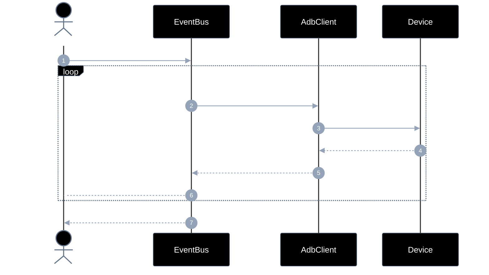
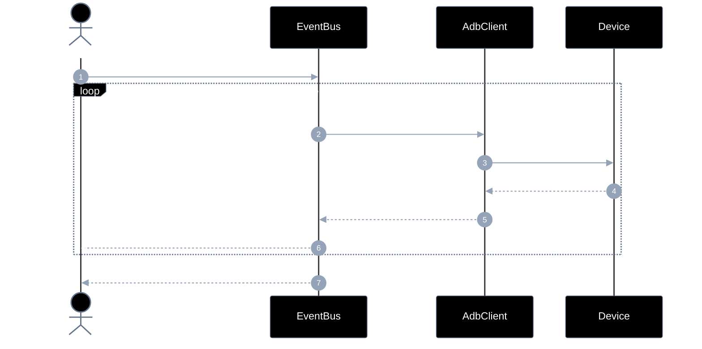
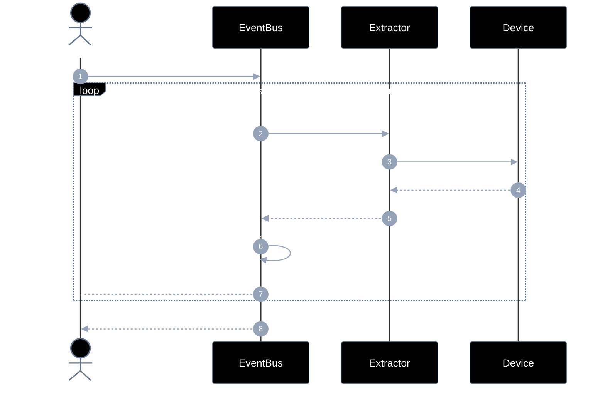
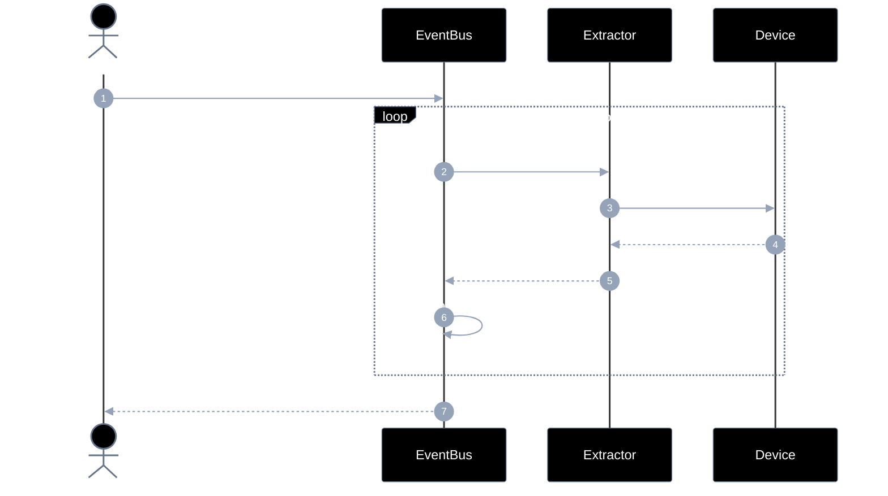
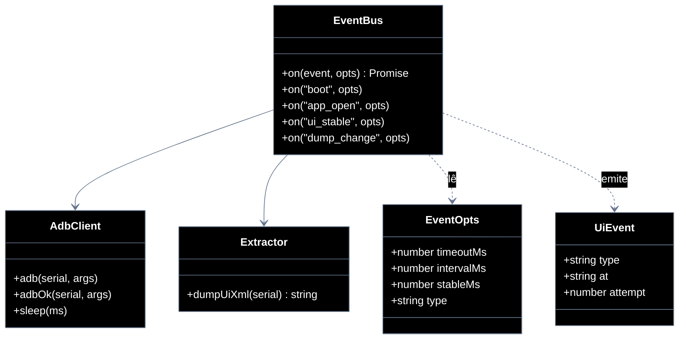

# Implementation plan — EP-02 Eventos de UI

**Por quê:** plano técnico do épico (sequências · agentes · passo a passo · contratos · classes · modelos · BDDs).  
**Épico:** [`2.epics.md`](../2.epics.md).  
**US:** [`1.stories.md`](../1.stories.md) · [`3.scenarios.md`](../3.scenarios.md) · [`4.bdds.md`](../4.bdds.md).
**Código:** [`../sources/android-control/lib/events.js`](../sources/android-control/lib/events.js) · [`extract.js`](../sources/android-control/lib/extract.js) · [`adb.js`](../sources/android-control/lib/adb.js).

**Stack:** Node ≥ 18 · `adb` · runtime provisionado (EP-01).

---

## Escopo

| ID | Item |
|----|------|
| US-02 | Evento de boot |
| US-03 | Evento de app aberta |
| US-04 | Evento de tela estável |
| US-05 | Evento de mudança de dump |
| SC-04 | Sinal de boot é recebido |
| SC-05 | App em foreground é confirmada |
| SC-06 | Tela fica estável |
| SC-07 | Dump de UI muda |

**Resultado:** sinais de UI confiáveis antes de instalar/operar/extrair.

---

## Diagramas de sequência

### US-02 — Evento de boot

#### Agentes

| Agente | Responsabilidade |
|--------|------------------|
| Caller | Solicita o wait de boot e opcionalmente escuta progresso via `on` |
| EventBus | Expõe `on("boot")`; polla até `sys.boot_completed=1` e emite o evento |
| AdbClient | Lê propriedades do device via `adb shell getprop` |
| Device | Fonte da prop `sys.boot_completed` |



#### Passo a passo

| # | De | Para | Chamada | Por quê | Entradas | Execução | Saídas |
|---|----|------|---------|---------|----------|----------|--------|
| 1 | Dev | EventBus | `on("boot", { serial, ...opts })` | Esperar boot | `serial`, opts | Inicia loop de poll | Promise |
| 2 | EventBus | AdbClient | `getprop sys.boot_completed` | Checar prop | `serial` | Pede leitura | pedido |
| 3 | AdbClient | Device | `adb shell getprop` | Ler no device | prop | Shell | pedido |
| 4 | Device | AdbClient | `"0"/"1"` | Valor | — | Resposta | prop |
| 5 | AdbClient | EventBus | `prop` | Entregar valor | — | Propaga | prop |
| 6 | EventBus | Dev | `on("boot_poll", payload)` | Progresso (fire-and-forget) | type + valor | Callback assíncrono | — |
| 7 | EventBus | Dev | `on("boot", { boot: true })` | Condição ok | prop==1 | Resolve Promise | `{ boot: true }` |

#### Contratos

| | Contrato |
|--|----------|
| **API** | `on("boot", opts: EventOpts) → Promise<{ boot: true }>` |
| **Entrada** | evento `"boot"`; `serial`; `timeoutMs?`; `intervalMs?`; handler opcional |
| **Pré** | Serial ADB online (EP-01) |
| **Saída** | `{ boot: true }` + eventos `boot_poll` / `boot` |
| **Erro** | `EVENT_BOOT_TIMEOUT` |

### US-03 — Evento de app aberta

#### Agentes

| Agente | Responsabilidade |
|--------|------------------|
| Caller | Pede wait até o package (e activity opcional) estar em foreground |
| EventBus | Expõe `on("app_open")`; polla foreground e emite progresso/`app_open` |
| AdbClient | Executa `dumpsys window` / `pidof` (ou equivalentes) no device |
| Device | Reporta janela/processo ativos que indicam o package em foreground |



#### Passo a passo

| # | De | Para | Chamada | Por quê | Entradas | Execução | Saídas |
|---|----|------|---------|---------|----------|----------|--------|
| 1 | Dev | EventBus | `on("app_open", { serial, pkg, ...opts })` | Esperar app na frente | `serial`, `pkg` | Inicia poll | Promise |
| 2 | EventBus | AdbClient | `dumpsys` / `pidof` | Evidência de foreground | `pkg` | Pede shell | pedido |
| 3 | AdbClient | Device | `adb shell` | Consultar | comando | Executa | pedido |
| 4 | Device | AdbClient | `package ativo?` | Evidência | — | stdout | sim/não |
| 5 | AdbClient | EventBus | `evidência` | Reportar | — | Propaga | evidência |
| 6 | EventBus | Dev | `on("app_poll", payload)` | Progresso (fire-and-forget) | pkg + evidência | Callback | — |
| 7 | EventBus | Dev | `on("app_open", { foreground, package })` | App aberta | match | Resolve | resultado |

#### Contratos

| | Contrato |
|--|----------|
| **API** | `on("app_open", opts) → Promise<{ foreground: true, package }>` |
| **Entrada** | evento `"app_open"`; `serial`; `pkg`; `activity?`; `timeoutMs?`; handler opcional |
| **Pré** | Device Booted; package instalado (ou a instalar) |
| **Saída** | Package (e activity opcional) em foreground |
| **Erro** | `EVENT_APP_TIMEOUT` |

### US-04 — Evento de tela estável

#### Agentes

| Agente | Responsabilidade |
|--------|------------------|
| Caller | Pede wait até a UI parar de mudar por `stableMs` |
| EventBus | Expõe `on("ui_stable")`; amostra dumps até estável e emite o evento |
| Extractor | Obtém o XML da UI (`uiautomator dump`) para cada amostra |
| Device | Fornece o dump da hierarquia de views |



#### Passo a passo

| # | De | Para | Chamada | Por quê | Entradas | Execução | Saídas |
|---|----|------|---------|---------|----------|----------|--------|
| 1 | Dev | EventBus | `on("ui_stable", { serial, ...opts })` | Esperar UI quieta | `serial`, `stableMs?` | Inicia amostragem | Promise |
| 2 | EventBus | Extractor | `dumpUiXml(serial)` | Snapshot UI | `serial` | Pede dump | pedido |
| 3 | Extractor | Device | `uiautomator dump` | Capturar XML | — | Dump + pull | pedido |
| 4 | Device | Extractor | `xml` | Snapshot | — | Retorna XML | xml |
| 5 | Extractor | EventBus | `xml` | Entregar dump | — | Propaga | xml |
| 6 | EventBus | EventBus | `hash == previous?` | Detectar estabilidade | xml | Compara hashes | stable? |
| 7 | EventBus | Dev | `on("ui_stable_poll", payload)` | Progresso (fire-and-forget) | hash | Callback | — |
| 8 | EventBus | Dev | `on("ui_stable", { stable: true })` | UI estável | stableMs | Resolve | `{ stable: true }` |

#### Contratos

| | Contrato |
|--|----------|
| **API** | `on("ui_stable", opts) → Promise<{ stable: true }>` |
| **Entrada** | evento `"ui_stable"`; `serial`; `timeoutMs?`; `stableMs?`; `intervalMs?`; handler opcional |
| **Pré** | App em foreground (US-03) recomendado |
| **Saída** | Dump/hash sem mudança por `stableMs` |
| **Erro** | `EVENT_STABLE_TIMEOUT` |

### US-05 — Evento de mudança de dump

#### Agentes

| Agente | Responsabilidade |
|--------|------------------|
| Caller | Pede wait até o dump divergir do baseline |
| EventBus | Expõe `on("dump_change")`; emite quando o hash diverge |
| Extractor | Captura novos dumps XML sob demanda |
| Device | Fonte do dump uiautomator a cada poll |



#### Passo a passo

| # | De | Para | Chamada | Por quê | Entradas | Execução | Saídas |
|---|----|------|---------|---------|----------|----------|--------|
| 1 | Dev | EventBus | `on("dump_change", { serial, previousXml?, ...opts })` | Esperar mudança | `serial`, baseline | Inicia poll | Promise |
| 2 | EventBus | Extractor | `dumpUiXml(serial)` | Novo snapshot | `serial` | Pede dump | pedido |
| 3 | Extractor | Device | `uiautomator dump` | Capturar XML | — | Dump + pull | pedido |
| 4 | Device | Extractor | `xml` | Snapshot | — | Retorna | xml |
| 5 | Extractor | EventBus | `xml` | Entregar | — | Propaga | xml |
| 6 | EventBus | EventBus | `hash ≠ previous?` | Detectar mudança | xml vs base | Compara | changed? |
| 7 | EventBus | Dev | `on("dump_change", { xml, changed: true })` | Mudou | novo xml | Resolve | resultado |

#### Contratos

| | Contrato |
|--|----------|
| **API** | `on("dump_change", opts) → Promise<{ xml, changed: true }>` |
| **Entrada** | evento `"dump_change"`; `serial`; `previousXml?`; `timeoutMs?`; handler opcional |
| **Pré** | Serial online; dump uiautomator disponível |
| **Saída** | `{ xml, changed: true }` com hash ≠ base |
| **Erro** | `EVENT_DUMP_TIMEOUT` |
---

## Modelos

### API

`on(event: "boot" | "app_open" | "ui_stable" | "dump_change" | "*_poll", opts: EventOpts) → Promise<UiEvent>`

### EventOpts

| Campo | Tipo | Descrição |
|-------|------|-----------|
| `serial` | `string` | Device ADB |
| `timeoutMs` | `number` | Default por evento |
| `intervalMs` | `number` | Poll interval |
| `stableMs` | `number` | `"ui_stable"`: janela sem mudança |
| `pkg` | `string?` | `"app_open"` |
| `activity` | `string?` | `"app_open"` opcional |
| `previousXml` | `string?` | `"dump_change"` baseline |
| `handler` | `(e: UiEvent) => void` | Progresso (`*_poll`) e conclusão |

### UiEvent

| Campo | Tipo | Exemplos `type` |
|-------|------|-----------------|
| `type` | `string` | `boot`, `app_open`, `ui_stable`, `dump_change`, `boot_poll`, `app_poll`, `ui_stable_poll` |
| `at` | `ISO-8601` | Timestamp |
| `attempt` | `number` | Tentativa atual |

### Erros

| Código | US |
|--------|-----|
| `EVENT_BOOT_TIMEOUT` | US-02 |
| `EVENT_APP_TIMEOUT` | US-03 |
| `EVENT_STABLE_TIMEOUT` | US-04 |
| `EVENT_DUMP_TIMEOUT` | US-05 |

---

## Diagrama de classes



**Hoje / gap:** ver mapeamento abaixo.

---

## Cenários BDD

Fonte: pastas `US-02`..`US-05` / `4.bdds.md`.

### US-02

```gherkin
Cenário: US-02 Boot do device é sinalizado
  Dado o serial online
  Quando o sistema espera o sinal de boot
  Então o boot é sinalizado
```

### US-03

```gherkin
Cenário: US-03 App aberta é confirmada
  Dado o package em foreground esperado
  Quando o sistema espera a app em foreground
  Então a app aberta está confirmada
```

### US-04

```gherkin
Cenário: US-04 Tela estável é confirmada
  Dado a app em foreground
  Quando o sistema espera UI estável (sem transição)
  Então a tela está estável
```

### US-05

```gherkin
Cenário: US-05 Dump atualizado fica disponível
  Dado um dump anterior (opcional) e serial online
  Quando o sistema detecta mudança no dump de UI
  Então um dump atualizado está disponível
```

---

## Plano de implementação (gaps → entregas)

| # | Entrega | US | Arquivos | Critério |
|---|---------|-----|----------|----------|
| I1 | `on("boot")` + emit `boot_poll`/`boot` | US-02 | `events.js` | SC-04 |
| I2 | `on("app_open")` (dumpsys, não só pidof) | US-03 | `events.js` | SC-05 |
| I3 | `on("ui_stable")` por hash de dump | US-04 | `events.js` | SC-06 |
| I4 | `on("dump_change")` | US-05 | `events.js` | SC-07 |
| I5 | Unificar em `on(event, opts)`; deprecar `waitForUiReady` | — | `events.js` | API clara |

### Ordem

```text
I1 → I2 → I3 → I4 → I5
```

---

## Mapeamento código atual

| Peça | Status |
|------|--------|
| `on(event, opts)` unificado | **Gap** (hoje `waitForUiReady`) |
| Eventos `"boot"` / `"app_open"` / `"ui_stable"` / `"dump_change"` | **Gap** |
| Foreground real (dumpsys) | **Gap** |

---

## Critério de pronto (épico)

1. Quatro APIs de evento exportadas  
2. Sequências US-02..05 cobertas por BDD  
3. `on(nome, opts)` cobre os quatro eventos + polls  
4. Consumíveis por EP-03..05  

## Próximos passos

→ Implementar gaps em [`sources/android-control`](../sources/android-control/README.md)  
→ Aceite: BDDs em cada pasta `US-*/4.bdds.md`
