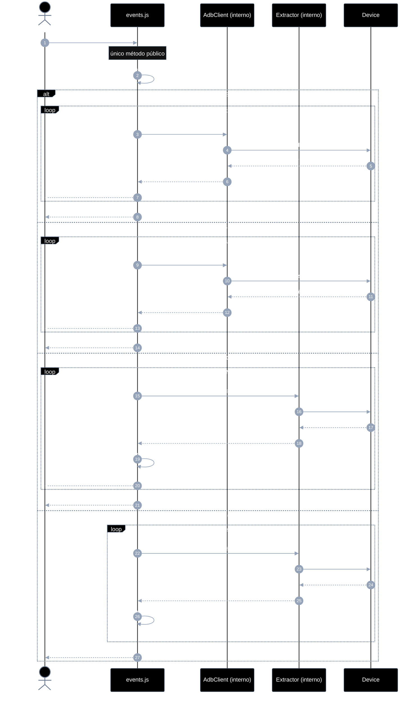
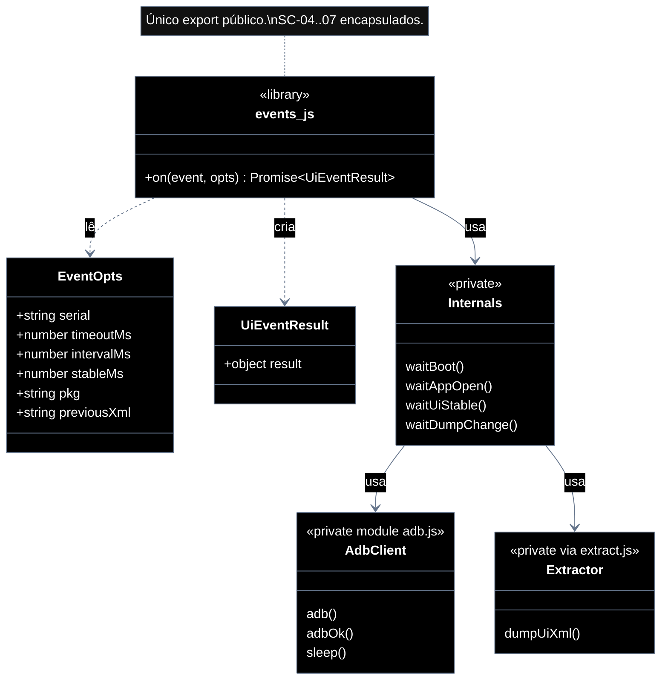

# Implementation plan — EP-02 Eventos de UI

**Por quê:** plano técnico do épico (sequências · agentes · passo a passo · contratos · classes · modelos · BDDs).  
**Épico:** [`2.epics.md`](../2.epics.md).  
**US:** [`1.stories.md`](../1.stories.md) · [`4.scenarios.md#ep-02--eventos-de-ui`](../4.scenarios.md#ep-02--eventos-de-ui) · [`5.bdds.md#ep-02--eventos-de-ui`](../5.bdds.md#ep-02--eventos-de-ui).  
**Biblioteca:** [`../sources/android-control/lib/events.js`](../sources/android-control/lib/events.js) — **único método público:** `on`.  
**Pré-requisito:** emulador provisionado ([`EP-01`](EP-01-provisionar-agente.md) · `provisionEmulator`).

**Stack:** Node ≥ 18 · JavaScript · `adb` · runtime provisionado (EP-01).

---

## Escopo

| ID | Item |
|----|------|
| US-02 | Evento de boot |
| US-03 | Evento de app aberta |
| US-04 | Evento de tela estável |
| US-05 | Evento de mudança de dump |
| SC-04 | Sinal de boot é recebido |
| SC-05 | App em foreground é confirmada |
| SC-06 | Tela fica estável |
| SC-07 | Dump de UI muda |

**Resultado:** sinais de UI confiáveis antes de instalar/operar/extrair.

---

## Biblioteca JavaScript

Arquivo: `sources/android-control/lib/events.js`.

**Regra:** a lib **encapsula** todas as chamadas dos diagramas de sequência (US-02→US-05 / SC-04→SC-07). Para o caller existe **apenas um método**:

```js
import { on } from "./lib/events.js";

await on("boot", { serial });
await on("app_open", { serial, pkg: "com.linkedin.android" });
await on("ui_stable", { serial, stableMs: 1_200 });
await on("dump_change", { serial, previousXml });
```

Helpers internos (`waitBoot`, `waitAppOpen`, `waitUiStable`, `waitDumpChange`, uso de `adb.js` / dump) **não** são exportados — ficam privados ao módulo.

| Superfície | O quê |
|------------|--------|
| **Público** | `on(event, opts) → Promise<UiEventResult>` |
| **Privado** | poll boot · foreground · hash dump · estabilidade · progresso `*_poll` |

`event`: `"boot"` \| `"app_open"` \| `"ui_stable"` \| `"dump_change"`.

---

## Diagramas de sequência

### Visão geral — único método público

#### Agentes

| Agente | Responsabilidade |
|--------|------------------|
| Caller / CLI | Chama **só** `on(event, opts)` e consome o resultado |
| events.js | Biblioteca: despacha e encapsula SC-04→SC-07 |
| AdbClient (interno) | `getprop`, `dumpsys` / `pidof` — **não** exportado |
| Extractor (interno) | `dumpUiXml` / hash — **não** exportado pela lib de eventos |
| Device | Fonte de props, foreground e dump |



#### Passo a passo (visão geral)

| # | De | Para | Chamada | Descrição | Entradas | Execução | Saídas |
|---|----|------|---------|-----------|----------|----------|--------|
| 1 | Dev | events.js | `on(event, opts)` | **Única** chamada pública | `event`, `opts` | Despacha SC-04..07 por dentro | Promise resultado |
| 2 | Lib | Lib | `dispatch` *(privado)* | Escolher wait interno | `event` | Roteia | handler |
| 3–n | Lib ↔ Adb/Extractor | *(privado)* | polls por evento | Ver US abaixo | `serial`, opts | Loop + `onEvent` | resultado tipado |

#### Contratos

**API pública** (só isto é importável pelo caller):

```ts
// Pré: serial ADB online (EP-01 · provisionEmulator)
// Erros: EVENT_BOOT_TIMEOUT | EVENT_APP_TIMEOUT | EVENT_STABLE_TIMEOUT | EVENT_DUMP_TIMEOUT | EVENT_UNKNOWN

type EventName = "boot" | "app_open" | "ui_stable" | "dump_change";

type EventOpts = {
  serial: string;
  timeoutMs?: number;
  intervalMs?: number;
  stableMs?: number;       // ui_stable
  pkg?: string;            // app_open
  activity?: string;       // app_open
  previousXml?: string;    // dump_change
  contains?: string;       // ui_stable (opcional: texto no dump)
  onEvent?: (payload: { type: string; [k: string]: unknown }) => void;
};

type UiEventResult =
  | { boot: true }
  | { foreground: true; package: string; activity?: string }
  | { stable: true }
  | { xml: string; changed: true };

/** Único método exportado pela biblioteca. */
declare function on(event: EventName, opts: EventOpts): Promise<UiEventResult>;

await on("boot", { serial: "127.0.0.1:5555", timeoutMs: 60_000 });
await on("app_open", { serial: "127.0.0.1:5555", pkg: "com.linkedin.android" });
await on("ui_stable", { serial: "127.0.0.1:5555", stableMs: 1_200 });
await on("dump_change", { serial: "127.0.0.1:5555", previousXml: "<hierarchy/>" });
```

**Interno (não exportar):** `waitBoot`, `waitAppOpen`, `waitUiStable`, `waitDumpChange`, `hashDump`, `isPackageForeground` — encapsulam as sequências por US.

---

### US-02 — Evento de boot (SC-04)

Caller: `on("boot", opts)`. Interno: poll `sys.boot_completed` até `"1"`.

| # | De | Para | Chamada | Descrição |
|---|----|------|---------|-----------|
| 1 | Dev | Lib | `on("boot", opts)` | Entrada pública |
| 2 | Lib | Adb | getprop *(privado)* | Poll |
| 3 | Lib | Dev | `{ boot: true }` | Resolve |

```ts
const result = await on("boot", {
  serial: "127.0.0.1:5555",
  timeoutMs: 60_000,
  intervalMs: 1_500,
  onEvent: (p) => console.log(p.type), // boot_poll
});
// → { boot: true }
```

---

### US-03 — Evento de app aberta (SC-05)

Caller: `on("app_open", opts)`. Interno: dumpsys / pidof até package em foreground.

| # | De | Para | Chamada | Descrição |
|---|----|------|---------|-----------|
| 1 | Dev | Lib | `on("app_open", { serial, pkg, ... })` | Entrada pública |
| 2 | Lib | Adb | dumpsys/pidof *(privado)* | Poll foreground |
| 3 | Lib | Dev | `{ foreground: true, package }` | Resolve |

```ts
await on("app_open", {
  serial: "127.0.0.1:5555",
  pkg: "com.linkedin.android",
  activity: ".authenticator.LaunchActivity",
  timeoutMs: 30_000,
});
```

---

### US-04 — Evento de tela estável (SC-06)

Caller: `on("ui_stable", opts)`. Interno: dumps + hash estável por `stableMs`.

| # | De | Para | Chamada | Descrição |
|---|----|------|---------|-----------|
| 1 | Dev | Lib | `on("ui_stable", opts)` | Entrada pública |
| 2 | Lib | Extractor | dumpUiXml *(privado)* | Amostras |
| 3 | Lib | Lib | hash == previous? | Estabilidade |
| 4 | Lib | Dev | `{ stable: true }` | Resolve |

```ts
await on("ui_stable", {
  serial: "127.0.0.1:5555",
  timeoutMs: 30_000,
  stableMs: 1_200,
  intervalMs: 400,
});
```

---

### US-05 — Evento de mudança de dump (SC-07)

Caller: `on("dump_change", opts)`. Interno: dump até hash ≠ baseline.

| # | De | Para | Chamada | Descrição |
|---|----|------|---------|-----------|
| 1 | Dev | Lib | `on("dump_change", opts)` | Entrada pública |
| 2 | Lib | Extractor | dumpUiXml *(privado)* | Poll |
| 3 | Lib | Lib | hash ≠ previous? | Mudança |
| 4 | Lib | Dev | `{ xml, changed: true }` | Resolve |

```ts
const changed = await on("dump_change", {
  serial: "127.0.0.1:5555",
  previousXml: "<hierarchy/>",
  timeoutMs: 20_000,
});
```

---

## Modelos

### EventOpts

| Campo | Tipo | Descrição |
|-------|------|-----------|
| `serial` | `string` | Device ADB |
| `timeoutMs` | `number` | Default por evento |
| `intervalMs` | `number` | Poll interval |
| `stableMs` | `number` | `"ui_stable"`: janela sem mudança |
| `pkg` | `string?` | `"app_open"` |
| `activity` | `string?` | `"app_open"` opcional |
| `previousXml` | `string?` | `"dump_change"` baseline |
| `contains` | `string?` | `"ui_stable"` opcional (texto no dump) |
| `onEvent` | `(e) => void` | Progresso (`*_poll`) |

### UiEventResult

| `event` | Resultado |
|---------|-----------|
| `boot` | `{ boot: true }` |
| `app_open` | `{ foreground: true, package, activity? }` |
| `ui_stable` | `{ stable: true }` |
| `dump_change` | `{ xml, changed: true }` |

### Erros

| Código | US |
|--------|-----|
| `EVENT_BOOT_TIMEOUT` | US-02 |
| `EVENT_APP_TIMEOUT` | US-03 |
| `EVENT_STABLE_TIMEOUT` | US-04 |
| `EVENT_DUMP_TIMEOUT` | US-05 |
| `EVENT_UNKNOWN` | evento inválido |

---

## Diagrama de classes



**Hoje:** `waitForUiReady` / `isPackageForeground` exportados — fora do padrão EP-01.  
**Alvo:** só `on` exportado; waits internos; deprecar exports extras.

---

## Cenários BDD

Fonte canônica: [`5.bdds.md#ep-02--eventos-de-ui`](../5.bdds.md#ep-02--eventos-de-ui).

### US-02 — Boot do device é sinalizado

```gherkin
Cenário: US-02 Boot do device é sinalizado
  Dado o serial online
  Quando o sistema espera o sinal de boot
  Então o boot é sinalizado
```

### US-03 — App aberta é confirmada

```gherkin
Cenário: US-03 App aberta é confirmada
  Dado o package em foreground esperado
  Quando o sistema espera a app em foreground
  Então a app aberta está confirmada
```

### US-04 — Tela estável é confirmada

```gherkin
Cenário: US-04 Tela estável é confirmada
  Dado a app em foreground
  Quando o sistema espera UI estável (sem transição)
  Então a tela está estável
```

### US-05 — Dump atualizado fica disponível

```gherkin
Cenário: US-05 Dump atualizado fica disponível
  Dado um dump anterior (opcional) e serial online
  Quando o sistema detecta mudança no dump de UI
  Então um dump atualizado está disponível
```

---

## Plano de implementação (gaps → entregas)

| # | Entrega | SC | Arquivos | Critério |
|---|---------|-----|----------|----------|
| I1 | Lib `events.js` com **só** `on` exportado | — | `events.js` | API pública = 1 método |
| I2 | Interno: `waitBoot` + `boot_poll` | SC-04 | `events.js` | `on("boot")` |
| I3 | Interno: `waitAppOpen` (dumpsys, não só pidof) | SC-05 | `events.js` | `on("app_open")` |
| I4 | Interno: `waitUiStable` por hash | SC-06 | `events.js` | `on("ui_stable")` |
| I5 | Interno: `waitDumpChange` | SC-07 | `events.js` | `on("dump_change")` |
| I6 | Piloto LinkedIn usa `on(...)` | — | `scripts/linkedin-login.js` | Sem `waitForUiReady` |

### Ordem

```text
I1 → I2 → I3 → I4 → I5 → I6
```

---

## Mapeamento código atual

| Peça | Status |
|------|--------|
| `on(event, opts)` (único export) | **Gap** |
| Internos boot / app_open / ui_stable / dump_change | **Gap** |
| `waitForUiReady` / `isPackageForeground` exportados | Existe — **substituir** (não exportar) |
| Foreground real (dumpsys) | **Gap** |

---

## Critério de pronto (épico)

1. Biblioteca JS com **apenas** `on` na superfície pública  
2. Sequências SC-04..07 encapsuladas dentro da lib  
3. Modelos `EventOpts` / `UiEventResult` / erros documentados  
4. Quatro eventos cobertos por BDD  
5. Consumível por EP-03..05 e piloto LinkedIn  

## Próximos passos

→ Implementar I1–I6 em [`sources/android-control`](../sources/android-control/README.md)  
→ Aceite: [`5.bdds.md#ep-02--eventos-de-ui`](../5.bdds.md#ep-02--eventos-de-ui)
