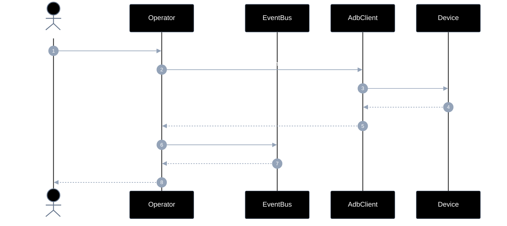
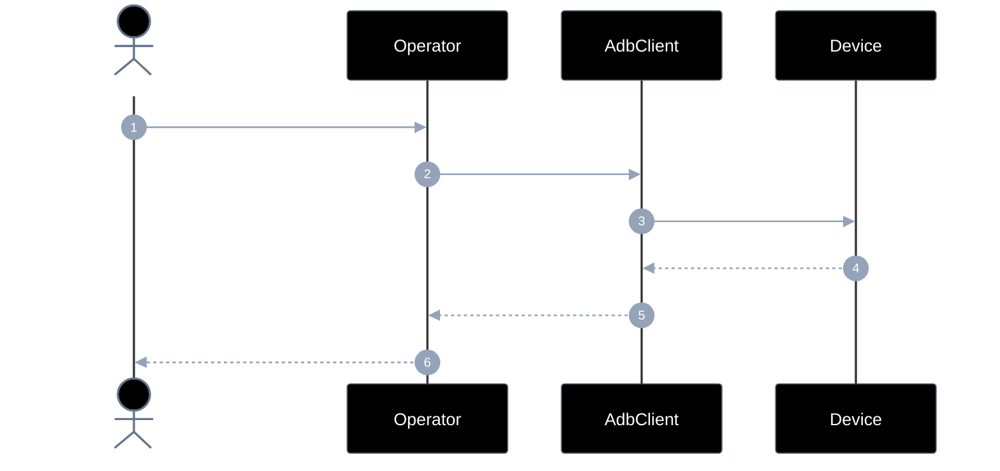
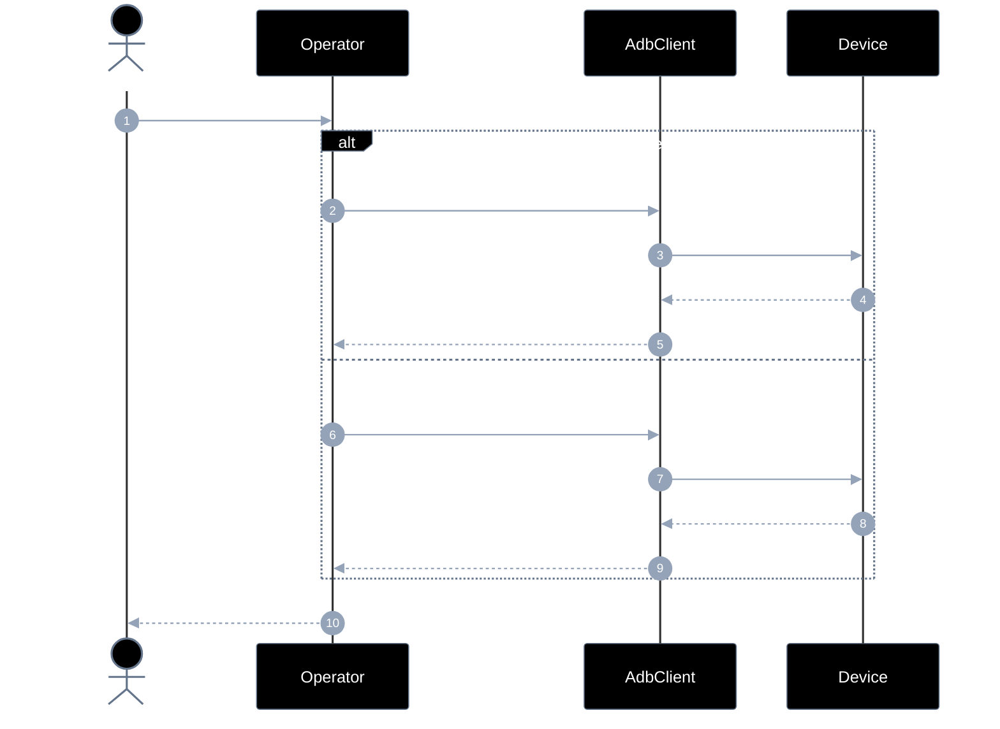
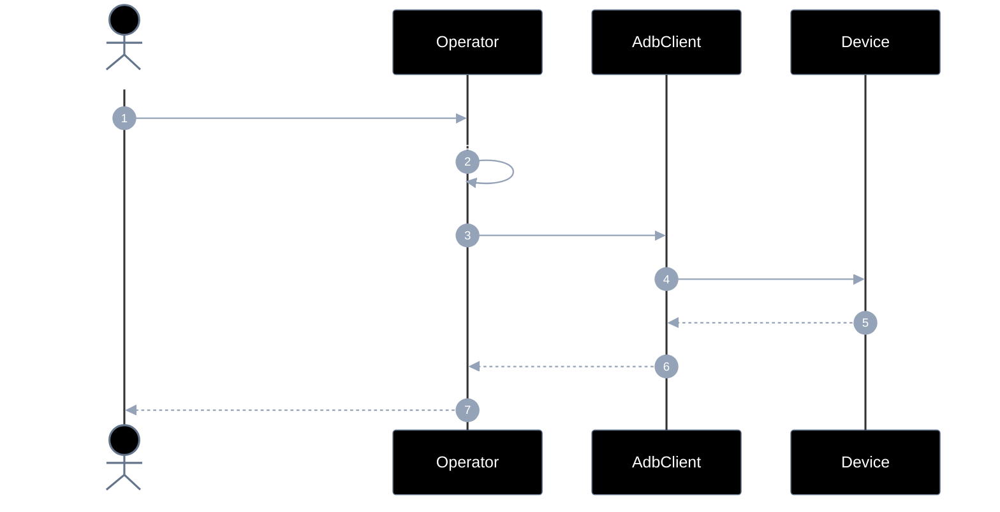
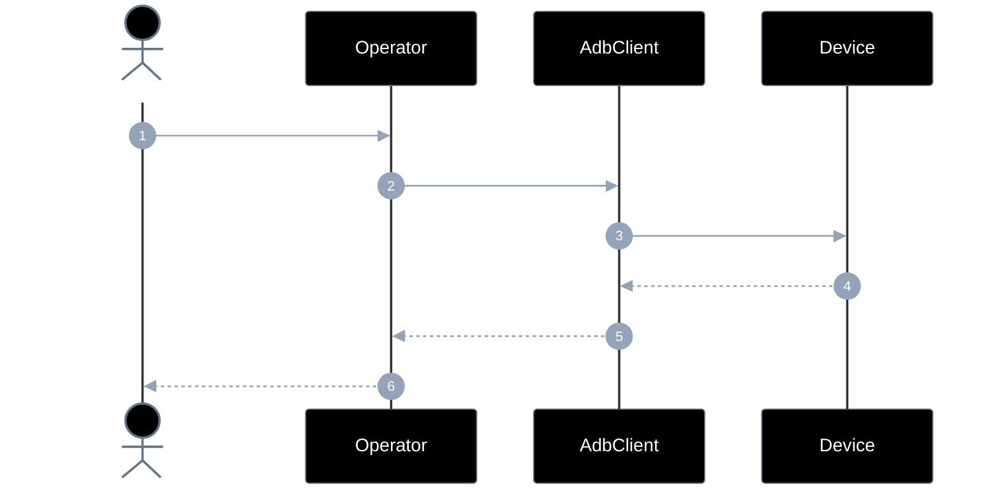
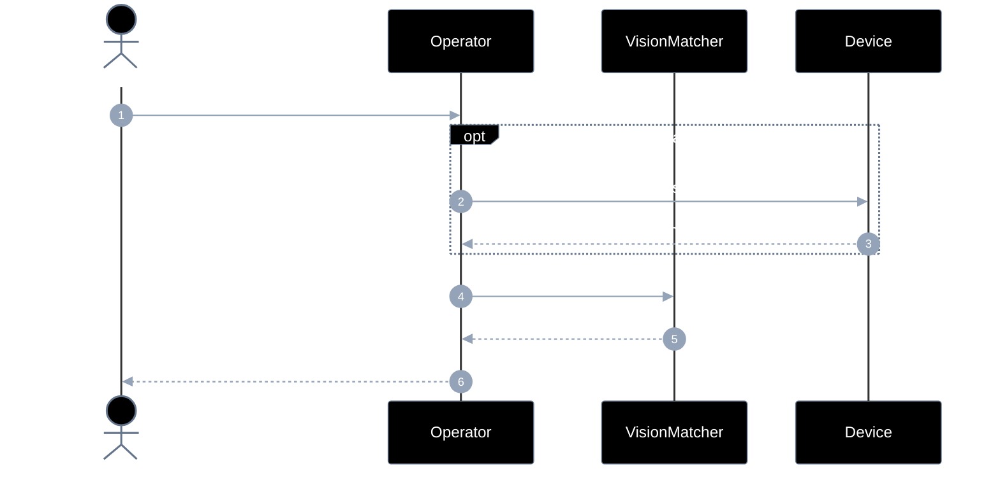
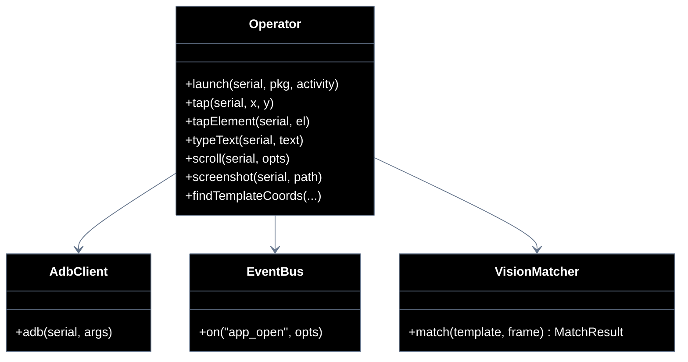

# Implementation plan — EP-04 Operar tela

**Por quê:** plano técnico do épico (sequências · agentes · passo a passo · contratos · classes · modelos · BDDs).  
**Épico:** [`2.epics.md`](../2.epics.md).  
**US:** [`1.stories.md`](../1.stories.md) · [`4.scenarios.md#ep-04--operar-tela`](../4.scenarios.md#ep-04--operar-tela) · [`5.bdds/EP-04-operar-tela.md`](../5.bdds/EP-04-operar-tela.md).
**Código:** [`../sources/android-control/lib/operate.js`](../sources/android-control/lib/operate.js) · [`events.js`](../sources/android-control/lib/events.js).

**Stack:** Node ≥ 18 · `adb` · runtime provisionado (EP-01).

---

## Escopo

| ID | Item |
|----|------|
| US-07 | Abrir aplicativo |
| US-08 | tap |
| US-09 | type |
| US-10 | scroll |
| US-11 | screenshot |
| US-12 | Resgatar coordenadas x,y a partir de uma imagem |
| SC-11..16 | Cenários correspondentes |

**Resultado:** gestos, captura e match visual sobre o device.

---

## Diagramas de sequência

### US-07 — Abrir aplicativo

#### Agentes

| Agente | Responsabilidade |
|--------|------------------|
| Caller | Pede abertura do package/activity no agent |
| Operator | Dispara o launch e confirma foreground via EventBus `on("app_open")` |
| EventBus | Responde a `on("app_open")` após o start |
| AdbClient | Envia `am start` / `monkey` ao device |
| Device | Inicia a activity e passa a exibir o app |



#### Passo a passo

| # | De | Para | Chamada | Descrição | Entradas | Execução | Saídas |
|---|----|------|---------|---------|----------|----------|--------|
| 1 | Dev | Operator | `launch(...)` | Abrir app | `serial`, `pkg` | Orquestra launch+wait | Promise |
| 2 | Operator | AdbClient | `am start` / `monkey` | Disparar activity | `pkg`/`activity` | Envia comando | pedido |
| 3 | AdbClient | Device | `launch` | Iniciar app | intent | AM/monkey | pedido |
| 4 | Device | AdbClient | `started` | App iniciando | — | Confirma start | `started` |
| 5 | AdbClient | Operator | `ok` | Comando ok | — | Propaga | `ok` |
| 6 | Operator | EventBus | `on("app_open", { serial, pkg })` | Confirmar foreground | `pkg` | Wait US-03 | pedido |
| 7 | EventBus | Operator | `foreground` | App na frente | — | Resolve wait | `foreground` |
| 8 | Operator | Dev | `ok` | Launch ok | — | Resolve | `ok` |

#### Contratos

Exemplos TypeScript das chamadas (# do passo a passo).

```ts
// Pré: device Booted; package instalado
// Erros: OP_LAUNCH_FAILED | EVENT_APP_TIMEOUT

// #1 Dev → Operator
declare function launch(
  serial: string,
  pkg: string,
  activity?: string,
): Promise<void>;

await launch(
  "127.0.0.1:5555",
  "com.linkedin.android",
  ".authenticator.LaunchActivity",
);

// #2–N AdbClient / monkey / am start + on("app_open")
declare function amStart(
  serial: string,
  component: string,
): Promise<void>;

await amStart(
  "127.0.0.1:5555",
  "com.linkedin.android/.authenticator.LaunchActivity",
);

declare function on(
  event: "app_open",
  opts: { serial: string; pkg: string },
): Promise<{ foreground: true; package: string }>;

await on("app_open", {
  serial: "127.0.0.1:5555",
  pkg: "com.linkedin.android",
});
```


### US-08 — tap

#### Agentes

| Agente | Responsabilidade |
|--------|------------------|
| Caller | Solicita toque por coordenadas ou por elemento |
| Operator | Resolve coords (diretas ou `center`) e envia o tap |
| AdbClient | Executa `input tap x y` no serial |
| Device | Injeta o evento de toque na UI |



#### Passo a passo

| # | De | Para | Chamada | Descrição | Entradas | Execução | Saídas |
|---|----|------|---------|---------|----------|----------|--------|
| 1 | Dev | Operator | `tap` / `tapElement` | Toque na UI | coords ou el | Resolve coords | Promise |
| 2 | Operator | AdbClient | `input tap` | Enviar toque | `x,y` | Comando input | pedido |
| 3 | AdbClient | Device | `tap` | Injetar evento | coords | `input tap` | pedido |
| 4 | Device | AdbClient | `done` | Toque aplicado | — | Confirma | `done` |
| 5 | AdbClient | Operator | `ok` | Tap ok | — | Propaga | `ok` |
| 6 | Operator | Dev | `ok` | Ação concluída | — | Resolve | `ok` |

#### Contratos

Exemplos TypeScript das chamadas (# do passo a passo).

```ts
// Pré: device Booted; UI alvo visível
// Erro: OP_TAP_INVALID_TARGET

type UiElement = {
  center?: { x: number; y: number };
  bounds?: { x1: number; y1: number; x2: number; y2: number };
};

// #1 Dev → Operator
declare function tap(serial: string, x: number, y: number): void;
declare function tapElement(serial: string, el: UiElement): void;

tap("127.0.0.1:5555", 540, 960);
tapElement("127.0.0.1:5555", { center: { x: 540, y: 960 } });

// AdbClient → Device
declare function adbInputTap(serial: string, x: number, y: number): void;
adbInputTap("127.0.0.1:5555", 540, 960);
```


### US-09 — type

#### Agentes

| Agente | Responsabilidade |
|--------|------------------|
| Caller | Envia o texto a digitar no campo focado |
| Operator | Escolhe `input text` (ASCII) ou ADBKeyBoard (unicode) e injeta |
| AdbClient | Encaminha comandos de input/broadcast IME ao device |
| Device | Aplica os caracteres no campo via input/IME |



#### Passo a passo

| # | De | Para | Chamada | Descrição | Entradas | Execução | Saídas |
|---|----|------|---------|---------|----------|----------|--------|
| 1 | Dev | Operator | `typeText(serial, text)` | Digitar texto | `serial`, `text` | Escolhe ASCII/unicode | Promise |
| 2 | Operator | AdbClient | `input text` | Caminho ASCII | texto escapado | alt ASCII | pedido |
| 3 | AdbClient | Device | `injetar` | Aplicar chars | payload | input/IME | pedido |
| 4 | Device | AdbClient | `done` | Texto aplicado | — | Confirma | `done` |
| 5 | AdbClient | Operator | `ok` | Type ok | — | Propaga | `ok` |
| 6 | Operator | AdbClient | `ADBKeyBoard + B64` | Caminho unicode | texto B64 | alt unicode | pedido |
| 7 | AdbClient | Device | `injetar` | Broadcast IME | payload | ADB_INPUT_B64 | pedido |
| 8 | Device | AdbClient | `done` | Texto aplicado | — | Confirma | `done` |
| 9 | AdbClient | Operator | `ok` | Type ok | — | Propaga | `ok` |
| 10 | Operator | Dev | `ok` | Concluído | — | Resolve | `ok` |

#### Contratos

Exemplos TypeScript das chamadas (# do passo a passo).

```ts
// Pré: campo focado ou IME pronto; ADBKeyBoard para unicode

// #1 Dev → Operator
declare function typeText(serial: string, text: string): void;

typeText("127.0.0.1:5555", "hello@example.com");

// AdbClient → Device (ASCII / IME)
declare function adbInputText(serial: string, escaped: string): void;
declare function adbBroadcastIme(serial: string, text: string): void;

adbInputText("127.0.0.1:5555", "hello@example.com");
adbBroadcastIme("127.0.0.1:5555", "olá");
```


### US-10 — scroll

#### Agentes

| Agente | Responsabilidade |
|--------|------------------|
| Caller | Pede scroll por direção (e opcionalmente distance/bounds) |
| Operator | Calcula o swipe (início→fim) e dispara o gesto |
| AdbClient | Executa `input swipe` no device |
| Device | Desloca o conteúdo scrollável conforme o gesto |



#### Passo a passo

| # | De | Para | Chamada | Descrição | Entradas | Execução | Saídas |
|---|----|------|---------|---------|----------|----------|--------|
| 1 | Dev | Operator | `scroll(...)` | Scroll da UI | direction, bounds? | Inicia gesto | Promise |
| 2 | Operator | Operator | `calc swipe` | Coords do gesto | direction/distance | Calcula x1,y1→x2,y2 | coords |
| 3 | Operator | AdbClient | `input swipe` | Enviar gesto | coords | Comando swipe | pedido |
| 4 | AdbClient | Device | `swipe` | Executar | gesto | `input swipe` | pedido |
| 5 | Device | AdbClient | `done` | Swipe ok | — | Confirma | `done` |
| 6 | AdbClient | Operator | `ok` | Scroll ok | — | Propaga | `ok` |
| 7 | Operator | Dev | `ok` | Concluído | — | Resolve | `ok` |

#### Contratos

Exemplos TypeScript das chamadas (# do passo a passo).

```ts
// Pré: device Booted; área scrollável
// Erro: OP_SCROLL_UNSUPPORTED

type ScrollOpts = {
  direction: "up" | "down" | "left" | "right";
  distance?: number;
  bounds?: { x1: number; y1: number; x2: number; y2: number };
};

// #1 Dev → Operator
declare function scroll(serial: string, opts: ScrollOpts): void;

scroll("127.0.0.1:5555", { direction: "down", distance: 800 });

// AdbClient → Device
declare function adbSwipe(
  serial: string,
  x1: number,
  y1: number,
  x2: number,
  y2: number,
  durationMs?: number,
): void;

adbSwipe("127.0.0.1:5555", 540, 1400, 540, 600, 300);
```


### US-11 — screenshot

#### Agentes

| Agente | Responsabilidade |
|--------|------------------|
| Caller | Pede captura da tela em um path de saída |
| Operator | Orquestra screencap + pull e devolve o path absoluto |
| AdbClient | Roda screencap no device e puxa o arquivo para o host |
| Device | Gera a imagem do framebuffer |



#### Passo a passo

| # | De | Para | Chamada | Descrição | Entradas | Execução | Saídas |
|---|----|------|---------|---------|----------|----------|--------|
| 1 | Dev | Operator | `screenshot(serial, path)` | Capturar tela | `serial`, `path` | Orquestra capturar+pull | Promise |
| 2 | Operator | AdbClient | `screencap + pull` | Obter imagem | `path` | Dois passos adb | pedido |
| 3 | AdbClient | Device | `capturar` | Framebuffer | — | `screencap -p` | pedido |
| 4 | Device | AdbClient | `png` | Bytes da imagem | — | Arquivo remoto | png |
| 5 | AdbClient | Operator | `arquivo local` | Pull ok | — | Arquivo no host | path |
| 6 | Operator | Dev | `absPath` | Path final | — | Resolve | absPath |

#### Contratos

Exemplos TypeScript das chamadas (# do passo a passo).

```ts
// Pré: device Booted

// #1 Dev → Operator
declare function screenshot(serial: string, path: string): string;

const absPath = screenshot(
  "127.0.0.1:5555",
  "artifacts/screen.png",
);
// → "/Users/.../artifacts/screen.png"

// AdbClient → Device
declare function screencapPull(
  serial: string,
  remotePath: string,
  localPath: string,
): string;

screencapPull(
  "127.0.0.1:5555",
  "/sdcard/screen.png",
  absPath,
);
```


### US-12 — Coordenadas por template

#### Agentes

| Agente | Responsabilidade |
|--------|------------------|
| Caller | Pede as coordenadas do template na tela/frame |
| Operator | Garante um frame (screenshot se preciso) e chama o matcher |
| VisionMatcher | Faz template matching e devolve `x,y,confidence` |
| Device | Fonte do frame quando a captura ainda não existe no host |



#### Passo a passo

| # | De | Para | Chamada | Descrição | Entradas | Execução | Saídas |
|---|----|------|---------|---------|----------|----------|--------|
| 1 | Dev | Operator | `findTemplateCoords(...)` | Achar template | frame/serial + template | Inicia match | Promise |
| 2 | Operator | Device | `screenshot` | Obter frame se falta | `serial` | opt captura | pedido |
| 3 | Device | Operator | `frame` | Frame pronto | — | Retorna imagem | frame |
| 4 | Operator | VisionMatcher | `match(...)` | Localizar template | template + frame | Template matching | pedido |
| 5 | VisionMatcher | Operator | `x,y,confidence` | Melhor match | — | Retorna | MatchResult |
| 6 | Operator | Dev | `{ x, y, confidence }` | Coords | — | Resolve | resultado |

#### Contratos

Exemplos TypeScript das chamadas (# do passo a passo).

```ts
// Pré: screenshot disponível ou capturável
// Erros: OP_MATCH_LOW_CONFIDENCE | template não encontrado

type MatchResult = {
  x: number;
  y: number;
  confidence: number;
};

// #1 Dev → Operator / Matcher
declare function findTemplateCoords(
  frame: string, // serial ou path do frame
  templatePath: string,
  minConfidence?: number,
): MatchResult;

const match = findTemplateCoords(
  "artifacts/screen.png",
  "templates/login-button.png",
  0.85,
);
// → { x: 540, y: 1200, confidence: 0.92 }
```


---

## Modelos

### TapTarget / ScrollOpts / MatchResult

| Modelo | Campos |
|--------|--------|
| `TapTarget` | `x,y` ou `bounds` / `center` |
| `ScrollOpts` | `direction`, `distance?`, `bounds?` |
| `MatchResult` | `x`, `y`, `confidence` |

### Erros

| Código | US |
|--------|-----|
| `OP_LAUNCH_FAILED` | US-07 |
| `OP_SCROLL_UNSUPPORTED` | US-10 (hoje) |
| `OP_MATCH_LOW_CONFIDENCE` | US-12 |

---

## Diagrama de classes



**Hoje / gap:** ver mapeamento abaixo.

---

## Cenários BDD

Fonte: `US-07`..`US-12` / `5.bdds/EP-04-operar-tela.md`.

```gherkin
Cenário: US-07 App fica em foreground no agent
  Dado package (e activity opcional)
  Quando o launch do app é executado no agent
  Então a app está em foreground
```

```gherkin
Cenário: US-08 UI reflete o toque
  Dado coordenadas x,y ou bounds
  Quando o toque na tela é executado
  Então a UI reflete o tap
```

```gherkin
Cenário: US-09 Texto aparece na UI
  Dado um texto e campo focado ou coords
  Quando digitar / injetar texto é executado
  Então o texto aparece na UI
```

```gherkin
Cenário: US-10 Conteúdo da tela ou lista é rolado
  Dado direção, distância ou bounds
  Quando swipe / scroll é executado
  Então o conteúdo rolou
```

```gherkin
Cenário: US-11 Frame da tela é capturado
  Dado serial e path de saída
  Quando o frame da tela é capturado
  Então o arquivo de imagem existe
```

```gherkin
Cenário: US-12 Coordenadas do alvo são devolvidas
  Dado template e frame/tela atual
  Quando o match por visão/template é executado
  Então coordenadas x,y e confiança são devolvidas
```

---

## Plano de implementação (gaps → entregas)

| # | Entrega | US | Critério |
|---|---------|-----|----------|
| I1 | `launch` + `on("app_open")` | US-07 | SC-11 |
| I2 | `scroll` / swipe API + CLI | US-10 | SC-14 |
| I3 | `VisionMatcher` + `findTemplateCoords` | US-12 | SC-16 |
| I4 | Pós-condição opcional (dump change) em tap/type | US-08/09 | Aceite UI |

### Ordem

```text
I1 → I2 → I3 → I4
```

---

## Mapeamento código atual

| Peça | Status |
|------|--------|
| launch, tap, type, screenshot | Existe |
| scroll | **Gap** |
| template match | **Gap** |

---

## Critério de pronto (épico)

1. Seis APIs US-07..12  
2. BDDs SC-11..16  
3. CLI cobre gestos principais  

## Próximos passos

→ Implementar gaps em [`sources/android-control`](../sources/android-control/README.md)  
→ Aceite: BDDs em [`5.bdds/EP-04-operar-tela.md`](../5.bdds/EP-04-operar-tela.md)
