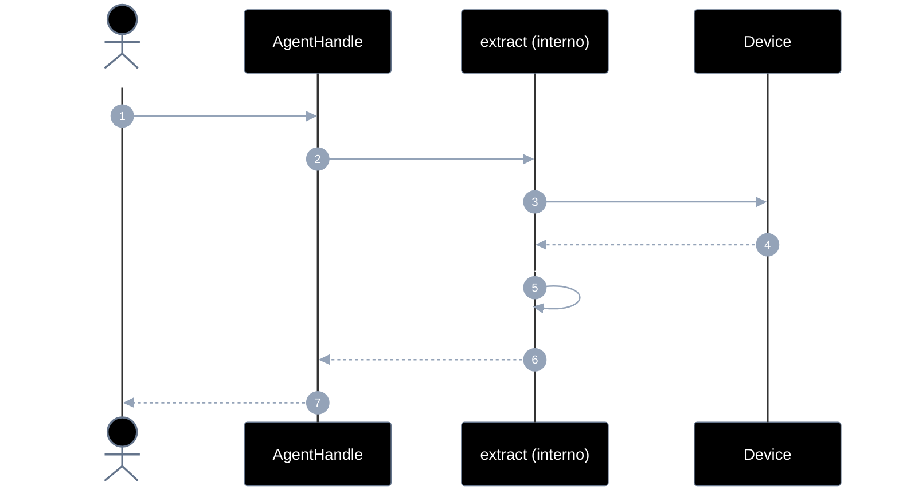
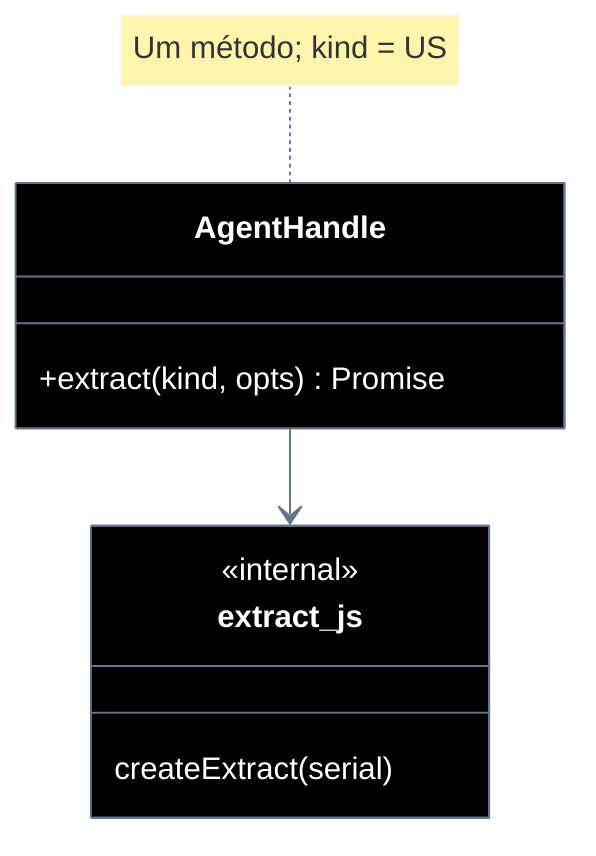

# Implementation plan — EP-05 Extrair elementos

**Por quê:** plano técnico do épico (sequências · agentes · passo a passo · contratos · classes · modelos · BDDs).  
**Épico:** [`2.epics.md`](../2.epics.md).  
**US:** [`1.stories.md`](../1.stories.md) · [`4.scenarios.md#ep-05--extrair-elementos`](../4.scenarios.md#ep-05--extrair-elementos) · [`5.bdds.md#ep-05--extrair-elementos`](../5.bdds.md#ep-05--extrair-elementos).  
**Handle:** `extract` é método do [`AgentHandle`](EP-01-provisionar-agente.md) — **não** é função solta com `serial`.  
**Pré-requisito:** [`EP-01`](EP-01-provisionar-agente.md) · handle.  
**Implementação interna:** [`../sources/android-control/lib/extract.js`](../sources/android-control/lib/extract.js) (anexado ao handle em `provision.js`).

**Stack:** Node ≥ 18 · JavaScript · `adb` · runtime provisionado.

---

## Escopo

| ID | Item |
|----|------|
| US-13 | Extrair árvore DOM com textos |
| US-14 | Extrair ícones |
| US-15 | Extrair listas |
| US-16 | Extrair imagens |
| SC-17..21 | Cenários correspondentes |

**Resultado:** árvore tipada via `handle.extract(kind, opts?)`.

---

## Fluxo (obrigatório)

1. **Provisionar** → handle.  
2. **Extrair** → `handle.extract(kind, opts?)` (serial do handle).

```js
const handle = await provisionEmulator(cfg);

const texts = await handle.extract("texts");       // SC-17 / fase 1
const tree = await handle.extract("tree");         // SC-18 árvore completa
const icons = await handle.extract("icons");       // SC-19
const lists = await handle.extract("lists");       // SC-20
const images = await handle.extract("images");     // SC-21
```

Mesmo padrão de `handle.on`: **um método**, `kind` discrimina a US.

| Superfície | O quê |
|------------|--------|
| **Público** | `handle.extract(kind, opts?)` |
| **Privado** | dumpUiXml · parse textos/ícones/listas/imagens · compor árvore |

`kind`: `"texts"` \| `"tree"` \| `"icons"` \| `"lists"` \| `"images"`.

---

## Diagramas de sequência

### Visão geral



### Por US

| US | SC | Chamada | Saída |
|----|-----|---------|--------|
| US-13 | SC-17 | `extract("texts")` | árvore com textos (fase 1) |
| US-13 | SC-18 | `extract("tree")` | árvore completa |
| US-14 | SC-19 | `extract("icons")` | nós ícone |
| US-15 | SC-20 | `extract("lists")` | nós lista |
| US-16 | SC-21 | `extract("images")` | nós imagem |

#### Contratos

```ts
type ExtractKind = "texts" | "tree" | "icons" | "lists" | "images";

type UiNode = {
  type: "text" | "icon" | "list" | "image" | "other";
  text?: string;
  bounds?: { x: number; y: number; w: number; h: number };
  children?: UiNode[];
};

type AgentHandle = {
  // … EP-01..04 …
  extract(kind: ExtractKind, opts?: Record<string, unknown>): Promise<{
    elements?: UiNode[];
    tree?: UiNode;
  }>;
};

const { tree } = await handle.extract("tree");
```

---

## Modelos / Erros

| Código | Quando |
|--------|--------|
| `EXTRACT_DUMP_FAILED` | dump indisponível |
| `EXTRACT_UNKNOWN_KIND` | kind inválido |

---

## Diagrama de classes



---

## Cenários BDD

Fonte: [`5.bdds.md#ep-05--extrair-elementos`](../5.bdds.md#ep-05--extrair-elementos).

---

## Plano de implementação (gaps → entregas)

| # | Entrega | SC | Critério |
|---|---------|-----|----------|
| I1 | `createExtract(serial)` + `handle.extract` | — | API no handle |
| I2 | `extract("texts")` | SC-17 | Fase 1 |
| I3 | `extract("tree")` | SC-18 | Completa |
| I4 | `extract("icons"\|"lists"\|"images")` | SC-19..21 | Tipos |
| I5 | Piloto usa `handle.extract` | — | linkedin-login |

### Ordem

```text
I1 → I2 → I3 → I4 → I5
```

---

## Mapeamento código atual

| Peça | Status |
|------|--------|
| `extractElements(serial)` solto | Existe — **envolver** em `handle.extract` |
| Árvore tipada icons/lists/images | **Parcial / gap** |

---

## Critério de pronto (épico)

1. Só `handle.extract(kind)` na superfície  
2. SC-17..21 encapsulados  
3. BDDs US-13..16  

## Próximos passos

→ Implementar I1–I5 em [`sources/android-control`](../sources/android-control/README.md)  
→ Aceite: [`5.bdds.md#ep-05--extrair-elementos`](../5.bdds.md#ep-05--extrair-elementos)
