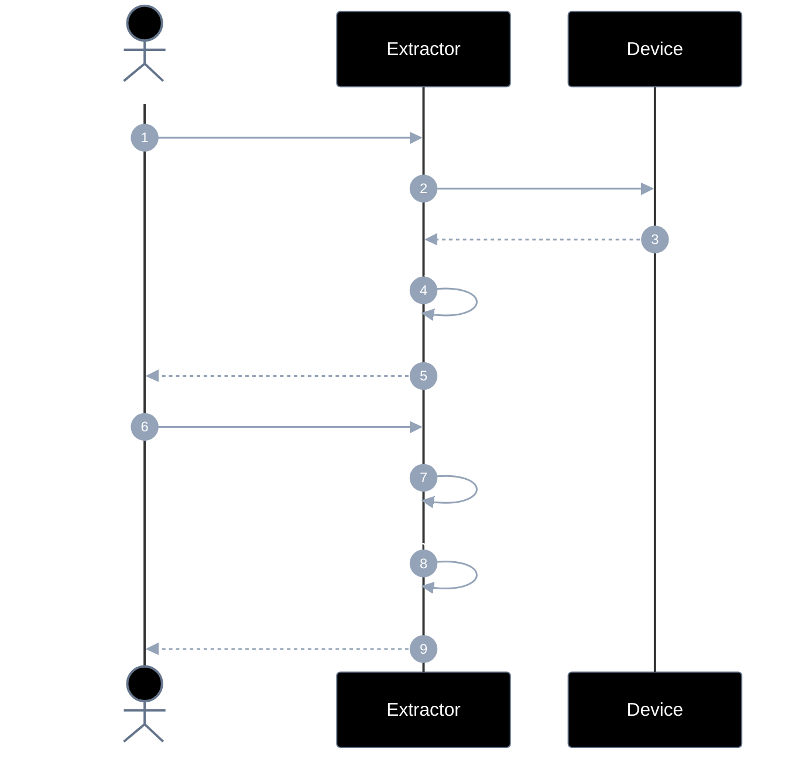
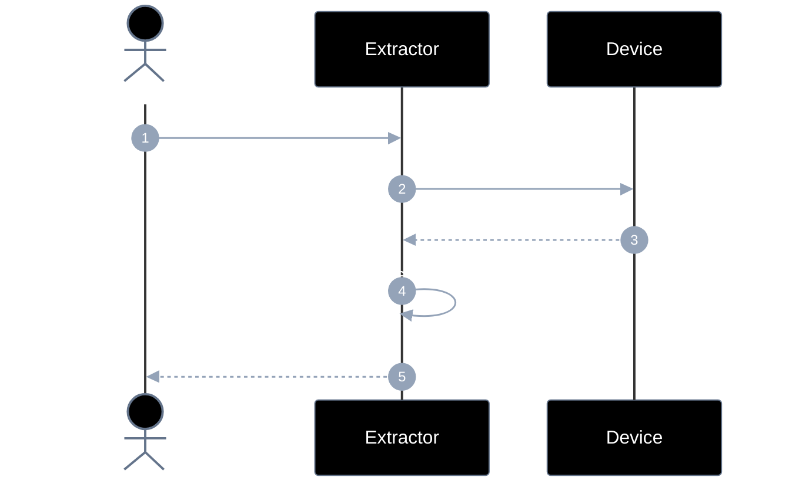
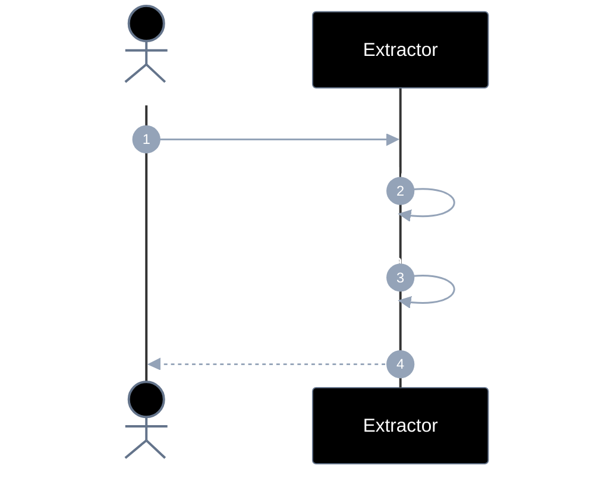
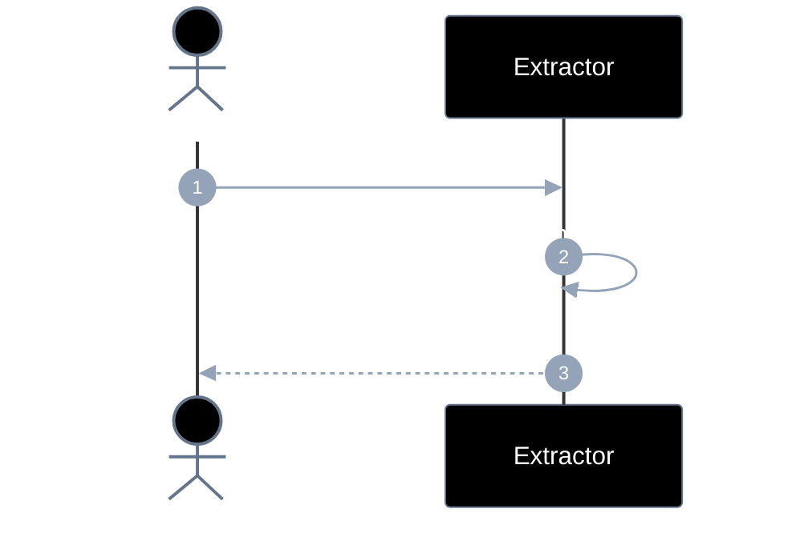
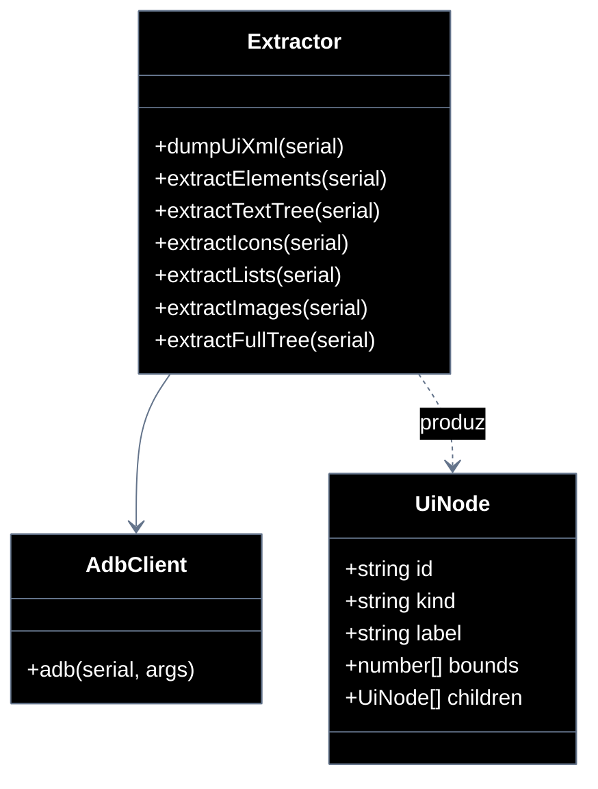

# Implementation plan — EP-05 Extrair elementos

**Por quê:** plano técnico do épico (sequências · agentes · passo a passo · contratos · classes · modelos · BDDs).  
**Épico:** [`2.epics.md`](../2.epics.md).  
**US:** [`1.stories.md`](../1.stories.md) · [`4.scenarios.md#ep-05--extrair-elementos`](../4.scenarios.md#ep-05--extrair-elementos) · [`5.bdds/EP-05-extrair-elementos.md`](../5.bdds/EP-05-extrair-elementos.md).
**Código:** [`../sources/android-control/lib/extract.js`](../sources/android-control/lib/extract.js).

**Stack:** Node ≥ 18 · `adb` · runtime provisionado (EP-01).

---

## Escopo

| ID | Item |
|----|------|
| US-13 | Extrair árvore DOM com textos |
| US-14 | Extrair ícones |
| US-15 | Extrair listas |
| US-16 | Extrair imagens |
| SC-17..21 | Cenários correspondentes |

**Resultado:** árvore de componentes tipada (textos → completa).

---

## Diagramas de sequência

### US-13 — Árvore DOM (duas fases)

#### Agentes

| Agente | Responsabilidade |
|--------|------------------|
| Caller | Pede árvore fase 1 (textos) e depois a árvore completa tipada |
| Extractor | Faz dump, parseia textos e compõe icons/lists/images na fase 2 |
| Device | Fornece o dump uiautomator (e evidência visual se necessário) |



#### Passo a passo

| # | De | Para | Chamada | Descrição | Entradas | Execução | Saídas |
|---|----|------|---------|---------|----------|----------|--------|
| 1 | Dev | Extractor | `extractTextTree(serial)` | Fase 1 textos | `serial` | Dump + parse text | Promise |
| 2 | Extractor | Device | `uiautomator dump` | Obter XML | — | Dump + pull | pedido |
| 3 | Device | Extractor | `xml` | Hierarquia | — | Retorna | xml |
| 4 | Extractor | Extractor | `parse → árvore textos` | Montar tree | xml | Parser text nodes | tree |
| 5 | Extractor | Dev | `tree fase 1` | Entrega rápida | — | Resolve | `{ tree, xml }` |
| 6 | Dev | Extractor | `extractFullTree(...)` | Fase 2 completa | serial/tree | Orquestra extractors | Promise |
| 7 | Extractor | Extractor | `icons+lists+images` | Kinds extras | tree/xml | Chama US-14..16 | subárvores |
| 8 | Extractor | Extractor | `compor hierarquia` | Árvore única | subárvores | Merge | tree |
| 9 | Extractor | Dev | `tree completa` | DOM final | — | Resolve | `{ tree }` |

#### Contratos

Exemplos TypeScript das chamadas (# do passo a passo).

```ts
// Pré: device Booted; UI dumpável
// Erros: EXTRACT_DUMP_FAILED | EXTRACT_EMPTY_TREE

type TreeNode = {
  kind: "text" | "icon" | "list" | "image" | "node";
  text?: string;
  bounds?: { x1: number; y1: number; x2: number; y2: number };
  children?: TreeNode[];
  [k: string]: unknown;
};

// #1 Dev → Extractor
declare function extractTextTree(
  serial: string,
): Promise<{ tree: TreeNode; xml: string }>;

declare function extractFullTree(
  input: string | TreeNode,
): Promise<{ tree: TreeNode }>;

const phase1 = await extractTextTree("127.0.0.1:5555");
// phase1.tree.kind === "text" (nós com texto)

const full = await extractFullTree(phase1.tree);
```


### US-14 — Extrair ícones

#### Agentes

| Agente | Responsabilidade |
|--------|------------------|
| Caller | Solicita nodes tipados como ícone |
| Extractor | Obtém dump/frame e filtra ImageView/nodes de ícone com bounds |
| Device | Fonte do dump/frame usados na detecção |



#### Passo a passo

| # | De | Para | Chamada | Descrição | Entradas | Execução | Saídas |
|---|----|------|---------|---------|----------|----------|--------|
| 1 | Dev | Extractor | `extractIcons(...)` | Tipar ícones | serial/tree | Prepara dump | Promise |
| 2 | Extractor | Device | `dump / frame` | Evidência UI | `serial` | Obtém dump/frame | pedido |
| 3 | Device | Extractor | `xml/frame` | Dados | — | Retorna | evidência |
| 4 | Extractor | Extractor | `filtrar icons` | Marcar kind=icon | xml/tree | Heurísticas | nodes |
| 5 | Extractor | Dev | `tree kind=icon` | Ícones | — | Resolve | `{ tree }` |

#### Contratos

Exemplos TypeScript das chamadas (# do passo a passo).

```ts
// Pré: dump disponível
// Erro: EXTRACT_DUMP_FAILED

type TreeNode = {
  kind: "icon" | string;
  bounds?: { x1: number; y1: number; x2: number; y2: number };
  children?: TreeNode[];
  [k: string]: unknown;
};

// #1 Dev → Extractor
declare function extractIcons(
  input: string | TreeNode,
): Promise<{ tree: TreeNode }>;

const { tree } = await extractIcons("127.0.0.1:5555");
// tree inclui nodes kind === "icon"
```


### US-15 — Extrair listas

#### Agentes

| Agente | Responsabilidade |
|--------|------------------|
| Caller | Solicita listas e seus items na árvore |
| Extractor | Detecta containers de lista e agrupa filhos como items (`kind=list`) |



#### Passo a passo

| # | De | Para | Chamada | Descrição | Entradas | Execução | Saídas |
|---|----|------|---------|---------|----------|----------|--------|
| 1 | Dev | Extractor | `extractLists(...)` | Tipar listas | serial/tree | Detecta containers | Promise |
| 2 | Extractor | Extractor | `detectar ListView/...` | Achar listas | xml/tree | Heurísticas | candidatos |
| 3 | Extractor | Extractor | `agrupar items` | Filhos como items | containers | Agrupa | list+items |
| 4 | Extractor | Dev | `tree kind=list` | Listas | — | Resolve | `{ tree }` |

#### Contratos

Exemplos TypeScript das chamadas (# do passo a passo).

```ts
// Pré: dump disponível
// Erro: EXTRACT_DUMP_FAILED

type TreeNode = {
  kind: "list" | string;
  children?: TreeNode[];
  [k: string]: unknown;
};

// #1 Dev → Extractor
declare function extractLists(
  input: string | TreeNode,
): Promise<{ tree: TreeNode }>;

const { tree } = await extractLists("127.0.0.1:5555");
// tree inclui kind === "list" com items filhos
```


### US-16 — Extrair imagens

#### Agentes

| Agente | Responsabilidade |
|--------|------------------|
| Caller | Solicita nodes tipados como imagem |
| Extractor | Identifica nodes de imagem/foto, anexa bounds e marca `kind=image` |



#### Passo a passo

| # | De | Para | Chamada | Descrição | Entradas | Execução | Saídas |
|---|----|------|---------|---------|----------|----------|--------|
| 1 | Dev | Extractor | `extractImages(...)` | Tipar imagens | serial/tree | Filtra nodes | Promise |
| 2 | Extractor | Extractor | `nodes imagem + bounds` | kind=image | xml/tree | Heurísticas | nodes |
| 3 | Extractor | Dev | `tree kind=image` | Imagens | — | Resolve | `{ tree }` |

#### Contratos

Exemplos TypeScript das chamadas (# do passo a passo).

```ts
// Pré: dump disponível
// Erro: EXTRACT_DUMP_FAILED

type TreeNode = {
  kind: "image" | string;
  bounds?: { x1: number; y1: number; x2: number; y2: number };
  children?: TreeNode[];
  [k: string]: unknown;
};

// #1 Dev → Extractor
declare function extractImages(
  input: string | TreeNode,
): Promise<{ tree: TreeNode }>;

const { tree } = await extractImages("127.0.0.1:5555");
// tree inclui kind === "image" + bounds
```


---

## Modelos

### UiNode / ComponentTree

| Campo | Tipo | Descrição |
|-------|------|-----------|
| `id` | `string` | id estável na árvore |
| `kind` | `text\|icon\|list\|image\|node\|…` | Tipo |
| `label` / `text` | `string` | Conteúdo |
| `bounds` / `center` | `number[]` | Geometria |
| `children` | `UiNode[]` | Hierarquia |

### Erros

| Código | Quando |
|--------|--------|
| `EXTRACT_DUMP_FAILED` | Dump indisponível |
| `EXTRACT_EMPTY_TREE` | Sem nodes úteis |

---

## Diagrama de classes



**Hoje / gap:** ver mapeamento abaixo.

---

## Cenários BDD

Fonte: `US-13`..`US-16` / `5.bdds/EP-05-extrair-elementos.md`.

```gherkin
Cenário: US-13 Árvore de componentes é composta em duas fases
  Dado uma imagem da tela ou dump
  Quando primeiro os textos são extraídos e montados na árvore
  E em seguida o restante é extraído e a hierarquia é completa
  Então a árvore de componentes completa é devolvida
```

```gherkin
Cenário: US-14 Árvore de componentes com ícones
  Dado uma imagem da tela ou dump
  Quando o reconhecimento de ícones monta a árvore
  Então a árvore de componentes contendo os ícones é devolvida
```

```gherkin
Cenário: US-15 Árvore de componentes com listas
  Dado uma imagem da tela ou dump
  Quando o reconhecimento de listas monta a árvore
  Então a árvore de componentes contendo as listas é devolvida
```

```gherkin
Cenário: US-16 Árvore de componentes com imagens
  Dado uma imagem da tela ou dump
  Quando o reconhecimento de imagens/fotos monta a árvore
  Então a árvore de componentes contendo as imagens é devolvida
```

---

## Plano de implementação (gaps → entregas)

| # | Entrega | US | Critério |
|---|---------|-----|----------|
| I1 | `extractTextTree` hierárquico | US-13 / SC-17 | Árvore textos |
| I2 | `extractFullTree` composição | US-13 / SC-18 | Árvore completa |
| I3 | `extractIcons` tipado | US-14 | kind=icon |
| I4 | `extractLists` tipado | US-15 | kind=list |
| I5 | `extractImages` tipado | US-16 | kind=image |

### Ordem

```text
I1 → I3/I4/I5 → I2
```

---

## Mapeamento código atual

| Peça | Status |
|------|--------|
| `dumpUiXml` / `extractElements` flat | Existe |
| Árvore hierárquica + kinds tipados | **Gap** |

---

## Critério de pronto (épico)

1. APIs US-13..16  
2. BDDs SC-17..21  
3. Tree consumível por operate/tapElement  

## Próximos passos

→ Implementar gaps em [`sources/android-control`](../sources/android-control/README.md)  
→ Aceite: BDDs em [`5.bdds/EP-05-extrair-elementos.md`](../5.bdds/EP-05-extrair-elementos.md)
