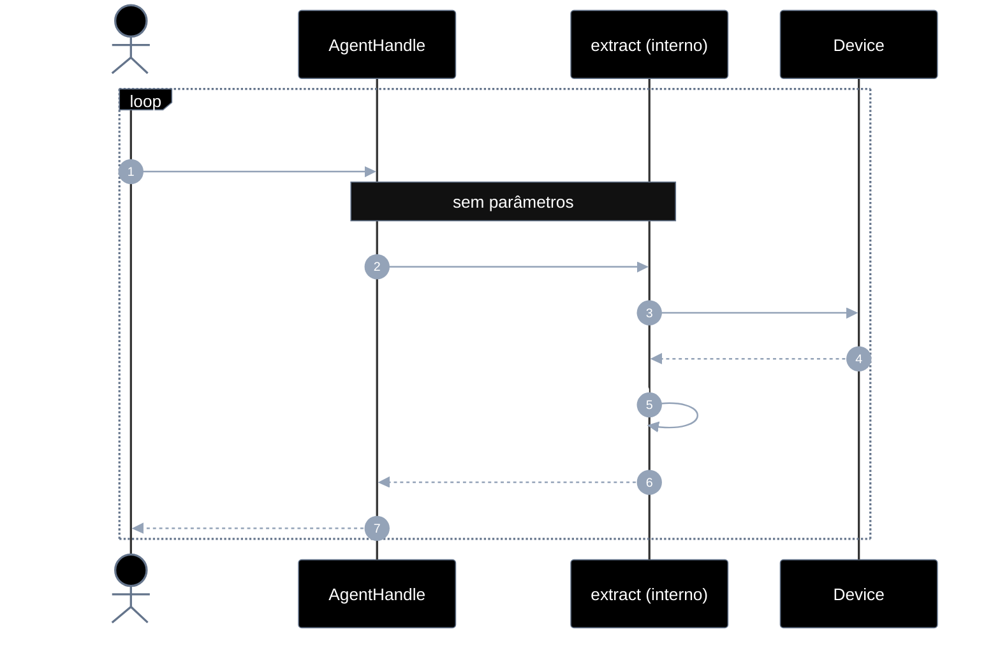
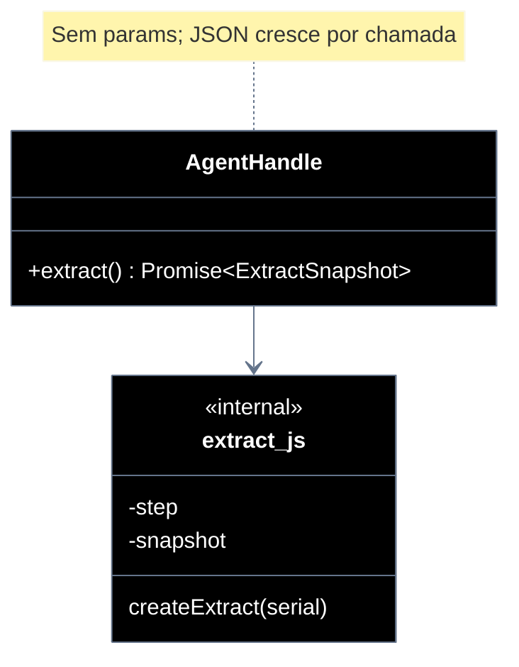

# Implementation plan — EP-05 Extrair elementos

**Por quê:** plano técnico do épico (sequências · agentes · passo a passo · contratos · classes · modelos · BDDs).  
**Épico:** [`2.epics.md`](../2.epics.md).  
**US:** [`1.stories.md`](../1.stories.md) · [`4.scenarios.md#ep-05--extrair-elementos`](../4.scenarios.md#ep-05--extrair-elementos) · [`5.bdds.md#ep-05--extrair-elementos`](../5.bdds.md#ep-05--extrair-elementos).  
**Handle:** `extract` é método do [`AgentHandle`](EP-01-provisionar-agente.md) — **não** é função solta com `serial`.  
**Pré-requisito:** [`EP-01`](EP-01-provisionar-agente.md) · handle.  
**Implementação interna:** [`../sources/android-control/lib/extract.js`](../sources/android-control/lib/extract.js) (anexado ao handle em `provision.js`).

**Stack:** Node ≥ 18 · JavaScript · `adb` · runtime provisionado.

---

## Escopo

| ID | Item |
|----|------|
| US-13 | Extrair árvore DOM com textos |
| US-14 | Extrair ícones |
| US-15 | Extrair listas |
| US-16 | Extrair imagens |
| SC-17..21 | Cenários correspondentes |

**Resultado:** JSON acumulado via `handle.extract()` — **um método, sem parâmetros**; cada chamada (por estória/SC) **incrementa** campos no retorno.

---

## Fluxo (obrigatório)

1. **Provisionar** → handle.  
2. **Extrair** → `handle.extract()` repetidas vezes; o que muda é o **JSON de retorno** (estado interno avança).

```js
const handle = await provisionEmulator(cfg);

const r1 = await handle.extract();
// → { texts: [ … ] }                          // SC-17 / US-13 fase 1

const r2 = await handle.extract();
// → { texts, tree: { … } }                     // SC-18 / US-13 árvore completa

const r3 = await handle.extract();
// → { texts, tree, icons: [ … ] }              // SC-19 / US-14

const r4 = await handle.extract();
// → { texts, tree, icons, lists: [ … ] }       // SC-20 / US-15

const r5 = await handle.extract();
// → { texts, tree, icons, lists, images: [ … ] } // SC-21 / US-16
```

**Regra:** assinatura sempre `extract()` — sem `kind`, sem opts que discrimine estória. A lib guarda o passo interno; cada chamada acrescenta a próxima fatia no mesmo formato JSON.

| Superfície | O quê |
|------------|--------|
| **Público** | `handle.extract() → Promise<ExtractSnapshot>` |
| **Privado** | passo atual · dump · parse · merge no snapshot |

---

## Diagramas de sequência

### Visão geral



### Por US — mesma chamada, retorno que cresce

| Ordem | US | SC | Chamada | Campos **novos** no JSON |
|-------|----|-----|---------|---------------------------|
| 1 | US-13 | SC-17 | `extract()` | `texts` |
| 2 | US-13 | SC-18 | `extract()` | `tree` (completa; textos já presentes) |
| 3 | US-14 | SC-19 | `extract()` | `icons` |
| 4 | US-15 | SC-20 | `extract()` | `lists` |
| 5 | US-16 | SC-21 | `extract()` | `images` |

Caller captura o que precisa no JSON de cada retorno (`r.texts`, `r.tree`, `r.icons`, …).

#### Contratos

```ts
type UiNode = {
  type: "text" | "icon" | "list" | "image" | "other";
  text?: string;
  bounds?: { x: number; y: number; w: number; h: number };
  children?: UiNode[];
};

/** Snapshot acumulado — campos aparecem conforme as chamadas avançam. */
type ExtractSnapshot = {
  texts?: UiNode[];
  tree?: UiNode;
  icons?: UiNode[];
  lists?: UiNode[];
  images?: UiNode[];
  step: number; // 1..5 (interno / debug)
};

type AgentHandle = {
  // … EP-01..04 …
  /** Sem parâmetros. Cada chamada incrementa o JSON. */
  extract(): Promise<ExtractSnapshot>;
};

const r1 = await handle.extract(); // { step: 1, texts }
const r2 = await handle.extract(); // { step: 2, texts, tree }
const r3 = await handle.extract(); // { step: 3, texts, tree, icons }
```

**Interno:** cursor de passo no handle; após o passo 5, nova chamada pode resetar ou idempotente (devolver snapshot completo) — documentar na implementação.

---

## Modelos / Erros

| Código | Quando |
|--------|--------|
| `EXTRACT_DUMP_FAILED` | dump indisponível |
| `EXTRACT_STEP_FAILED` | falha ao incrementar o passo atual |

---

## Diagrama de classes



---

## Cenários BDD

Fonte: [`5.bdds.md#ep-05--extrair-elementos`](../5.bdds.md#ep-05--extrair-elementos).  
“Quando…” = `handle.extract()`; “Então…” = campo correspondente presente no JSON.

---

## Plano de implementação (gaps → entregas)

| # | Entrega | SC | Critério |
|---|---------|-----|----------|
| I1 | `createExtract` + `handle.extract()` sem args | — | Assinatura única |
| I2 | Passo 1 → `texts` | SC-17 | JSON com `texts` |
| I3 | Passo 2 → + `tree` | SC-18 | Snapshot acumula |
| I4 | Passos 3–5 → + `icons` / `lists` / `images` | SC-19..21 | Campos incrementais |
| I5 | Piloto usa `extract()` em sequência | — | linkedin-login |

### Ordem

```text
I1 → I2 → I3 → I4 → I5
```

---

## Mapeamento código atual

| Peça | Status |
|------|--------|
| `extractElements(serial)` solto | Existe — **envolver** em `extract()` com cursor |
| Snapshot acumulado por passos | **Gap** |

---

## Critério de pronto (épico)

1. Só `handle.extract()` — sem parâmetros discriminadores  
2. Cada chamada de estória incrementa o JSON de retorno  
3. BDDs US-13..16  

## Próximos passos

→ Implementar I1–I5 em [`sources/android-control`](../sources/android-control/README.md)  
→ Aceite: [`5.bdds.md#ep-05--extrair-elementos`](../5.bdds.md#ep-05--extrair-elementos)
