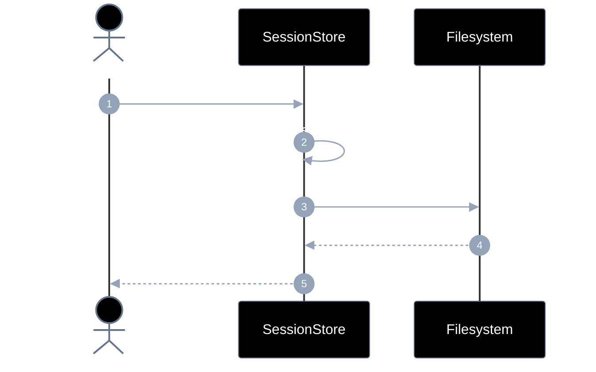
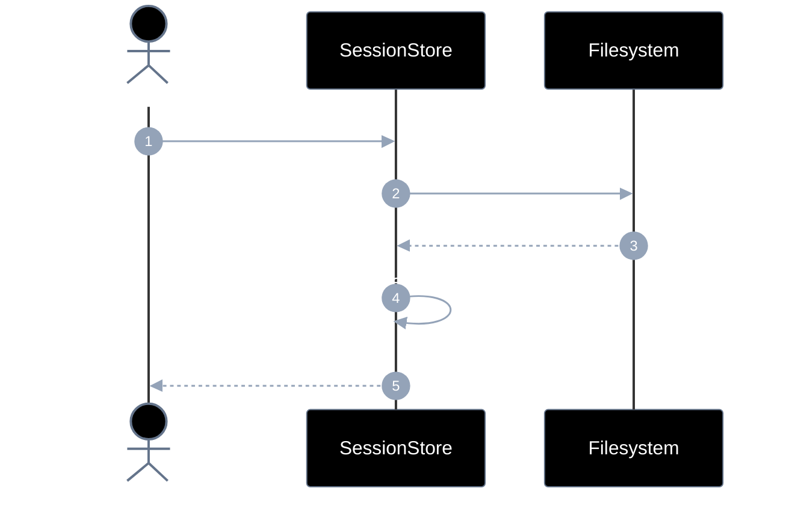
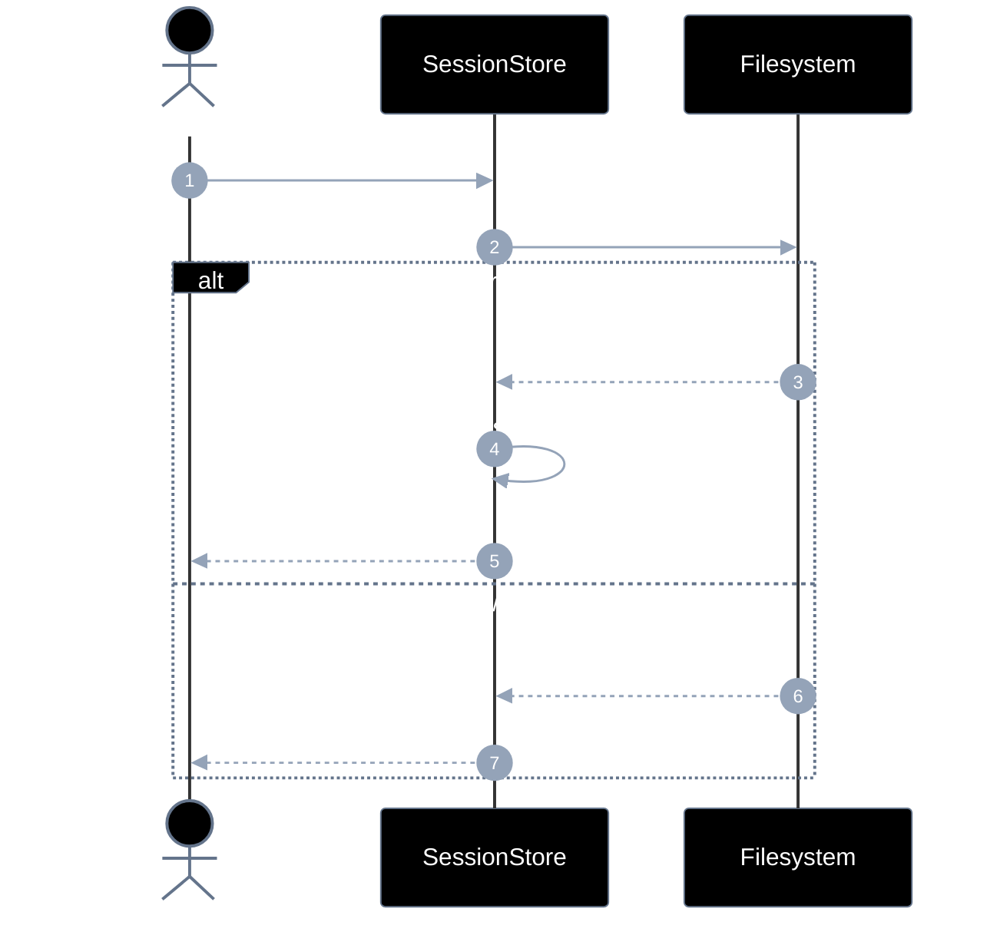
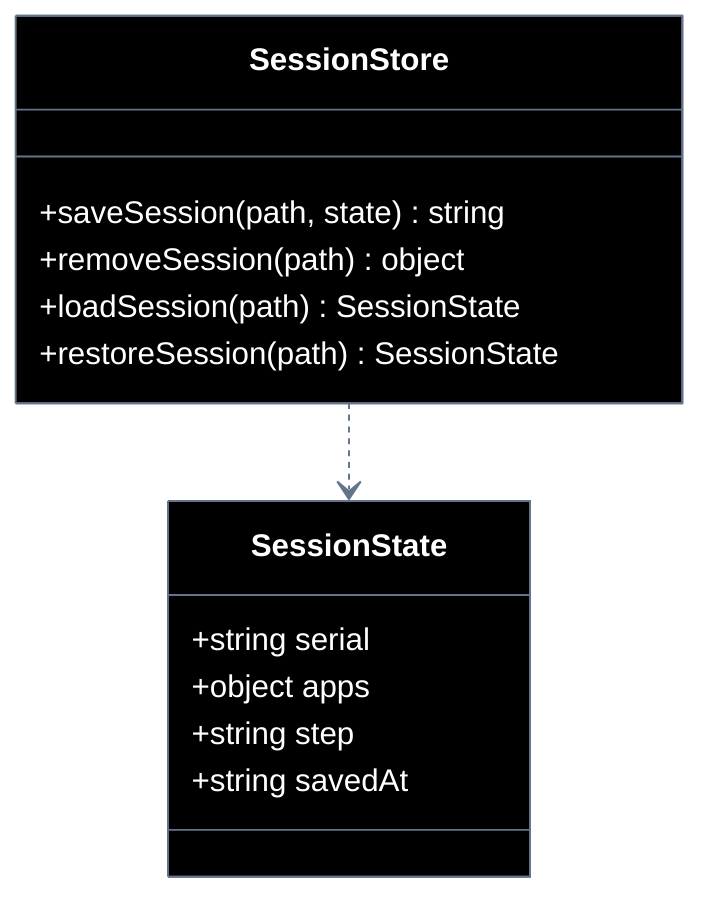

# Implementation plan — EP-06 Sessão

**Por quê:** plano técnico do épico (sequências · agentes · passo a passo · contratos · classes · modelos · BDDs).  
**Épico:** [`2.epics.md`](../2.epics.md).  
**US:** [`1.stories.md`](../1.stories.md) · [`3.scenarios.md`](../3.scenarios.md) · [`4.bdds.md`](../4.bdds.md).
**Código:** [`../sources/android-control/lib/session.js`](../sources/android-control/lib/session.js).

**Stack:** Node ≥ 18 · `adb` · runtime provisionado (EP-01).

---

## Escopo

| ID | Item |
|----|------|
| US-17 | Salvar sessão |
| US-18 | Remover sessão |
| US-19 | Recuperar sessão |
| SC-22..24 | Cenários correspondentes |

**Resultado:** estado do robô persistido, apagado e restaurado.

---

## Diagramas de sequência

### US-17 — Salvar sessão

#### Agentes

| Agente | Responsabilidade |
|--------|------------------|
| Caller | Entrega o estado atual e o path onde persistir |
| SessionStore | Enriquece com `savedAt`, serializa e grava o JSON |
| Filesystem | Cria diretórios e escreve o arquivo no disco |



#### Passo a passo

| # | De | Para | Chamada | Por quê | Entradas | Execução | Saídas |
|---|----|------|---------|---------|----------|----------|--------|
| 1 | Dev | SessionStore | `saveSession(path, state)` | Persistir | `path`, state | Serializa | Promise |
| 2 | SessionStore | SessionStore | `merge savedAt` | Carimbar | state | Injeta ISO timestamp | state |
| 3 | SessionStore | FS | `mkdir + write JSON` | Gravar | path + JSON | Cria dirs e escreve | pedido |
| 4 | FS | SessionStore | `ok` | Escrita ok | — | Confirma | `ok` |
| 5 | SessionStore | Dev | `absPath` | Path canônico | — | Resolve | absPath |

#### Contratos

| | Contrato |
|--|----------|
| **API** | `saveSession(path, state: SessionState) → string` |
| **Entrada** | `path`; estado em memória (`serial`, `apps?`, `step?`, `paths?`) |
| **Pré** | Path gravável |
| **Saída** | Path absoluto do JSON; inclui `savedAt` |
| **Erro** | `SESSION_WRITE_FAILED` |

### US-18 — Remover sessão

#### Agentes

| Agente | Responsabilidade |
|--------|------------------|
| Caller | Pede remoção da sessão no path informado |
| SessionStore | Apaga o arquivo (idempotente) e limpa o contexto em memória |
| Filesystem | Executa o unlink do arquivo de sessão, se existir |



#### Passo a passo

| # | De | Para | Chamada | Por quê | Entradas | Execução | Saídas |
|---|----|------|---------|---------|----------|----------|--------|
| 1 | Dev | SessionStore | `removeSession(path)` | Apagar sessão | `path` | Unlink idempotente | Promise |
| 2 | SessionStore | FS | `unlink` | Remover arquivo | `path` | Apaga se existe | pedido |
| 3 | FS | SessionStore | `removed/absent` | Resultado FS | — | Retorna flag | status |
| 4 | SessionStore | SessionStore | `limpar contexto` | Alinhar memória | handles | Reset runtime | — |
| 5 | SessionStore | Dev | `{ removed }` | Resultado | — | Resolve | `{ removed }` |

#### Contratos

| | Contrato |
|--|----------|
| **API** | `removeSession(path) → { removed: boolean }` |
| **Entrada** | `path` da sessão |
| **Pré** | — (idempotente) |
| **Saída** | Arquivo inexistente; contexto runtime limpo |
| **Erro** | Falha de FS (raro); preferir idempotente |

### US-19 — Recuperar sessão

#### Agentes

| Agente | Responsabilidade |
|--------|------------------|
| Caller | Pede restauração do estado a partir do path |
| SessionStore | Lê o JSON, valida o schema e devolve `SessionState` |
| Filesystem | Fornece o conteúdo do arquivo no path |



#### Passo a passo

| # | De | Para | Chamada | Por quê | Entradas | Execução | Saídas |
|---|----|------|---------|---------|----------|----------|--------|
| 1 | Dev | SessionStore | `restoreSession(path)` | Restaurar | `path` | Read + validate | Promise |
| 2 | SessionStore | FS | `read JSON` | Carregar | `path` | fs.readFile | pedido |
| 3 | FS | SessionStore | `content` | Arquivo ok | — | alt ok | JSON |
| 4 | SessionStore | SessionStore | `validar schema` | Garantir campos | JSON | Valida | state |
| 5 | SessionStore | Dev | `state` | Sessão pronta | — | Resolve | `SessionState` |
| 6 | FS | SessionStore | `missing/invalid` | Falha de leitura | — | alt erro | erro |
| 7 | SessionStore | Dev | `erro` | Não restaurável | código | Rejeita | `SESSION_*` |

#### Contratos

| | Contrato |
|--|----------|
| **API** | `restoreSession(path) → SessionState` · `loadSession(path) → SessionState \| null` |
| **Entrada** | `path` existente |
| **Pré** | Arquivo JSON válido |
| **Saída** | Estado restaurado (schema validado) |
| **Erro** | `SESSION_NOT_FOUND` · `SESSION_INVALID` |
---

## Modelos

### SessionState

| Campo | Tipo | Descrição |
|-------|------|-----------|
| `serial` / `device` | `string` | Device |
| `apps` | `object?` | Versões/pacotes |
| `step` | `string?` | Etapa do fluxo |
| `paths` | `object?` | screenshot/session |
| `savedAt` | `ISO-8601` | Persistência |

### Erros

| Código | US |
|--------|-----|
| `SESSION_WRITE_FAILED` | US-17 |
| `SESSION_NOT_FOUND` | US-19 |
| `SESSION_INVALID` | US-19 |

---

## Diagrama de classes



**Hoje / gap:** ver mapeamento abaixo.

---

## Cenários BDD

Fonte: `US-17`..`US-19` / `4.bdds.md`.

```gherkin
Cenário: US-17 Sessão é gravada em disco
  Dado estado em memória e path da sessão
  Quando a serialização grava o arquivo
  Então o arquivo de sessão existe
```

```gherkin
Cenário: US-18 Sessão é removida
  Dado um path de sessão
  Quando a remoção da sessão é executada
  Então o arquivo de sessão não existe
  E o runtime não mantém o contexto daquela sessão
```

```gherkin
Cenário: US-19 Sessão é recuperada
  Dado um arquivo de sessão existente
  Quando a leitura reaplica o contexto
  Então o runtime possui o estado restaurado
```

---

## Plano de implementação (gaps → entregas)

| # | Entrega | US | Critério |
|---|---------|-----|----------|
| I1 | Schema mínimo `SessionState` | US-17 | Doc + validação |
| I2 | `removeSession` | US-18 | SC-23 |
| I3 | `restoreSession` (falha se inválido) | US-19 | SC-24 |

### Ordem

```text
I1 → I2 → I3
```

---

## Mapeamento código atual

| Peça | Status |
|------|--------|
| `saveSession` / `loadSession` | Existe |
| `removeSession` / `restoreSession` | **Gap** |

---

## Critério de pronto (épico)

1. Três APIs US-17..19  
2. BDDs SC-22..24  
3. Schema estável para o piloto LinkedIn  

## Próximos passos

→ Implementar gaps em [`sources/android-control`](../sources/android-control/README.md)  
→ Aceite: BDDs em cada pasta `US-*/4.bdds.md`
