# Roadmap — screen-robot

**Por quê:** Gantt das fases maiores (épicos), sequenciais.  
**Árvore / esforço por nó:** [`tasks.md`](tasks.md).  
**Fonte:** [`scenarios.md`](scenarios.md).  
**Épicos:** [`epics.md`](epics.md).  
**Visão:** [`README.md`](README.md).

```mermaid
---
config:
  theme: base
  themeVariables:
    darkMode: true
    background: '#000000'
    primaryTextColor: '#ffffff'
    secondaryTextColor: '#ffffff'
    tertiaryTextColor: '#ffffff'
    textColor: '#ffffff'
    lineColor: '#333333'
    mainBkg: '#000000'
    secondaryColor: '#000000'
    tertiaryColor: '#000000'
    sectionBkgColor: '#000000'
    sectionBkgColor2: '#000000'
    altSectionBkgColor: '#000000'
    gridColor: '#222222'
    excludeBkgColor: '#000000'
    todayLineColor: '#444444'
    doneTaskBkgColor: '#2563eb'
    doneTaskBorderColor: '#1d4ed8'
    taskBkgColor: '#94a3b8'
    taskBorderColor: '#64748b'
    taskTextColor: '#ffffff'
    taskTextDarkColor: '#ffffff'
    taskTextLightColor: '#ffffff'
    taskTextOutsideColor: '#ffffff'
    critBkgColor: '#2563eb'
    critBorderColor: '#1d4ed8'
    activeTaskBkgColor: '#94a3b8'
    activeTaskBorderColor: '#64748b'
---
gantt
  title screen-robot épicos (sequencial)
  dateFormat X
  axisFormat %s

  section Épicos
  EP-01 Provisionar agente              :done, ep01, 0, 60m
  EP-02 Eventos de UI                   :done, ep02, after ep01, 24m
  EP-03 Instalar APKs                   :done, ep03, after ep02, 45m
  EP-04 Operar tela                     :done, ep04, after ep03, 15m
  EP-05 Extrair elementos               :done, ep05, after ep04, 120m
  EP-06 Sessao                          :done, ep06, after ep05, 45m
```

## Próximos passos

→ [`tasks.md`](tasks.md) · [`bdds.md`](bdds.md)  
→ Implementação em [`sources/android-control`](sources/android-control/README.md)
