# Roadmap — screen-robot

**Por quê:** Gantt das histórias (minutos IA).  
**Árvore / esforço por nó:** [`tasks.md`](tasks.md).  
**Fonte:** [`scenarios.md`](scenarios.md).  
**Épicos:** [`epics.md`](epics.md).  
**Visão:** [`README.md`](README.md).

Barras = US apenas (SC ficam em [`tasks.md`](tasks.md)).  
US-01..05 e US-14..16 sequenciais; **US-06..13** partem juntas após US-05.  
Soma esforço: **408 min** · caminho crítico: **273 min**.

```mermaid
gantt
  title screen-robot US minutos IA (paralelo 06-13)
  dateFormat X
  axisFormat %s

  section Sequencial
  US-01 Provisionar um agente           :us01, 0, 60m
  US-02 Evento de boot                  :us02, after us01, 12m
  US-03 Evento de app aberta            :us03, after us02, 12m
  US-04 Evento de tela estavel          :us04, after us03, 12m
  US-05 Evento de mudanca de dump       :us05, after us04, 12m

  section Paralelo
  US-06 Instalar APKs                   :us06, after us05, 45m
  US-07 Abrir aplicativo                :us07, after us05, 15m
  US-08 tap                             :us08, after us05, 15m
  US-09 type                            :us09, after us05, 15m
  US-10 scroll                          :us10, after us05, 15m
  US-11 screenshot                      :us11, after us05, 15m
  US-12 Resgatar coordenadas x,y        :us12, after us05, 15m
  US-13 Extrair elementos               :crit, us13, after us05, 120m

  section Apos paralelo
  US-14 Salvar sessao                   :us14, after us13, 15m
  US-15 Remover sessao                  :us15, after us14, 15m
  US-16 Recuperar sessao                :us16, after us15, 15m
```

## Próximos passos

→ [`tasks.md`](tasks.md) · [`bdds.md`](bdds.md)  
→ Implementação em [`sources/android-control`](sources/android-control/README.md)
