# Tasks — screen-robot

**Por quê:** árvore de execução e Gantt (minutos IA).  
**IDs:** **TSK-** para todos os nós.  
**Roadmap (sem SC):** [`roadmap.md`](roadmap.md).  
**Fonte:** [`scenarios.md`](scenarios.md).  
**Épicos:** [`epics.md`](epics.md).  
**Visão:** [`README.md`](README.md).  
**Kanban / inventário (umbrella):** [`core/tasks`](../../core/tasks/README.md#p1--connectmax--screen-robot).

Estimativas: minutos IA · **1 dia = 8h = 480 min**.

**Colapso:** 1 filho no pai → só o pai (folhas sobem se houver >1 no nível omitido).

### Árvore de execução

```text
screen-robot (249 min caminho · 408 min soma)
├── TSK-001 Provisionar agente (60 min)
│   ├── TSK-002 Subir / conectar o Android (agent) (20 min)
│   ├── TSK-003 Garantir serial ADB online (20 min)
│   └── TSK-004 Aguardar boot completo (20 min)
├── TSK-005 Eventos de UI (24 min caminho)
│   ├── TSK-006 Evento de boot (12 min)
│   ├── ∥ TSK-007 Evento de app aberta (12 min)
│   ├── ∥ TSK-008 Evento de tela estável (12 min)
│   └── ∥ TSK-009 Evento de mudança de dump (12 min)
├── ∥ TSK-010 Instalar APKs (45 min)
│   ├── TSK-011 Ler versão na config do dispositivo (5 min)
│   ├── TSK-012 Baixar APK na versão definida (25 min)
│   └── TSK-013 Instalar pacote no agent (15 min)
├── ∥ TSK-014 Operar tela (15 min caminho)
│   ├── TSK-015 Abrir aplicativo (15 min)
│   ├── TSK-016 tap (15 min)
│   ├── TSK-017 type (15 min)
│   ├── TSK-018 scroll (15 min)
│   ├── TSK-019 screenshot (15 min)
│   └── TSK-020 Resgatar coordenadas x,y a partir de uma imagem (15 min)
├── ∥ TSK-021 Extrair elementos (120 min)
└── TSK-022 Sessão (45 min)
    ├── TSK-023 Salvar sessão (15 min)
    ├── TSK-024 Remover sessão (15 min)
    └── TSK-025 Recuperar sessão (15 min)
```

`∥` = paralelizáveis (TSK-007..009 após TSK-006; TSK-010..021 após o grupo de eventos; caminhos 12 min e 120 min).

### Gantt

```mermaid
---
config:
  theme: base
  themeVariables:
    darkMode: true
    background: '#000000'
    primaryTextColor: '#ffffff'
    secondaryTextColor: '#ffffff'
    tertiaryTextColor: '#ffffff'
    textColor: '#ffffff'
    lineColor: '#333333'
    mainBkg: '#000000'
    secondaryColor: '#000000'
    tertiaryColor: '#000000'
    sectionBkgColor: '#000000'
    sectionBkgColor2: '#000000'
    altSectionBkgColor: '#000000'
    gridColor: '#222222'
    excludeBkgColor: '#000000'
    todayLineColor: '#444444'
    doneTaskBkgColor: '#2563eb'
    doneTaskBorderColor: '#1d4ed8'
    taskBkgColor: '#94a3b8'
    taskBorderColor: '#64748b'
    taskTextColor: '#ffffff'
    taskTextDarkColor: '#ffffff'
    taskTextLightColor: '#ffffff'
    taskTextOutsideColor: '#ffffff'
    critBkgColor: '#2563eb'
    critBorderColor: '#1d4ed8'
    activeTaskBkgColor: '#94a3b8'
    activeTaskBorderColor: '#64748b'
---
gantt
  title screen-robot TSK
  dateFormat X
  axisFormat %s

  section TSK-001 Provisionar
  TSK-001 Provisionar agente            :done, tsk01, 0, 60m
  TSK-002 Subir e conectar              :tsk02, 0, 20m
  TSK-003 Serial ADB online             :tsk03, after tsk02, 20m
  TSK-004 Boot completo                 :tsk04, after tsk03, 20m

  section TSK-005 Eventos de UI
  TSK-005 Eventos de UI                 :done, tsk05, after tsk01, 24m
  TSK-006 Evento de boot                :tsk06, after tsk01, 12m
  TSK-007 Evento de app aberta          :tsk07, after tsk06, 12m
  TSK-008 Evento de tela estavel        :tsk08, after tsk06, 12m
  TSK-009 Evento de mudanca de dump     :tsk09, after tsk06, 12m

  section TSK-010 Instalar APKs
  TSK-010 Instalar APKs                 :done, tsk10, after tsk09, 45m
  TSK-011 Ler versao                    :tsk11, after tsk09, 5m
  TSK-012 Baixar APK                    :tsk12, after tsk11, 25m
  TSK-013 Instalar pacote               :tsk13, after tsk12, 15m

  section TSK-014 Operar tela
  TSK-014 Operar tela                   :done, tsk14, after tsk09, 15m
  TSK-015 Abrir aplicativo              :tsk15, after tsk09, 15m
  TSK-016 tap                           :tsk16, after tsk09, 15m
  TSK-017 type                          :tsk17, after tsk09, 15m
  TSK-018 scroll                        :tsk18, after tsk09, 15m
  TSK-019 screenshot                    :tsk19, after tsk09, 15m
  TSK-020 Resgatar coordenadas x,y      :tsk20, after tsk09, 15m

  section TSK-021 Extrair elementos
  TSK-021 Extrair elementos             :done, tsk21, after tsk09, 120m

  section TSK-022 Sessao
  TSK-022 Sessao                        :done, tsk22, after tsk21, 45m
  TSK-023 Salvar sessao                 :tsk23, after tsk21, 15m
  TSK-024 Remover sessao                :tsk24, after tsk23, 15m
  TSK-025 Recuperar sessao              :tsk25, after tsk24, 15m
```



## Próximos passos

→ Roadmap (EP/US): [`roadmap.md`](roadmap.md)  
→ Implementação em [`sources/android-control`](sources/android-control/README.md)  
→ Aceite: [`bdds.md`](bdds.md)
