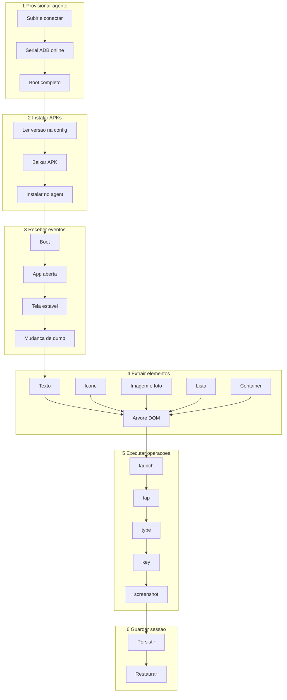

# Board

Gantts e árvores de execução por projeto (prioridade maior → menor).  
Status Todo/Doing/Done: [`tasks/`](../tasks/README.md).

---

## P1 — ConnectMax · screen-robot

Seis capacidades Node (maiores sequenciais + filhas).  
Funcionalidades: [`functionalities.md`](../../connectmax/screen-robot/docs/functionalities.md) · BDD: [`bdd-linkedin-login.md`](../../connectmax/screen-robot/docs/bdd-linkedin-login.md).  
Estimativas: minutos IA. Kanban: [`tasks`](../tasks/README.md#p1--connectmax--screen-robot).

### Árvore de execução

```text
screen-robot
├── 1. Provisionar um agente
│   ├── Subir / conectar o Android (agent)
│   ├── Garantir serial ADB online
│   └── Aguardar boot completo
├── 2. Instalar APKs
│   ├── Ler versão na config do dispositivo
│   ├── Baixar APK na versão definida
│   └── Instalar pacote no agent
├── 3. Receber eventos
│   ├── Evento de boot
│   ├── Evento de app aberta
│   ├── Evento de tela estável
│   └── Evento de mudança de dump
├── 4. Extrair elementos e informações
│   ├── Nó Texto
│   ├── Nó Ícone
│   ├── Nó Imagem / foto
│   ├── Nó Lista (itens filhos + scroll)
│   ├── Nó Container
│   └── Montar árvore DOM (raiz → filhos)
├── 5. Executar operações
│   ├── launch
│   ├── tap
│   ├── type
│   ├── key
│   └── screenshot
└── 6. Guardar estado de sessão
    ├── Persistir sessão em arquivo
    └── Restaurar sessão do arquivo
```



### Gantt

```mermaid
gantt
  title screen-robot funcionalidades minutos IA
  dateFormat X
  axisFormat %s

  section 1 Provisionar
  Provisionar um agente     :crit, p0, 0, 60m
  Subir e conectar agent    :p1, 0, 20m
  Serial ADB online         :p2, after p1, 20m
  Boot completo             :p3, after p2, 20m

  section 2 Instalar APKs
  Instalar APKs             :crit, i0, after p0, 45m
  Ler versao na config      :i1, after p0, 5m
  Baixar APK                :i2, after i1, 25m
  Instalar no agent         :i3, after i2, 15m

  section 3 Receber eventos
  Receber eventos           :crit, e0, after i0, 48m
  Evento boot               :e1, after i0, 12m
  Evento app aberta         :e2, after e1, 12m
  Evento tela estavel       :e3, after e2, 12m
  Evento mudanca de dump    :e4, after e3, 12m

  section 4 Extrair
  Extrair elementos         :crit, x0, after e0, 120m
  No Texto                  :x1, after e0, 20m
  No Icone                  :x2, after x1, 20m
  No Imagem e foto          :x3, after x2, 24m
  No Lista                  :x4, after x3, 24m
  No Container              :x5, after x4, 12m
  Montar arvore DOM         :x6, after x5, 20m

  section 5 Operacoes
  Executar operacoes        :crit, o0, after x0, 75m
  launch                    :o1, after x0, 15m
  tap                       :o2, after o1, 15m
  type                      :o3, after o2, 15m
  key                       :o4, after o3, 15m
  screenshot                :o5, after o4, 15m

  section 6 Sessao
  Guardar estado de sessao  :crit, s0, after o0, 30m
  Persistir sessao          :s1, after o0, 15m
  Restaurar sessao          :s2, after s1, 15m
```



| # | Maior | Filhas | Min IA |
|---|-------|--------|--------|
| 1 | Provisionar um agente | subir/conectar · serial online · boot | 60 |
| 2 | Instalar APKs | ler versão · baixar · instalar | 45 |
| 3 | Receber eventos | boot · app aberta · tela estável · dump | 48 |
| 4 | Extrair elementos | texto · ícone · imagem/foto · lista · container · árvore DOM | 120 |
| 5 | Executar operações | launch · tap · type · key · screenshot | 75 |
| 6 | Guardar sessão | persistir · restaurar | 30 |
| | **Total** | | **378** |

→ [`tasks`](../tasks/README.md#p1--connectmax--screen-robot) · [`functionalities`](../../connectmax/screen-robot/docs/functionalities.md)

---

## P1b — ConnectMax · vendas

Sem Gantt ainda.

→ [`tasks`](../tasks/README.md#p1b--connectmax--vendas)

---

## P2 — Flow

Pré-requisito do Plans.  
Sem Gantt ainda.

→ [`tasks`](../tasks/README.md#p2--flow)

---

## P3 — Plans

Sem Gantt ainda.

→ [`tasks`](../tasks/README.md#p3--plans)

---

## P4 — RoleGo

Sem Gantt ainda.

→ [`tasks`](../tasks/README.md#p4--rolego)

---

## P5 — Chines

Sem Gantt ainda.

→ [`tasks`](../tasks/README.md#p5--chines)

---

## P6 — Caronas

Sem Gantt ainda.

→ [`tasks`](../tasks/README.md#p6--caronas)

---

## P7 — Fitness

Sem Gantt ainda.

→ [`tasks`](../tasks/README.md#p7--fitness)

---

## P8 — Eternos Mutáveis

Sem Gantt ainda.

→ [`tasks`](../tasks/README.md#p8--eternos-mutáveis)

---

## P9 — Jiu-jitsu

Sem Gantt ainda.

→ [`tasks`](../tasks/README.md#p9--jiu-jitsu)
