# Board

Gantts por projeto (prioridade maior → menor).  
Árvore de execução e status Todo/Doing/Done: [`tasks/`](../tasks/README.md).

---

## P1 — ConnectMax · screen-robot

Robô de tela em 4 épicos: Capture → Perceive → Decide → Actuate.  
Estimativas: **minutos de esforço IA** (não humano).  
Épicos: [`screen-robot/epics/`](../../connectmax/screen-robot/epics/README.md).

```mermaid
gantt
  title screen-robot — 4 épicos (minutos IA)
  dateFormat X
  axisFormat %s

  section EP-01 Capture
  Frame padronizado        :a01, 0, 12m
  Captura ADB              :a02, after a01, 30m
  Validar redroid          :a03, after a02, 9m
  Captura agent            :a04, after a01, 90m
  Backend captura          :a05, after a03, 24m

  section EP-02 Perceive
  Schema elemento          :b01, after a03, 24m
  OCR textos               :b02, after b01, 60m
  Controles vision         :b03, after b01, 90m
  Unificar lista           :b04, after b02, 36m
  CLI perceive             :b05, after b04, 30m

  section EP-03 Decide
  Selecionar elemento      :c01, after b05, 36m
  Decidir via LLM          :c02, after b05, 48m
  Goal sem coords          :c03, after c01, 72m
  Aguardar elemento        :c04, after c03, 30m
  Metricas                 :c05, after c03, 24m

  section EP-04 Actuate
  Contrato atuacao         :d01, 0, 12m
  Gestos ADB               :d02, after d01, 24m
  Clique do frame          :d03, after d02, 9m
  Rolar ate achar          :d04, after c03, 36m
  Calibrar resolucao       :d05, after d01, 30m
  Gestos agent             :d06, after d01, 90m
  Backend atuacao          :d07, after d02, 24m
```

→ [`tasks`](../tasks/README.md#p1--connectmax--screen-robot) · [`epics`](../../connectmax/screen-robot/epics/README.md)

---

## P1b — ConnectMax · vendas

Sem Gantt ainda.

→ [`tasks`](../tasks/README.md#p1b--connectmax--vendas)

---

## P2 — Flow

Pré-requisito do Plans.  
Sem Gantt ainda.

→ [`tasks`](../tasks/README.md#p2--flow)

---

## P3 — Plans

Sem Gantt ainda.

→ [`tasks`](../tasks/README.md#p3--plans)

---

## P4 — RoleGo

Sem Gantt ainda.

→ [`tasks`](../tasks/README.md#p4--rolego)

---

## P5 — Chines

Sem Gantt ainda.

→ [`tasks`](../tasks/README.md#p5--chines)

---

## P6 — Caronas

Sem Gantt ainda.

→ [`tasks`](../tasks/README.md#p6--caronas)

---

## P7 — Fitness

Sem Gantt ainda.

→ [`tasks`](../tasks/README.md#p7--fitness)

---

## P8 — Eternos Mutáveis

Sem Gantt ainda.

→ [`tasks`](../tasks/README.md#p8--eternos-mutáveis)

---

## P9 — Jiu-jitsu

Sem Gantt ainda.

→ [`tasks`](../tasks/README.md#p9--jiu-jitsu)
