# Board

Gantts por projeto (prioridade maior → menor).  
Árvore de execução e status Todo/Doing/Done: [`tasks/`](../tasks/README.md).

---

## P1 — ConnectMax · screen-robot

Seis capacidades Node + cenário login LinkedIn.  
Funcionalidades: [`functionalities.md`](../../connectmax/screen-robot/docs/functionalities.md) · BDD: [`bdd-linkedin-login.md`](../../connectmax/screen-robot/docs/bdd-linkedin-login.md).

```mermaid
gantt
  title screen-robot — Node (minutos IA)
  dateFormat X
  axisFormat %s

  section Caps
  Provisionar agente       :a01, 0, 30m
  Instalar APKs            :a02, after a01, 45m
  Receber eventos          :a03, after a01, 24m
  Extrair elementos        :a04, after a03, 36m
  Executar operacoes       :a05, after a02, 36m
  Guardar sessao           :a06, after a05, 18m

  section Cenario
  Login LinkedIn BDD       :b01, after a06, 60m
```

→ [`tasks`](../tasks/README.md#p1--connectmax--screen-robot) · [`functionalities`](../../connectmax/screen-robot/docs/functionalities.md)

---

## P1b — ConnectMax · vendas

Sem Gantt ainda.

→ [`tasks`](../tasks/README.md#p1b--connectmax--vendas)

---

## P2 — Flow

Pré-requisito do Plans.  
Sem Gantt ainda.

→ [`tasks`](../tasks/README.md#p2--flow)

---

## P3 — Plans

Sem Gantt ainda.

→ [`tasks`](../tasks/README.md#p3--plans)

---

## P4 — RoleGo

Sem Gantt ainda.

→ [`tasks`](../tasks/README.md#p4--rolego)

---

## P5 — Chines

Sem Gantt ainda.

→ [`tasks`](../tasks/README.md#p5--chines)

---

## P6 — Caronas

Sem Gantt ainda.

→ [`tasks`](../tasks/README.md#p6--caronas)

---

## P7 — Fitness

Sem Gantt ainda.

→ [`tasks`](../tasks/README.md#p7--fitness)

---

## P8 — Eternos Mutáveis

Sem Gantt ainda.

→ [`tasks`](../tasks/README.md#p8--eternos-mutáveis)

---

## P9 — Jiu-jitsu

Sem Gantt ainda.

→ [`tasks`](../tasks/README.md#p9--jiu-jitsu)
