# Processo de desenvolvimento de software

Ciclo padrão da workstation:

```text
Discovery → Refinamento técnico → Desenvolvimento → Testes → Implantação → Manutenção
```

Cada etapa documenta **entradas**, **execução** e **saídas**. A árvore abaixo lista os **passos da execução** de cada fase.

## Como atacar

1. No [discovery](discovery/README.md), nesta ordem: **vision → cenários → BDDs → protótipo**.
2. **Depois**, separar **cada estória** e aplicar o ciclo acima **por estória** (refinamento técnico → desenvolvimento → testes → implantação → manutenção).

O mapa nasce no discovery; o restante do processo roda **estória a estória**, não no produto inteiro de uma vez.

| Etapa | Pasta | Objetivo |
|-------|-------|----------|
| Discovery | [`discovery/`](discovery/README.md) | Vision → cenários → BDDs → protótipo; depois ciclo por estória |
| Refinamento técnico | [`refinamento-tecnico/`](refinamento-tecnico/README.md) | Detalhar solução, riscos e critérios técnicos |
| Desenvolvimento | [`desenvolvimento/`](desenvolvimento/README.md) | Implementar o que foi acordado |
| Testes | [`testes/`](testes/README.md) | Validar comportamento e qualidade |
| Implantação | [`implantacao/`](implantacao/README.md) | Publicar em ambiente alvo |
| Manutenção | [`manutencao/`](manutencao/README.md) | Operar, corrigir e evoluir |

### Árvore de execução

```text
Processo (31)
├── Discovery
│   ├── Vision
│   ├── Cenarios (EP → US → SC)
│   ├── BDDs
│   ├── Prototipo
│   └── Validar com stakeholders
├── Refinamento tecnico
│   ├── Desenhar arquitetura, contratos e dados
│   ├── Identificar riscos e mitigacoes
│   ├── Consolidar criterios de pronto
│   ├── Estimar esforco e dependencias
│   └── Quebrar em tarefas priorizadas
├── Desenvolvimento
│   ├── Implementar conforme aceite
│   ├── Commits pequenos e revisaveis
│   ├── Lote: primeiro caso, depois escala
│   ├── Testes unitarios
│   ├── Documentar o minimo
│   └── Integrar com CI
├── Testes
│   ├── Unitario / integracao / E2E
│   ├── Aceite por cenario
│   ├── Regressao
│   ├── Qualidade
│   └── Priorizar bugs
├── Implantacao
│   ├── Build e release
│   ├── Migracoes e configuracao
│   ├── Deploy staging → prod
│   ├── Smoke pos-deploy
│   └── Comunicar / rollback
└── Manutencao
    ├── Monitorar e incidentes
    ├── Hotfixes
    ├── Melhorias incrementais
    ├── Debito tecnico
    └── Encaminhar mudancas
```

### Gantt — fases e passos sequenciais

Fases em ordem; dentro de cada fase, os passos da execução (mesma ordem da árvore).  
Barras = folhas da árvore. Durações relativas (1 unidade = 1 passo).

```mermaid
gantt
  title Processo de desenvolvimento — fases e passos sequenciais
  dateFormat X
  axisFormat %s

  section Discovery
  Vision                        :d1a, 0, 1
  Cenarios                      :d1b, after d1a, 1
  BDDs                          :d1c, after d1b, 1
  Prototipo                     :d1d, after d1c, 1
  Validar stakeholders          :d1f, after d1d, 1

  section Refinamento tecnico
  Arquitetura e contratos       :d2a, after d1f, 1
  Riscos e mitigacoes           :d2b, after d2a, 1
  Criterios de pronto           :d2c, after d2b, 1
  Estimar esforco               :d2d, after d2c, 1
  Quebrar em tarefas            :d2e, after d2d, 1

  section Desenvolvimento
  Implementar aceite            :d3a, after d2e, 1
  Commits revisaveis            :d3b, after d3a, 1
  Lote primeiro caso            :d3c, after d3b, 1
  Testes unitarios              :d3d, after d3c, 1
  Documentar minimo             :d3e, after d3d, 1
  Integrar CI                   :d3f, after d3e, 1

  section Testes
  Unitario integracao E2E       :d4a, after d3f, 1
  Aceite por cenario            :d4b, after d4a, 1
  Regressao                     :d4c, after d4b, 1
  Qualidade                     :d4d, after d4c, 1
  Priorizar bugs                :d4e, after d4d, 1

  section Implantacao
  Build e release               :d5a, after d4e, 1
  Migracoes e config            :d5b, after d5a, 1
  Deploy staging prod           :d5c, after d5b, 1
  Smoke pos-deploy              :d5d, after d5c, 1
  Comunicar rollback            :d5e, after d5d, 1

  section Manutencao
  Monitorar incidentes          :d6a, after d5e, 1
  Hotfixes                      :d6b, after d6a, 1
  Melhorias                     :d6c, after d6b, 1
  Debito tecnico                :d6d, after d6c, 1
  Encaminhar mudancas           :d6e, after d6d, 1
```



## Fluxo (entradas → execução → saídas)

```mermaid
flowchart TB
  subgraph D["1. Discovery"]
    direction TB
    D_E["Entradas<br/>demanda / problema<br/>contexto e restrições<br/>stakeholders<br/>dados e feedback"]
    D_X["Execução<br/>vision → cenários → BDDs → protótipo<br/>validar com stakeholders"]
    D_S["Saídas<br/>vision.md<br/>scenarios.md<br/>bdds.md<br/>protótipo"]
    D_E --> D_X --> D_S
  end

  subgraph R["2. Refinamento técnico"]
    direction TB
    R_E["Entradas<br/>vision + EP → US → SC + BDD<br/>restrições<br/>stack e padrões"]
    R_X["Execução<br/>arquitetura e contratos<br/>riscos e mitigações<br/>critérios de pronto<br/>estimativas<br/>quebra em tarefas"]
    R_S["Saídas<br/>desenho técnico / ADR<br/>critérios de pronto<br/>backlog priorizado"]
    R_E --> R_X --> R_S
  end

  subgraph Dev["3. Desenvolvimento"]
    direction TB
    Dev_E["Entradas<br/>backlog e aceite<br/>desenho técnico<br/>código existente<br/>ambiente pronto"]
    Dev_X["Execução<br/>implementar<br/>commits revisáveis<br/>testes unitários<br/>documentar mínimo<br/>CI"]
    Dev_S["Saídas<br/>código para validação<br/>PRs / commits<br/>testes unitários"]
    Dev_E --> Dev_X --> Dev_S
  end

  subgraph T["4. Testes"]
    direction TB
    T_E["Entradas<br/>código entregue<br/>cenários de aceite<br/>ambiente de teste<br/>casos de regressão"]
    T_X["Execução<br/>unitário / integração / E2E<br/>aceite por cenário<br/>regressão<br/>qualidade<br/>priorizar bugs"]
    T_S["Saídas<br/>evidência de aceite<br/>bugs priorizados<br/>relatório de resultados"]
    T_E --> T_X --> T_S
  end

  subgraph I["5. Implantação"]
    direction TB
    I_E["Entradas<br/>artefato aprovado<br/>checklist go-live<br/>config e segredos<br/>plano de rollback"]
    I_X["Execução<br/>build e release<br/>migrações<br/>deploy staging→prod<br/>smoke<br/>comunicar / rollback"]
    I_S["Saídas<br/>versão publicada<br/>notas de release<br/>evidência de go-live"]
    I_E --> I_X --> I_S
  end

  subgraph M["6. Manutenção"]
    direction TB
    M_E["Entradas<br/>sistema em produção<br/>monitoramento<br/>incidentes e feedback<br/>backlog e débito"]
    M_X["Execução<br/>monitorar e incidentes<br/>hotfixes<br/>melhorias<br/>débito técnico<br/>encaminhar mudanças"]
    M_S["Saídas<br/>estabilidade<br/>correções publicadas<br/>backlog atualizado"]
    M_E --> M_X --> M_S
  end

  D_S --> R_E
  R_S --> Dev_E
  Dev_S --> T_E
  T_S -->|aprovado| I_E
  I_S --> M_E
  M_S -.->|mudança relevante| D_E
  M_S -.->|ajuste técnico| R_E
```


