# Processo de desenvolvimento de software

Ciclo padrão da workstation:

```text
Discovery → Refinamento técnico → Desenvolvimento → Testes → Implantação → Manutenção
```

Cada etapa documenta **entradas**, **execução** e **saídas**.

| Etapa | Pasta | Objetivo |
|-------|-------|----------|
| Discovery | [`discovery/`](discovery/) | Visão (funcionalidades) + épicos (histórias, BDD, protótipos HF) |
| Refinamento técnico | [`refinamento-tecnico/`](refinamento-tecnico/) | Detalhar solução, riscos e critérios técnicos |
| Desenvolvimento | [`desenvolvimento/`](desenvolvimento/) | Implementar o que foi acordado |
| Testes | [`testes/`](testes/) | Validar comportamento e qualidade |
| Implantação | [`implantacao/`](implantacao/) | Publicar em ambiente alvo |
| Manutenção | [`manutencao/`](manutencao/) | Operar, corrigir e evoluir |

## Fluxo (entradas → execução → saídas)

```mermaid
flowchart TB
  subgraph D["1. Discovery"]
    direction TB
    D_E["Entradas<br/>demanda / problema<br/>contexto e restrições<br/>stakeholders<br/>dados e feedback"]
    D_X["Execução<br/>mapear problema e valor<br/>métricas e escopo<br/>funcionalidades (título, descrição, capa)<br/>épicos com histórias, BDD e protótipos HF<br/>validar com stakeholders"]
    D_S["Saídas<br/>documento de visão<br/>documento de épicos"]
    D_E --> D_X --> D_S
  end

  subgraph R["2. Refinamento técnico"]
    direction TB
    R_E["Entradas<br/>visão (funcionalidades)<br/>épicos (histórias, BDD, protótipos HF)<br/>restrições<br/>stack e padrões"]
    R_X["Execução<br/>arquitetura e contratos<br/>riscos e mitigações<br/>critérios de pronto<br/>estimativas<br/>quebra em tarefas"]
    R_S["Saídas<br/>desenho técnico / ADR<br/>critérios de pronto<br/>backlog priorizado"]
    R_E --> R_X --> R_S
  end

  subgraph Dev["3. Desenvolvimento"]
    direction TB
    Dev_E["Entradas<br/>backlog e aceite<br/>desenho técnico<br/>código existente<br/>ambiente pronto"]
    Dev_X["Execução<br/>implementar<br/>commits revisáveis<br/>testes unitários<br/>documentar mínimo<br/>CI"]
    Dev_S["Saídas<br/>código para validação<br/>PRs / commits<br/>testes unitários"]
    Dev_E --> Dev_X --> Dev_S
  end

  subgraph T["4. Testes"]
    direction TB
    T_E["Entradas<br/>código entregue<br/>critérios / BDD<br/>ambiente de teste<br/>casos de regressão"]
    T_X["Execução<br/>unitário / integração / E2E<br/>aceite BDD<br/>regressão<br/>qualidade<br/>priorizar bugs"]
    T_S["Saídas<br/>evidência de aceite<br/>bugs priorizados<br/>relatório de resultados"]
    T_E --> T_X --> T_S
  end

  subgraph I["5. Implantação"]
    direction TB
    I_E["Entradas<br/>artefato aprovado<br/>checklist go-live<br/>config e segredos<br/>plano de rollback"]
    I_X["Execução<br/>build e release<br/>migrações<br/>deploy staging→prod<br/>smoke<br/>comunicar / rollback"]
    I_S["Saídas<br/>versão publicada<br/>notas de release<br/>evidência de go-live"]
    I_E --> I_X --> I_S
  end

  subgraph M["6. Manutenção"]
    direction TB
    M_E["Entradas<br/>sistema em produção<br/>monitoramento<br/>incidentes e feedback<br/>backlog e débito"]
    M_X["Execução<br/>monitorar e incidentes<br/>hotfixes<br/>melhorias<br/>débito técnico<br/>encaminhar mudanças"]
    M_S["Saídas<br/>estabilidade<br/>correções publicadas<br/>backlog atualizado"]
    M_E --> M_X --> M_S
  end

  D_S --> R_E
  R_S --> Dev_E
  Dev_S --> T_E
  T_S -->|aprovado| I_E
  I_S --> M_E
  M_S -.->|mudança relevante| D_E
  M_S -.->|ajuste técnico| R_E
```


