# Processo de desenvolvimento de software

Ciclo padrão da workstation:

```text
Discovery → Refinamento técnico → Desenvolvimento → Testes → Implantação → Manutenção
```

Cada etapa documenta **entradas**, **execução** e **saídas**. A árvore abaixo lista os **passos da execução** de cada fase.

## Como atacar

1. No [discovery](discovery/README.md), nesta ordem: **vision → functionalities → cenários → BDDs → protótipo → roadmap**.
2. **Depois**, separar **cada estória** e aplicar o ciclo acima **por estória** (refinamento técnico → desenvolvimento → testes → implantação → manutenção).

O mapa nasce no discovery; o restante do processo roda **estória a estória**, não no produto inteiro de uma vez.

| Etapa | Pasta | Objetivo |
|-------|-------|----------|
| Discovery | [`discovery/`](discovery/README.md) | Vision → functionalities → cenários → BDDs → protótipo → roadmap; depois ciclo por estória |
| Refinamento técnico | [`refinamento-tecnico/`](refinamento-tecnico/README.md) | Detalhar solução, riscos e critérios técnicos |
| Desenvolvimento | [`desenvolvimento/`](desenvolvimento/README.md) | Implementar o que foi acordado |
| Testes | [`testes/`](testes/README.md) | Validar comportamento e qualidade |
| Implantação | [`implantacao/`](implantacao/README.md) | Publicar em ambiente alvo |
| Manutenção | [`manutencao/`](manutencao/README.md) | Operar, corrigir e evoluir |

### Árvore de execução

```text
Processo (41)
├── 1. Discovery
│   ├── 1.1 Vision
│   ├── 1.2 Functionalities
│   ├── 1.3 Cenarios (EP → US → SC)
│   ├── 1.4 BDDs
│   ├── 1.5 Prototipo
│   └── 1.6 Roadmap
│       ├── 1.6.1 Criar épicos
│       ├── 1.6.2 Criar estórias
│       └── 1.6.3 Criar cenários
├── 2. Refinamento tecnico
│   ├── 2.1 Desenhar arquitetura, contratos e dados
│   ├── 2.2 Identificar riscos e mitigacoes
│   ├── 2.3 Consolidar criterios de pronto
│   ├── 2.4 Estimar esforco e dependencias
│   └── 2.5 Quebrar em tarefas priorizadas
├── 3. Desenvolvimento
│   ├── 3.1 Implementar conforme aceite
│   ├── 3.2 Commits pequenos e revisaveis
│   ├── 3.3 Lote: primeiro caso, depois escala
│   ├── 3.4 Testes unitarios
│   ├── 3.5 Documentar o minimo
│   └── 3.6 Integrar com CI
├── 4. Testes
│   ├── 4.1 Unitario / integracao / E2E
│   ├── 4.2 Aceite por cenario
│   ├── 4.3 Regressao
│   ├── 4.4 Qualidade
│   └── 4.5 Priorizar bugs
├── 5. Implantacao
│   ├── 5.1 Build e release
│   ├── 5.2 Migracoes e configuracao
│   ├── 5.3 Deploy staging → prod
│   ├── 5.4 Smoke pos-deploy
│   └── 5.5 Comunicar / rollback
└── 6. Manutencao
    ├── 6.1 Monitorar e incidentes
    ├── 6.2 Hotfixes
    ├── 6.3 Melhorias incrementais
    ├── 6.4 Debito tecnico
    └── 6.5 Encaminhar mudancas
```

### Roadmap — etapas sequenciais

Só as fases maiores, em sequência (detalhe dos passos na árvore acima).  
Estilo: fundo preto · etapa = azul.

```mermaid
---
config:
  theme: base
  themeVariables:
    darkMode: true
    background: '#000000'
    primaryTextColor: '#ffffff'
    secondaryTextColor: '#ffffff'
    tertiaryTextColor: '#ffffff'
    textColor: '#ffffff'
    lineColor: '#333333'
    mainBkg: '#000000'
    secondaryColor: '#000000'
    tertiaryColor: '#000000'
    sectionBkgColor: '#000000'
    sectionBkgColor2: '#000000'
    altSectionBkgColor: '#000000'
    gridColor: '#222222'
    excludeBkgColor: '#000000'
    todayLineColor: '#444444'
    doneTaskBkgColor: '#2563eb'
    doneTaskBorderColor: '#1d4ed8'
    taskBkgColor: '#94a3b8'
    taskBorderColor: '#64748b'
    taskTextColor: '#ffffff'
    taskTextDarkColor: '#ffffff'
    taskTextLightColor: '#ffffff'
    taskTextOutsideColor: '#ffffff'
    critBkgColor: '#2563eb'
    critBorderColor: '#1d4ed8'
    activeTaskBkgColor: '#94a3b8'
    activeTaskBorderColor: '#64748b'
---
gantt
  title Processo — etapas sequenciais
  dateFormat X
  axisFormat %s

  section Etapas
  1. Discovery                  :done, p1, 0, 1
  2. Refinamento tecnico        :done, p2, after p1, 1
  3. Desenvolvimento            :done, p3, after p2, 1
  4. Testes                     :done, p4, after p3, 1
  5. Implantacao                :done, p5, after p4, 1
  6. Manutencao                 :done, p6, after p5, 1
```



## Fluxo (entradas → execução → saídas)


