# Processo de desenvolvimento de software

Ciclo padrão da workstation:

```text
Discovery → Refinamento técnico → Desenvolvimento → Testes → Implantação → Manutenção
```

Cada etapa documenta **entradas**, **execução** e **saídas**.

| Etapa | Pasta | Objetivo |
|-------|-------|----------|
| Discovery | [`discovery/`](discovery/README.md) | Épicos (valor) → estórias (operação) → cenários (estado + unidade testável/paralelizável) |
| Refinamento técnico | [`refinamento-tecnico/`](refinamento-tecnico/README.md) | Detalhar solução, riscos e critérios técnicos |
| Desenvolvimento | [`desenvolvimento/`](desenvolvimento/README.md) | Implementar o que foi acordado |
| Testes | [`testes/`](testes/README.md) | Validar comportamento e qualidade |
| Implantação | [`implantacao/`](implantacao/README.md) | Publicar em ambiente alvo |
| Manutenção | [`manutencao/`](manutencao/README.md) | Operar, corrigir e evoluir |

### Árvore de execução

```text
Processo (18)
├── Discovery
│   ├── Entradas
│   ├── Execucao
│   └── Saidas
├── Refinamento tecnico
│   ├── Entradas
│   ├── Execucao
│   └── Saidas
├── Desenvolvimento
│   ├── Entradas
│   ├── Execucao
│   └── Saidas
├── Testes
│   ├── Entradas
│   ├── Execucao
│   └── Saidas
├── Implantacao
│   ├── Entradas
│   ├── Execucao
│   └── Saidas
└── Manutencao
    ├── Entradas
    ├── Execucao
    └── Saidas
```

### Gantt — fases e filhas sequenciais

Fases em ordem; dentro de cada fase: Entradas → Execução → Saídas.  
Barras = folhas da árvore. Durações relativas (1 unidade = 1 filha).

```mermaid
gantt
  title Processo de desenvolvimento — fases e filhas sequenciais
  dateFormat X
  axisFormat %s

  section Discovery
  Entradas               :d1e, 0, 1
  Execucao               :d1x, after d1e, 1
  Saidas                 :d1s, after d1x, 1

  section Refinamento tecnico
  Entradas               :d2e, after d1s, 1
  Execucao               :d2x, after d2e, 1
  Saidas                 :d2s, after d2x, 1

  section Desenvolvimento
  Entradas               :d3e, after d2s, 1
  Execucao               :d3x, after d3e, 1
  Saidas                 :d3s, after d3x, 1

  section Testes
  Entradas               :d4e, after d3s, 1
  Execucao               :d4x, after d4e, 1
  Saidas                 :d4s, after d4x, 1

  section Implantacao
  Entradas               :d5e, after d4s, 1
  Execucao               :d5x, after d5e, 1
  Saidas                 :d5s, after d5x, 1

  section Manutencao
  Entradas               :d6e, after d5s, 1
  Execucao               :d6x, after d6e, 1
  Saidas                 :d6s, after d6x, 1
```



## Fluxo (entradas → execução → saídas)

```mermaid
flowchart TB
  subgraph D["1. Discovery"]
    direction TB
    D_E["Entradas<br/>demanda / problema<br/>contexto e restrições<br/>stakeholders<br/>dados e feedback"]
    D_X["Execução<br/>épicos = valor<br/>estórias = operação completa<br/>cenários = estado + testável/paralelizável<br/>validar com stakeholders"]
    D_S["Saídas<br/>documento de funcionalidades<br/>(EP → US → SC)"]
    D_E --> D_X --> D_S
  end

  subgraph R["2. Refinamento técnico"]
    direction TB
    R_E["Entradas<br/>EP → US → SC<br/>restrições<br/>stack e padrões"]
    R_X["Execução<br/>arquitetura e contratos<br/>riscos e mitigações<br/>critérios de pronto<br/>estimativas<br/>quebra em tarefas"]
    R_S["Saídas<br/>desenho técnico / ADR<br/>critérios de pronto<br/>backlog priorizado"]
    R_E --> R_X --> R_S
  end

  subgraph Dev["3. Desenvolvimento"]
    direction TB
    Dev_E["Entradas<br/>backlog e aceite<br/>desenho técnico<br/>código existente<br/>ambiente pronto"]
    Dev_X["Execução<br/>implementar<br/>commits revisáveis<br/>testes unitários<br/>documentar mínimo<br/>CI"]
    Dev_S["Saídas<br/>código para validação<br/>PRs / commits<br/>testes unitários"]
    Dev_E --> Dev_X --> Dev_S
  end

  subgraph T["4. Testes"]
    direction TB
    T_E["Entradas<br/>código entregue<br/>cenários de aceite<br/>ambiente de teste<br/>casos de regressão"]
    T_X["Execução<br/>unitário / integração / E2E<br/>aceite por cenário<br/>regressão<br/>qualidade<br/>priorizar bugs"]
    T_S["Saídas<br/>evidência de aceite<br/>bugs priorizados<br/>relatório de resultados"]
    T_E --> T_X --> T_S
  end

  subgraph I["5. Implantação"]
    direction TB
    I_E["Entradas<br/>artefato aprovado<br/>checklist go-live<br/>config e segredos<br/>plano de rollback"]
    I_X["Execução<br/>build e release<br/>migrações<br/>deploy staging→prod<br/>smoke<br/>comunicar / rollback"]
    I_S["Saídas<br/>versão publicada<br/>notas de release<br/>evidência de go-live"]
    I_E --> I_X --> I_S
  end

  subgraph M["6. Manutenção"]
    direction TB
    M_E["Entradas<br/>sistema em produção<br/>monitoramento<br/>incidentes e feedback<br/>backlog e débito"]
    M_X["Execução<br/>monitorar e incidentes<br/>hotfixes<br/>melhorias<br/>débito técnico<br/>encaminhar mudanças"]
    M_S["Saídas<br/>estabilidade<br/>correções publicadas<br/>backlog atualizado"]
    M_E --> M_X --> M_S
  end

  D_S --> R_E
  R_S --> Dev_E
  Dev_S --> T_E
  T_S -->|aprovado| I_E
  I_S --> M_E
  M_S -.->|mudança relevante| D_E
  M_S -.->|ajuste técnico| R_E
```


