# Tasks

Árvore de execução e kanban **Todo / Doing / Done** por projeto (prioridade maior → menor).

---

## P1 — ConnectMax · screen-robot

Seis capacidades Node (maiores sequenciais + filhas).  
Funcionalidades: [`functionalities.md`](../../connectmax/screen-robot/docs/functionalities.md) · BDD nós: [`bdd-nos.md`](../../connectmax/screen-robot/docs/bdd-nos.md) · BDD login: [`bdd-linkedin-login.md`](../../connectmax/screen-robot/docs/bdd-linkedin-login.md).  
Estimativas: minutos IA · **1 dia = 8h = 480 min**.

### Árvore de execução

```text
screen-robot (408 min)
├── 1. Provisionar um agente (60 min)
│   ├── Subir / conectar o Android (agent) (20 min)
│   ├── Garantir serial ADB online (20 min)
│   └── Aguardar boot completo (20 min)
├── 2. Instalar APKs (45 min)
│   ├── Ler versão na config do dispositivo (5 min)
│   ├── Baixar APK na versão definida (25 min)
│   └── Instalar pacote no agent (15 min)
├── 3. Receber eventos (48 min)
│   ├── Evento de boot (12 min)
│   ├── Evento de app aberta (12 min)
│   ├── Evento de tela estável (12 min)
│   └── Evento de mudança de dump (12 min)
├── 4. Executar operações (105 min)
│   ├── Abrir aplicativo (15 min)
│   ├── tap (15 min)
│   ├── type (15 min)
│   ├── key (15 min)
│   ├── scroll (15 min)
│   ├── screenshot (15 min)
│   └── Resgatar coordenadas x,y (imagem de entrada) (15 min)
├── 5. Extrair elementos e informações (120 min)
│   ├── Nó Texto (20 min)
│   ├── Nó Ícone (20 min)
│   ├── Nó Imagem / foto (24 min)
│   ├── Nó Lista (itens filhos + scroll) (24 min)
│   ├── Nó Container (12 min)
│   └── Montar árvore DOM (raiz → filhos) (20 min)
└── 6. Guardar estado de sessão (30 min)
    ├── Persistir sessão em arquivo (15 min)
    └── Restaurar sessão do arquivo (15 min)
```

### Gantt — atividades da árvore (paralelizáveis por IA)

Mesmas atividades da árvore acima (nomes e minutos).  
Barras maiores (`crit`) = funcionalidade; filhas em paralelo entre si (entrega IA).  
**Montar árvore DOM** só depois dos nós de extrair.  
Esforço total (soma): **408 min**. Com filhas em paralelo, caminho crítico ≈ **60 min** (Provisionar) — Extrair como unidade `crit` cobre **120 min** se entregue monolítica; com só filhas paralelas + DOM após nós, a trilha Extrair é **24+20=44 min**.

```mermaid
gantt
  title screen-robot atividades da arvore minutos IA
  dateFormat X
  axisFormat %s

  section 1 Provisionar
  Provisionar um agente              :crit, p0, 0, 60m
  Subir e conectar agent             :p1, 0, 20m
  Garantir serial ADB online         :p2, 0, 20m
  Aguardar boot completo             :p3, 0, 20m

  section 2 Instalar APKs
  Instalar APKs                      :crit, i0, 0, 45m
  Ler versao na config               :i1, 0, 5m
  Baixar APK na versao               :i2, 0, 25m
  Instalar pacote no agent           :i3, 0, 15m

  section 3 Receber eventos
  Receber eventos                    :crit, e0, 0, 48m
  Evento de boot                     :e1, 0, 12m
  Evento de app aberta               :e2, 0, 12m
  Evento de tela estavel             :e3, 0, 12m
  Evento de mudanca de dump          :e4, 0, 12m

  section 4 Executar operacoes
  Executar operacoes                 :crit, o0, 0, 105m
  Abrir aplicativo                   :o1, 0, 15m
  tap                                :o2, 0, 15m
  type                               :o3, 0, 15m
  key                                :o4, 0, 15m
  scroll                             :o5, 0, 15m
  screenshot                         :o6, 0, 15m
  Resgatar xy por imagem             :o7, 0, 15m

  section 5 Extrair elementos
  Extrair elementos                  :crit, x0, 0, 120m
  No Texto                           :x1, 0, 20m
  No Icone                           :x2, 0, 20m
  No Imagem e foto                   :x3, 0, 24m
  No Lista                           :x4, 0, 24m
  No Container                       :x5, 0, 12m
  Montar arvore DOM                  :x6, after x3, 20m

  section 6 Guardar sessao
  Guardar estado de sessao           :crit, s0, 0, 30m
  Persistir sessao em arquivo        :s1, 0, 15m
  Restaurar sessao do arquivo        :s2, 0, 15m
```



### Entradas · Execução · Saídas (por nó)

#### 1. Provisionar um agente (60 min)

| Entradas | Execução | Saídas |
|----------|----------|--------|
| Config do device (`device.config.json`), runtime Android disponível | Orquestrar subir/conectar, serial online e boot completo | Agent pronto para ADB (serial online, boot ok) |

##### 1.1 Subir / conectar o Android (agent) (20 min)

| Entradas | Execução | Saídas |
|----------|----------|--------|
| Host, imagem/runtime, script de start | Subir o agent e estabelecer conexão | Processo do agent em execução e alcançável |

##### 1.2 Garantir serial ADB online (20 min)

| Entradas | Execução | Saídas |
|----------|----------|--------|
| Agent alcançável, serial esperado na config | `adb connect` / listar devices até serial `device` | Serial ADB online |

##### 1.3 Aguardar boot completo (20 min)

| Entradas | Execução | Saídas |
|----------|----------|--------|
| Serial online | Poll de boot/sys.boot_completed (ou equivalente) | Device com boot completo |

#### 2. Instalar APKs (45 min)

| Entradas | Execução | Saídas |
|----------|----------|--------|
| Agent provisionado, lista de apps e versões na config | Ler versão, baixar e instalar cada pacote | Apps instalados nas versões definidas |

##### 2.1 Ler versão na config do dispositivo (5 min)

| Entradas | Execução | Saídas |
|----------|----------|--------|
| `device.config.json` | Parsear `apps.*.version` / package | Versão e package alvo |

##### 2.2 Baixar APK na versão definida (25 min)

| Entradas | Execução | Saídas |
|----------|----------|--------|
| Package + versão, ferramenta de download (ex. apkeep) | Baixar APK/XAPK da versão pedida | Artefato APK no disco |

##### 2.3 Instalar pacote no agent (15 min)

| Entradas | Execução | Saídas |
|----------|----------|--------|
| Serial online, caminho do APK | `adb install` (ou equivalente) | Pacote instalado no agent |

#### 3. Receber eventos (48 min)

| Entradas | Execução | Saídas |
|----------|----------|--------|
| Serial online, critérios de espera | Observar e aguardar sinais de boot, app, UI e dump | Evento confirmado (estado estável para o próximo passo) |

##### 3.1 Evento de boot (12 min)

| Entradas | Execução | Saídas |
|----------|----------|--------|
| Serial online | Esperar sinal de boot | Boot sinalizado |

##### 3.2 Evento de app aberta (12 min)

| Entradas | Execução | Saídas |
|----------|----------|--------|
| Package em foreground esperado | Esperar app em foreground | App aberta confirmada |

##### 3.3 Evento de tela estável (12 min)

| Entradas | Execução | Saídas |
|----------|----------|--------|
| App em foreground | Esperar UI estável (sem transição) | Tela estável |

##### 3.4 Evento de mudança de dump (12 min)

| Entradas | Execução | Saídas |
|----------|----------|--------|
| Dump anterior (opcional), serial | Detectar mudança no dump de UI | Dump atualizado disponível |

#### 4. Executar operações (105 min)

| Entradas | Execução | Saídas |
|----------|----------|--------|
| Serial online, alvo (package/coords/elemento/imagem) | Disparar abrir app, gestos, scroll, teclas, print e match por imagem | Ação aplicada no device; coords ou artefato quando couber |

##### 4.1 Abrir aplicativo (15 min)

| Entradas | Execução | Saídas |
|----------|----------|--------|
| Package (e activity opcional) | Launch do app no agent | App em foreground |

##### 4.2 tap (15 min)

| Entradas | Execução | Saídas |
|----------|----------|--------|
| Coordenadas x,y ou bounds do elemento | Toque na tela | UI refletindo o tap |

##### 4.3 type (15 min)

| Entradas | Execução | Saídas |
|----------|----------|--------|
| Texto, campo focado ou coords | Digitar / injetar texto | Texto na UI |

##### 4.4 key (15 min)

| Entradas | Execução | Saídas |
|----------|----------|--------|
| Código de tecla (ex. ENTER, BACK) | Enviar keyevent | Tecla processada |

##### 4.5 scroll (15 min)

| Entradas | Execução | Saídas |
|----------|----------|--------|
| Direção (up/down/left/right), distância ou bounds da área | Swipe / scroll na tela ou na lista | Conteúdo rolado; novos itens visíveis |

##### 4.6 screenshot (15 min)

| Entradas | Execução | Saídas |
|----------|----------|--------|
| Serial, path de saída | Capturar frame da tela | Arquivo de imagem |

##### 4.7 Resgatar coordenadas x,y (imagem de entrada) (15 min)

| Entradas | Execução | Saídas |
|----------|----------|--------|
| Imagem template, frame/tela atual | Template match / visão na tela | Coordenadas x,y (e confiança) |

#### 5. Extrair elementos e informações (120 min)

| Entradas | Execução | Saídas |
|----------|----------|--------|
| Frame/dump da tela estável | Extrair textos, ícones, imagens, listas, containers e montar DOM | Árvore de componentes (estilo DOM) |

##### 5.1 Nó Texto (20 min)

| Entradas | Execução | Saídas |
|----------|----------|--------|
| Frame/dump | OCR / atributo de texto | Nós de texto com string e bounds |

##### 5.2 Nó Ícone (20 min)

| Entradas | Execução | Saídas |
|----------|----------|--------|
| Frame/dump | Reconhecer pictogramas/controles | Nós de ícone com tipo e bounds |

##### 5.3 Nó Imagem / foto (24 min)

| Entradas | Execução | Saídas |
|----------|----------|--------|
| Frame/dump | Detectar regiões de mídia | Nós imagem/foto com bounds |

##### 5.4 Nó Lista (itens filhos + scroll) (24 min)

| Entradas | Execução | Saídas |
|----------|----------|--------|
| Frame/dump | Identificar coleção rolável e itens | Nó lista com filhos e metadados de scroll |

##### 5.5 Nó Container (12 min)

| Entradas | Execução | Saídas |
|----------|----------|--------|
| Frame/dump | Agrupar card/toolbar/painel | Nós container com filhos |

##### 5.6 Montar árvore DOM (raiz → filhos) (20 min)

| Entradas | Execução | Saídas |
|----------|----------|--------|
| Nós tipados (texto, ícone, imagem, lista, container) | Compor hierarquia raiz → filhos | Árvore DOM navegável |

#### 6. Guardar estado de sessão (30 min)

| Entradas | Execução | Saídas |
|----------|----------|--------|
| Contexto atual (device, apps, etapa, paths) | Persistir e/ou restaurar arquivo de sessão | Sessão em disco / contexto restaurado |

##### 6.1 Persistir sessão em arquivo (15 min)

| Entradas | Execução | Saídas |
|----------|----------|--------|
| Estado em memória, path da sessão | Serializar e gravar | Arquivo de sessão |

##### 6.2 Restaurar sessão do arquivo (15 min)

| Entradas | Execução | Saídas |
|----------|----------|--------|
| Arquivo de sessão existente | Ler e reaplicar contexto | Estado restaurado no runtime |

### Kanban

| Todo | Doing | Done |
|------|-------|------|
| [Login LinkedIn (BDD)](../../connectmax/screen-robot/docs/bdd-linkedin-login.md) · `npm run linkedin-login` | | [Libs Node 6 recortes](../../connectmax/screen-robot/sources/android-control/README.md) |

→ [`screen-robot/`](../../connectmax/screen-robot/README.md) · [`functionalities`](../../connectmax/screen-robot/docs/functionalities.md)

---

## P1b — ConnectMax · vendas

Automação do processo de vendas / prospecção LinkedIn (consome o screen-robot).

| Todo | Doing | Done |
|------|-------|------|
| Criar épico | | |
| user-stories.md | | |

→ [`vendas/`](../../connectmax/vendas/README.md) · [`functionalities`](../../connectmax/vendas/docs/functionalities.md)

---

## P2 — Flow

Pré-requisito do Plans.  
Legenda: verde = Done · amarelo = Doing · cinza = Todo

```mermaid
flowchart TD
  T001[TSK-001 Criar epico]
  T002[TSK-002 Criar as historias]
  T003[TSK-003 Explorar]
  T007[TSK-007 Criar arquivo]
  T008[TSK-008 Remover arquivo]
  T009[TSK-009 Renomear arquivo]
  T010[TSK-010 Mover arquivo]
  T011[TSK-011 Visualizar arvore]
  T028[TSK-028 Criar BDD]
  T029[TSK-029 Criar PAF]
  T030[TSK-030 Criar BDD]
  T031[TSK-031 Criar PAF]
  T032[TSK-032 Criar BDD]
  T033[TSK-033 Criar PAF]
  T034[TSK-034 Criar BDD]
  T035[TSK-035 Criar PAF]
  T036[TSK-036 Criar BDD]
  T037[TSK-037 Criar PAF]
  T004[TSK-004 Board]
  T013[TSK-013 Criar card]
  T014[TSK-014 Remover card]
  T015[TSK-015 Mover card]
  T016[TSK-016 Renomear card]
  T017[TSK-017 Abrir card]
  T018[TSK-018 Editar card]
  T019[TSK-019 Criar coluna]
  T020[TSK-020 Criar raia]
  T040[TSK-040 Criar BDD]
  T041[TSK-041 Criar PAF]
  T042[TSK-042 Criar BDD]
  T043[TSK-043 Criar PAF]
  T044[TSK-044 Criar BDD]
  T045[TSK-045 Criar PAF]
  T046[TSK-046 Criar BDD]
  T047[TSK-047 Criar PAF]
  T048[TSK-048 Criar BDD]
  T049[TSK-049 Criar PAF]
  T050[TSK-050 Criar BDD]
  T051[TSK-051 Criar PAF]
  T052[TSK-052 Criar BDD]
  T053[TSK-053 Criar PAF]
  T054[TSK-054 Criar BDD]
  T055[TSK-055 Criar PAF]
  T005[TSK-005 Gantt]
  T021[TSK-021 Criar tarefa]
  T022[TSK-022 Mover tarefa]
  T023[TSK-023 Remover tarefa]
  T024[TSK-024 Atribuir responsavel]
  T027[TSK-027 Visualizar tarefas]
  T056[TSK-056 Criar BDD]
  T057[TSK-057 Criar PAF]
  T058[TSK-058 Criar BDD]
  T059[TSK-059 Criar PAF]
  T060[TSK-060 Criar BDD]
  T061[TSK-061 Criar PAF]
  T062[TSK-062 Criar BDD]
  T063[TSK-063 Criar PAF]
  T068[TSK-068 Criar BDD]
  T069[TSK-069 Criar PAF]
  T070[TSK-070 Selecionar atividade]
  T071[TSK-071 Criar BDD]
  T072[TSK-072 Criar PAF]
  T073[TSK-073 Criar atividade]
  T074[TSK-074 Mover atividade]
  T075[TSK-075 Remover atividade]
  T076[TSK-076 Atribuir responsavel]
  T077[TSK-077 Visualizar arvore]
  T078[TSK-078 Selecionar atividade]
  T079[TSK-079 Criar BDD]
  T080[TSK-080 Criar PAF]
  T081[TSK-081 Criar BDD]
  T082[TSK-082 Criar PAF]
  T083[TSK-083 Criar BDD]
  T084[TSK-084 Criar PAF]
  T085[TSK-085 Criar BDD]
  T086[TSK-086 Criar PAF]
  T087[TSK-087 Criar BDD]
  T088[TSK-088 Criar PAF]
  T089[TSK-089 Criar BDD]
  T090[TSK-090 Criar PAF]
  T006[TSK-006 Arvore execucao]
  T091[TSK-091 Dashboard]
  T092[TSK-092 Expandir arvore 2D]
  T001 --> T002
  T002 --> T003
  T003 --> T007
  T003 --> T008
  T003 --> T009
  T003 --> T010
  T003 --> T011
  T007 --> T028
  T007 --> T029
  T008 --> T030
  T008 --> T031
  T009 --> T032
  T009 --> T033
  T010 --> T034
  T010 --> T035
  T011 --> T036
  T011 --> T037
  T002 --> T004
  T004 --> T013
  T004 --> T014
  T004 --> T015
  T004 --> T016
  T004 --> T017
  T004 --> T018
  T004 --> T019
  T004 --> T020
  T013 --> T040
  T013 --> T041
  T014 --> T042
  T014 --> T043
  T015 --> T044
  T015 --> T045
  T016 --> T046
  T016 --> T047
  T017 --> T048
  T017 --> T049
  T018 --> T050
  T018 --> T051
  T019 --> T052
  T019 --> T053
  T020 --> T054
  T020 --> T055
  T002 --> T005
  T005 --> T021
  T005 --> T022
  T005 --> T023
  T005 --> T024
  T005 --> T027
  T005 --> T070
  T021 --> T056
  T021 --> T057
  T022 --> T058
  T022 --> T059
  T023 --> T060
  T023 --> T061
  T024 --> T062
  T024 --> T063
  T027 --> T068
  T027 --> T069
  T070 --> T071
  T070 --> T072
  T002 --> T006
  T006 --> T073
  T006 --> T074
  T006 --> T075
  T006 --> T076
  T006 --> T077
  T006 --> T078
  T073 --> T079
  T073 --> T080
  T074 --> T081
  T074 --> T082
  T075 --> T083
  T075 --> T084
  T076 --> T085
  T076 --> T086
  T077 --> T087
  T077 --> T088
  T078 --> T089
  T078 --> T090
  T002 --> T091
  T002 --> T092
  style T001 fill:#fff3cd
  style T002 fill:#fff3cd
  style T003 fill:#d4edda
  style T004 fill:#fff3cd
  style T005 fill:#fff3cd
  style T007 fill:#d4edda
  style T008 fill:#d4edda
  style T009 fill:#d4edda
  style T010 fill:#d4edda
  style T011 fill:#d4edda
  style T013 fill:#fff3cd
  style T014 fill:#fff3cd
  style T015 fill:#fff3cd
  style T016 fill:#fff3cd
  style T017 fill:#fff3cd
  style T018 fill:#fff3cd
  style T019 fill:#fff3cd
  style T020 fill:#fff3cd
  style T021 fill:#fff3cd
  style T022 fill:#fff3cd
  style T023 fill:#fff3cd
  style T024 fill:#fff3cd
  style T027 fill:#fff3cd
  style T070 fill:#fff3cd
  style T028 fill:#d4edda
  style T030 fill:#d4edda
  style T032 fill:#d4edda
  style T034 fill:#d4edda
  style T036 fill:#d4edda
  style T040 fill:#d4edda
  style T042 fill:#d4edda
  style T044 fill:#d4edda
  style T046 fill:#d4edda
  style T048 fill:#d4edda
  style T050 fill:#d4edda
  style T052 fill:#d4edda
  style T054 fill:#d4edda
  style T056 fill:#d4edda
  style T058 fill:#d4edda
  style T060 fill:#d4edda
  style T062 fill:#d4edda
  style T068 fill:#d4edda
  style T071 fill:#d4edda
  style T029 fill:#d4edda
  style T031 fill:#d4edda
  style T033 fill:#d4edda
  style T035 fill:#d4edda
  style T037 fill:#d4edda
  style T006 fill:#fff3cd
  style T073 fill:#fff3cd
  style T074 fill:#fff3cd
  style T075 fill:#fff3cd
  style T076 fill:#fff3cd
  style T077 fill:#fff3cd
  style T078 fill:#fff3cd
  style T079 fill:#d4edda
  style T081 fill:#d4edda
  style T083 fill:#d4edda
  style T085 fill:#d4edda
  style T087 fill:#d4edda
  style T089 fill:#d4edda
```



| Todo | Doing | Done |
|------|-------|------|
| [TSK-043](../../flow/tasks/TSK-001-criar-epico/TSK-002-criar-as-historias/TSK-004-board/TSK-014-remover-card/TSK-043-criar-paf/README.md) Criar PAF | [TSK-001](../../flow/tasks/TSK-001-criar-epico/README.md) Criar épico | [TSK-028](../../flow/epics/EP-01-explorar/US-01-criar-arquivo/README.md) Criar BDD |
| [TSK-045](../../flow/tasks/TSK-001-criar-epico/TSK-002-criar-as-historias/TSK-004-board/TSK-015-mover-card/TSK-045-criar-paf/README.md) Criar PAF | [TSK-002](../../flow/tasks/TSK-001-criar-epico/TSK-002-criar-as-historias/README.md) Criar as histórias | [TSK-030](../../flow/epics/EP-01-explorar/US-02-remover-arquivo/README.md) Criar BDD |
| [TSK-091](../../flow/epics/EP-05-dashboard/README.md) Dashboard | [TSK-013](../../flow/epics/EP-02-board/US-01-criar-card/README.md) Criar card | [TSK-032](../../flow/epics/EP-01-explorar/US-03-renomear-arquivo/README.md) Criar BDD |
| [TSK-092](../../flow/epics/EP-06-expandir-arvore-2d/README.md) Expandir para árvore 2D |  |  |
| [TSK-047](../../flow/tasks/TSK-001-criar-epico/TSK-002-criar-as-historias/TSK-004-board/TSK-016-renomear-card/TSK-047-criar-paf/README.md) Criar PAF | [TSK-014](../../flow/epics/EP-02-board/US-02-remover-card/README.md) Remover card | [TSK-034](../../flow/epics/EP-01-explorar/US-04-mover-arquivo-dragdrop/README.md) Criar BDD |
| [TSK-049](../../flow/tasks/TSK-001-criar-epico/TSK-002-criar-as-historias/TSK-004-board/TSK-017-abrir-card/TSK-049-criar-paf/README.md) Criar PAF | [TSK-015](../../flow/epics/EP-02-board/US-03-mover-card/README.md) Mover card | [TSK-036](../../flow/epics/EP-01-explorar/US-05-visualizar-arvore-de-arquivos/README.md) Criar BDD |
| [TSK-051](../../flow/tasks/TSK-001-criar-epico/TSK-002-criar-as-historias/TSK-004-board/TSK-018-editar-card/TSK-051-criar-paf/README.md) Criar PAF | [TSK-016](../../flow/epics/EP-02-board/US-04-renomear-card/README.md) Renomear card | [TSK-044](../../flow/epics/EP-02-board/US-03-mover-card/README.md) Criar BDD |
| [TSK-053](../../flow/tasks/TSK-001-criar-epico/TSK-002-criar-as-historias/TSK-004-board/TSK-019-criar-coluna/TSK-053-criar-paf/README.md) Criar PAF | [TSK-017](../../flow/epics/EP-02-board/US-05-abrir-card/README.md) Abrir card | [TSK-046](../../flow/epics/EP-02-board/US-04-renomear-card/README.md) Criar BDD |
| [TSK-055](../../flow/tasks/TSK-001-criar-epico/TSK-002-criar-as-historias/TSK-004-board/TSK-020-criar-raia/TSK-055-criar-paf/README.md) Criar PAF | [TSK-018](../../flow/epics/EP-02-board/US-06-editar-card/README.md) Editar card | [TSK-048](../../flow/epics/EP-02-board/US-05-abrir-card/README.md) Criar BDD |
| [TSK-059](../../flow/tasks/TSK-001-criar-epico/TSK-002-criar-as-historias/TSK-005-gantt/TSK-022-mover-tarefa-dragdrop/TSK-059-criar-paf/README.md) Criar PAF | [TSK-019](../../flow/epics/EP-02-board/US-07-criar-coluna/README.md) Criar coluna | [TSK-050](../../flow/epics/EP-02-board/US-06-editar-card/README.md) Criar BDD |
| [TSK-061](../../flow/tasks/TSK-001-criar-epico/TSK-002-criar-as-historias/TSK-005-gantt/TSK-023-remover-tarefa/TSK-061-criar-paf/README.md) Criar PAF | [TSK-020](../../flow/epics/EP-02-board/US-08-criar-raia/README.md) Criar raia | [TSK-052](../../flow/epics/EP-02-board/US-07-criar-coluna/README.md) Criar BDD |
| [TSK-063](../../flow/tasks/TSK-001-criar-epico/TSK-002-criar-as-historias/TSK-005-gantt/TSK-024-atribuir-responsavel/TSK-063-criar-paf/README.md) Criar PAF | [TSK-004](../../flow/epics/EP-02-board/README.md) Board | [TSK-054](../../flow/epics/EP-02-board/US-08-criar-raia/README.md) Criar BDD |
| [TSK-069](../../flow/tasks/TSK-001-criar-epico/TSK-002-criar-as-historias/TSK-005-gantt/TSK-027-visualizar-tarefas/TSK-069-criar-paf/README.md) Criar PAF | [TSK-021](../../flow/epics/EP-03-gantt/US-01-criar-tarefa/README.md) Criar tarefa | [TSK-056](../../flow/epics/EP-03-gantt/US-01-criar-tarefa/README.md) Criar BDD |
| [TSK-072](../../flow/tasks/TSK-001-criar-epico/TSK-002-criar-as-historias/TSK-005-gantt/TSK-070-selecionar-atividade/TSK-072-criar-paf/README.md) Criar PAF | [TSK-022](../../flow/epics/EP-03-gantt/US-02-mover-tarefa-dragdrop/README.md) Mover tarefa | [TSK-058](../../flow/epics/EP-03-gantt/US-02-mover-tarefa-dragdrop/README.md) Criar BDD |
| [TSK-080](../../flow/tasks/TSK-001-criar-epico/TSK-002-criar-as-historias/TSK-006-arvore-de-execucao/TSK-073-criar-atividade/TSK-080-criar-paf/README.md) Criar PAF | [TSK-023](../../flow/epics/EP-03-gantt/US-03-remover-tarefa/README.md) Remover tarefa | [TSK-060](../../flow/epics/EP-03-gantt/US-03-remover-tarefa/README.md) Criar BDD |
| [TSK-082](../../flow/tasks/TSK-001-criar-epico/TSK-002-criar-as-historias/TSK-006-arvore-de-execucao/TSK-074-mover-atividade-dragdrop/TSK-082-criar-paf/README.md) Criar PAF | [TSK-024](../../flow/epics/EP-03-gantt/US-04-atribuir-responsavel/README.md) Atribuir responsável | [TSK-062](../../flow/epics/EP-03-gantt/US-04-atribuir-responsavel/README.md) Criar BDD |
| [TSK-084](../../flow/tasks/TSK-001-criar-epico/TSK-002-criar-as-historias/TSK-006-arvore-de-execucao/TSK-075-remover-atividade/TSK-084-criar-paf/README.md) Criar PAF | [TSK-027](../../flow/epics/EP-03-gantt/US-07-visualizar-tarefas/README.md) Visualizar tarefas | [TSK-068](../../flow/epics/EP-03-gantt/US-07-visualizar-tarefas/README.md) Criar BDD |
| [TSK-086](../../flow/tasks/TSK-001-criar-epico/TSK-002-criar-as-historias/TSK-006-arvore-de-execucao/TSK-076-atribuir-responsavel/TSK-086-criar-paf/README.md) Criar PAF | [TSK-070](../../flow/epics/EP-03-gantt/US-08-selecionar-atividade/README.md) Selecionar atividade | [TSK-071](../../flow/epics/EP-03-gantt/US-08-selecionar-atividade/README.md) Criar BDD |
| [TSK-088](../../flow/tasks/TSK-001-criar-epico/TSK-002-criar-as-historias/TSK-006-arvore-de-execucao/TSK-077-visualizar-arvore/TSK-088-criar-paf/README.md) Criar PAF | [TSK-005](../../flow/epics/EP-03-gantt/README.md) Gantt | [TSK-029](../../flow/tasks/TSK-001-criar-epico/TSK-002-criar-as-historias/TSK-003-explorar/TSK-007-criar-arquivo/TSK-029-criar-paf/README.md) Criar PAF |
| [TSK-090](../../flow/tasks/TSK-001-criar-epico/TSK-002-criar-as-historias/TSK-006-arvore-de-execucao/TSK-078-selecionar-atividade/TSK-090-criar-paf/README.md) Criar PAF | [TSK-006](../../flow/epics/EP-04-arvore-de-execucao/README.md) Árvore de execução | [TSK-031](../../flow/tasks/TSK-001-criar-epico/TSK-002-criar-as-historias/TSK-003-explorar/TSK-008-remover-arquivo/TSK-031-criar-paf/README.md) Criar PAF |
|  | [TSK-073](../../flow/epics/EP-04-arvore-de-execucao/US-01-criar-atividade/README.md) Criar atividade | [TSK-033](../../flow/tasks/TSK-001-criar-epico/TSK-002-criar-as-historias/TSK-003-explorar/TSK-009-renomear-arquivo/TSK-033-criar-paf/README.md) Criar PAF |
|  | [TSK-074](../../flow/epics/EP-04-arvore-de-execucao/US-02-mover-atividade-dragdrop/README.md) Mover atividade | [TSK-035](../../flow/tasks/TSK-001-criar-epico/TSK-002-criar-as-historias/TSK-003-explorar/TSK-010-mover-arquivo-dragdrop/TSK-035-criar-paf/README.md) Criar PAF |
|  | [TSK-075](../../flow/epics/EP-04-arvore-de-execucao/US-03-remover-atividade/README.md) Remover atividade | [TSK-037](../../flow/tasks/TSK-001-criar-epico/TSK-002-criar-as-historias/TSK-003-explorar/TSK-011-visualizar-arvore-de-arquivos/TSK-037-criar-paf/README.md) Criar PAF |
|  | [TSK-076](../../flow/epics/EP-04-arvore-de-execucao/US-04-atribuir-responsavel/README.md) Atribuir responsável | [TSK-007](../../flow/epics/EP-01-explorar/US-01-criar-arquivo/README.md) Criar arquivo |
|  | [TSK-077](../../flow/epics/EP-04-arvore-de-execucao/US-05-visualizar-arvore/README.md) Visualizar árvore | [TSK-008](../../flow/epics/EP-01-explorar/US-02-remover-arquivo/README.md) Remover arquivo |
|  | [TSK-078](../../flow/epics/EP-04-arvore-de-execucao/US-06-selecionar-atividade/README.md) Selecionar atividade | [TSK-009](../../flow/epics/EP-01-explorar/US-03-renomear-arquivo/README.md) Renomear arquivo |
|  |  | [TSK-010](../../flow/epics/EP-01-explorar/US-04-mover-arquivo-dragdrop/README.md) Mover arquivo |
|  |  | [TSK-011](../../flow/epics/EP-01-explorar/US-05-visualizar-arvore-de-arquivos/README.md) Visualizar árvore |
|  |  | [TSK-003](../../flow/epics/EP-01-explorar/README.md) Explorar |
|  |  | [TSK-079](../../flow/epics/EP-04-arvore-de-execucao/US-01-criar-atividade/README.md) Criar BDD |
|  |  | [TSK-081](../../flow/epics/EP-04-arvore-de-execucao/US-02-mover-atividade-dragdrop/README.md) Criar BDD |
|  |  | [TSK-083](../../flow/epics/EP-04-arvore-de-execucao/US-03-remover-atividade/README.md) Criar BDD |
|  |  | [TSK-085](../../flow/epics/EP-04-arvore-de-execucao/US-04-atribuir-responsavel/README.md) Criar BDD |
|  |  | [TSK-087](../../flow/epics/EP-04-arvore-de-execucao/US-05-visualizar-arvore/README.md) Criar BDD |
|  |  | [TSK-089](../../flow/epics/EP-04-arvore-de-execucao/US-06-selecionar-atividade/README.md) Criar BDD |
→ [`flow/`](../../flow/README.md) · [`flow/tasks/`](../../flow/tasks/README.md) · [`flow/epics/`](../../flow/epics/README.md) · [`flow/gantt.md`](../../flow/gantt.md)

---

## P3 — Plans

| Todo | Doing | Done |
|------|-------|------|
| | | Criar épico |

→ [`plans/`](../../plans/README.md) · [`plans/epics/`](../../plans/epics/README.md)

---

## P4 — RoleGo

| Todo | Doing | Done |
|------|-------|------|
| | | |

→ [`role-go/`](../../role-go/README.md)

---

## P5 — Chines

| Todo | Doing | Done |
|------|-------|------|
| | | |

→ [`chines/`](../../chines/docs/README.md)

---

## P6 — Caronas

| Todo | Doing | Done |
|------|-------|------|
| | | |

→ [`caronas/`](../../caronas/README.md)

---

## P7 — Fitness

| Todo | Doing | Done |
|------|-------|------|
| | | |

→ [`fitness/`](../../fitness/README.md)

---

## P8 — Eternos Mutáveis

| Todo | Doing | Done |
|------|-------|------|
| | | |

→ [`eternos-mutaveis/`](../../eternos-mutaveis/README.md)

---

## P9 — Jiu-jitsu

| Todo | Doing | Done |
|------|-------|------|
| | | |

→ [`jiu-jitsu/`](../../jiu-jitsu/README.md)
