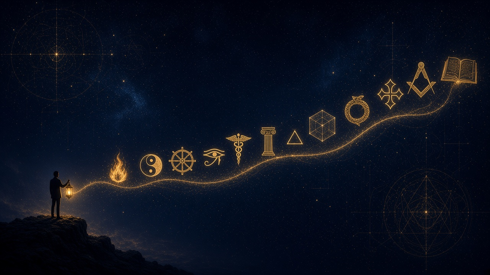
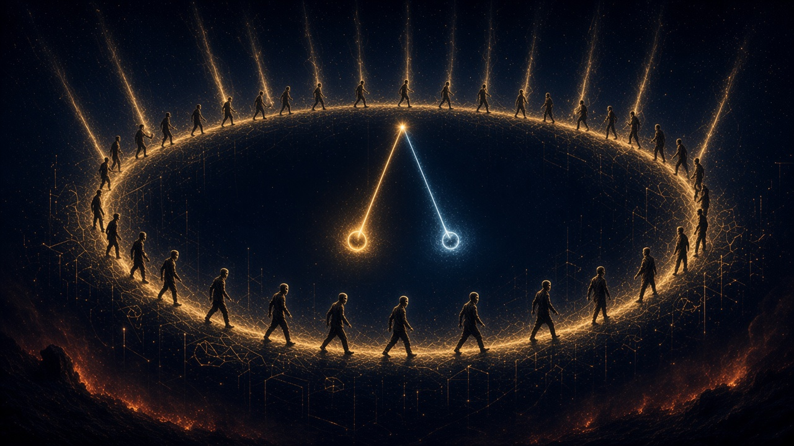
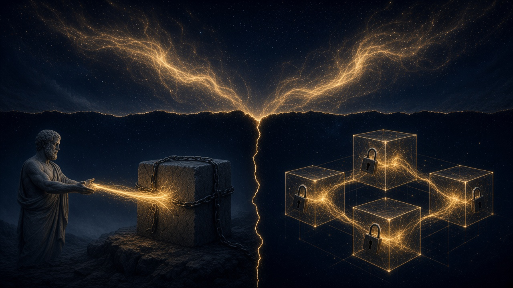
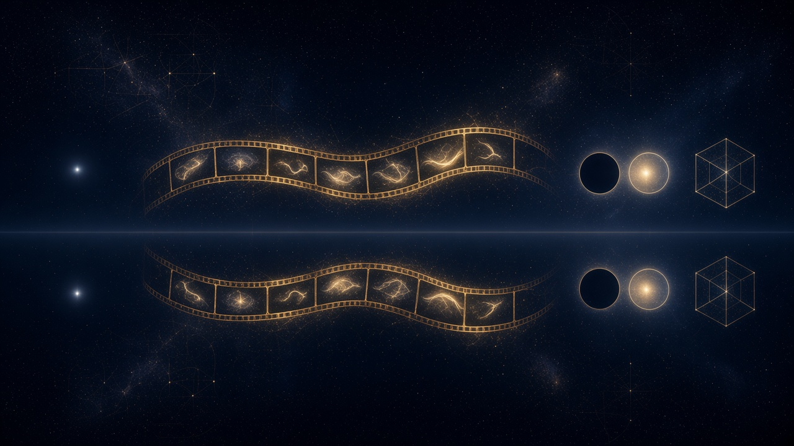

# Eternos Mutáveis — Bullets por capítulo

## 0. Abertura — as perguntas que não envelhecem

- Objetivo: entender o que é a realidade, pela lógica e não pela fé
- Perguntas eternas: Deus, vida, mundo espiritual, depois da morte, por que há algo e não o nada, do que é feita a existência, por que estamos aqui
- Milênios de tentativas (templos, tratados, telescópios) sem consenso
- Contraste com a matemática: dois e dois são quatro em qualquer língua e século; no espírito não há consenso
- Religiões, escolas filosóficas e ciência explicam a origem de tudo: cada uma ilumina uma parte, nenhuma enxerga o todo
- Perdidos no excesso: informação demais, síntese de menos
- Cada pessoa lida de um jeito com o espiritual: herda a fé e a mantém, entra num grupo e não consegue seguir, segue um tempo e abandona, pula de tradição em tradição, acredita mas não frequenta, nem tenta porque não acredita
- Cada um explica Deus à sua maneira; a conversa escorrega para o lúdico ou o sombrio e termina em divergência
- Religiões pedem fé sem base lógica; o essencial não está sendo transmitido
- Preço da ignorância espiritual: evoluímos em tecnologia, medicina e engenharia, mas engatinhamos no conhecimento mais importante
- Com tanta desinformação o homem sofre: tenta viver bem, acerta, erra, recomeça; muitos vivem atormentados e em condições precárias (financeiras, psicológicas, mentais), com ansiedade e vida sem sentido
- Desvio pelo palpável: cansado da frustração, o autor se apaixona pela programação
- Programação aplica-se à vida inteira: decisão de arquitetura é decisão filosófica (o que separar, o que unir, do que cada parte depende)
- Bom programador é bom gestor de processos: quem planeja e organiza entrega qualquer projeto, de software ou de vida
- Busca da estrutura perfeita do software por mais de uma década; nos últimos três anos, períodos sabáticos estudando filosofias, tradições espirituais e o Caibalion
- Um livro mudou a lente sobre o código: a programação virou base para compreender a espiritualidade
- O ateu que queria lógica: via os crentes como bitolados, sem ceticismo, trocando lógica por fé; só aceitaria Deus com explicação lógica e coerente
- As perguntas de que havia desistido estavam na programação, nas camadas profundas de sistemas
- A chave: sólidos e abstratos
- Espiritualidade não como mais uma religião nem como fé por si só, mas como o conhecimento que leva a Deus
- Ponte: o que vem a seguir sempre esteve diante dos olhos; de tão simples, nunca foi percebido em sua grandeza

---

## 1. Era adâmica — o problema

- Queda / encarnação: espírito acoplado à matéria, que esquece a origem
- Prisão ao mundo material: guiado pelos sentidos, vê só um cisco da realidade
- Ignorância estrutural: estruturas metafísicas só o intelecto alcança
- Crença herdada: mapa do mundo recebido antes de poder questionar
- Analfabetismo espiritual: o problema central
- Metafísica (estudo da estrutura) × espiritualidade (experiência dela)
- O homem se acostuma ao mundo material e esquece outras estruturas igualmente presentes, mas invisíveis: as religiões as chamam de espirituais; os filósofos, de substância oculta ou metafísica
- Esse lado oculto é o "mundo que transforma o mundo", um agente processador invisível aos olhos
- Parece místico, mas pode ser compreendido pelo intelecto, por via diferente da ciência experimental
- A experiência é produto de algo maior que ordena tudo por trás
- Metafísica: *meta* (além) + *physis* (físico); o suprassensível, o mundo dos verbos, dos vazios, dos movimentos, das ideias, dos espíritos, que divide espaço com a matéria
- Muito do que se sabe sobre Deus e o lado espiritual está equivocado
- O conhecimento que separa a era adâmica da superação adâmica: o homem encarnado que transcende a matéria
- A criação de Adão como metáfora: o homem adâmico (a personalidade) ainda existe e deve ser superado
- Somos centelha divina num corpo transitório, sob o véu do esquecimento
- O homem primitivo é guiado por impressões sensoriais e não entende a origem das próprias decisões nem o sentido da existência
- A ignorância se perpetua de forma inconsciente; "o homem não é mau, reproduz comportamentos sem perceber"
- A linguagem do homem é contraditória e mal compreendida
- Não existe um manual sintético e acessível da vida; o mundo espiritual vira paranormal e gera medo
- Civilização analfabeta espiritual: divergência, conflito e guerra; sintomas listados: violência, desigualdade, complexo de identidade, excesso de informação, baile de máscaras
- Alfabetização metafísica: ensinar os padrões e símbolos desde a infância, numa linguagem unificada
- Homem tem intelecto, mas ignora a própria condição de autômato e reduz-se a corpo e instinto
- Crença herdada já molda a ação: mapa recebido vira comportamento antes do questionamento
- Estamos mais em contato com criações humanas do que com a natureza; isso deturpa a visão da realidade
- Aparência × essência: a matéria é véu; o que se vê não é o que rege
- Sem metafísica (filosofia primeira, causa dos efeitos) Deus permanece incompreensível
- Não confundir a incapacidade humana de explicar Deus com a inexistência de Deus
- Metafísica como “religião sem santidade”: acesso pelo intelecto, sem culto nem fé cega
- Insatisfação e busca por sentido nascem da visão deturpada da realidade
- O óbvio precisa ser dito para se tornar unânime; sem síntese acessível, cada um inventa o seu mapa

---

## 2. Busca por respostas — contexto histórico

- Por que a busca começa: a experiência sensorial não resolve
- Persas, taoísmo, budismo, hinduísmo
- Egito e hermetismo: o Todo, Caibalion, Hermes Trismegisto
- Judaísmo, Logos, Cabala
- Gregos: Heráclito, Parmênides, Sócrates, Platão, Aristóteles (inventário)
- Cristianismo e gnósticos
- Idade Média, Renascimento, Iluminismo, ordens (maçonaria, Rosa-Cruz)
- Kant, Nietzsche, ciência, Jung, Saussure, espiritismo
- Explicações lúdicas deturpadas: Deus materializado, alma como fantasma
- Ciência (particulares) × metafísica (gerais)
- Problema da linguagem: Russell, Whitehead, Wittgenstein
- Resultado provisório: a metafísica segue em aberto
- A busca começa quando o homem domina a linguagem e a experiência sozinha não responde
- Persas (Zoroastro) e orientais (taoísmo): conceitos de dualidade que se relacionam entre si
- Egito: corpo hermético e Caibalion, com sete princípios gerais de como o universo opera
- Gregos: do mito ao logos; matemáticos que buscavam estruturas eternas; Pitágoras e a herança egípcia; ordens iniciáticas já no Egito e na Grécia
- Pré-socráticos: Parmênides (nada muda) × Heráclito (tudo muda, exceto a mudança; ninguém entra duas vezes no mesmo rio; ensinava por aforismos)
- Platão: mundo das ideias × mundo dos sentidos; Deus como Demiurgo, o artesão
- Aristóteles: substância como forma e matéria; filosofia primeira e causa primeira (usada por Tomás de Aquino); o autor questiona a leitura de que ele rompe com Platão
- Cristianismo: "assim na Terra como no céu" é a correspondência hermética; "No princípio era o Verbo" dialoga com o Logos de Heráclito
- Gnósticos: libertação do espírito pelo conhecimento, não pela fé; um deus maligno teria aprisionado o espírito à carne; Jesus lido como ser humano iluminado pela gnose
- Idade Média perseguiu e destruiu o saber; Renascimento o resgatou em símbolos e pinturas; Iluminismo buscou a razão
- Ordens (Rosa-Cruz, maçonaria) estudam princípios eternos e imutáveis; matemáticos veneravam símbolos e viam a matemática como linguagem de Deus
- Críticos da metafísica: Kant, Nietzsche, Schopenhauer
- Jung: arquétipos e inconsciente coletivo; símbolos que se repetem em civilizações sem contato, anteriores ao próprio homem
- Linguagem: polimorfismo (um nome, vários sentidos) e redundância (vários nomes, um sentido)
- Russell e Whitehead buscavam uma linguagem única, sem redundância; Wittgenstein tentou no Tractatus ("do que não se pode falar, deve-se calar"; a linguagem é o limite do conhecimento) e depois recuou para os jogos de linguagem
- Esta obra dá continuidade a Russell e Whitehead: uma linguagem única e isomórfica, que resolve a linguagem para resolver a filosofia
- Cada civilização, religião e filósofo avançou, mas não existe manual lógico da existência
- Budismo (roda do samsara), hinduísmo (Bhagavad Gita), judaísmo ("Sou o que sou")
- Hermetismo: Corpus Hermeticum, Pedra de Roseta e hieróglifos como linguagem; princípios do Caibalion (o Todo é mente, correspondência, polaridade, causa e efeito, fluxo e refluxo, gênero)
- Heráclito: o Logos, o que não muda, tensão dos opostos, os que dormem e os que acordam
- Sócrates: a razão como virtude; Platão no *Timeu*: o Demiurgo como artesão organizador
- Gnósticos: Apócrifo de João (Aion, Sophia) e o demiurgo maligno
- Renascimento: Ficino e Pico della Mirandola retomam neoplatonismo, hermetismo e cabala
- Saussure: signo (significante e significado) e valor por oposição ("só é porque não é")
- Ciência × metafísica: a ciência olha os estados e os particulares, depende de teste e "prova o que não é"; a metafísica olha os movimentos e os gerais, pelo intelecto; a matemática prova o que é, para todos os casos; Deus não pode ser experienciado
- Metafísica entre realismo e idealismo, sem consenso
- Origem do autor: a complexidade do software o levou à ontologia e à espiritualidade
- Platão integra Parmênides (o que não muda) e Heráclito (o que muda) nos dois mundos
- Pré-socráticos também: Tales e Anaximandro (arché); aparência × realidade
- Helenismo/neoplatonismo: Plotino, Uno e emanacionismo — ponte para o cristianismo
- Agostinho: síntese de Platão e cristianismo; Tomás: Aristóteles a serviço da teologia
- Idade Média: além da perseguição, monopólio do conhecimento
- Linhagem hermética nas religiões abraâmicas: judaísmo, cristianismo e islamismo como herdeiros órfãos de Hermes
- Explicações lúdicas também: anjos, demônios e “conexão direta” entre planos
- Racionalismo e empirismo (Descartes a Hume): a ciência ocupa o lugar da metafísica; evolução espiritual fica tardia
- Heidegger: esquecimento do ser — eco moderno da mesma lacuna metafísica
- Russell: o referente precisa existir antes do predicado (“o rei é burro”); a linguagem já embute ontologia

---

## 3. Consequências — o inferno cíclico

- Mazelas do analfabetismo: individuais, familiares, sociais
- Identidade individualizada, tratada como linha reta
- Excesso de opções e crenças sem base lógica
- Autômato: crença, DNA e ambiente empurram a ação
- Dialética e esquecimento: desejo, posse, hábito, tédio, novo desejo
- Inferno cíclico: atores repetindo os mesmos erros
- Dor do software: manutenção cara, produtividade em queda, OOP centrada em objetos
- Analfabetos espirituais: os problemas vêm da forma deturpada de enxergar a realidade
- Baile de máscaras: gente que finge saber e confunde mentes; excesso de crenças sem base lógica
- A identidade fixa não existe: tudo muda a cada instante, e o tempo e a existência são vistos como linha reta
- O cérebro processa em pulsos, como uma máquina que reinicia a cada momento, e ignora o que é comum para poupar energia
- Memória limitada: desejos giram em círculo (Schopenhauer: desejo de ter × tédio de possuir)
- Dialética (Heráclito, Hegel, yin-yang): tese, antítese, síntese lidas como perda de memória; exemplos do cabelo, do casamento e do peso; a mosca que perde a memória
- Sem tédio não haveria desejo; todo espaço preenchido gera novos espaços
- Como vencer o ciclo: ir em direção à correnteza, entender que tudo passa e tudo retorna
- Livre-arbítrio ilusório: o homem é produto de crenças, DNA e ambiente, e não escolhe o que acredita
- A sociedade cultiva o individual e vive de medo e de aparência de segurança; o mal é a mente desordenada, não o mundo
- Dor do software: começa rápido, perde manutenibilidade e performance de desenvolvimento; mais gente e menos entregas; não escala com o número de funcionalidades
- Redundância de formas de fazer a mesma coisa (paradigmas, linguagens, frameworks, domínios); curva de aprendizagem alta; mudança constante de jeito de desenvolver
- Software é pouco intuitivo, diferente de um prédio (Arquitetura Limpa); "sopa de letras" de signos
- O problema comum a filosofia, espiritualidade e software: os jogos de linguagem
- Autômato: máquina de estados em que cada estado tem um movimento e um próximo estado; o estado molda a percepção; o universo opera como um grande autômato
- Conto da mosca: volta ao lugar de risco porque esquece no caminho; pêndulo do esquecimento; "lembrar é poder"; basta uma decisão diferente para interromper o ciclo
- Mito de Sísifo: saco sem fundo; busca que não preenche; trabalhar só para pagar contas; excessos para preencher faltas
- Atores vivendo personagens: o ator carrega os carmas dos personagens
- Individualização na infância: o ego nasce da separação do todo; a individualidade é ilusão e "o mal da humanidade"
- Céu e inferno aqui e agora: condição mental, cenas que se repetem; a mesma consciência vive todas as vidas sob o véu do esquecimento; o mal feito ao outro é feito a si
- A dor como justiceira: sem dor, não há valor
- Violência, desigualdade e conflitos como frutos da ignorância
- Software: manutenção consome cerca de 80% do esforço; criar é fácil, manter é difícil
- Causas no software: conceitos confusos (polimorfismo × isomorfismo, sólido × abstrato, encapsulamento, acoplamento × coesão, imperativo × declarativo), escrita linear, objetos estáticos no lugar da ordem e do fluxo
- Modelamos o software como enxergamos a realidade: visão deturpada gera software deturpado
- "Acoplamento é o maior cupim da OOP"
- A natureza é o manual de Deus: para toda dor há causa e antídoto
- Crença deturpada gera comportamento deturpado; sem bússola lógica, a ação já nasce torta
- Desejo é medo do oposto (pobreza→riqueza, solidão→companhia); o pêndulo começa no medo
- Completude também é inferno: sem desejo, sensação de parada; “quisestes o Jardim, tivestes o Jardim”
- Se o comportamento nos define e os estados mudam, somos muitos — a identidade única não se sustenta
- O desejo de se sentir especial cega para os ciclos já conhecidos
- Baile de máscaras + manada: a massa confunde confiança com verdade; egrégora do fingir se espalha
- Futuro = passado com novos atores; o cenário se repete, muda só o elenco
- Tamanho do ciclo proporcional à memória: sem memória, a mosca (e o homem) vive em loop
- Envelhecer encurta o tempo sentido: menos novidade, mais repetição percebida
- OOP reforça a ilusão de identidade única e separada — o erro do software ecoa o erro existencial
- Boas práticas e padrões (GoF etc.) sem domínio filosófico/linguístico não curam a dor do software

---

## 4. Existe um conhecimento que liberta

- Insight: a chave da metafísica estava na linguagem e no software
- A dor do software é a mesma da filosofia e da espiritualidade: a linguagem
- Caminho técnico: abstratos, essencialismo, deturpação da OOP
- Cadeia: linguagem → metafísica → gnose
- Gnose: libertação por compreensão, não por fé ou obediência
- O que a obra oferece: visão lógica de Deus, ferramenta de análise metafísica, código de conduta pela correspondência, condição da vida eterna
- Resolver a linguagem resolve a filosofia, e isso muda a percepção de Deus, eternidade, identidade, tempo, céu e inferno
- Objetivo da obra: dar significado e estrutura à linguagem
- Trajetória do autor: engenharia de software, programação desde a juventude (primeiro contato aos 12 anos, graduação aos 17), 15 anos de busca por regras eternas, independentes de linguagem, sistema operacional, hardware e domínio
- Arquitetura Limpa (Uncle Bob) confirmou que existem regras imutáveis, mas o autor discorda de que o software não tenha estruturas óbvias
- Programadores não dominam os conceitos-base: os pilares da OOP (polimorfismo, herança, abstração, encapsulamento) vêm da filosofia e da linguagem, e não são compreendidos
- Tratado Filosófico Metafísico Ontológico Sistêmico: 14 teses (história como menor unidade, verbo, Logos, metafísica, linguagem)
- Flow: linguagem visual de programação que descreve e sistematiza o plano das mudanças; camadas substituíveis e desacopladas
- Ajustar as lentes muda o paradigma de construir software e de viver
- Promessa: libertação do espírito pelo conhecimento, com lógica
- Código de conduta no estilo das 48 Leis do Poder, aplicando a correspondência
- Não é moral do que fazer: são as regras do jogo da vida, e a conclusão moral tende a convergir
- Conforto: viveremos eternamente e o presente define a eternidade
- Sensações pretendidas: alívio, tranquilidade, esperança, entusiasmo, felicidade
- Gnose: "conhecereis a verdade, e a verdade vos libertará"; o mundo espiritual pode ser compreendido com a exatidão da matemática
- Raciocínio: Deus é perfeito, logo imutável; no mundo tudo muda; o que não muda?
- A chave estava no software: estudo dos abstratos, essencialismo e *Arquitetura Limpa*
- A estrutura da linguagem é fiel à realidade e se repete nela; sem compreender a linguagem não se compreende a realidade
- Linguagem, software, filosofia e espiritualidade compartilham o mesmo problema: falta de domínio da linguagem
- Metafísica como domínio do que se repete: quem reconhece o padrão antevê o que vem
- Manual da vida: lógico, sintético e acessível
- Não haverá salvador: a salvação parte de cada indivíduo
- Para combater o veneno, é preciso conhecer o veneno
- Dominando a linguagem, domina-se software, filosofia e a realidade
- Há mais filosofia na programação do que se imagina: OOP espelha forma×matéria e classe×instância
- Caminho também passa pelos filósofos da linguagem: Moore, Frege, Russell, Wittgenstein
- Cadeia prática: resolver a linguagem → software → filosofia → existência/espiritualidade
- Trajetória inversa: busca do software perfeito → ontologia → espiritualidade → linguagem
- Sólido = endereço físico mensurável; abstrato = estrutura geral sem endereço; compreender abstratos extrai o mundo espiritual
- Essência = o que se repete (alma, generalização, padrão); aprende-se por reprodução de histórias
- Gnose: batismo pelo conhecimento; acesso a Deus, eternidade e jardim do Éden; desprende do material
- Flow: elimina conceitos redundantes, um só modo de desenvolver; camadas homogêneas e princípios além do software
- Conteúdo da libertação: conhecimento do verbo e reconciliação com a ordem
- Depender de abstrações, não de instâncias sólidas: a chave técnica que abre a metafísica

---

## 5. O erro — Aristóteles e a substância

- Platão: dois mundos, o que muda e o que não muda
- Aristóteles: forma e matéria unidas na substância; verbo colado ao objeto
- Correção: objetos não possuem verbos; verbos possuem objetos
- Impacto na OOP: classes com comportamento e característica coladas
- Maior erro da programação: repetir a ontologia da substância no código
- Paradoxo do barbeiro: separar papéis fecha a lógica
- Aristóteles funciona como o demiurgo gnóstico: carnificou o espírito ao fundir os dois mundos platônicos na substância
- Contradição: ele nega Platão, mas forma e matéria já é visão platônica
- Maior erro de interpretação: prender o movimento ao elemento, como se o movimento pertencesse ao elemento
- Platão acerta ao separar os mundos: um perfeito e eterno, outro material e mutável
- Na OOP, a menor unidade é o objeto com estado e comportamento; o software imita objetos do mundo real
- Essa forma de desenvolver software não tem dado muito certo; a saída é separar movimento (eterno) de estado (mutável)
- Enxergamos o mundo só como material, feito de fatos; na verdade ele é feito de verbos e objetos
- Aristóteles define Deus como ato puro e motor imóvel; sua substância sustenta a prova de Deus de Tomás de Aquino
- Se tivesse seguido Platão, objetos teriam características e os verbos seriam o plano das ideias, o Logos de Heráclito
- Em vez de um ser com características e mudanças, há dois: o ser (constante) e o devir (mutável)
- Objetificação: ver a realidade como entidades isoladas num fundo vazio
- O objeto é só estado, sem comportamento; a função não pertence ao objeto, o objeto pertence à função
- Hilemorfismo relido: forma = espaço/critério (abstrato); matéria = componente que o preenche; a identidade está na forma
- O modelo entidade-relacionamento (MER) reúne estado e ação no objeto; o Flow separa função e dado
- Na linguagem, o sujeito não é o ator, é o que está entre o verbo e o estado; propõe-se VO, como `caiu(João)`
- Paradoxo do barbeiro: `João.barbeiaASi()` contradiz; com papéis separados, o barbeiro corta o cabelo do cliente
- Identidade como ilusão (Navio de Teseu)
- Tudo que se sustenta na ontologia aristotélica deve ser revisto, inclusive a linguagem
- Movimentos se relacionam com características, não com objetos; objetos são acúmulo de características acopladas
- Funções criaram a necessidade de objetos; o objeto é comodidade cognitiva, não motor da mudança
- O quê e o quando importam mais que o quem
- Relação provoca a mudança, não o sujeito
- Verbo antecede o sujeito; o sujeito só preenche o espaço entre verbo e estado
- Atribuir o ser ao comportamento, não o comportamento ao ser
- Polimorfismo do símbolo (mesmo nome para verbo e para estado) sustenta o erro aristotélico
- Ecos do acoplamento: forma×conteúdo, classe×instância; o mundo imperativo acorrenta espírito à carne
- Softwares devem separar unidade de ação e unidade de estado; comportamentos independem de objetos
- Foco nos objetos gera sofrimento; histórias possuem objetos, não o contrário
- Linguagem tradicional falha ao acoplar ação ao sujeito e modelar o mundo como OO

---

## 6. O conhecimento secreto — alfabeto da dualidade

- A realidade é dual; correspondência: assim em cima como embaixo
- Criação por contraste: o ponto branco no universo preto; o verbo entre os fotogramas
- Pares: ser × devir, movimento × estado, ser × estar, eternos × temporais, ato × potência
- Verbo × objeto, abstrato × sólido, forma × matéria, espírito × corpo
- Isomórfico × polimórfico, imperativo × declarativo, stateful × stateless, causa × efeito
- Menor unidade da realidade: a história (estados mais verbo)
- Logos: ordem entre os verbos; tudo é isomórfico (linguagem, metafísica, programação, matemática, consciência)
- Deus como Verbo; céu e inferno como estados de consciência
- Navio de Teseu resolvido pela identidade no critério, não no componente
- Experimento: universo todo preto com um ponto branco; bola preta num ambiente preto não é percebida
- "Para ser, é preciso não ser": frio e calor, luz e sombra, bom e mau
- Eterno × mutável: o eterno é perfeito porque não precisa mudar; o mutável é imperfeito porque muda
- Exemplo da porta: estado inicial (fechada), verbo (abrir), estado final (aberta); um verbo grande contém verbos menores (destrancar, abrir)
- Fita de cinema: vemos as fotos (estados); o verbo entre elas é invisível; o que enxergamos é o resultado do movimento
- Ato = o estado atual; potência = as possibilidades a partir dele
- Particular × geral: abrir uma porta, uma carta, uma garrafa; é o mesmo verbo
- Abstração: espaço recortado onde se encaixa qualquer objeto, com critérios que são a forma; o verbo "cair" serve para laranja, skate ou bola
- Colapso do movimento: o espaço preenchido vira novo estado, novo ato com novas potências
- Histórias se repetem como música com outras notas ou filme com outros personagens; o que aconteceu acontecerá
- Gênero hermético: macho = sólido, fêmea = abstrato; composição de histórias
- Aristóteles: forma (espaço) e matéria (componente); a forma é o espaço que o componente preenche
- Navio de Teseu: o navio é o critério, o espaço na história, e não o componente
- Formas não são criadas nem destruídas ("não houve criação"); são estruturas arquetípicas, ligadas ao inconsciente coletivo
- Deus como o próprio movimento, o Demiurgo, polimórfico, presente em tudo; "No princípio era o Verbo"
- O homem também é verbo e tem domínio da própria ordem, deturpada pela ignorância
- Tratado: verbos têm relações de compatibilidade; a mudança de estado representa o tempo; a linguagem descreve o plano das mudanças e é o limite da consciência
- Espírito único e isomórfico; corpos são manifestações polimórficas da mesma estrutura
- Espírito não se cria nem se destrói; a vida é ciclo sem fim; o espírito deve ver o outro como a si
- Todo significado é referencial: o não ser define o ser por contraste
- Ser = o que é e não pode deixar de ser; devir = o que pode deixar de vir a ser; ser × estar
- Estado como história condensada; estória (padrão) × história (instância)
- Mais pares: presença × ausência, significante × significado, qualidade × critério, luz × sombra, ligado × desligado, entrada × saída, macho × fêmea, componente × espaço, acoplamento × coesão, dedução × indução, privado × público, caos × ordem, efeito × causa, perfeito × imperfeito, particular × geral
- Imperativo = controle no sujeito; declarativo = inversão de controle (interfaces e protocolos)
- O verbo é fractal; a trindade é cortina de fumaça sobre a dualidade
- Dois mundos: Mundo da Verdade (padrões) × Mundo da Existência (manifestações)
- Deus não é um ente criador (senão, quem criou Deus?): é a metafísica, a causa primeira, o que foi, é e sempre será; é o ser e o devir; os movimentos são a língua de Deus
- "Deus existe" seria equívoco: ele é
- Não houve criação: o universo já nasceu pronto
- Princípio, movimento e matéria
- Mais pares: físico×metafísico, natural×sobrenatural, observável×observador, o que move×o que é movido, energia×matéria, eternidade×tempo, bem×mal, paz×guerra, alívio×dor, felicidade×tristeza, sabedoria×ignorância, destino×escolha, tédio×desejo, princípio×fim, criador×criatura, padrão×manifestação
- Guerra dos opostos: tudo surge pelo contraste; qualidades são no mínimo binárias
- Não é o objeto que é polimórfico: a história é que abstrai
- Utilidade está na história (cabo de vassoura), não no objeto isolado
- Movimentos enxergam características, não elementos
- Estado atual = o todo das relações, não só o objeto
- Todo elemento/qualidade pertence a uma história; por perspectiva, um elemento só contém uma qualidade por vez
- Ser = o próprio movimento imutável; estado/devir = o transitório
- Mônada: estado inicial + movimento + estado final (com antagônica); binário 0↔1 com dois movimentos opostos
- Analogia da melodia: identidade atemporal independente dos instrumentos
- Indução: quais histórias este elemento preenche?; dedução: do geral ao particular com endereço
- Cadeia: verdade → fato → história → estados e mudança → ser e devir → verbo e estado
- Endereço/existência surge na contraposição dos seres; a condição da existência é a presença pelo contraste

---

## 7. Superação adâmica — aplicação

- Resolução cruzada: existência, filosofia, espiritualidade e software
- Histórias como padrões eternos; objetos como personagens mutáveis
- Software sob regras eternas: menos custo, mais qualidade, manutenção curta
- Armadilha da perfeição: superioridade e nova queda
- Fase da imperfeição: todos somos um; condenar o outro é condenar-se
- Equilíbrio: morte do ego, eterno presente, de ator a autor
- Prática: ambiente, plano, controle da mente, tempo diário para lembrar
- Fecho: respostas às perguntas da abertura; a verdade compreendida liberta
- Software: separar imutável de mutável protege a aplicação de mudanças, reduz custo e tempo e aumenta a qualidade ("software sólido")
- Reutilização de histórias e padrões eternos com elementos diferentes
- Conhecer o plano dos verbos permite compreender a identidade e as regras do jogo da vida
- Vencer o desejo cíclico: acompanhar as fases, entender que sentimentos vão e voltam
- Ajustar as lentes melhora software, linguagem e a visão do mundo espiritual e do material
- Objetivo: libertar e fazer o homem viver em harmonia com a própria identidade
- A mensagem remove os véus e mostra a face de Deus; o homem encarnado transcende a matéria
- Superação adâmica: transcender a visão vertical orientada a objetos e ver a história como menor unidade; o mundo horizontal, orientado a fluxos
- Software feito de função e dado; bons desenvolvedores são bons roteiristas ("desenvolver software é a arte de contar histórias")
- Flow olha a ordem dos eventos, não os objetos; linguagem ubíqua; desacoplar o verbo do sujeito
- Para construir um bom software é preciso conhecer filosofia
- Seja o autor: conheça as histórias e reconheça nos atores os seus personagens; escolher o papel interrompe os ciclos
- Observador: você não é o ator nem a mente; a consciência é pura, imutável e eterna; transmutação mental
- Equilíbrio: nem tanto, nem tão pouco; todo excesso é uma falta
- Um só mandamento: enxergar o outro como a si; quem se irrita com os outros é escravo deles
- Imperfeição: perfeição é ato de aperfeiçoar, não resultado; perdoar e ter misericórdia
- Prática: tenha um plano, veja o plano, siga o plano; não reagir; metas diárias; o próximo passo é o mais importante
- Estado de Flow: eliminar o que não é essencial ao fluxo
- Código de conduta: nunca raiva, nunca reagir, nunca se explicar; falar o indispensável; não falar dos outros
- Correspondência prática: quem fala de outro para você falará de você para outro
- Você não lida com pessoas, lida com situações; trate todos como se estivessem sofrendo
- Ciclo a quebrar: como se vê → sente → comporta → veem → tratam → se vê; defina-se
- Selecione o que vê, ouve, fala, pensa e come; controle gatilhos; mude o ambiente, muda o mundo
- Haja como stateless; atitudes não dependem das emoções; saiba por que desejas
- Desejo é medo do oposto; foque também no que não quer ser (eliminar riscos)
- Em tudo que focar, cresce; todo acoplamento/excesso será punido
- Lógica inversa: pequeno é grande, humilde é primeiro; renúncia é vitória; desconforto pode ser felicidade
- Misericórdia: oferecer a outra face; olho por olho deixa todos cegos; vingança real é perdoar
- Faça do presente a eternidade: escolhas de agora tendem a se repetir; cada ato é plantio
- Técnica: escrever/desenhar o plano (diário Flow); próximo estado essencial ao próximo movimento
- Experimento: se controlasse todos os personagens num jogo imersivo — ou vivesse todas as vidas — o que faria diferente hoje?
- Software: separar roteiros e objetos; bons desenvolvedores são roteiristas de autômatos; catálogo de estórias reutilizáveis
- Observe histórias na natureza; use o verbo a favor; o estado define o próximo movimento