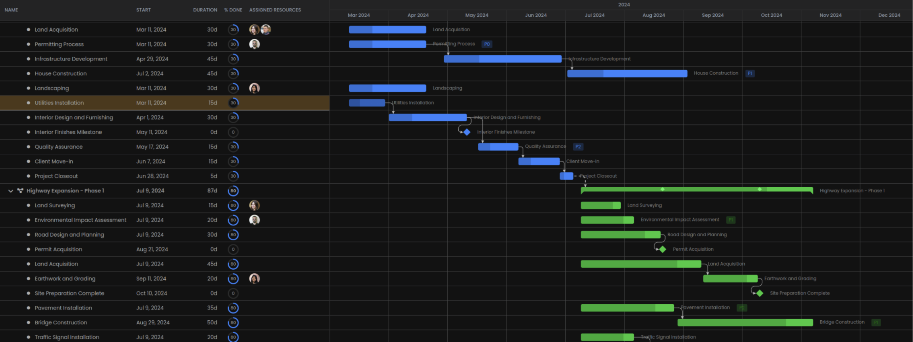

# Flow — Identidade visual

Documento de referência visual do produto **Flow**, derivado de
[`input/gantt-sample.png`](../input/gantt-sample.png).

A identidade prioriza **densidade de informação**, **alto contraste** e
**precisão** — adequada a Gantt, Board, Explorar e Árvore de execução.



---

## Princípios

1. **Escuro por padrão** — o conteúdo (barras, progresso, avatares) brilha
   sobre o fundo; o chrome da UI permanece discreto.
2. **Dados primeiro** — tipografia e grade servem à leitura da matriz
   (linhas × tempo), não à decoração.
3. **Cor com significado** — azul e verde diferenciam grupos/fases; ângulos
   e diamantes marcam milestones e dependências.
4. **Seleção legível** — o estado selecionado usa um destaque quente suave,
   sem ofuscar o conteúdo da linha.
5. **Cantos contidos** — raios pequenos; nada “bubbly”; avatares circulares
   são a exceção intencional.

---

## Paleta

Valores amostrados da referência e normalizados para tokens de produto.

### Superfícies

| Token | Hex | Uso |
|-------|-----|-----|
| `--flow-bg` | `#101010` | Fundo da aplicação / canvas |
| `--flow-bg-elevated` | `#181818` | Painéis, cabeçalhos de coluna |
| `--flow-surface` | `#202020` | Faixas, áreas de tabela |
| `--flow-surface-hover` | `#282828` | Hover de linha |
| `--flow-border` | `#303030` | Divisores e grade |
| `--flow-border-subtle` | `#383838` | Linhas de grade secundárias |

### Texto

| Token | Hex | Uso |
|-------|-----|-----|
| `--flow-text` | `#F2F2F2` | Títulos de atividade, texto principal |
| `--flow-text-muted` | `#A0A0A0` | Cabeçalhos (NAME, START…), metadados |
| `--flow-text-faint` | `#6B6B6B` | Placeholders, eixos secundários |

### Ação e dados (cromáticos)

| Token | Hex | Uso |
|-------|-----|-----|
| `--flow-accent-blue` | `#4880F0` | Barra de tarefa (fase padrão), progresso, milestone |
| `--flow-accent-blue-dim` | `#3868D0` | Parte “restante” / track da barra azul |
| `--flow-accent-green` | `#50A840` | Barra de tarefa (fase alternativa / grupo) |
| `--flow-accent-green-bright` | `#60C048` | Trecho concluído sobre barra verde |
| `--flow-selection` | `#715A3F` | Fundo da linha selecionada (âmbar escuro) |
| `--flow-selection-border` | `#8B7355` | Contorno opcional da seleção |

### Semântica (derivada)

| Token | Hex | Uso sugerido |
|-------|-----|--------------|
| `--flow-success` | `#50A840` | Concluído / ok (alinha ao verde de fase) |
| `--flow-info` | `#4880F0` | Informação / foco (alinha ao azul) |
| `--flow-warning` | `#C4A35A` | Alerta (tom âmbar mais claro que a seleção) |
| `--flow-danger` | `#E05555` | Erro / exclusão (não aparece na amostra; complementar) |

### CSS (tokens)

```css
:root {
  /* Superfícies */
  --flow-bg: #101010;
  --flow-bg-elevated: #181818;
  --flow-surface: #202020;
  --flow-surface-hover: #282828;
  --flow-border: #303030;
  --flow-border-subtle: #383838;

  /* Texto */
  --flow-text: #f2f2f2;
  --flow-text-muted: #a0a0a0;
  --flow-text-faint: #6b6b6b;

  /* Cromáticos */
  --flow-accent-blue: #4880f0;
  --flow-accent-blue-dim: #3868d0;
  --flow-accent-green: #50a840;
  --flow-accent-green-bright: #60c048;
  --flow-selection: #715a3f;
  --flow-selection-border: #8b7355;

  /* Semântica */
  --flow-success: #50a840;
  --flow-info: #4880f0;
  --flow-warning: #c4a35a;
  --flow-danger: #e05555;
}
```

---

## Tipografia

| Papel | Família | Peso | Tamanho sugerido | Cor |
|-------|---------|------|------------------|-----|
| UI / corpo | Sans-serif geométrica (ex.: Inter, IBM Plex Sans, system-ui) | 400 | 13–14px | `--flow-text` |
| Cabeçalhos de coluna | Mesma família | 500–600 | 11–12px, **uppercase**, letter-spacing ampliado | `--flow-text-muted` |
| Nome da atividade | Mesma família | 400–500 | 13–14px | `--flow-text` |
| Metadados (data, duração) | Mesma família | 400 | 12–13px | `--flow-text-muted` |
| Labels em barra (P1, P2) | Mesma família | 600 | 10–11px | texto claro sobre chip escuro |

Evitar serifas display e stacks genéricos “de landing”. A tipografia deve
parecer de **ferramenta**, não de marketing.

---

## Espaçamento e forma

| Token | Valor | Uso |
|-------|-------|-----|
| `--flow-radius-sm` | `2–4px` | Barras do Gantt, chips, inputs |
| `--flow-radius-md` | `6px` | Cards / painéis leves |
| `--flow-radius-full` | `999px` | Avatares, anéis de progresso |
| `--flow-row-height` | `36–44px` | Altura de linha da grade |
| `--flow-grid-line` | `1px` | Grade temporal e divisores |
| `--flow-gap-inline` | `8–12px` | Espaço entre colunas da tabela esquerda |

Sombras: preferir **nenhuma** ou elevação mínima. Separação vem de borda e
diferença de superfície, não de glow.

---

## Componentes-chave (da referência)

### Grade Gantt / tabela

- Fundo `--flow-bg`; linhas horizontais e verticais em `--flow-border`.
- Cabeçalho temporal em duas faixas (ano / mês).
- Colunas fixas à esquerda: nome, início, duração, % done, responsáveis.

### Barra de atividade

- Forma: retângulo horizontal com `--flow-radius-sm`.
- Dois tons: **track** (dim) + **preenchimento de progresso** (bright).
- Paleta por grupo/fase: azul **ou** verde (não misturar na mesma barra).
- Labels opcionais (ex.: `P1`) em chip escuro sobre a barra.

### Progresso (% done)

- Anel circular (donut) na cor da fase (`--flow-accent-blue` / green).
- Fundo do anel em `--flow-border` / `--flow-surface`.

### Seleção de linha

- Preenchimento `--flow-selection` em toda a linha (tabela + timeline).
- Manter texto legível; não inverter para claro.

### Hierarquia

- Chevron discreto à esquerda do nome do grupo.
- Indentação por nível; pais e filhos compartilham a mesma tipografia.

### Responsáveis

- Avatares circulares empilhados ou lado a lado, com borda `--flow-bg`
  para separar no fundo escuro.

### Dependências e milestones

- Linhas finas em cinza claro (`--flow-text-faint` / border mais claro).
- Setas pequenas nas pontas.
- Milestone: **losango** na cor de destaque azul.

---

## Aplicação às visões do Flow

| Visão | Como aplicar a identidade |
|-------|---------------------------|
| **Gantt** | Seguir a referência de perto: grade, barras bicolor, seleção âmbar. |
| **Board** | Mesmo fundo e tipografia; cards em `--flow-surface`; status com azul/verde. |
| **Explorar** | Árvore estilo IDE no mesmo tema escuro; seleção = `--flow-selection`. |
| **Árvore de execução** | Nós e responsáveis com os mesmos tokens de texto/avatar; ramos em `--flow-border`. |

---

## O que evitar

- Fundos claros como tema padrão do produto.
- Raios grandes, pills excessivas, glow neon genérico.
- Roxo/indigo de “AI default” como cor primária.
- Múltiplas acentos cromáticos além de azul, verde e âmbar de seleção.
- Tipografia serifada ou display competindo com a grade de dados.

---

## Referência

| Artefato | Caminho |
|----------|---------|
| Amostra visual | [`input/gantt-sample.png`](../input/gantt-sample.png) |
| Visão do produto | [`../README.md`](../README.md) |

Atualizar este documento quando a UI divergir de forma permanente da amostra
(novas cores de fase, tema claro opcional, etc.).
