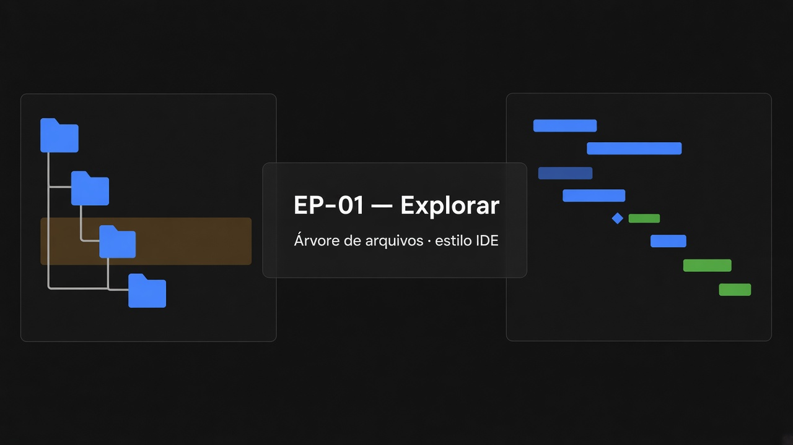
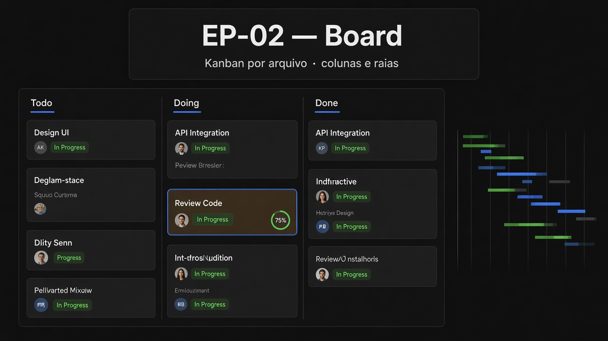
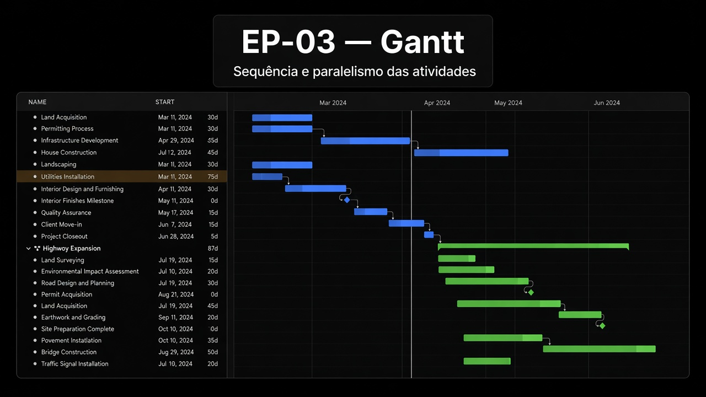
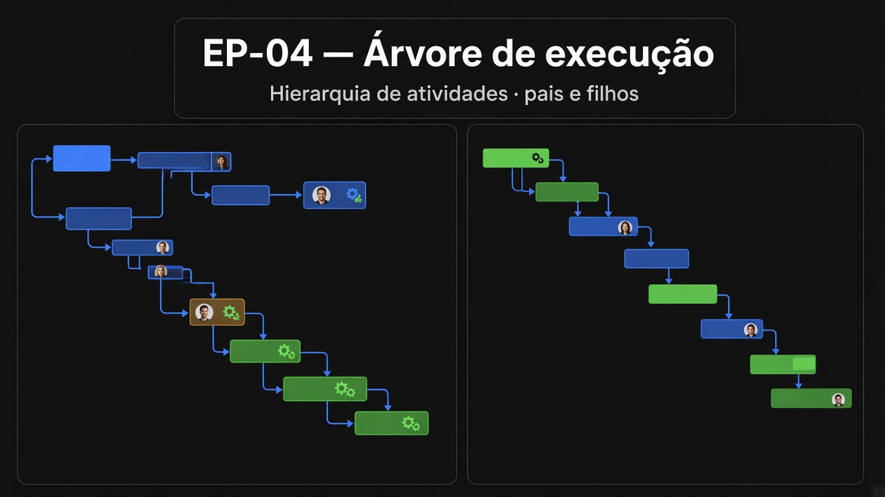

# Flow — Épicos

| ID | Épico | Pasta | Intenção |
|----|-------|-------|----------|
| EP-01 | Explorar | [`EP-01-explorar/`](EP-01-explorar/README.md) | Árvore de componentes parecida com IDE |
| EP-02 | Board | [`EP-02-board/`](EP-02-board/README.md) | Para cada arquivo, saber o status |
| EP-03 | Gantt | [`EP-03-gantt/`](EP-03-gantt/README.md) | Sequência e paralelismo das atividades |
| EP-04 | Árvore de execução | [`EP-04-arvore-de-execucao/`](EP-04-arvore-de-execucao/README.md) | Atividades pais e filhas |

## EP-01 — Explorar



Árvore de arquivos e pastas no estilo IDE: criar, remover, renomear, mover e navegar a hierarquia de componentes do Flow.

## EP-02 — Board



Kanban por arquivo: colunas, raias e cards para acompanhar e alterar o status de cada unidade no fluxo de trabalho.

## EP-03 — Gantt



Cronograma das atividades no tempo: criar, mover, remover e atribuir responsável, com visão de sequência e paralelismo.

## EP-04 — Árvore de execução



Hierarquia de atividades pais e filhas (floresta): decompor a execução fora do eixo temporal do Gantt, com responsáveis e reorganização.

## Hierarquia

```text
EP-01 Explorar
├── US-01 Criar arquivo
├── US-02 Remover arquivo
├── US-03 Renomear arquivo
├── US-04 Mover arquivo (drag and drop)
└── US-05 Visualizar árvore de arquivos
EP-02 Board
├── US-01 Criar card
├── US-02 Remover card
├── US-03 Mover card
├── US-04 Renomear card
├── US-05 Abrir card
├── US-06 Editar card
├── US-07 Criar coluna
└── US-08 Criar raia
EP-03 Gantt
├── US-01 Criar tarefa
├── US-02 Mover tarefa (drag and drop)
├── US-03 Remover tarefa
├── US-04 Atribuir responsável
├── US-07 Visualizar tarefas
└── US-08 Selecionar atividade
EP-04 Arvore de execucao
├── US-01 Criar atividade
├── US-02 Mover atividade (drag and drop)
├── US-03 Remover atividade
├── US-04 Atribuir responsável
├── US-05 Visualizar árvore
└── US-06 Selecionar atividade
```

→ [`../tasks/`](../tasks/README.md) · [`../board.md`](../board.md)

