# Flow — Gantt

Ordem temporal das atividades a partir da [hierarquia de tasks](tasks/README.md).

Visao em sequencia (equivalente ao Gantt; o tipo `gantt` do Mermaid falha em alguns previews do Cursor).

```mermaid
flowchart LR
  T001["TSK-001 Criar epico 3d"]
  T002["TSK-002 Criar historias 1d"]
  T003["TSK-003 Explorar 1d"]
  T007["TSK-007 Criar arquivo 1d"]
  T008["TSK-008 Remover arquivo 1d"]
  T009["TSK-009 Renomear arquivo 1d"]
  T010["TSK-010 Mover arquivo 1d"]
  T011["TSK-011 Visualizar arvore 1d"]
  T012["TSK-012 Toggle filhos 1d"]
  T004["TSK-004 Board 2d"]
  T005["TSK-005 Gantt 2d"]
  T006["TSK-006 Arvore execucao 2d"]
  T001 --> T002 --> T003 --> T007 --> T008 --> T009 --> T010 --> T011 --> T012 --> T004 --> T005 --> T006
  style T001 fill:#fff3cd
  style T002 fill:#fff3cd
  style T003 fill:#fff3cd
```

| ID | Atividade | Inicio | Duracao | Status |
|----|-----------|--------|---------|--------|
| TSK-001 | Criar epico | 2026-09-13 | 3d | Doing |
| TSK-002 | Criar as historias | 2026-09-16 | 1d | Doing |
| TSK-003 | Explorar | 2026-09-17 | 1d | Doing |
| TSK-007 | Criar arquivo | 2026-09-18 | 1d | Todo |
| TSK-008 | Remover arquivo | 2026-09-19 | 1d | Todo |
| TSK-009 | Renomear arquivo | 2026-09-20 | 1d | Todo |
| TSK-010 | Mover arquivo | 2026-09-21 | 1d | Todo |
| TSK-011 | Visualizar arvore | 2026-09-22 | 1d | Todo |
| TSK-012 | Toggle visualizar filhos | 2026-09-23 | 1d | Todo |
| TSK-004 | Board | 2026-09-24 | 2d | Todo |
| TSK-005 | Gantt | 2026-09-26 | 2d | Todo |
| TSK-006 | Arvore de execucao | 2026-09-28 | 2d | Todo |

→ [`tasks/`](tasks/) · [`../board.md`](../board.md)
